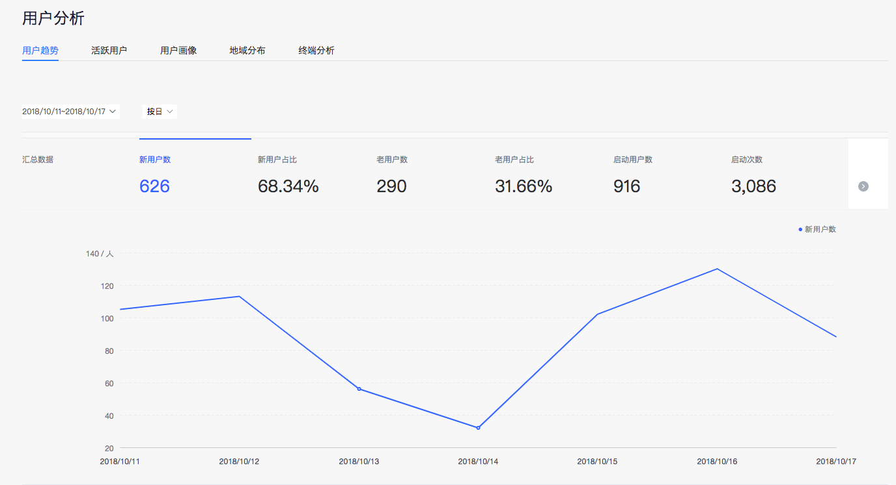
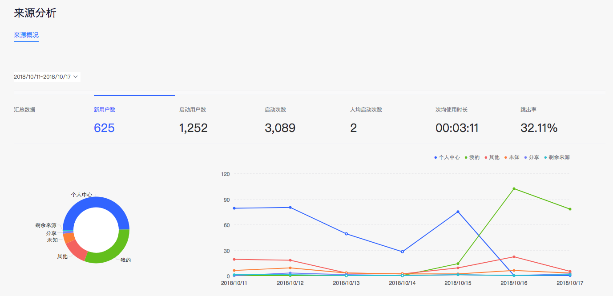

智能小程序数据分析功能为开发者提供了<a href="https://smartprogram.baidu.com/mappconsole/main/data?appId=11182003&childTabCur=1&tabCur=0">用户分析</a>、<a href="https://smartprogram.baidu.com/mappconsole/main/data?appId=11182003&childTabCur=2&tabCur=0">使用分析</a>、<a href="https://smartprogram.baidu.com/mappconsole/main/data?appId=11182003&childTabCur=3&tabCur=0">来源分析</a>、<a href="https://smartprogram.baidu.com/mappconsole/main/data?appId=11182003&childTabCur=4&tabCur=0">留存分析</a>、<a href="https://smartprogram.baidu.com/mappconsole/main/data?appId=11182003&childTabCur=5&tabCur=0">转化分析</a>等模块分析功能，帮助开发者了解小程序整体运营状况，分析小程序的用户来源、用户构成、用户增长趋势、用户留存与转化、用户小程序使用行为习惯等一些列问题，已实现数据驱动商业运营与产品迭代的目标。

## 应用概况
应用概况是产品健康仪表盘，通过集中展现当前应用的核心数据指标（如：新用户数、启动用户数等）及主要报表的近7日趋势变化缩略图，帮助您快速了解应用的当前数据表现。

## 用户分析

**用户趋势**：用于分析产品的新用户增量、新老构成比例等指标随时间的变化趋势，特别是结合自身业务重点分析趋势高、低点出现的合理性。
**活跃用户**：从活跃用户数、活跃度、流失用户等维度分析您用户的产品使用粘性。
**用户画像**：使用您应用的全部用户进行挖掘分析，得到用户在百度全域数据下的用户属性分布结果。
**地域分布**：展示使用您的应用的用户在国家、省份、城市维度的分布详情。进行地域分布分析对于进行针对性的地域运营方案具有重要价值。
**终端分析**：终端作为用户运行应用的载体，背后蕴藏着丰富的用户信息。分析用户品牌分布、设备型号分布、联网方式构成等，对于运营、产品和研发工作都十分必要。

## 使用分析

**页面分析**：展示各个页面的访次、停留时间、退出率等指标，体现页面受欢迎的程度。
**使用习惯**：从访问深度、使用频率、使用时长、使用间隔四个维度系统刻画用户使用习惯特征，熟悉并把握用户的产品使用习惯特征，对于有针对性的进行产品优化及运营策略制定具有重要意义。
**事件分析**：事件在小程序的统计分析中至关重要，用户在小程序内所有交互行为的分析均需要依赖对于事件的埋点与监控。目前支持通过事件API接口上报事件，即您需要在该报告“新增事件”后，将对应事件ID等信息通过事件API接口上报，而后才能看到事件的数据结果。在事件配置过程中，您可以给每个事件添加至多6个参数，用于进行事件更多维度的下钻分析，详情参见<a href="http://smartprogram.baidu.com/docs/data/custom/">自定义事件分析</a>。

## 来源分析
展示进入到小程序的不同来源数据情况，来源的启动用户数体现该来源规模，新用户数、人均启动次数、时长和跳出率则体现该来源的质量。

## 留存分析
用户留存报告用以分析目标用户再次启动小程序的情况，是体现小程序用户粘性的核心指标。在选择了考察的新用户（或活跃用户）时段后，可以在留存表中查看目标用户的“按日”、“按周”和“按月”的留存用户数或留存率。

## 转化分析
分析过程中的转化与流失情况。当前主要包括漏斗分析：漏斗分析，是指将多个事件串联起来，对每个步骤中用户转化与流失进行的分析。为了让最终的转化能实现最大化，就需要去监控漏斗每个关键步骤的用户流量，分析步骤之间的流转关系，提升每个步骤的转化率。这就是漏斗分析的意义与价值。

