场景值用来描述用户进入小程序的路径。

开发者可以在 App 生命周期函数中 [onLaunch](/develop/framework/app_service_register/#onLaunch-Object-object) 或 [onShow](/develop/framework/app_service_register/#onShow-Object-object) 事件中的 scene 字段获取场景值。

App 多次触发 onShow 事件，获得的场景值可能有所不同。如，首先通过自然搜索打开小程序，然后切至后台，然后通过信息流打开小程序，两次 onShow 事件获取的场景值不同。

以下为各场景和scene值的对应关系。

## 自然搜索
|场景|	scene值| 图例|
|---|---|---|
|自然结果|	10810008|
查看

|
|阿拉丁|	10810009|
查看
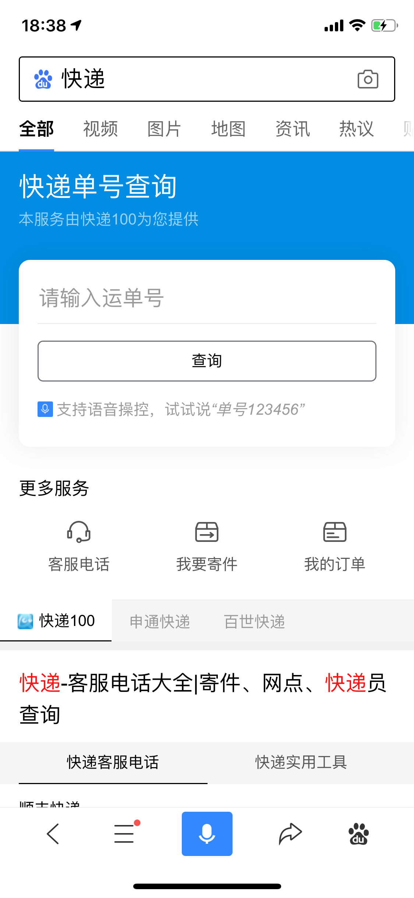

|
|搜索词推荐直达|	10810012|
查看
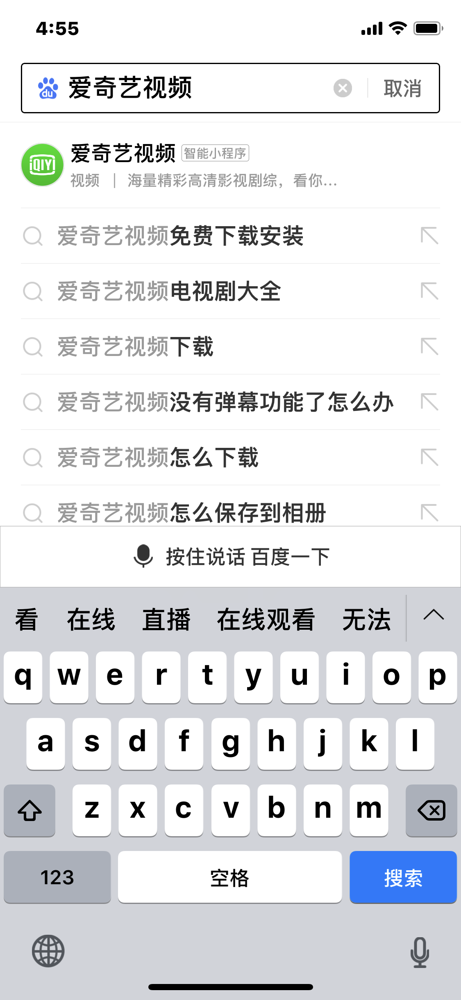

|
|语音直达|	10810013|
查看
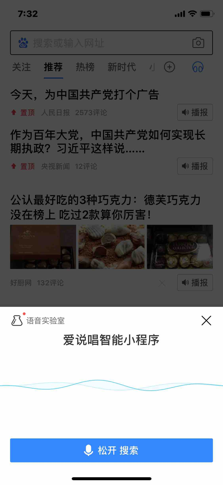

|
|小程序单卡|	10810014|
查看
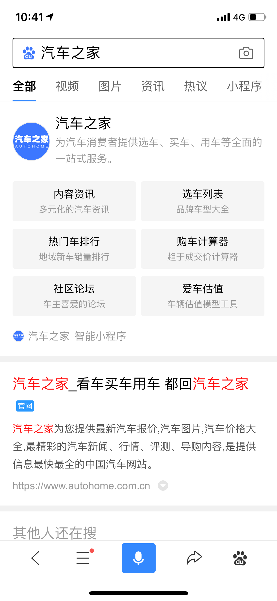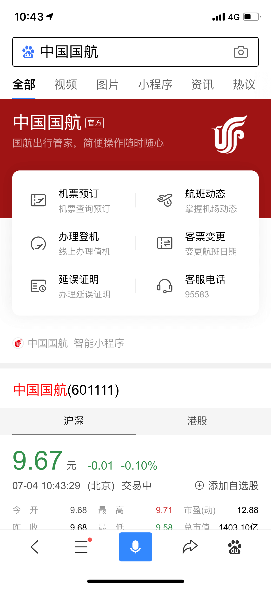

|
|小程序 Tab|10810083|
查看

|
|购物 Tab| 10810022|
查看

|
|职位 Tab|10810023|
查看

|
|笔记 Tab|10810024|
查看

|

## 信息流	
|场景|	scene值| 图例|
|---|---|---|
|信息流直接推荐|	10910015|
查看

|
|落地页自动挂载	|10910016|
查看

|

## 号挂载 	
|场景|	scene值| 图例|
|---|---|---|
|号文章挂载	|11110029|
查看
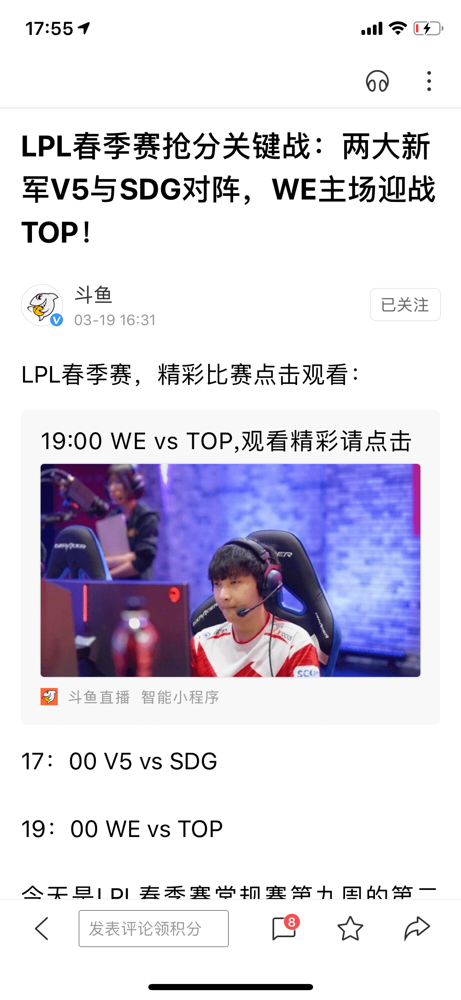

|
|号动态挂载	|11110030
11110031
11110032|
查看

|

## 号个人主页	
|场景|	scene值| 图例|
|---|---|---|
|号个人主页	|11410033
11410034
11410035|
查看

|

## 我的	
|场景|	scene值| 图例|
|---|---|---|
|常用服务|	12010043|
查看
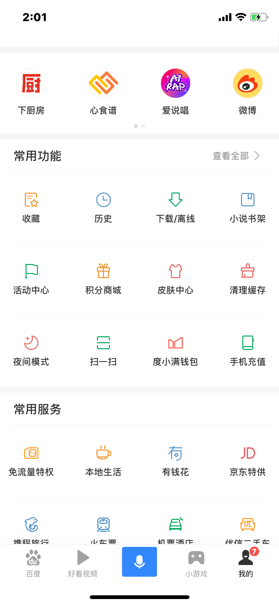

|
|顶部横划模块|	12010044|
查看

|
|历史|	12010045|
查看
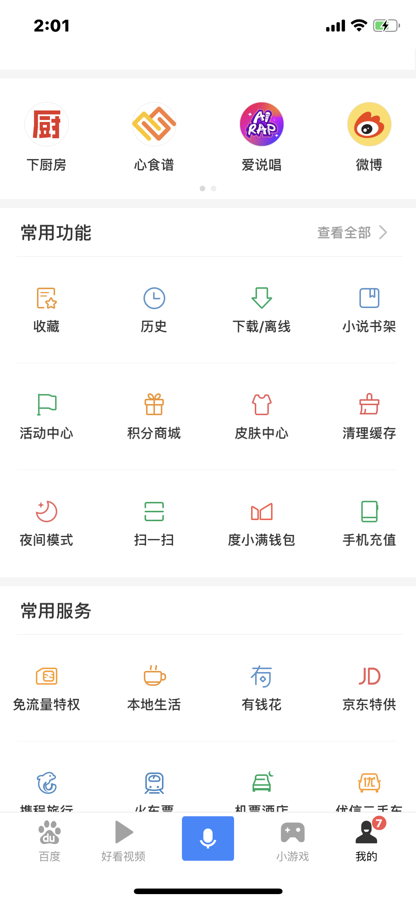

|
|活动中心|	12010046|
查看

|

## 百度首页下拉（二楼）
|场景|	scene值| 图例|
|---|---|---|
|推荐|	12110047|
查看

|
|历史|	12110048|
查看

|

## 桌面快捷方式	 
|场景|	scene值| 图例|
|---|---|---|
|桌面快捷方式|	12300000|
查看
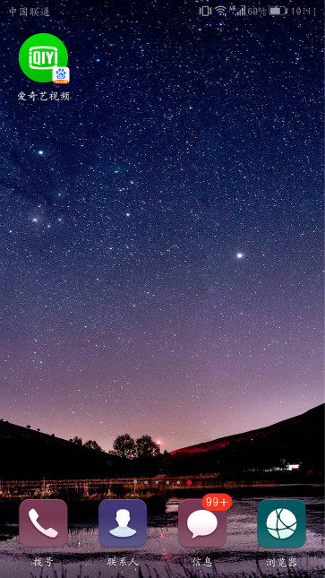

|

## 系统多任务	
|场景|	scene值| 图例|
|---|---|---|
|系统多任务|	12500000|
查看

|

## 消息通知	
|场景|	scene值| 图例|
|---|---|---|
|服务消息|	11310021|
查看
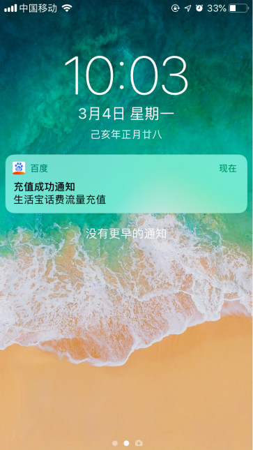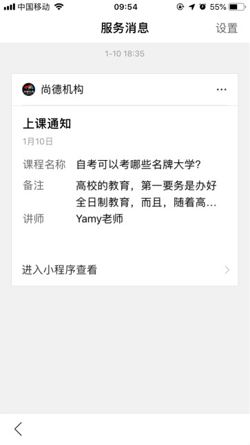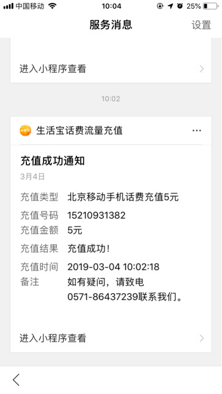

|
|营销消息|	11310004|
查看
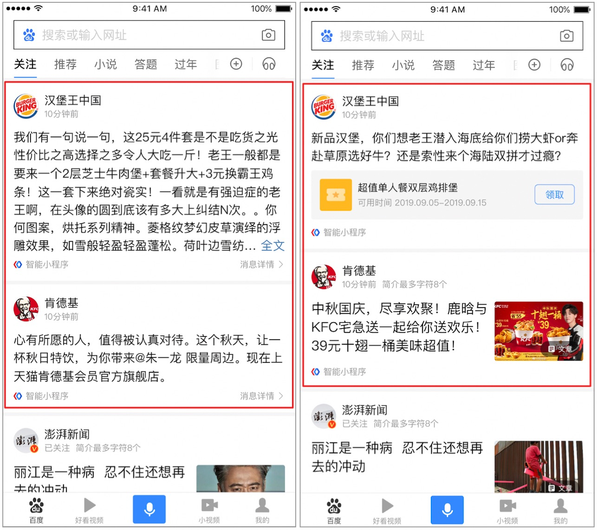

|

## 分享	
|场景|	scene值| 图例|
|---|---|---|
|分享|	11600000|
查看

|

## 小程序	
|场景|	scene值| 图例|
|---|---|---|
|小程序打开小程序|11700000|
/
|

## 扫码	
|场景|	scene值| 图例|
|---|---|---|
|扫码|	11800000|
查看

|

## 贴吧小程序	
|场景|	scene值| 图例|
|---|---|---|
|各吧内挂载|	11910037|
查看

|
|贴吧内搜索结果|	11910038|
查看
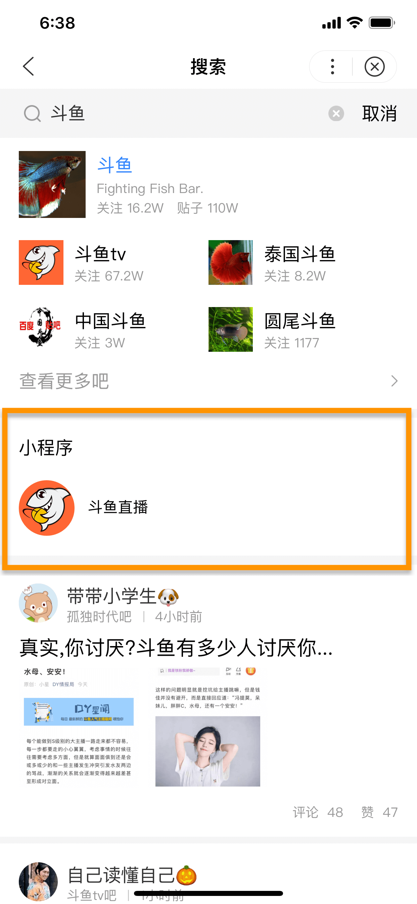

|
|贴吧吧内分享|	11910039|
查看

|
|首页信息流|11910086|
查看

|

## 游戏中心	
|场景|	scene值| 图例|
|---|---|---|
|小程序游戏中心|12410094|
查看

|
|NA游戏中心|12410095|
查看

|
|好看内游戏中心|12410103|
查看
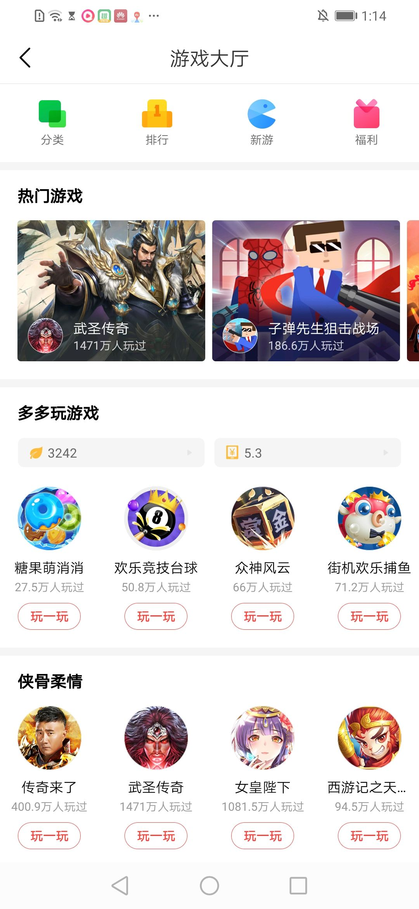

|
|全民内游戏中心|12410104|
查看

|
|Lite内游戏中心|12410004|
查看

|
|贴吧内游戏中心|12410005|
查看

|

## 游戏社区广场  
|场景|	scene值| 图例|
|---|---|---|
|侃侃小游戏社区首页|14010000|
查看

|
|游戏中心广场活动详情页|14010001|
查看

|
|游戏中心广场热帖|14010002|
查看

|

## 其它	
|场景|scene值| 图例|
|---|---|---|
|百度爬虫抓取|WEB|
/
|
|默认|NA|
/
|

**说明**：
* 智能小程序会被百度爬虫自动抓取，这部分流量的场景值为 WEB 。
* 如果没有场景值来源，会默认为场景值赋值为 NA 。