底部标签栏通常用于首页横向视图导航的切换，它始终固定在屏幕底部，不随页面滚动隐藏。

开发文档说明详见<a href="https://smartprogram.baidu.com/docs/develop/api/show_tabbar/" target="_blank">设置tabBar</a>。

	

		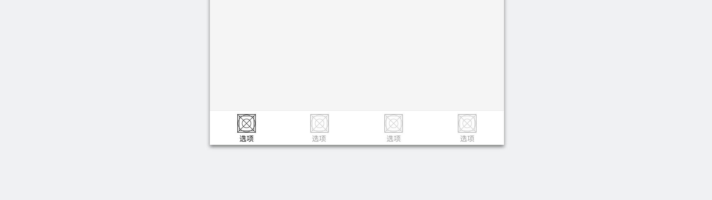
	

## 元素解构

	

		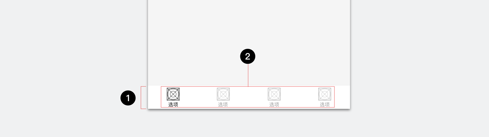
		
1.容器
	2.标签选项

	

### 容器

 	

 		

 			标签导航栏容器可以放置2-5个标签选项，每个标签栏对应展现其相应的分类内容。
容器颜色默认显示白色，开发者也可以配置相应的颜色，配置时请注意整体页面效果，设计侧建议可以参考后文的个性定制章节。
		

 	

 		

 			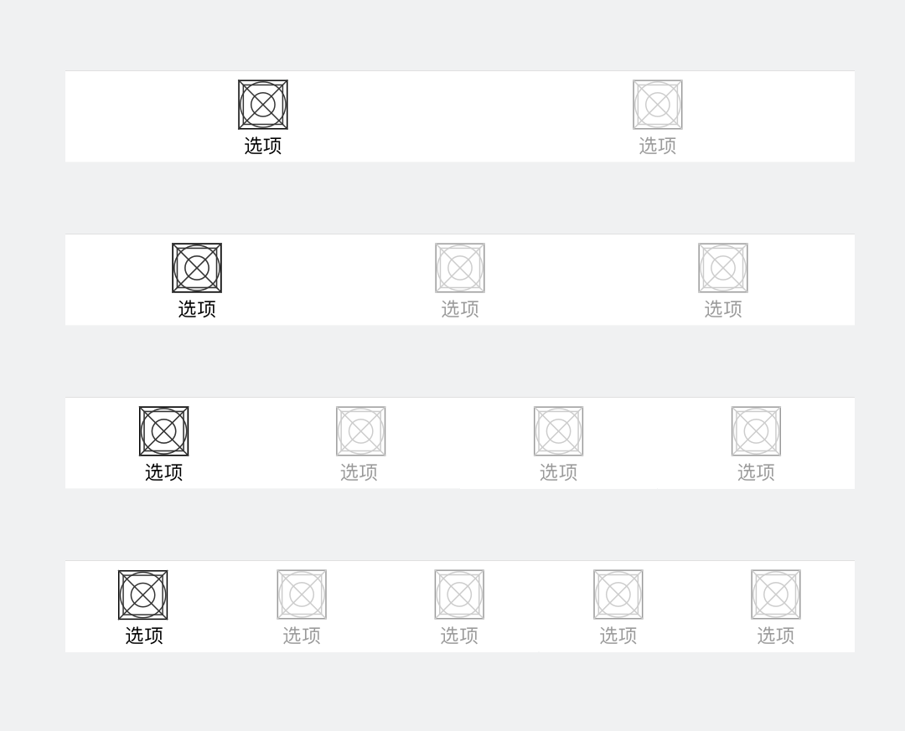
		

	

	

### 标签选项

 	

 		
标签选项由图标和选项名称组成，根据用户行为分为三个阶段状态：非选中态、点击态和选中态。其中点击态由小程序统一处理，其他由开发者自行定义。
1. 图标
    · 需要开发者自行上传选项在选中和非选中的图标；
    · 图标格式png，尺寸为81*81px，大小限制40kb。
2. 选项名称
    · 选项名称在选中态默认黑色，支持自定义；
    · 每个选项名称最多5个中文字符，超出截断。
		

 	

 	 	

		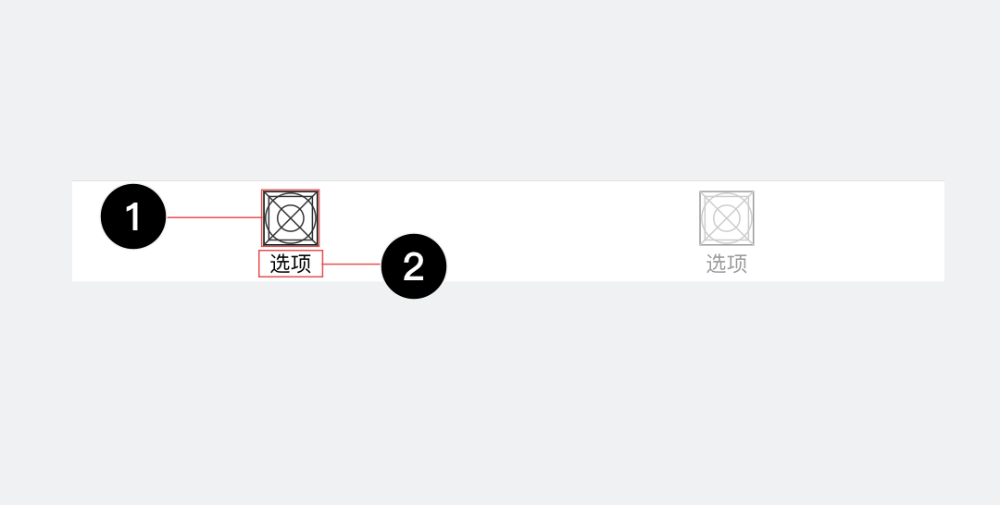
		

	

	

## 交互行为
点击底部标签时，用户屏幕可以切换至与其关联内容；点击当前页面所在标签，则无反应。

	

		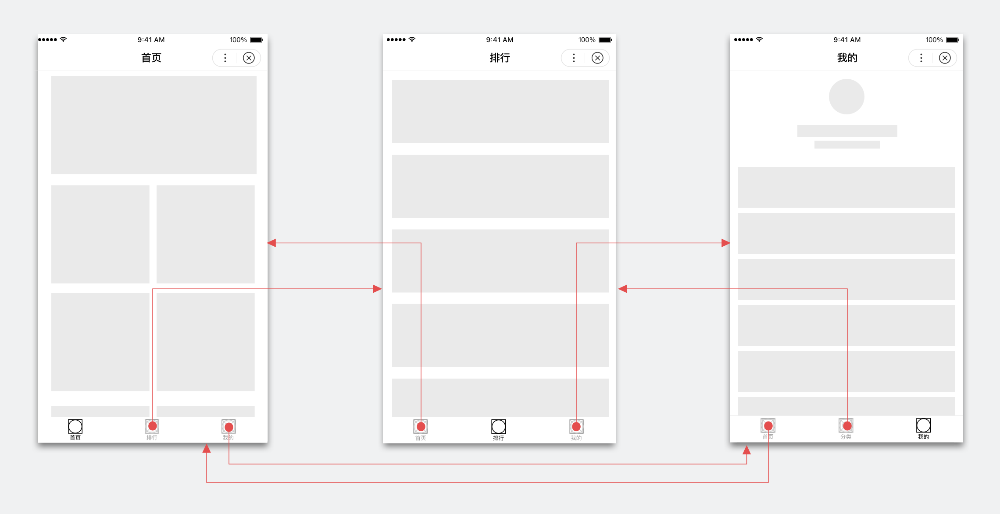
	

## 个性定制

### 默认样式

	

		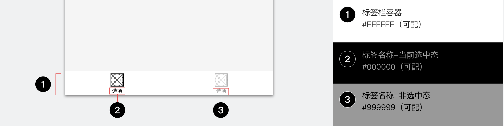
	

图标为开发者自定义上传，请注意区分明确其选中态和非选中态样式，方便用户定位当前所在位置。

	

		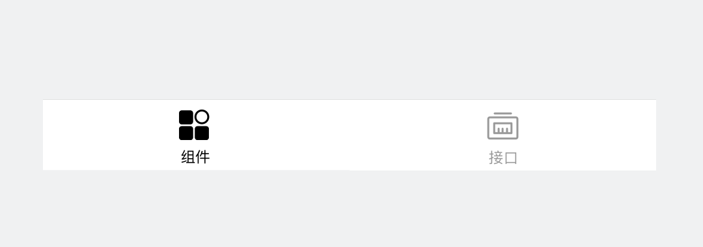
		
正确

图标的颜色和线面表达，在选中态和非选中态有明确区分，便于识别。

	

	

		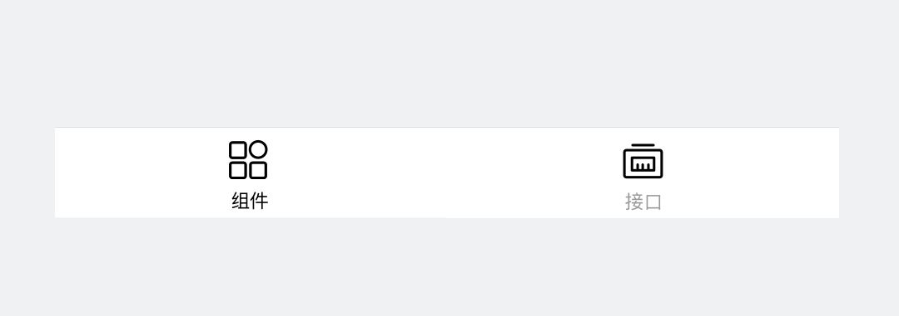
		
错误

所有标签图标都一样强，只能通过文字颜色判断当前位置。

	

### 自定义样式
定义标签栏样式时，请务必关注并保证其的可读性和可用性。
标签选项的图标和名称在选中态和非选中态时，有响应颜色呼应能使其整体一致性更好。选择合适的容器颜色，保证内容显示清晰。

	

		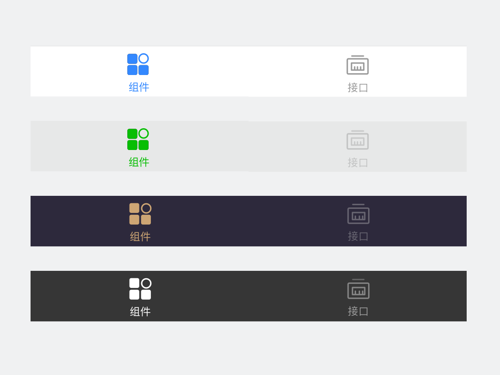
		
正确

底部导航栏整体页面均可定制，使用品牌主色或辅助色可以强调体现品牌，但整体需保证内容清晰显示。

	

	

		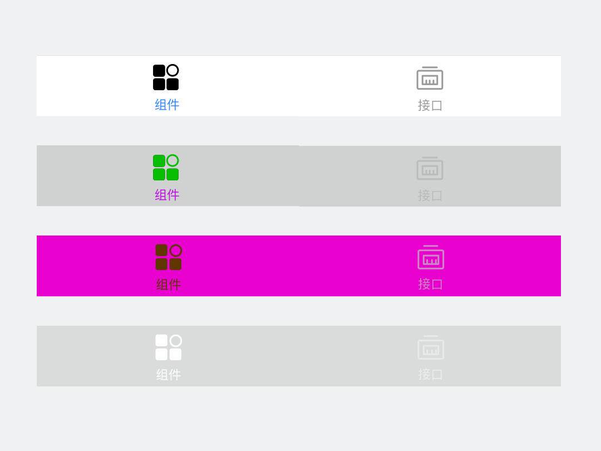
		
错误

图标和选项颜色差别过大，容器与内容样式搭配不当，过多使用高饱和度颜色均会降低阅读舒适度。

	

除了关注底部标签栏本身的内容显示清晰，也应该关注其整体页面效果。

	

		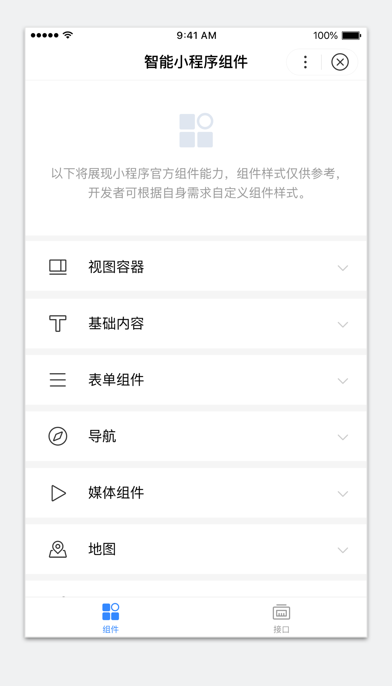
		
正确

在标签栏适当地点缀品牌色，能在强调标签选中态的同时，体现品牌。

	

	

		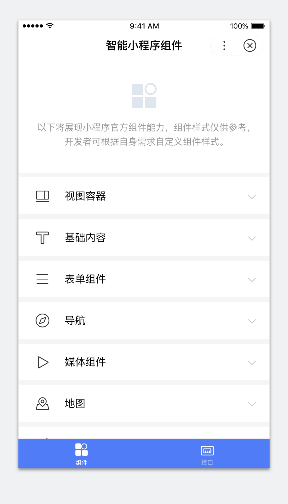
		
错误

底部标签栏阅读清晰度尚可，但过份抢占注意力，页面头轻脚重。

	

