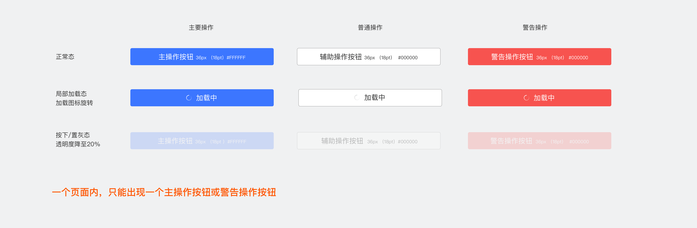
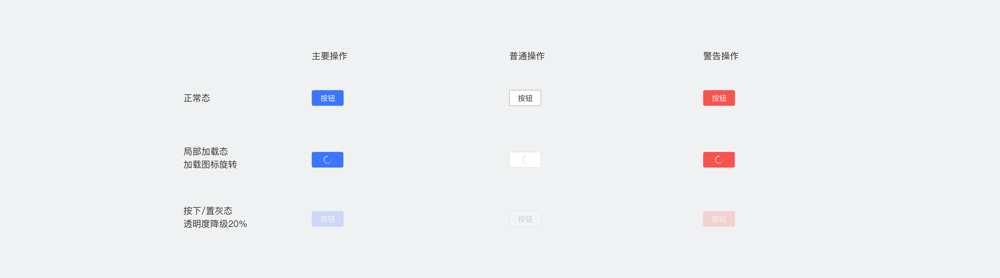

按钮允许用户点击触发对应的操作

大按钮
--------------

大按钮高度固定为88px（44pt），圆角大小固定8px（4pt）
自定义配置：按钮文案（不建议超过8个中文字符）

小按钮
--------------

小按钮高度固定为56px（28pt），宽度最小114px（57pt），圆角大小固定6px（3pt）
按钮内距离文字最小30px（15pt），文字较长时，按钮可按所需宽度拉伸适配
自定义配置：按钮文案（不建议超过8个中文字符）
