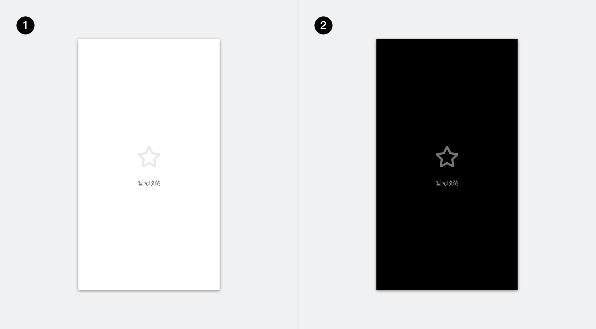
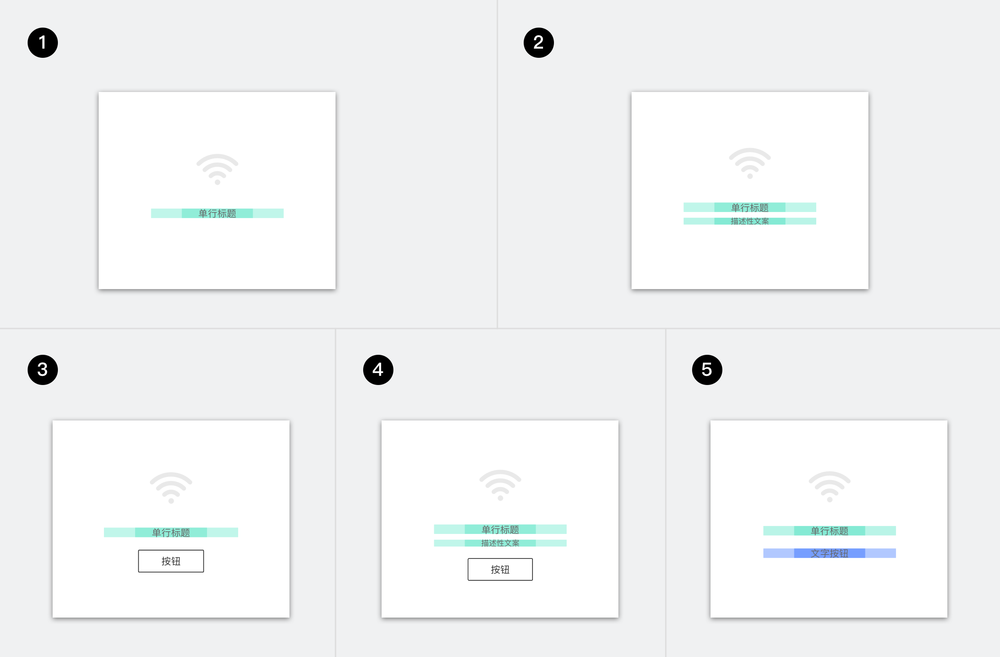
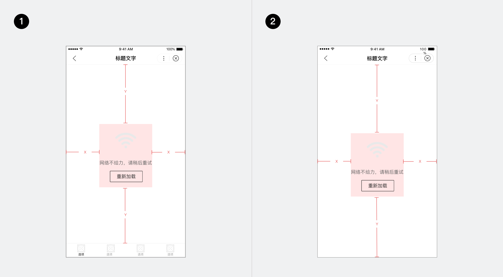
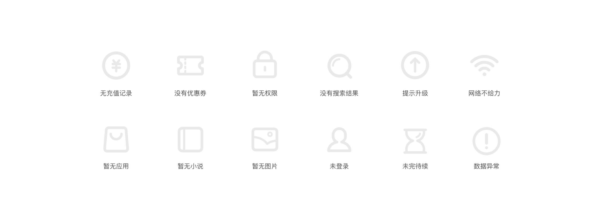

## 基础说明
空态用于指示页面无法显示内容时的情况，如网络错误、无内容数据等场景等。

基于页面整体样式的差异，应选择不同的空态展现形式：

	

		
注意图标颜色在不同背景上的有效展示。

	

## 规格类型 

	

1. 图标+单行标题
2. 图标+单行标题+描述文案
3. 图标+单行标题+按钮
4. 图标+单行标题+描述文案
5. 图标+单行标题+超链接

	

## 页面布局
空态元素整体与页面空内容区域应居中对齐。

	

	

## 图标
一般使用功能型静态图标，根据页面功能，最直接传达场景语义。
可参考以下示例：

	

	

