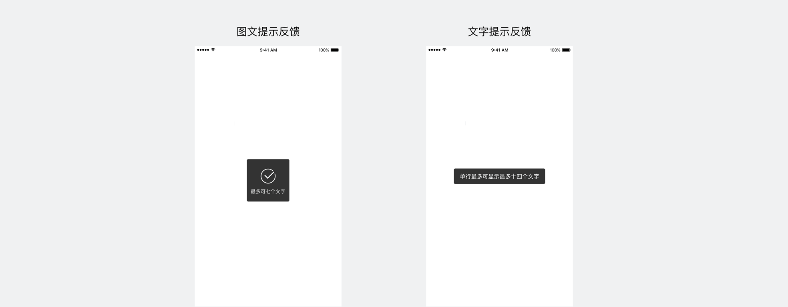
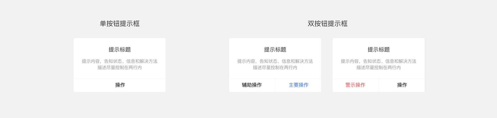
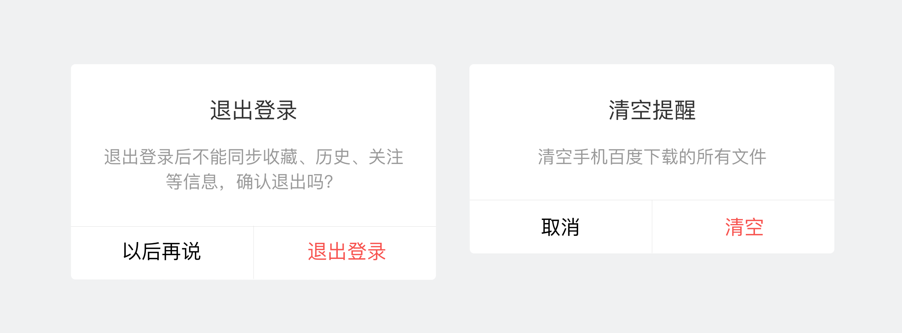
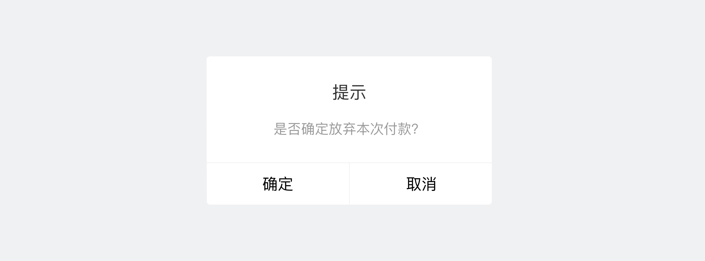
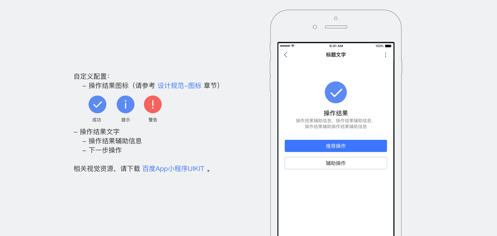
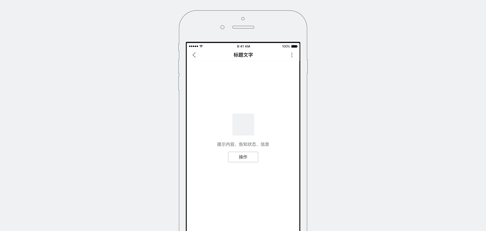

提示反馈
--------------
<notice>用于在界面内提供有关操作的简洁反馈</notice>

百度APP智能小程序提供图文提示反馈和文字提示反馈，同一时间建议只出现一个提示反馈，新的提示反馈会被优先展现。
自定义配置：图文提示图标，提示文案（图文提示最多显示7个中文字符，文字提示最多显示14个中文字符）

提示框
--------------
<notice>用于提示用户做一些决定，或者提供完成某个任务时所需额外信息</notice>

请谨慎使用提示框，因为它们会分散用户的注意力，并且打断用户的任务路径。
自定义配置：内容，操作。
1.内容：提示标题（最多不超过8个中文字符），辅助提示内容。
2.操作：支持1-2项操作，各操作按钮应按积极->消极，高频->低频从1-2号位顺序排布

措辞
--------------

1. 请遵守整体视觉规范中[措辞](../../specification/write/)章节；
2. 用户应该通过标题和按钮就能大致明白提示框的含义，最好在用词上有所呼应，如标题为“内测邀请”，确认按钮为“立即参加”
3. 内容区：
   - 标题：标题区：告知提示的类型或主题，可以是功能名称或操作内容
   - 辅助内容：告知状态、信息和解决方法，表达精简并尽量控制在51汉字；当表达为陈述词且只有一句时，句尾不必带“。”
4. 操作区：
   - 1项，操作的表达多为“取消”“关闭”“好的”“我知道了”
   - 2-4项，肯定操作请使用能表明操作结果的动词或动词短语，忽略操作应为“暂不XX”，“以后再说”“取消”等表述

正确

标题明确，内容清晰，操作明确且呼应

错误

表达模糊，操作区有歧义

全屏结果页
--------------

<notice>用于重要操作结果反馈</notice>

1.结果页反馈
在流程的最后一环，且结果反馈比较重要时，可以使用全屏结果页向用户反馈结果。稳定页面展现最为明确地告知用户结果，且能引导用户进行下一步操作。

2.空态/错误页反馈

请根据自己产品风格设计相应场景，反馈内容可以使用图片和文字，告知用户当前所处状态，并按场景考虑增加引导操作按钮。

