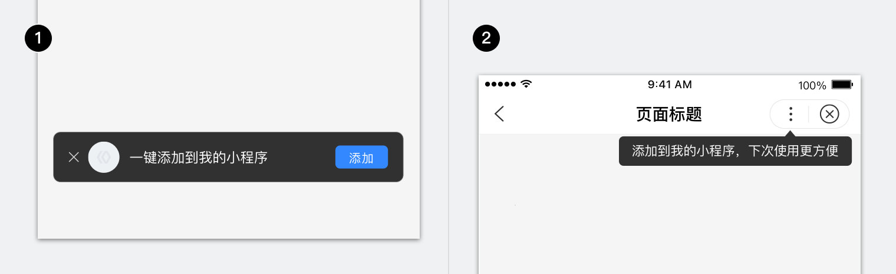
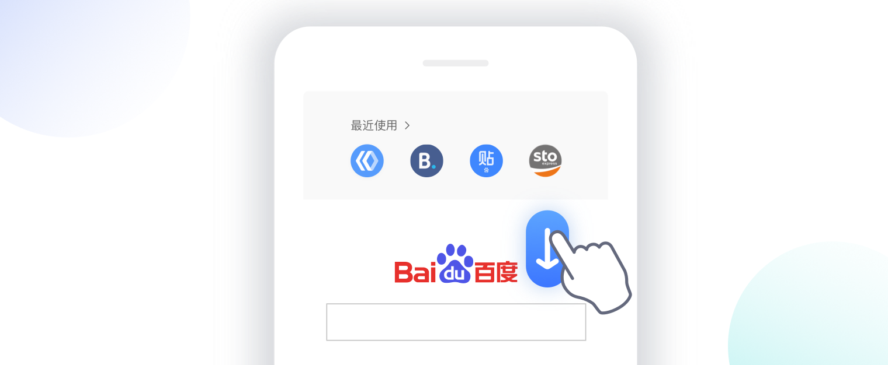
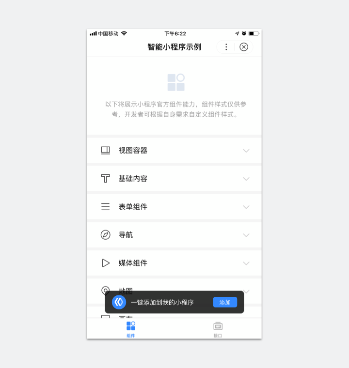
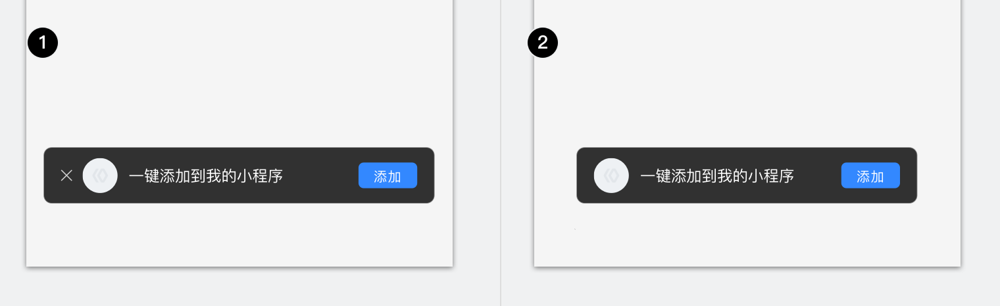

智能小程序提供两类引导添加组件，帮助开发者提示和引导用户进行“添加到我的小程序”这一操作。
开发文档说明详见 <a href="http://smartprogram.baidu.com/docs/develop/api/nacomponent/#showFavoriteGuide/">showFavoriteGuide</a>。
> 百度App v11.5及以上版本的智能小程序，支持引导添加组件。

	

		
	
1. 浮层引导
	2. 气泡引导

	

用户通过引导添加组件“添加到我的小程序”后，可以在百度APP首页的智能小程序二楼“我的小程序”中看到它。

	

		
	

## 浮层引导
浮层引导的展现力度比气泡引导更强，它固定展现在页面的底部，用户在组件上能直接进行“添加”操作。

	

		
		
1. 关闭按钮：默认展现，配置去掉后展现策略变更为3秒后自动消失；
	2. 小程序头像：默认抓取小程序头像展现；
3. 引导内容：默认显示“一键添加到我的小程序”，开发者可以自定义；文字单行显示，不可折行，最多显示11个中文字符；
4. 操作区：添加按钮，点击后直接执行添加到我的小程序。

	

	

		
		
正确

引导表达精简到位。

	

	

		
		
错误

引导内容过长截断导致的信息丢失，容易产生误解，应尽量避免截断。

	

### 规格类型

	

		
		
1. 一直展现的浮层
	2. 自动消失的浮层

	

#### 1. 一直展现的浮层（默认）：仅用户点击“关闭”或“添加”后才消失；

<video width="100%" muted autoplay="autoplay" loop="loop"  src="../../../img/design/component/guide_add/6.mp4"/>
你的浏览器不支持该视频播放
</video>

温馨提示：如果你的浏览器无法正常播放，请尝试Chrome浏览器。

#### 2. 自动消失的浮层：用户无操作，则3s后自动消失。

<video width="100%" muted autoplay="autoplay" loop="loop"  src="../../../img/design/component/guide_add/7.mp4"/>
你的浏览器不支持该视频播放
</video>

温馨提示：如果你的浏览器无法正常播放，请尝试Chrome浏览器。

## 气泡引导
气泡引导是一种轻量引导组件，固定指向小程序框架的菜单入口。
它既不会阻塞用户后续行为，也不要求用户响应操作，在一定时间内向用户展现信息，便自动消失。

### 1. 引导内容
默认显示“添加到我的小程序，下次使用更方便”，开发者可以自定义。
文字单行显示，不可折行，最多显示18个中文字符。

	

		
		
正确

表达精简到位。

	

	

		
		
错误

内容过长截断导致的信息丢失，容易产生误解，应尽量避免截断。

	

### 2. 展现策略
用户无操作，则3s后自动消失；用户点击菜单，或者切换页面，引导马上消失。

<video width="100%" muted autoplay="autoplay" loop="loop"  src="../../../img/design/component/guide_add/9.mp4"/>
你的浏览器不支持该视频播放
</video>

温馨提示：如果你的浏览器无法正常播放，请尝试Chrome浏览器。

