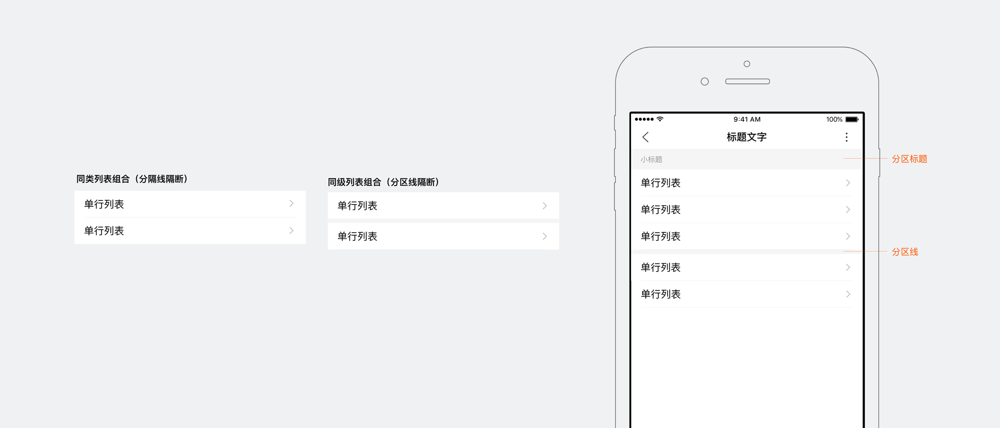
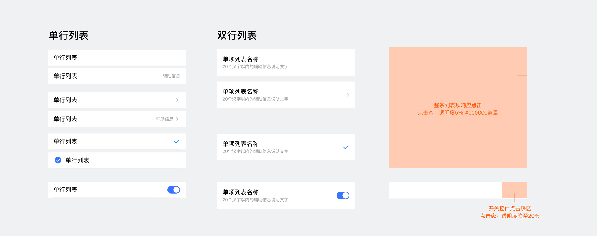

<notice>列表用于流式显示连续的多行项目</notice>

列表是由多个等宽列表项组成的、按一定规律排期的连续条目序列，支持上下垂直滚动。

自定义配置：列表顺序
建议按重要程度从上往下排列，最多不超过二级

<notice>列表项和点击态</notice>

单一操作列表，整条列表项响应点击；右侧带选择-开头控件的列表，只有控件区响应点击。
自定义配置：列表名称，辅助信息，选择控件。
