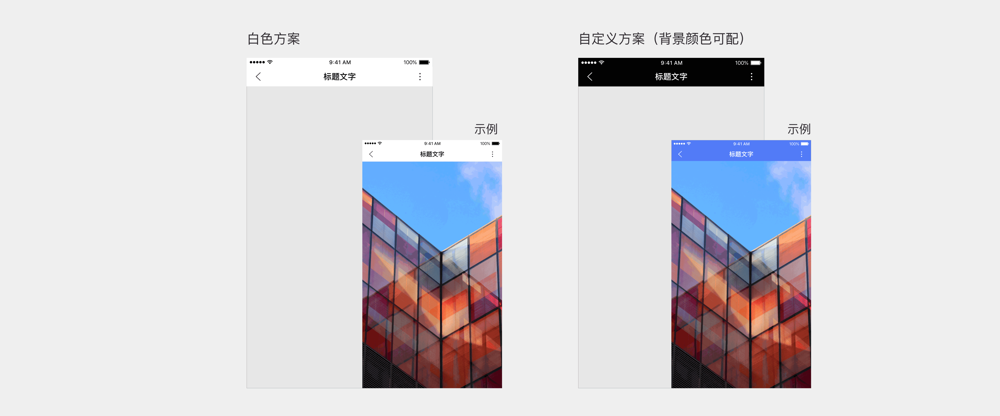
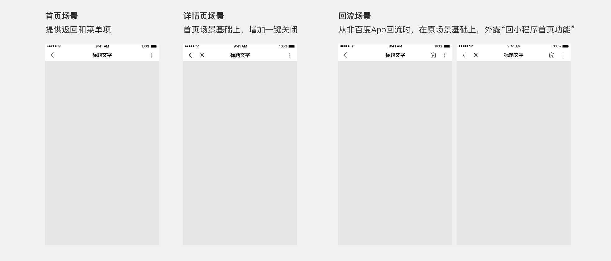
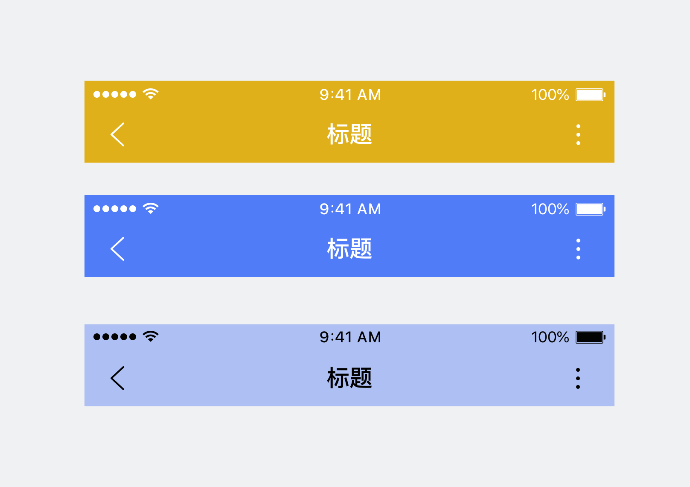
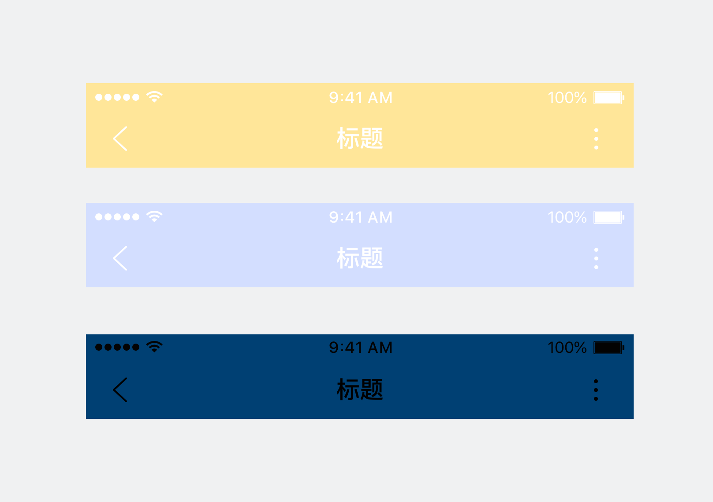
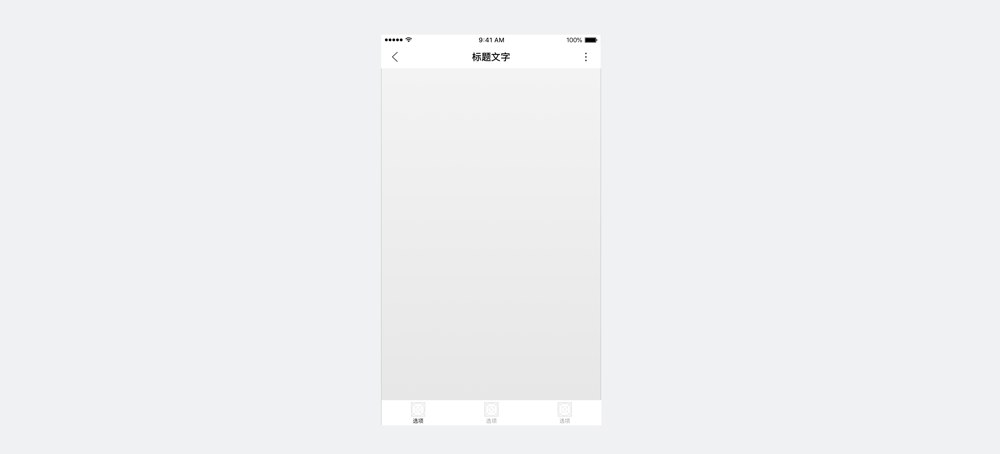
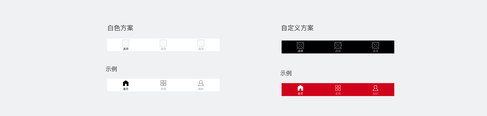
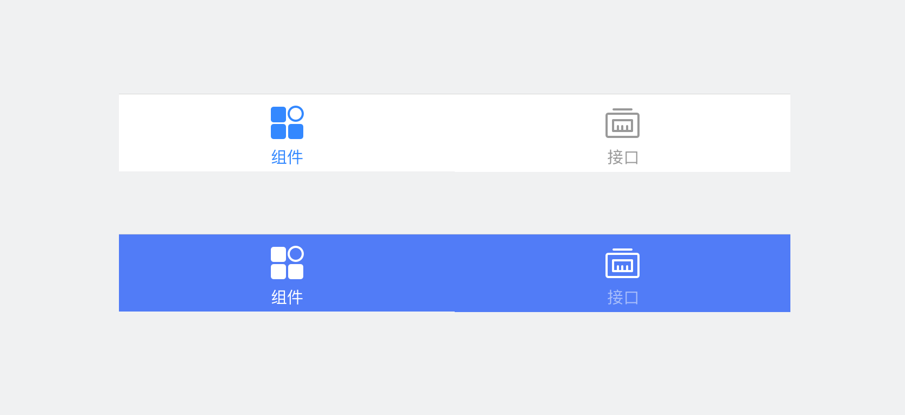
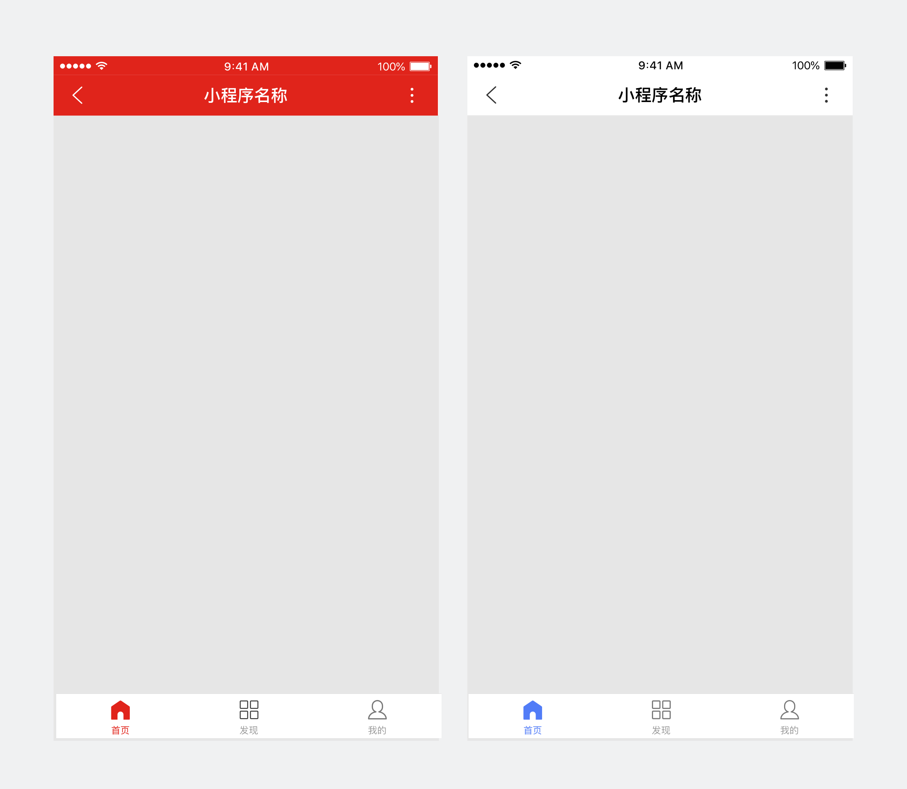

顶部导航栏
--------------
<notice>智能小程序提供统一框架，并提供两种不同的导航栏样式</notice>

<notice>不论导航栏样式如何，框架统一为不同场景适配以下功能：</notice>

<notice>定义导航栏框架，或使用沉浸框架时，请务必关注并保证其可读性和可用性</notice>

正确

背景色与文字色搭配可读性好

错误

背景色与文字色搭配效果可读性差

底部标签栏
--------------

<notice>标签栏，用于架构同级信息</notice>
底部标签栏只可用于小程序首页场景。

<notice>提供两种样式的标签栏：</notice>

<notice>定义标签栏样式时，请务必关注并保证其的可读性和可用性</notice>

正确

背景色与标签各态搭配效果可读性好

错误

背景色与分类标签选中态搭配效果差

<notice>除了保证各单一组件视觉效果，也需要关注整体搭配后页面效果，是否符合审美并能传达品牌</notice>

正确

品牌色明确，页面信息层次清晰

错误

使用颜色过多，页面信息重点杂乱

