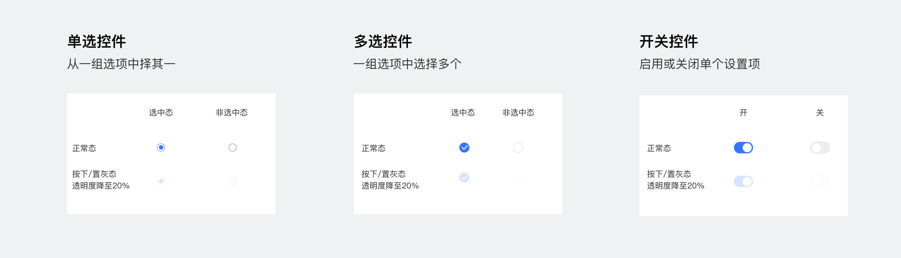
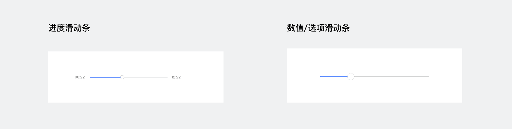
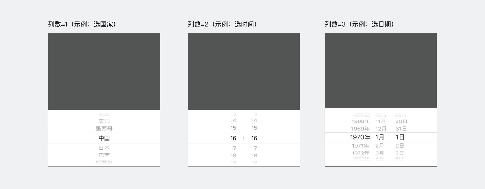

## 选项控件
选项控件允许用户选择某个值，这个值通常是选中/非选中，开/关。
通常搭配列表使用，点击时组件状态在选中/非选中，开/关间切换。
- 单选控件，开发文档说明详见<a href="/develop/component/formlist_radio/"  target="_blank">radio</a>；
- 多选控件，开发文档说明详见<a href="/develop/component/formlist_checkbox/"  target="_blank">checkbox</a>；
- 开关控件，开发文档说明详见<a href="/develop/component/formlist_switch/" target="_blank">switch</a>。

	

		
	

## 滑块选择条
滑块选择条允许用户从一个范围内选择某个值，这个值通常是主观的、不精准的设置，如亮度等。
滑动时，设置滑块跟随手势，实时反馈，松手即刻生效设置，且页面需要有相应的交互反馈当前状态。

开发文档说明详见<a href="/develop/component/formlist_slider/" target="_blank">slider</a>。

	

		
	

## 浮层选择器
浮层选择器用于承载选项较多的列表，通常在底部显示并固定高度展现。当列数不唯一时，用户在前列选择会对后列选项会产生约束和影响。

开发文档说明详见<a href="/develop/component/formlist_picker/" target="_blank">picker</a>。

自定义配置：
1. 选项列数及各列内容；
2. 用于时间选择场景时，可配置日期（年月日），时间（分秒）。

	

		
	

