顶部导航栏始终固定在屏幕顶部，不随页面滚动隐藏。
智能小程序会自动继承小程序首页顶部导航栏的配置，但每个页面均可配置其顶部导航栏。即同一智能小程序中，不但可同时存在原生顶部导航栏和自定义导航栏，也可为每个页面定制不同的样式。

开发文档说明详见<a href="https://smartprogram.baidu.com/docs/develop/api/show_navigationbar/" target="_blank">导航栏</a>。

## 原生顶部导航栏
原生顶部导航栏默认由智能小程序框架统一提供，用于控制整体小程序，指示当前位置及辅助小程序内部页面导航。

	

		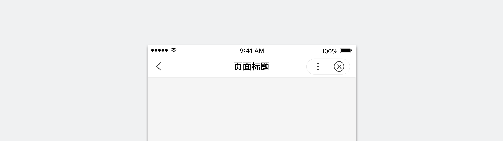
	

内部页面导航功能区居最左，页面标题名称放中间，小程序框架控制功能区最右。

	

		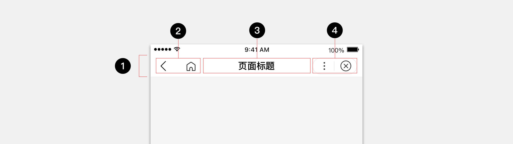
1.容器
2.内部页面导航功能区
3.页面标题（可选）
4.框架控制功能区

	

### 1. 容器
容器承载了顶部导航栏的功能，为其明确了导航区域。
顶部导航栏容器默认背景白色，开发者也可以配置相应的颜色。

	

		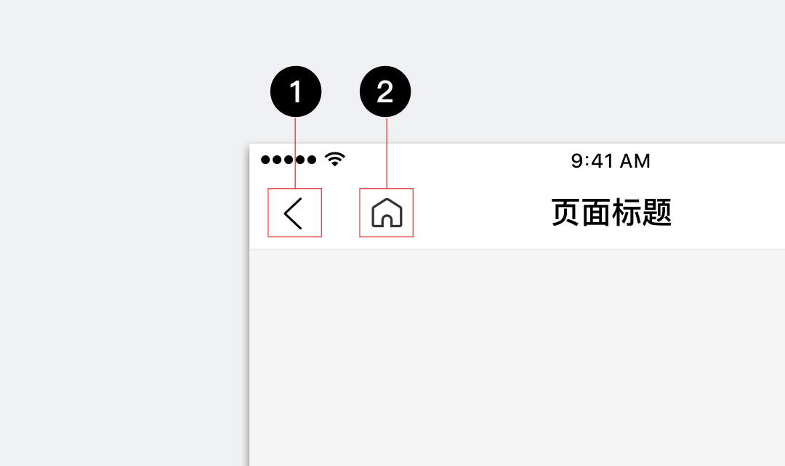
普通手机（1）和iPhone X（2）的页面布局都从顶部导航栏窗口底部开始。
iOS状态栏会随着顶部导航栏元素和容器背景自动改变颜色。

	

### 2. 框架内部导航功能区

 	

 		
当用户处于小程序首页时，此区域不展现任何功能。
 			其他页面下，根据场景展现：
1. 返回：用于返回上一页面；
2. 回首页：用于返回小程序首页。
		

 	

 		
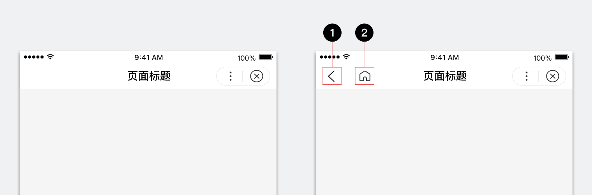
		

	

	

### 3. 页面标题
页面标题用于辅助和指示用户当前的位置，它通常描述当前页面/功能名称，或当前智能小程序的名称。
顶部导航栏默认展现页面标题，开发者也可以选择将其隐藏。
当标题过长时自动截断，但截断可能会导致用户误解。为保证主流机型显示，设计建议页面标题不超过8个中文字符。

	

		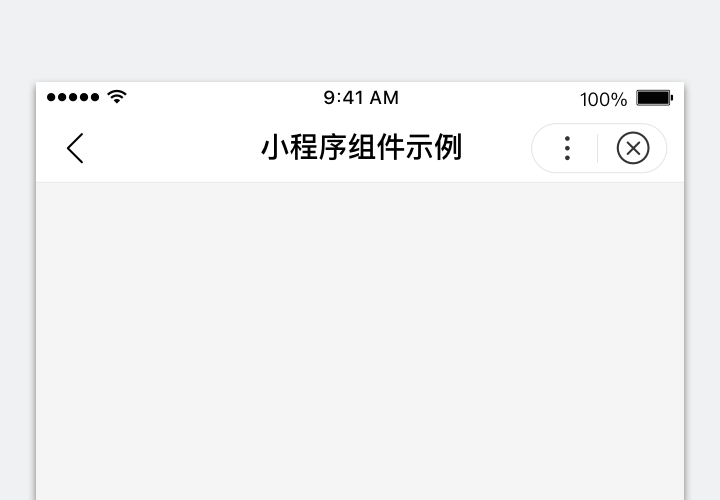
		
正确

标题表达信息过长时，在不影响理解的前提下，应精简表达。

	

	

		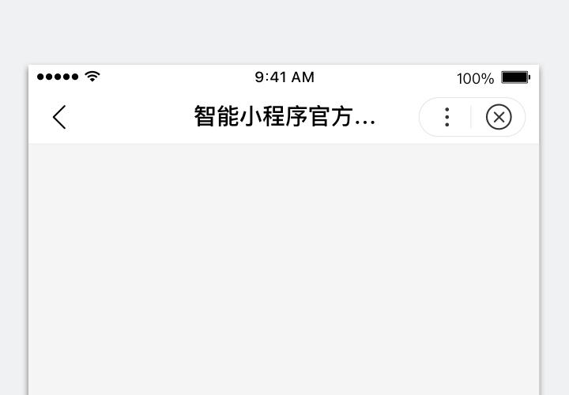
		
错误

标题过长截断导致的信息丢失，容易产生误解，应尽量避免截断。

	

### 4. 框架控制功能区

 	

 		
此区域为所有的小程序统一提供：
1.菜单：呼出菜单面板，内含夜间模式、分享等；
2.关闭：关闭并退出当前小程序。
		

 	

 	
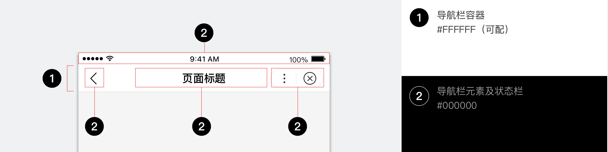
	

	

## 自定义顶部导航栏
> 百度App v11.1及以上版本的智能小程序，支持自定义顶部导航栏，使其只保留框架控制功能区。

使用自定义导航栏前，请了解透明框架的[页面布局](https://smartprogram.baidu.com/docs/design/foundation/layout/)基础，此时原生顶部导航栏中的容器、框架内部导航功能区、页面标题均不展示，开发者可自定义当前页面的顶部导航栏。

我们建议，在使用自定义导航栏时，通过系统信息接口[getSystemInfoSync](https://smartprogram.baidu.com/docs/develop/api/device_sys/#getSystemInfoSync)获得系统状态栏的高度（statusBarHeight），并为系统状态栏配置与自定义导航栏背景一致的颜色。

	

		
		
正确

普通手机（1）及全面屏手机（2）系统状态栏均正确适配，且颜色与自定义顶部导航栏一致。

	

	

		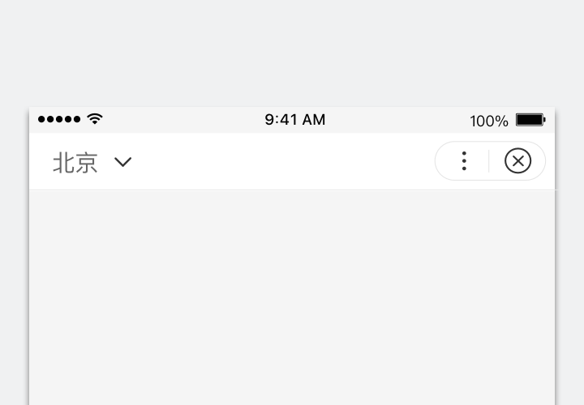
		
错误

适配系统状态栏高度，但未正确配置颜色。

	

	

		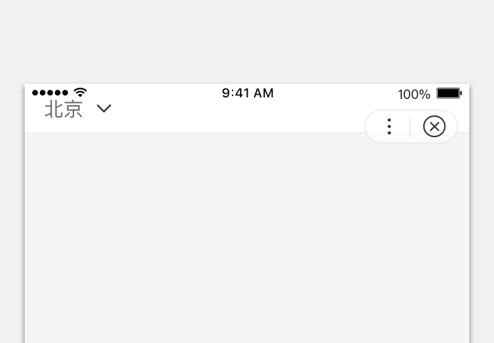
		
错误

未适配系统状态栏高度，导致自定义顶部导航栏布局错位。

	

自定义导航栏的元素建议与控制功能区对齐，且与原生顶部导航栏（navigationBarHeight）高度水平居中对齐。
技术实现请参考开发文档[全局配置](/develop/tutorial/process/)章节。

	

		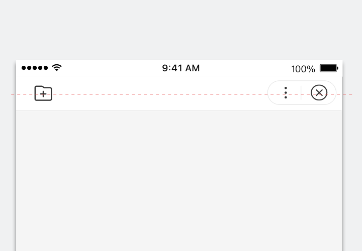
		
正确

自定义顶部导航栏元素与控制功能区水平居中对齐。

	

	

		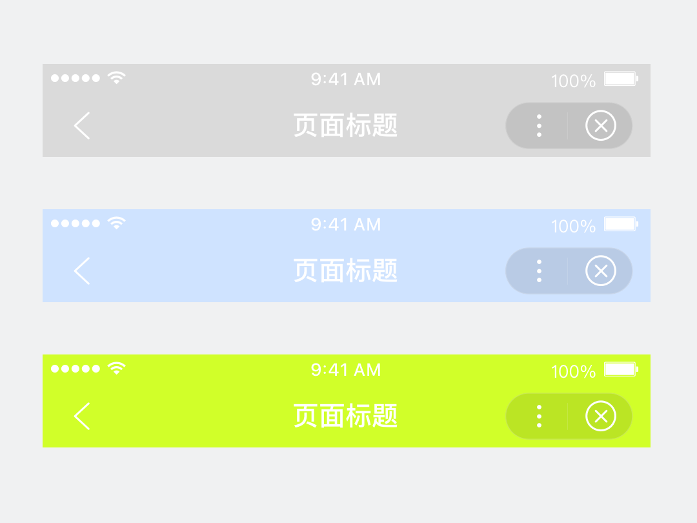
		
错误

自定义顶部导航栏元素未水平居中对齐。

	

<!--开发者也能便利地通过系统信息接口[getSystemInfo](https://smartprogram.baidu.com/docs/develop/api/device_sys/#getSystemInfoSync)获得原生顶部状态栏的高度(navigationBarHeight），更方便地使自定义导航栏的元素与原生导航栏对齐。-->

## 个性定制

### 黑色元素
默认顶部导航栏元素为黑，状态栏颜色跟随；容器背景默认为白色，但可被配置。

	

		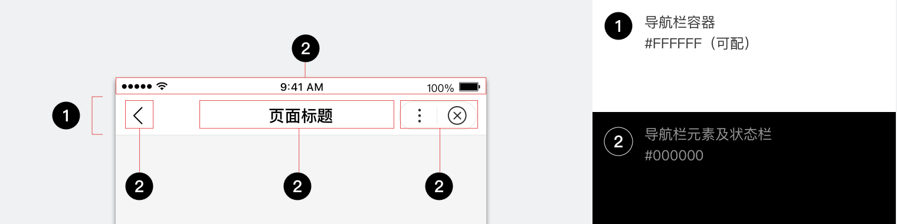
	

自定义配置容器背景颜色时，请重点关注信息的可识别性和整体阅读舒适度。

	

		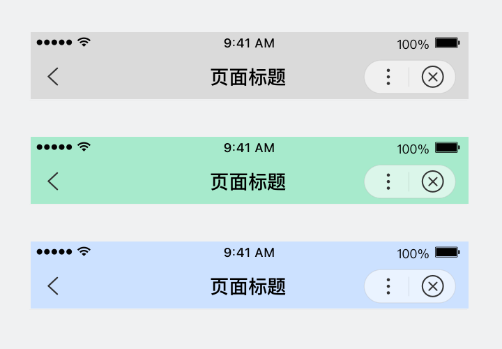
		
正确

黑色元素适合颜色较浅的容器背景。

	

	

		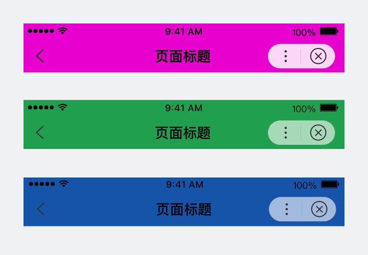
		
错误

当使用黑色元素时，背景配色应避免使用高饱和度或较深的颜色。

	

### 白色元素
顶部导航栏元素配置为白时，状态栏颜色跟随；容器背景可被配置。

	

		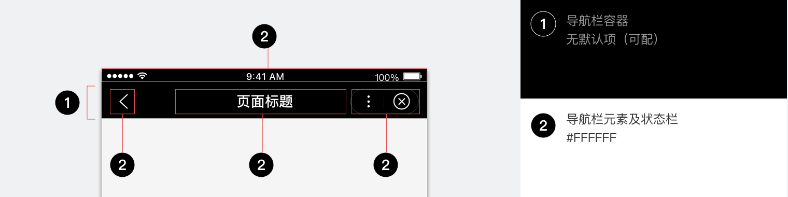
	

自定义配置容器背景颜色时，请重点关注信息的可识别性和整体阅读舒适度。

	

		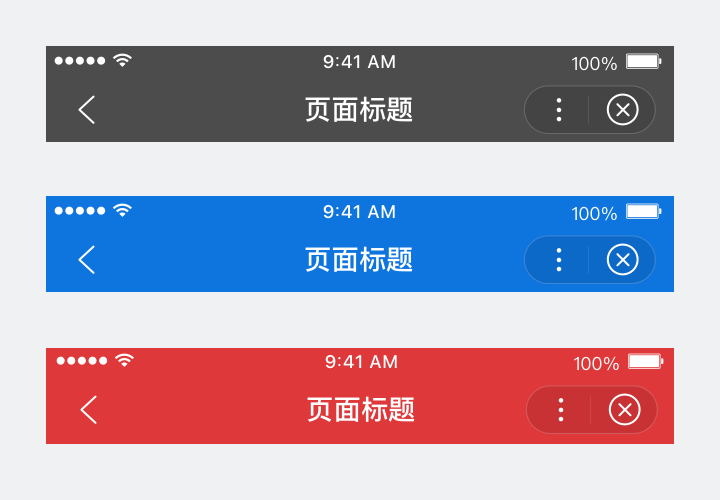
		
正确

白色元素适合颜色较深的容器背景。

	

	

		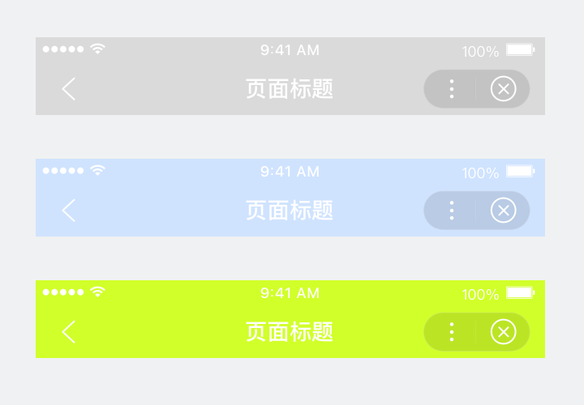
		
错误

使用黑色元素时，背景配色应避免使用高饱和度或较深的颜色。

	

