栏目选项条能方便用户在不同模块视图间浏览切换。

1. 栏目选项条可以放在页面顶部，也可以放在页面中部；
2. 切换查看不同栏目下的内容通过点击完成，如需辅以左右滑动手势，需配合“swiper”组件实现；

开发文档说明详见<a href="/"  target="_blank">设置 toptab</a>。

> 百度APP v11.13及以上版本的智能小程序，支持栏目选项条组件。

	

		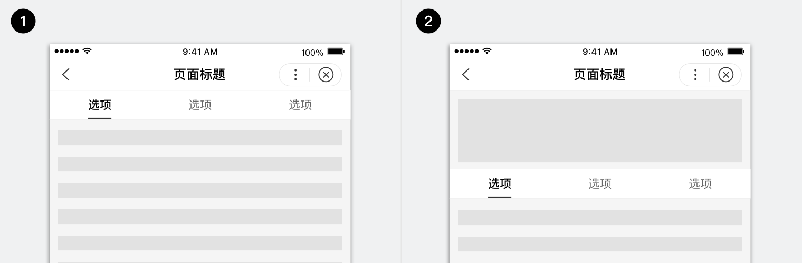
		
1.选项条在页面顶部
	2.选项条在页面中部

	

## 元素解构

	

		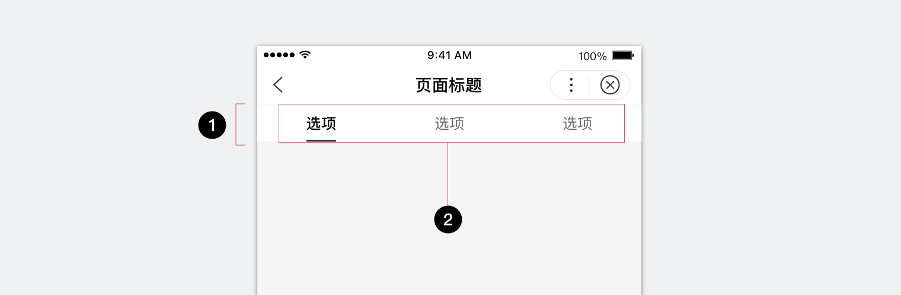
		
1.容器
	2.栏目选项

	

### 容器
栏目选项条容器用于放置栏目选项，并根据容器宽度和设置的最大显示数量均分展现，容器内设置2-5个选项为宜，每个选项对应展现其相应的分类内容。

		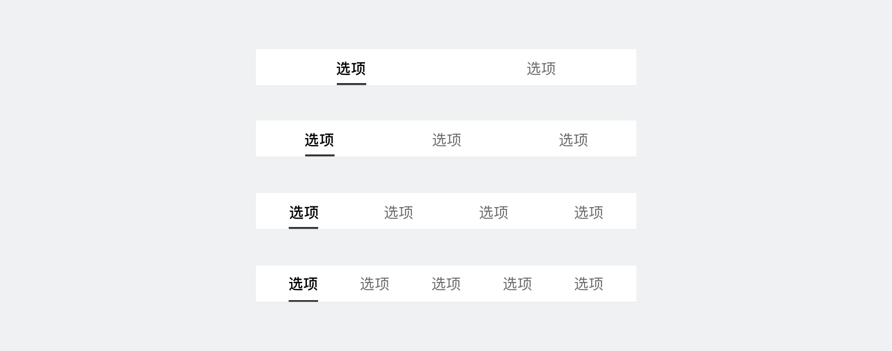

如需在栏目选项条右侧增加其他功能入口，可以通过自定义容器的整体宽度，为入口预留展示空间。入口数量不多于2个为宜。

	

		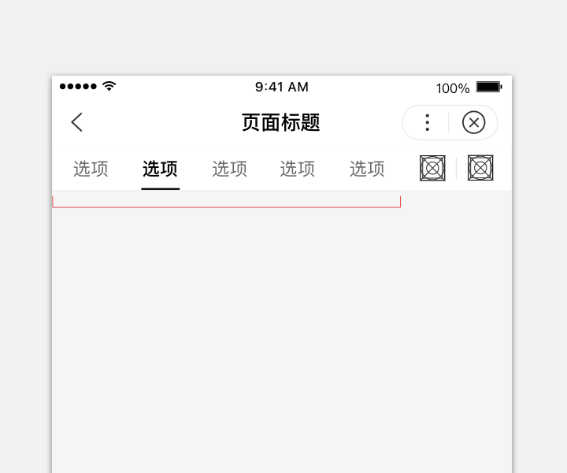
		
正确

选项条右侧设置2个功能入口。

	

	

		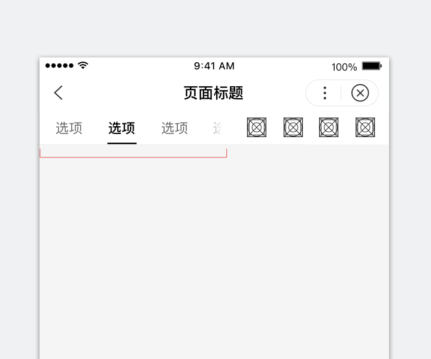
		
错误

功能入口过多，弱化了选项条，增加用户理解成本。

	

	

### 栏目选项
栏目选项根据用户行为分为三个阶段状态：非选中态、点击态和选中态（自带下划线）。其中点击态由小程序统一处理，其他由开发者自行定义。

	

		
		
1.选项名称
	2.选中态下划线

	

选项名称应简洁易懂，长度不大于4个汉字为宜。

	

		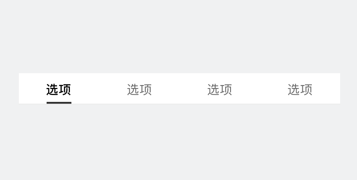
		
正确

选项名称简洁易懂。

	

	

		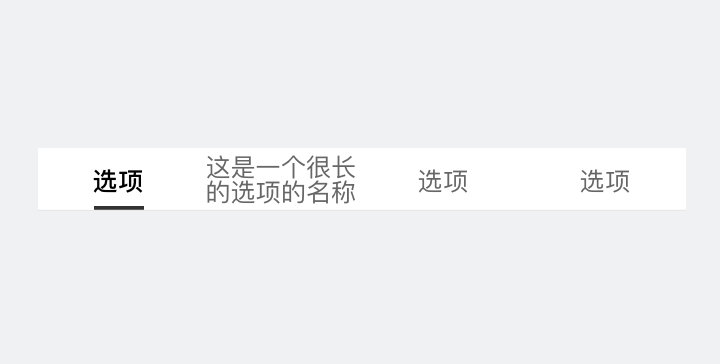
		
错误

选项名称过长出现折行，阅读成本高。

	

	

## 交互行为
点击栏目选项时，模块视图可以切换至与其关联内容。点击当模块所在选项，则无反应。如需辅以左右滑动手势，需配合“swiper”组件实现，开发文档说明详见<a href="https://smartprogram.baidu.com/docs/develop/component/view/#swiper-item-滑块视图容器子项/"  target="_blank">swiper-item 滑块视图容器子项</a>。
<video width="100%" muted autoplay="autoplay" loop="loop"  src="../../../img/design/component/toptab/7.mp4"/>
你的浏览器不支持该视频播放
</video>

温馨提示：如果你的浏览器无法正常播放，请尝试Chrome浏览器。

## 个性定制

### 默认样式

	

		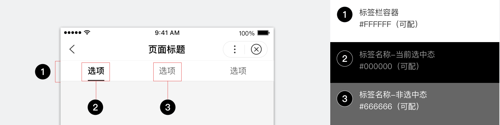
	

开发者可自定义选项名称和下划线颜色，请注意明确区分其选中态和非选中态样式，方便用户定位当前所在位置。

	

		
		
正确

在选中态和非选中态有明确颜色区分，下划线颜色清晰，便于识别。

	

	

		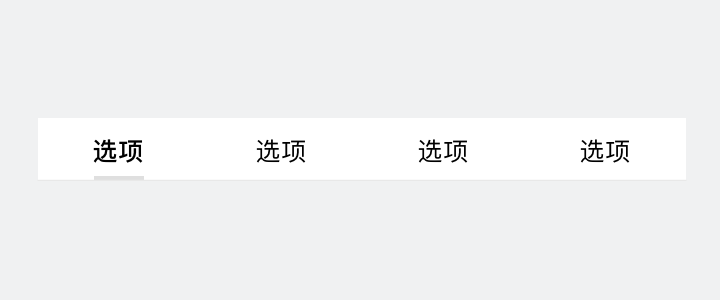
		
错误

选中态和非选中态的颜色无区分，只能通过浅颜色的下划线判断当前位置。

	

### 自定义样式
定义选项栏样式时，请务必关注并保证可读性和可用性。
用合适的颜色区分选项的选中态和非选中态，并且为容器设计适当的背景色，可保证内容显示清晰。

	

		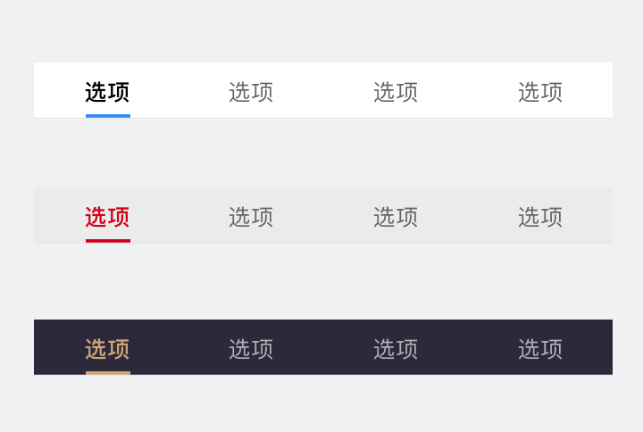
		
正确

栏目选项条整体样式均可定制，使用品牌主色或辅助色可以强调体现品牌，但整体需保证内容清晰显示。

	

	

		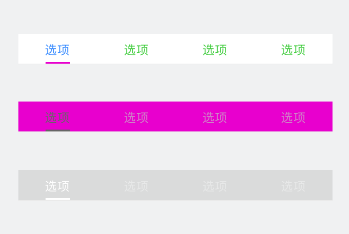
		
错误

选中态与下划线颜色突兀，容器与元素配色不协调，过多使用高饱和度颜色等，均会降低阅读的舒适度。

	

