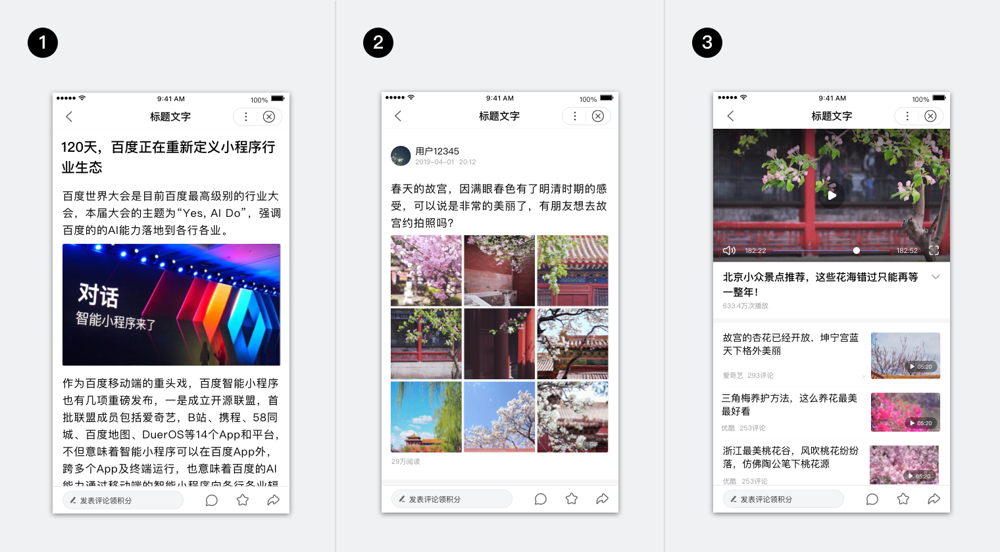
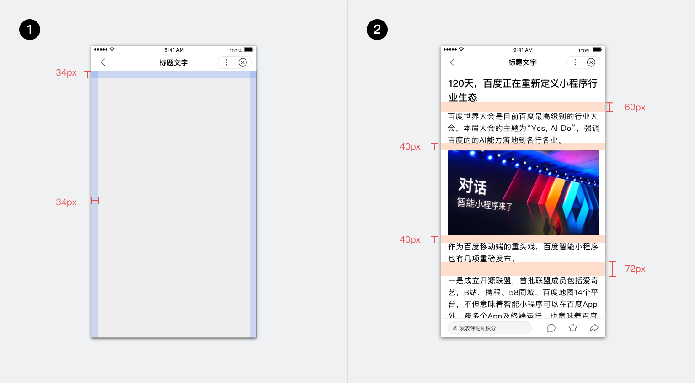
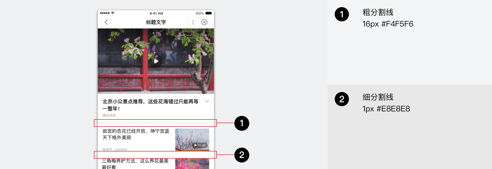
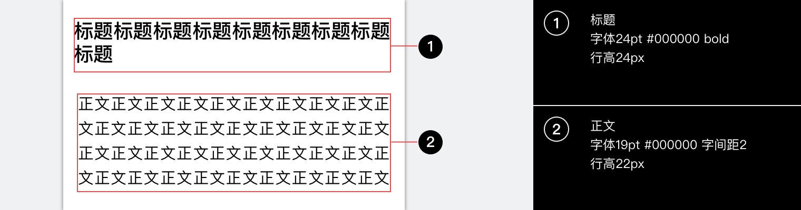
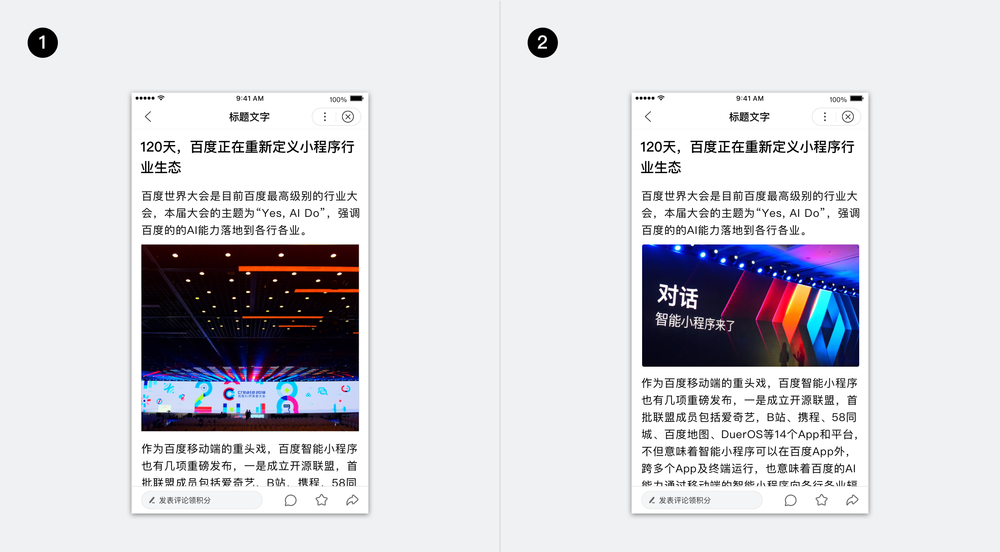
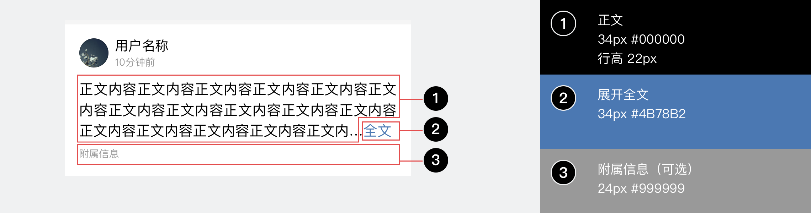
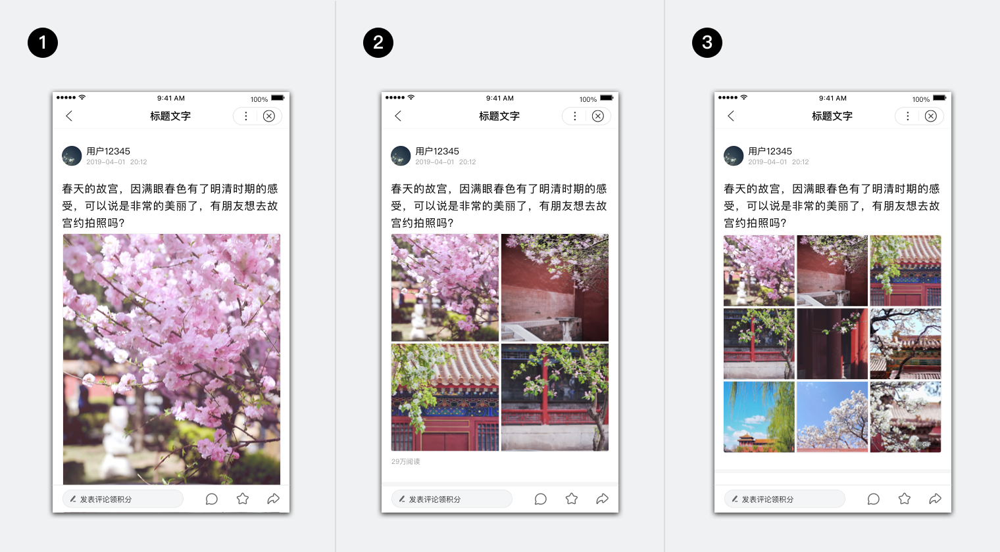
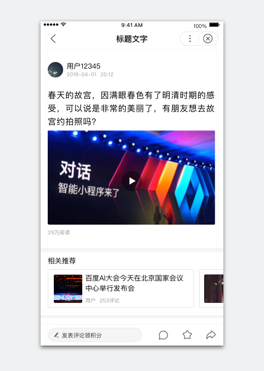
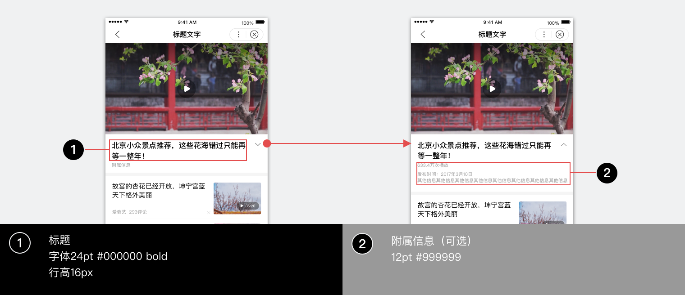

智能小程序提供三种内容详情页，均已多轮实验验证其阅读舒适度，建议开发者使用。

1. 图文详情页
2. 动态详情页
3. 视频详情页

## 基础布局
### 间距
布局时，为信息内容区留出至少适当边距，以获得最佳的可读性。

1. 页面边距：信息内容离顶部、屏幕左右边距34px；
2. 内容模块间距：标题与正文区间距60px，文字与多媒体间距40px；文字段落与段落间距72px。

### 分割线
内容详情页中可能有多类内容模块，如评论、相关推荐等，使用分割线区分不同模块及信息间的层级。

1. 粗分割：用于区分不同类型的内容模块，如内容详情与相关推荐；
		2. 细分割：用于区分同级模板，如推荐列表。

## 图文详情页
图文详情页一般由标题、正文、多媒体组成。

### 1. 标题和正文

1. 标题：字号24pt，行高16px；
			2. 正文：字号19pt，字间距2，行高22px。

### 2. 多媒体
图片和视频能丰富页面，请根据资源选择合适尺寸：

1. 图片：尺寸最宽为760px，当图片不满足最宽尺寸时，不进行拉伸显示，避免图片不清晰；
2. 视频：宽度为760px，尺寸为16:9。

## 动态详情页
动态详情页一般由正文、多媒体组成。
### 1. 正文

1. 正文：字号17pt，行高22px；
			2. 展开全文（可选）：字号17pt；
			3. 附属信息（可选）：字号12pt。

### 2. 多媒体
图片和视频能使文章更丰富，为达到最好阅读效果，请根据资源及数量选择合适尺寸。

#### 图片
1. 展示一张图片时，图片尺寸最宽为760px，当图片不满足最宽尺寸时，请不要拉伸显示，避免图片不清晰；
2. 当需要同时展示多张图片时，请根据不同图片数量使用不同的排版布局，以能获得更佳效果。
- 图片尺寸为1:1；
- 图片间距为8px。

		
1. 图片数量 = 1；
			2. 图片数量 = 2，4；
			3. 图片数量 = 3，5，6，9；

#### 视频

 	

展现一个视频时，宽度为760px，尺寸为16:9。

 	

 		

	

	

## 视频详情页
视频详情页一般由视频播放器、标题组成。

### 1. 视频播放器
使用智能小程序的视频播放器插件，使其固定在页面顶部。

	

		
		
正确

正确配置视频封面，效果好。

	

	

		
		
错误

未配置视频封面，无用户预期。

	

### 2. 标题

1. 标题：字号24pt，行高16px；
			2. 附属信息（可选）：字号12pt，行高12px。

