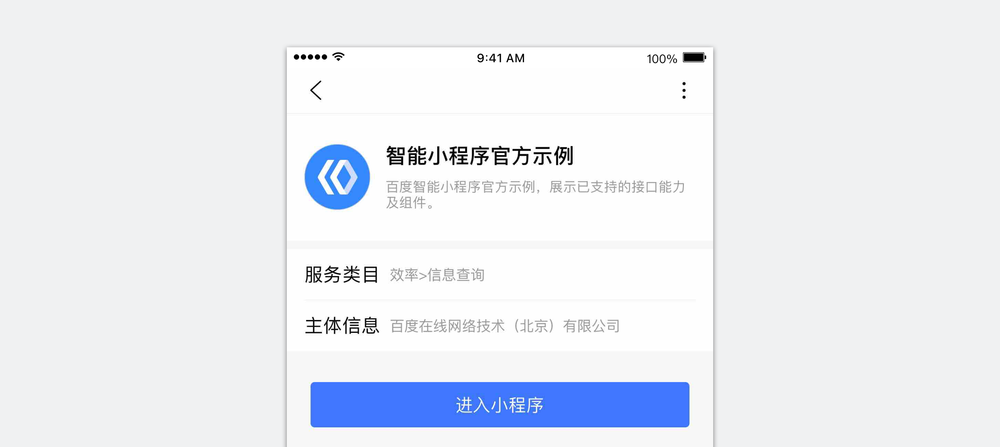
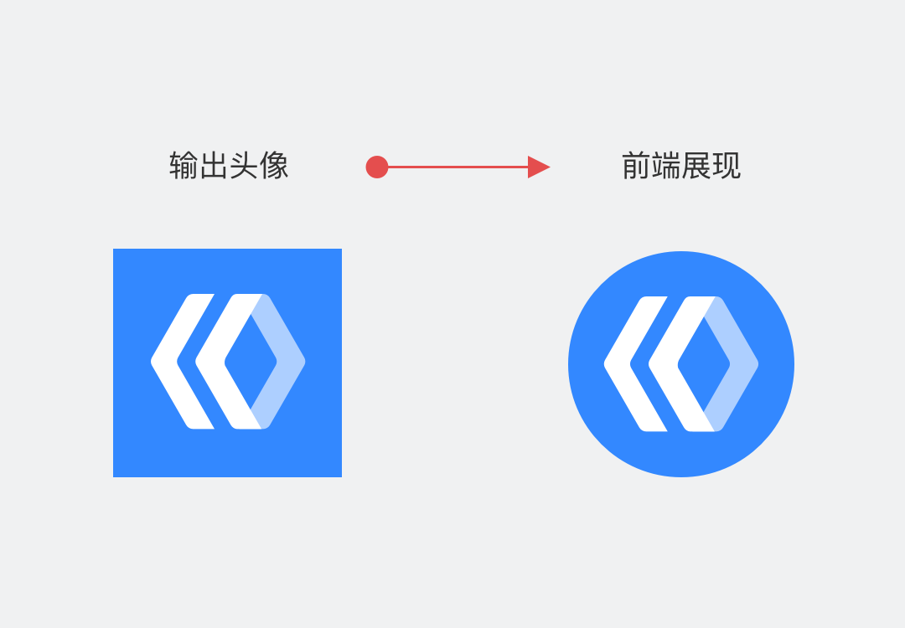
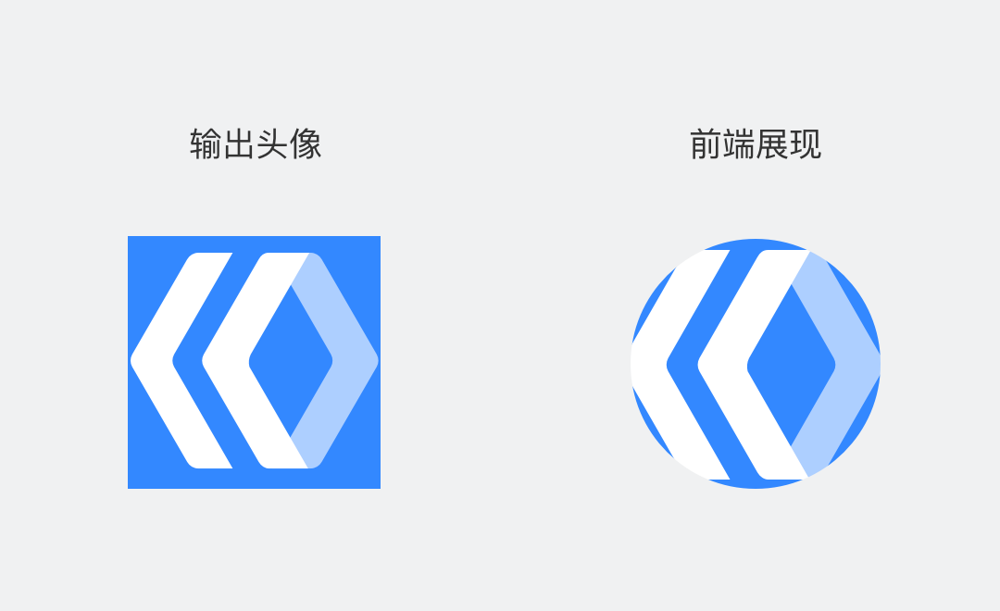
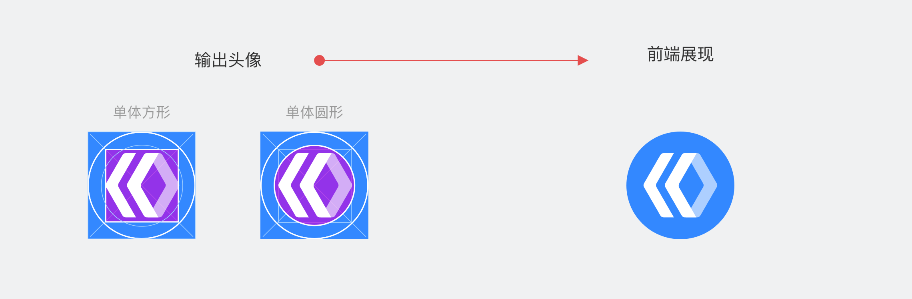

小程序头像将在开发者平台、百度App、小程序页面内以圆形外观展现；请使用清晰、合适大小的头像切图，以保证在界面展现上的美观和完整。

## 输出规格
|项目名称|要求|
|:--:|:--:|
|头像格式|PNG、BMP、JPEG、JPG格式的静态图片|
|头像尺寸| 144x144px 正方形|
|头像大小| 小于等于120kb|

		

## 输出原则

1. 小程序头像输出需保证主体元素的完整性，不能被前端圆形容器裁切。

	

		
		
正确

头像图片输出时主体元素比例适中，前端圆形头像展现完整。

	

	

		
		
错误

头像图片输出时主体元素占比过大，导致被前端圆形容器裁切。

	

2. 小程序头像为单体元素，元素在图片整体尺寸中的占比建议在70%以上，最好不超过80%。

		
1. 设计建议：头像的主体元素在方形或圆形参考线内；
		2. 前端展现效果：能在圆形轮廓中展现完全。

	

3. 如小程序头像为“图形+文字”的上下组合，或左右组合形式，应至少预留整体图片的20%作为出血区。

	

		
		
正确

头像图片预留了20%出血区，页面中圆形头像展现完整。

	

	

		
		
错误

头像图片预留出血区比例过低，导致被前端圆形容器裁切。

	

