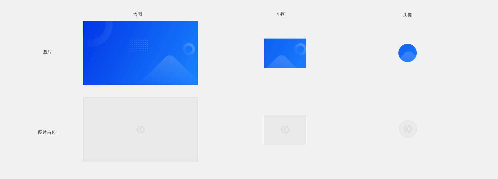
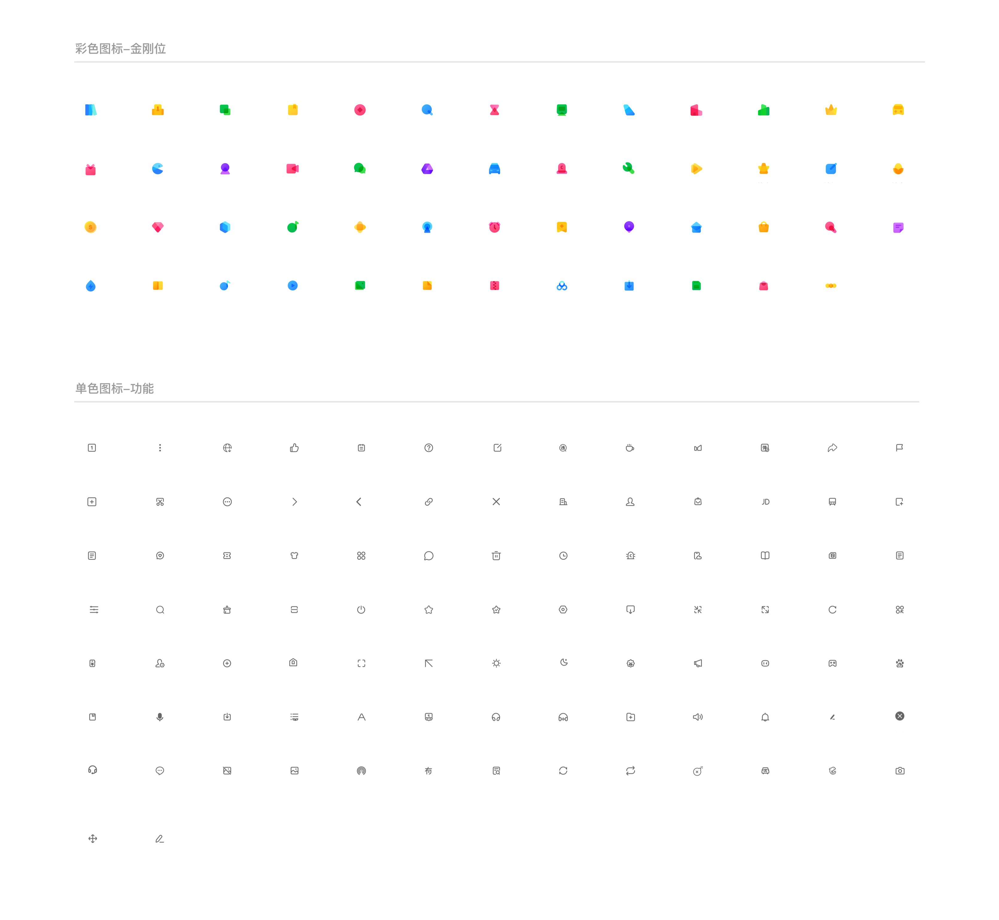

## 图片
图片比文字更吸引用户，能大大丰富页面内容。
请使用清晰的图片，模糊像素感的图片会降低页面的整体质感。

	

## 图标
图标能辅助信息的表达，建议按场景优化选用合适的通用图标样式。绘制图标时，请注意：
1. 使用几何图形进行图标绘制，风格应简洁、辨识性强；
2. 更多图标，详见设计资源的[UI Kit](https://smartprogram.baidu.com/docs/design/resource/uikit/)。

	

