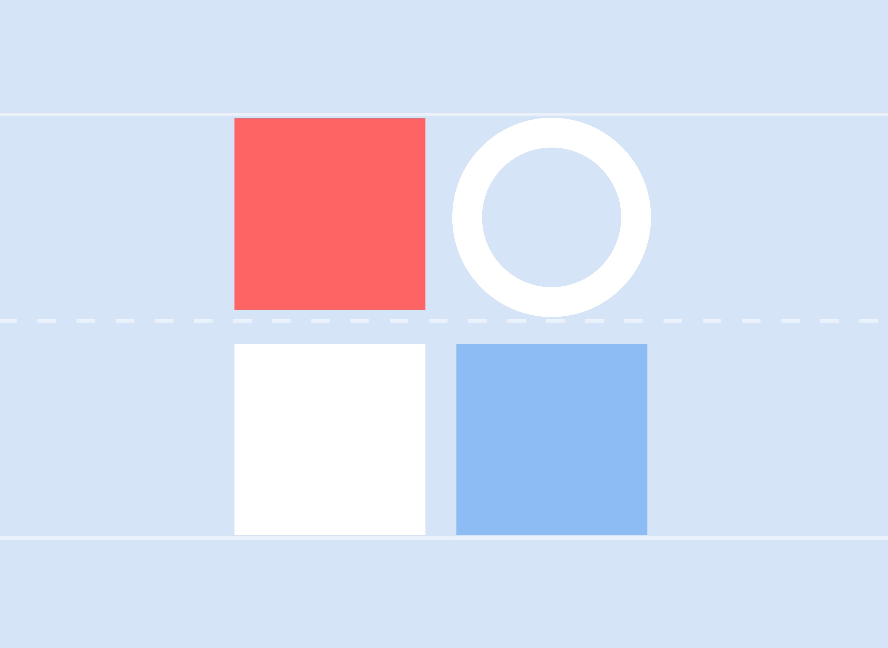

# 智能小程序体验设计指南
此指南由小程序团队提供，旨在帮助开发者们快速了解智能小程序，并在提升小程序体验方面给出相关设计建议。

## 内容构成
百度智能小程序体验设计指南共分成三个部分：

	

		
设计原则
		贯穿全流程设计的考量重点

	

	

		
设计规范和常用组件
		视觉和交互层面的设计建议

	

	

		
视觉组件库和设计走查表

	

## 更新记录 

|日期|内容|
|--|--|
|2018-11-08|1.设计资源 更新 [视觉组件库](../../resource/uikit/) ; 
2.设计资源 新增 [设计走查表](../../resource/checklist/) ;
3.设计资源 新增 [Lottie动效库](../../resource/lottie/)。|
|2018-09-21|1.优化设计原则，补充大量案例 ； 
 2.所有图例更为新框架 ;
3.增加iPhoneX适配说明;
4.优化部分常用组件。|