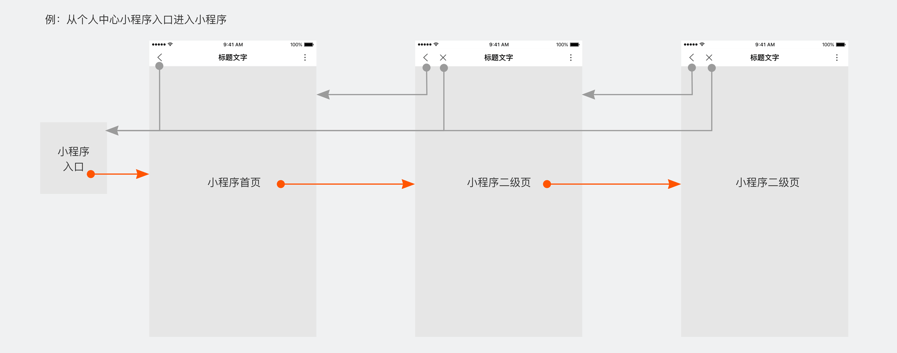
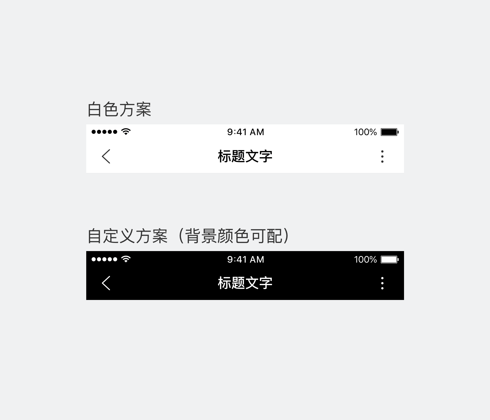
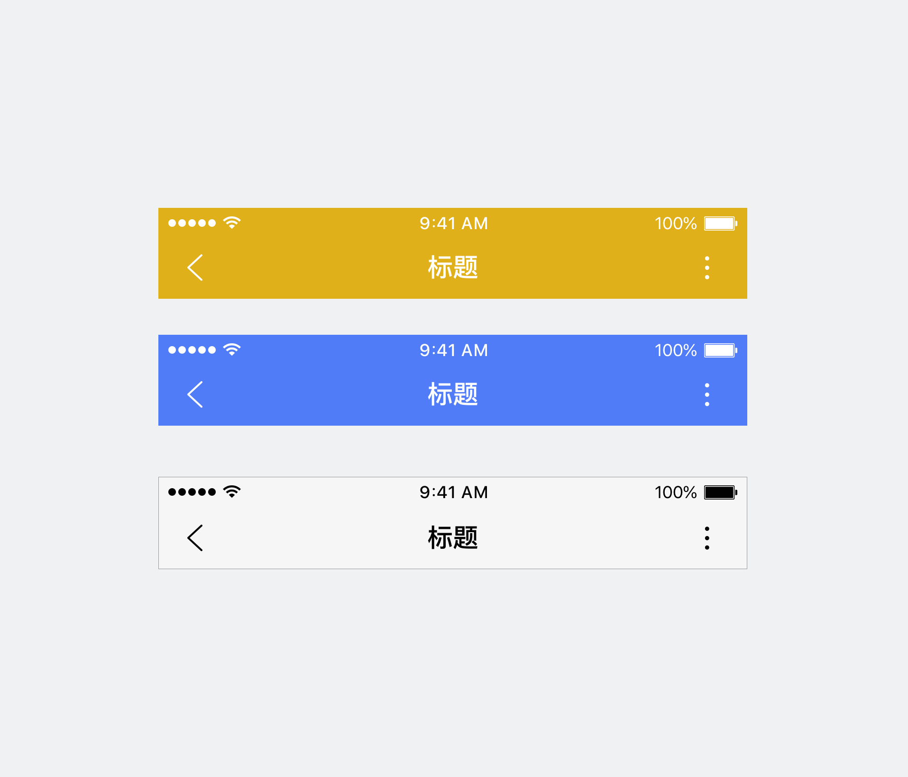
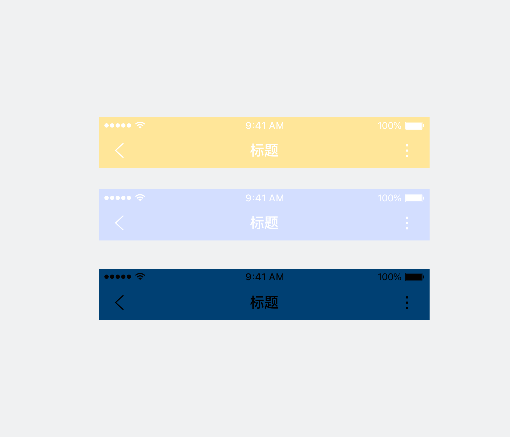
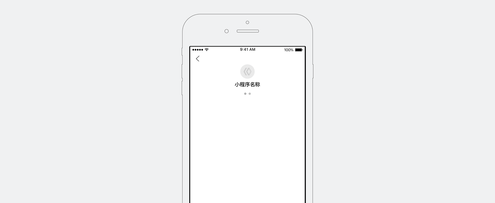
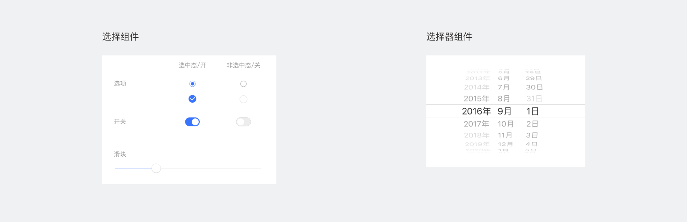
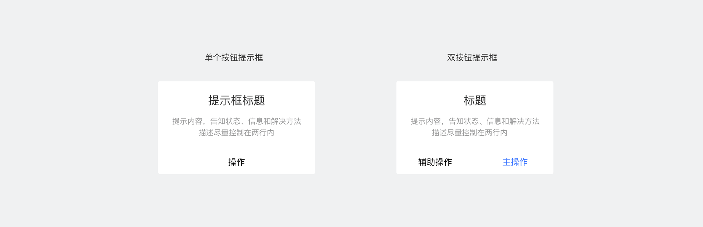
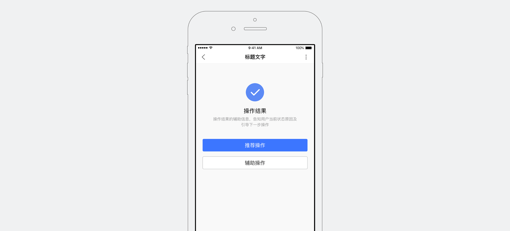

小程序导航
--------------
<notice>合理地设计清晰的导航，能使智能小程序的信息架构和浏览体验提升</notice>

当用户进入智能小程序，我们需要清晰地告知用户当前的位置，确认用户在浏览页面时不迷路，从而更舒适愉悦地使用智能小程序。
智能小程序框架已具备页面导航能力，开发者只需要标记定义“首页”即可，无需额外开发成本。

顶部导航栏
--------------
<notice>帮助用户定位“当前位置”，并指示“可往何方”和“可归何处”</notice>

固定顶部，不随页面滑动。
自定义配置：文字内容（字号固定）、背景颜色（请关注并保证其可读性和可用性）。

标准配色方案

正确

背景色与文字色搭配可读性好

错误

背景色与文字色搭配效果可读性差

底部标签栏
--------------
<notice>用于架构同级信息</notice>

通常不随页面滑动，用户切换可在当前页面浏览更多的内容。同一页面不可出现两组底部分类标签导航栏叠加。
标签数量不得少于2个，不得超过5个。每个选项字数建议保持一致且不超过4个中文字符，以保证不同手机屏幕尺寸，标签点击区域的易用性。

通常在首页底部固定展现。
自定义配置：图标样式（大小固定）、文字内容和颜色（字号固定）、背景颜色（请关注并保证其可读性和可用性）。

反馈
--------------

<notice>对当前状态及时反馈，能降低用户使用过程中等待的焦虑感</notice>

在用户使用智能小程序时，有时难免会出现各种需要等待的场景。移动场景下，用户的耐心是非常宝贵的，我们应该避免让用户面对一个静止的屏幕等待未知的结果。
使用反馈组件和动画辅助，以暗示用户当前智能小程序仍在正常运作，而没有卡死。

<notice>1. 框架启动加载反馈</notice>

智能小程序启动框架时，会使用此加载动画显示启动加载的状态。此加载反馈动画与百度App通用加载动画不同，更突出智能小程序的品牌和特性。
此为智能小程序框架通用能力，除LOGO和名称彼调用开发者的智能小程序信息外，其他视觉动效及交互均由智能小程序框架统一提供，开发者无需额外开发成本。

<notice>2. 内容加载反馈：用于反馈页面内容的加载状态</notice>

* 局部加载

局部加载反馈即只在触发加载的局部模块进行反馈，此加载反馈模式更好地指示了操作响应入口，且用户在此反馈下仍可浏览页面，负面情绪较少，推荐使用。

* 全局加载

全局性操作反馈且无法明确加载进度时使用。此加载样式为模态，此时用户无法操作页面，又无法明确告知具体加载位置和进度，可能引起用户焦虑，应该谨慎使用。

<notice>3. 选择操作反馈：表达用户选择的状态</notice>

用户对于当前页面内某个选项做出选择后，应在当前操作区域反馈其选择的状态。
各组件详细说明，请参考[组件-选择](../../component/choose/)章节。

<notice>4. 操作结果反馈：显示用户操作的结果</notice>

* 提示反馈

操作反馈3秒后消失，不打断用户流程，适用于轻量级的提示。设计时请注意，同一时间只显示一个反馈提示，并且应该根据不同的场景和反馈需要的强弱程度选择样式。
各组件详细说明，请参考[组件-反馈](../../component/feedback/)章节。

* 提示框反馈

提示框为模态，适用于需要用户明确知晓的信息，并做出下一步决定的情况。请谨慎使用提示框，因为它们打断用户路径，并会分散用户的注意力。
各组件详细说明，请参考[组件-反馈](../../component/feedback/)章节。

<notice>5. 结果页反馈</notice>

在流程的最后一环，且结果反馈比较重要时，可以使用全屏结果页向用户反馈结果。稳定页面展现最为明确地告知用户结果，且能引导用户进行下一步操作。
自定义配置：操作图标（建议使用智能小程序提供的图标），操作结果文字，操作结果辅助信息，下一步操作。

操作图片说明，请参考[设计规范-组件](../../specification/component/)章节。
组件详细说明，请参考[组件-反馈](../../component/feedback/)章节。
相关视觉资源，请下载[百度App智能小程序UIKIT](../../download/) 。
