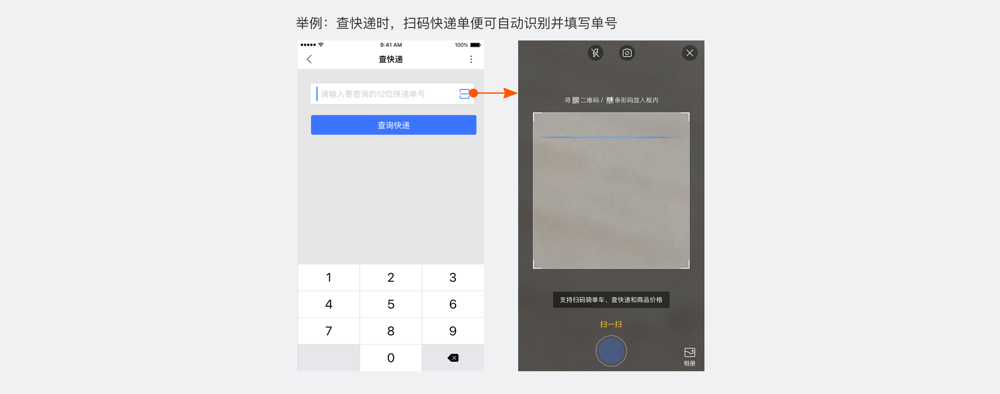
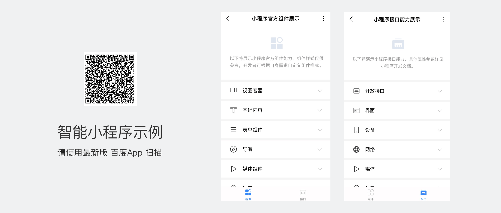
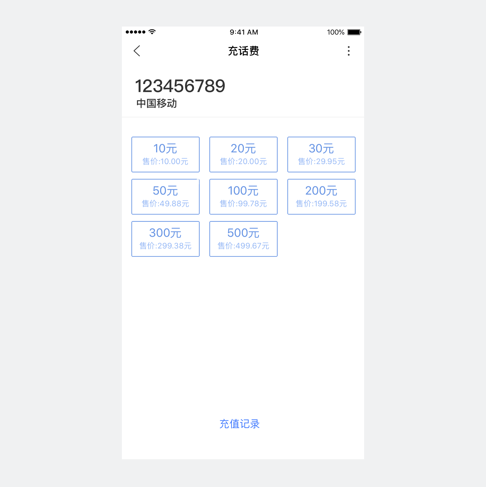
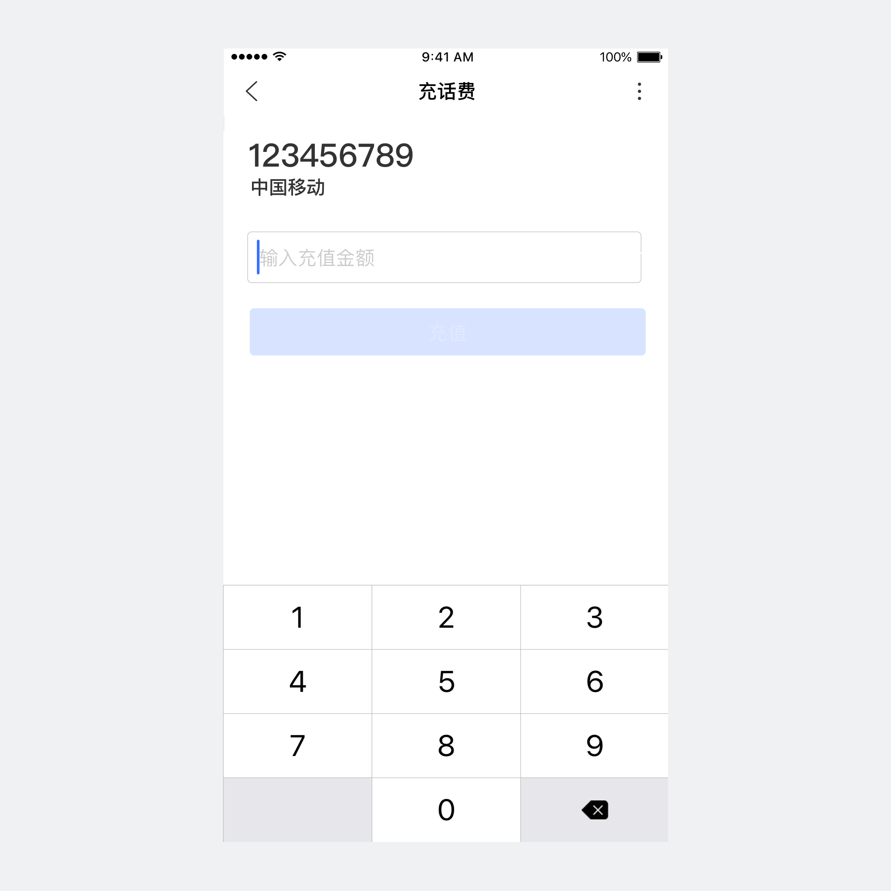
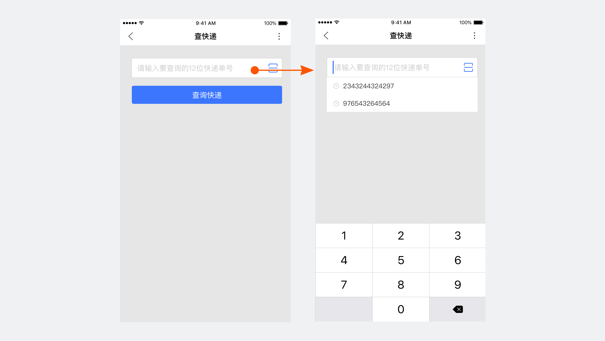
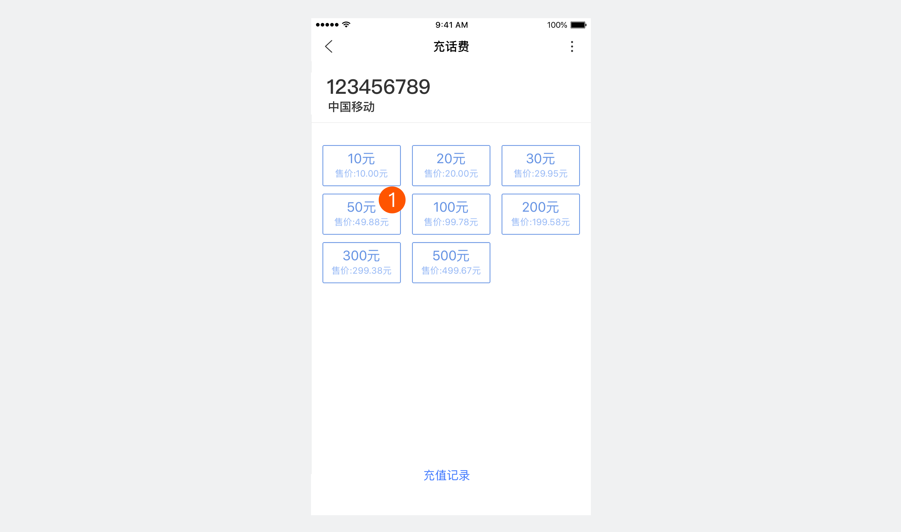
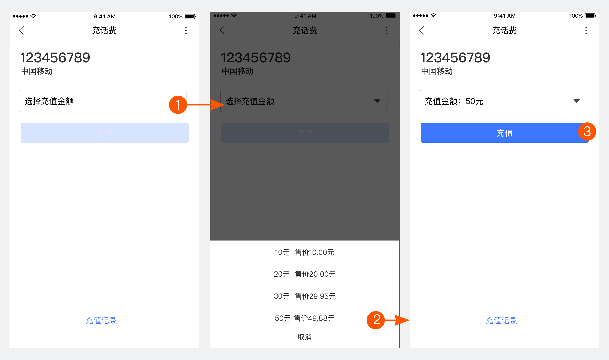

<notice>手机的输入效率低且输入场景复杂，应减少用户输入</notice>

手机屏幕虽然有变大的趋势，屏幕精度也在增加，但整体交互操作的准确性并不算精确；尤其手机键盘布键密集，输入困难还易引起输入错误。开发者在设计智能小程序时，应该充分考虑手机特性，尽量减少用户输入，利用现有接口或其他一些容易操作的选择控件来改善用户输入的体验。

<notice>利用接口</notice>

在合适的场景使用智能手机传感器，如摄像头、麦克风等。
智能小程序还对外开放如地理位置、用户公开信息等各种授权接口。
利这些资源不但能够减少用户成本，为用户提供更加快捷的服务，而且能提升智能小程序性能，从而进一步提升了用户体验。

这些接口库会不断完善和扩充。
你可以在百度App中，使用扫一扫功能，在“<notice>智能小程序示例</notice>”中了解组件的最新动向。

<notice>降低操作成本</notice>

当无法通过接口帮助用户输入时，可以尝试以下种方法帮助用户降低其输入操作成本。
1.选择比输入更便利，让用户做选择而不是键盘输入。

正确

用户一步点击完成任务

错误

需要用户输入并进行下一步

2.提供输入历史和输入帮助

正确

提供搜索历史，帮助用户回溯

<notice>消除附加工作，可以提升操作效率，缩短用户路径</notice>

产品在使用过程中经常会有一些多余的点击，对于用户而言，这些不必要的操作都是附加成本。减少消耗用户的精力、但是不直接实现用户的目标的附加工作，改善产品的可用性。

正确

用户1步操作到位，信息明确

错误

用户需要操作3步，且无法看到价格选项，增加了附加工作

