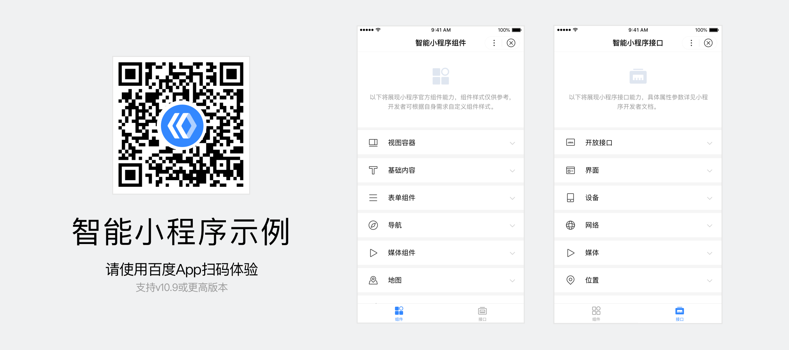
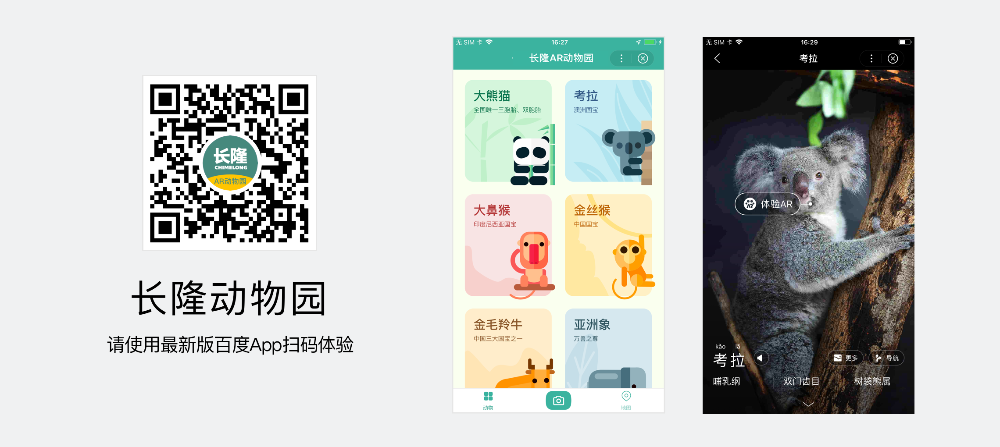
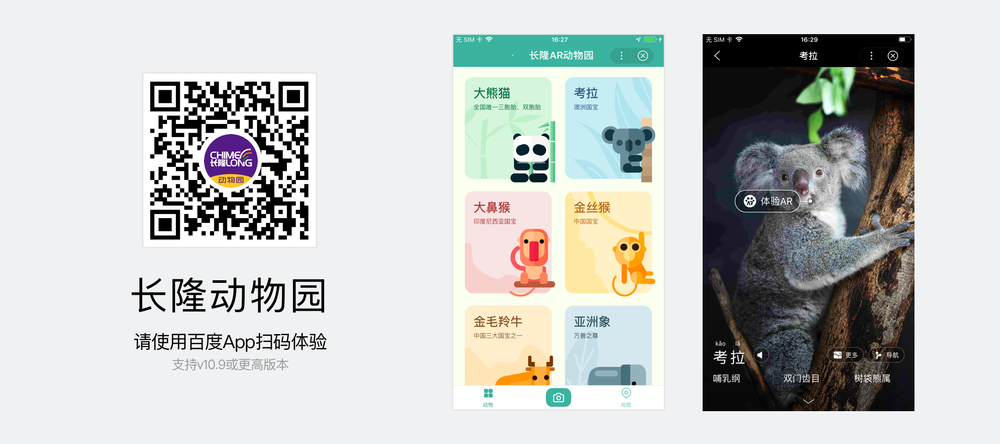

百度小程序为开发者提供基础组件，如按钮、图片等；这些控件均已在百度App中使用论证，充分地考虑移动设备的特点和可用性。
除了这些基础组件，我们还开放丰富的接口，如地理位置、地图导航等。利用这些开放资源，能够减少开发者搭建成本，而且能提升小程序性能。

想要更好地了解和使用这些资源，开发者可以：
1. 在[常用组件](../../component/topnav/)查看组件的使用细节和设计建议；
2. 下载设计所需的<a href="https://smartprogram.baidu.com/docs/design/resource/uikit/">UI Kit</a>，我们提供Sketch版本和Photoshop版本；
3. 使用百度App的拍照扫码功能扫描二维码，在官方示例中查看和试用这些组件和接口。

	

		
	

我们期待开发者们能灵活运用这些组件和接口工具，结合具体的场景需求和奇思妙想，一起碰撞创造出更多有趣的小程序。
在小程序前期，我们内部也做了一些创新尝试，有些已在AI开发者大会上亮相，有些还有研发设计中。它们的设计故事，我们还在继续记录和书写，后续会与大家见面。

		

		

