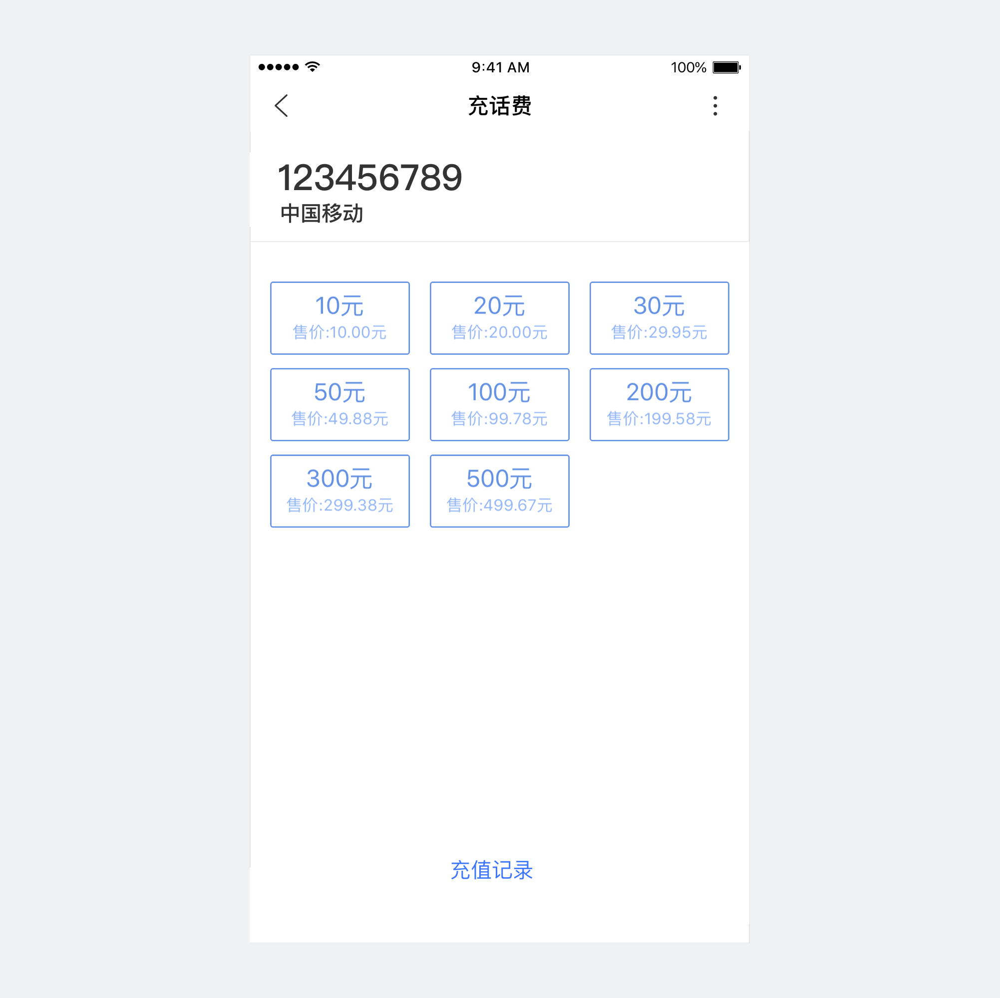
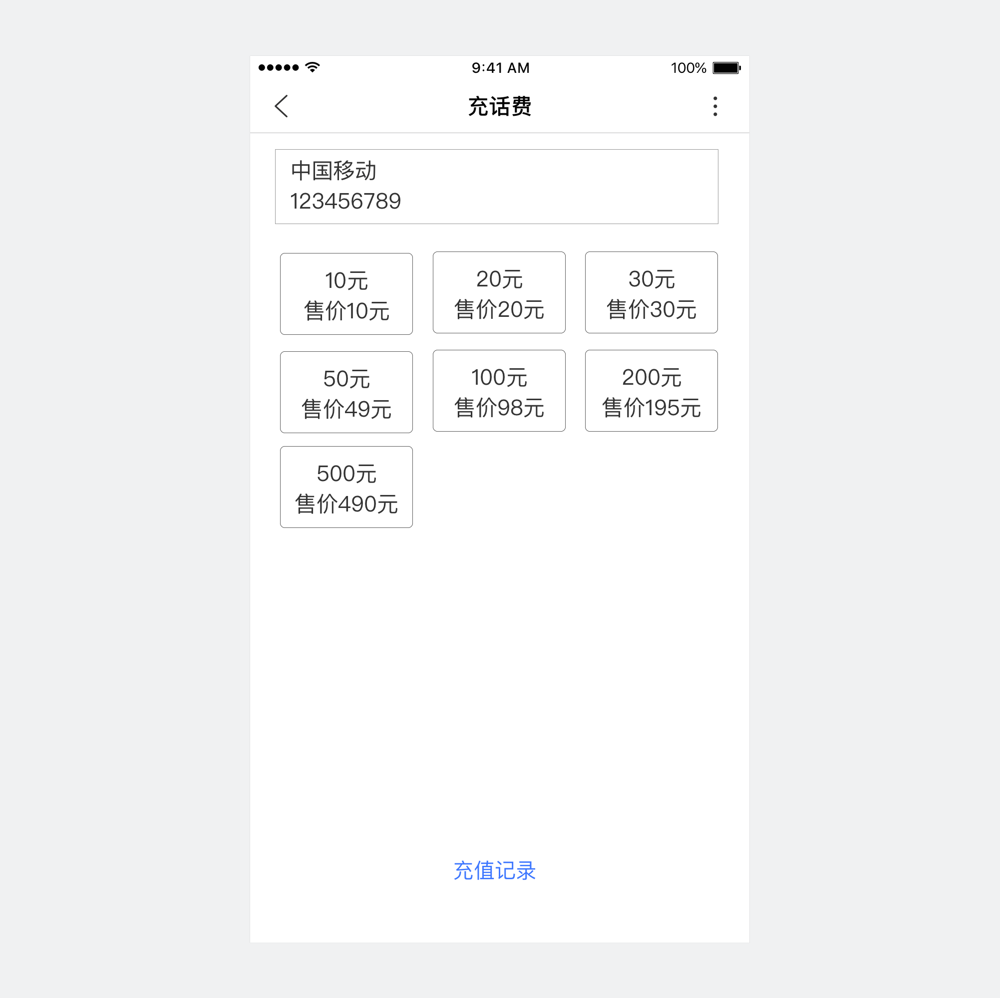
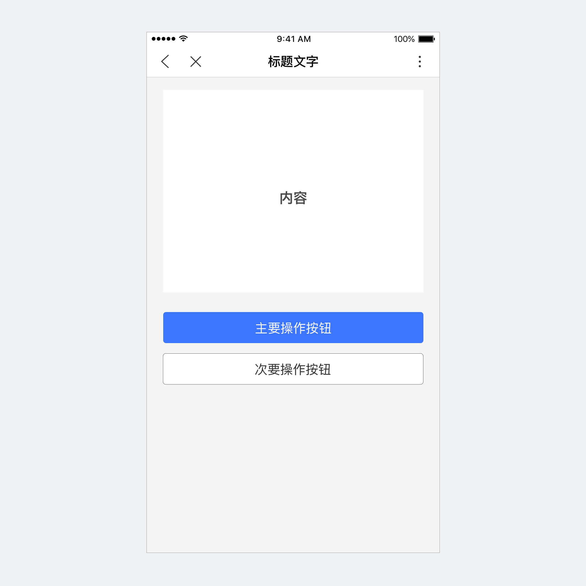
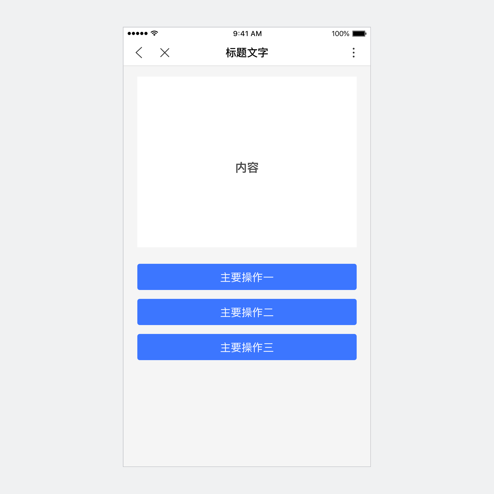
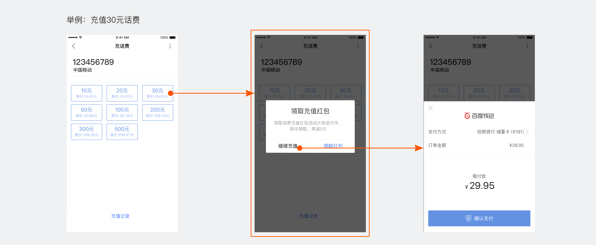

<notice>设计界面信息时，重点突出主要信息和操作</notice>
 

正确

信息主次层次分明

错误

字号颜色均一样，没有主次

正确

操作有主次重点

错误

多平行操作，用户难以选择

<notice>设计任务流程时，一次只做一件事情</notice>

移动设备使用场景复杂，用户注意力易分散。设计智能小程序时，为了帮助用户聚焦当前任务并且快速顺利完成，设计智能小程序的任务流程时，应明确当前主要任务操作，并且避免出现任务路径外的内容打断用户流程。

错误

弹窗打断了用户原充值流程

