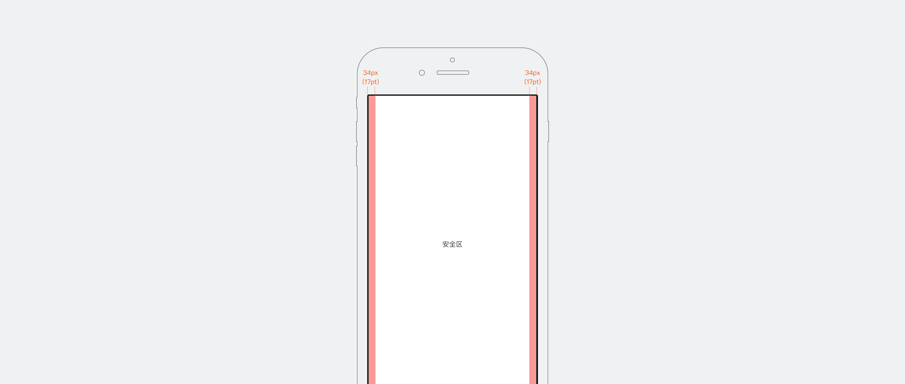
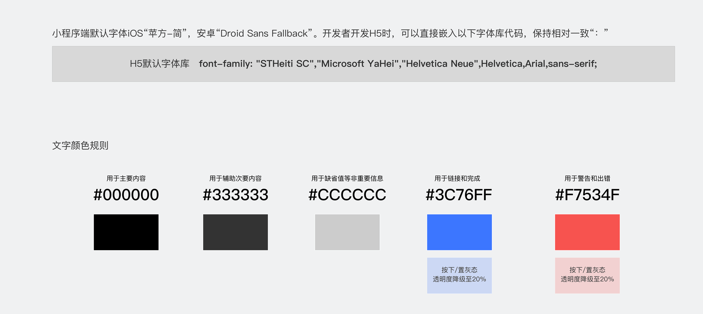

布局
--------------
<notice>布局指南</notice>

基于宽度750px（iPhone 6）输出视觉方案，我们在布局智能小程序信息时，为信息内容区留出左右边距34px（17pt），以限制内容宽度以获得最佳的可读性。

在布局时，请重点考虑：

<notice>1. 通过合理布局，表达不同信息权重：</notice>

用户浏览内容的顺序是“从上往下，从左往右”，因此，在布局信息时，我们应该把主要的信息/操作放在屏幕的上半部分和左侧；此外，更大的文字字号、更抢眼的颜色也能起到权重表达辅助，具体请参考[文字](../../specification/text/)章节 。  

<notice>2. 为可点击操作控件设置合适的点击热区：</notice>

考虑到用户手指操作精准度，我们建议可点击操作的响应点击的热区大于等于88x88px（44pt），最小不能小于72x72px（36pt），且点击间不重叠。

文字
--------------

<notice>智能小程序文字使用规则与百度App保持一致</notice>

智能小程序内文字常用字号为48，36，32，28，26(px)，使用场景具体如下：

