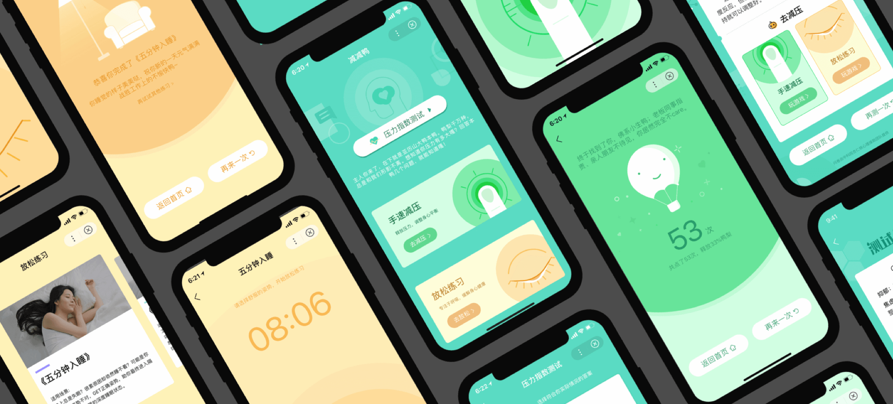
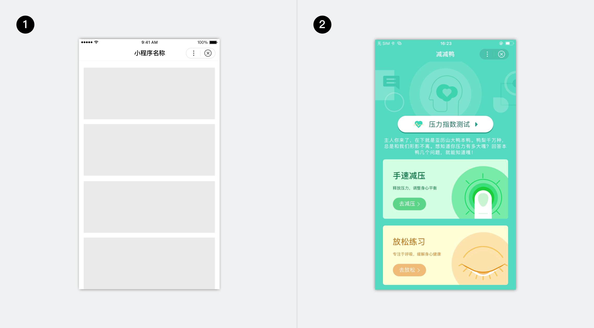
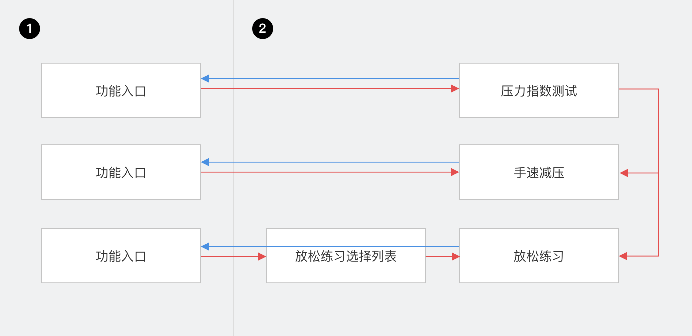
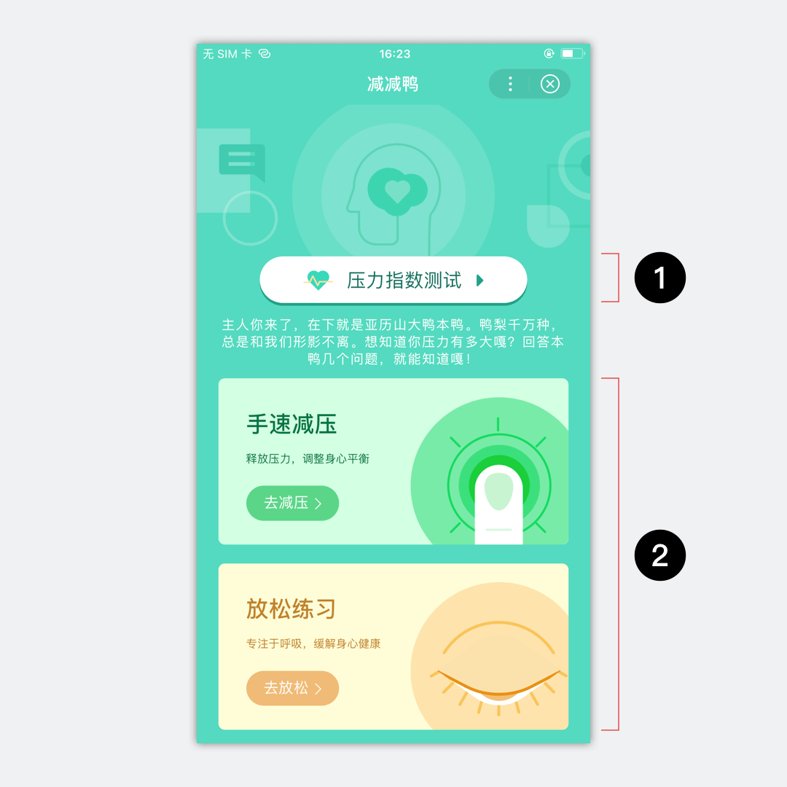
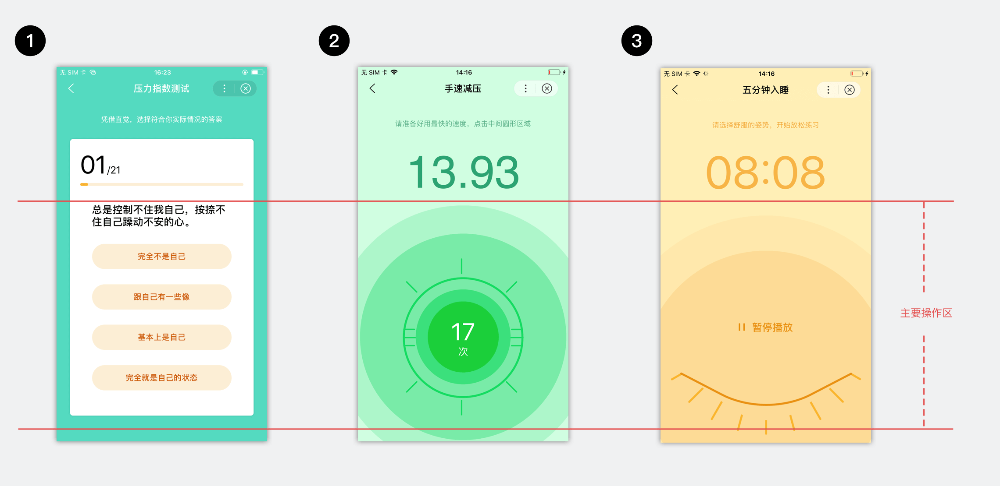
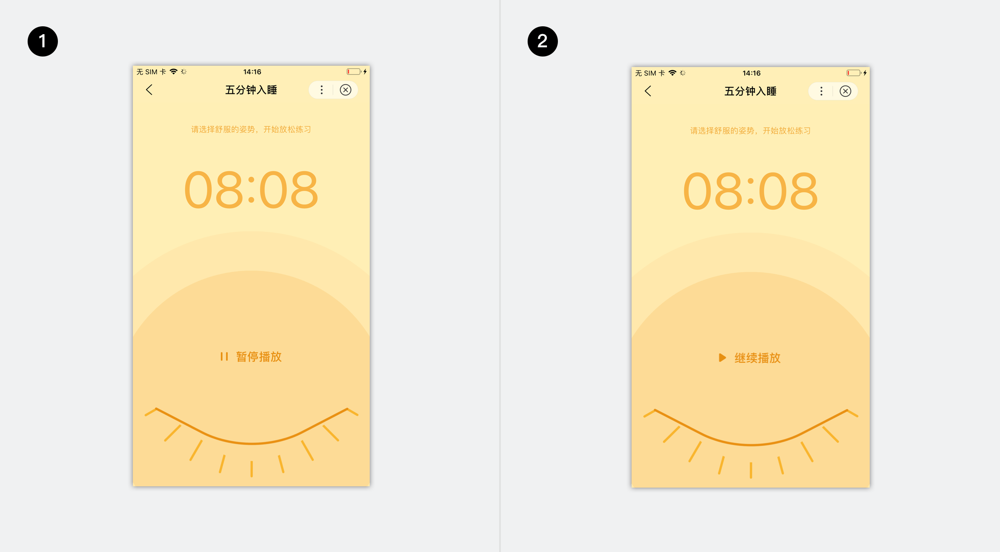
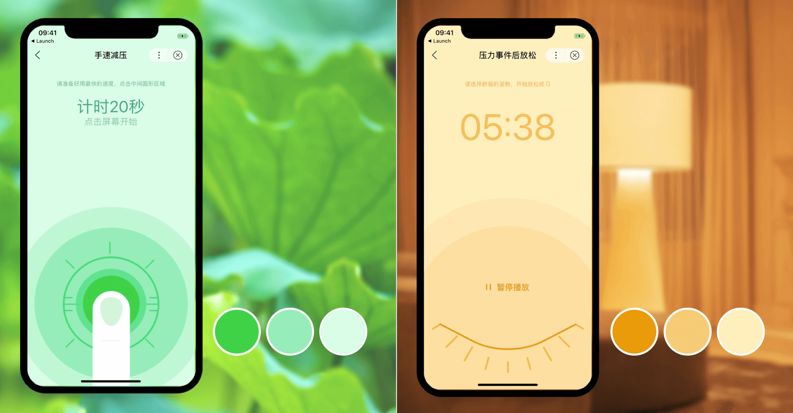
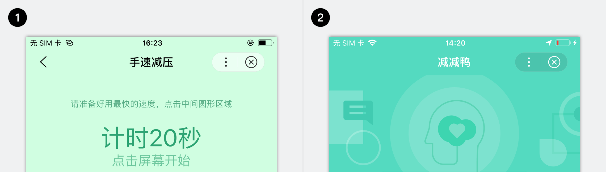
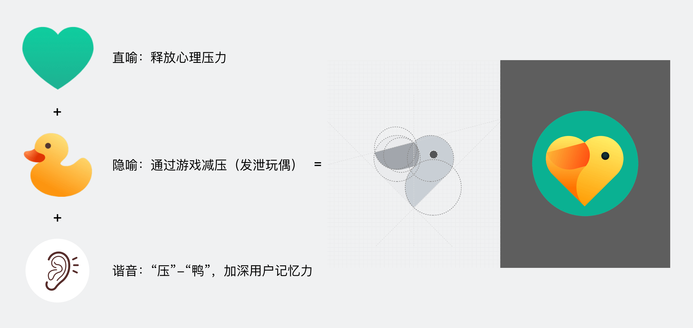

“减减鸭”是一款为用户分析压力情况，并帮助用户调节心情、减轻压力的工具类小程序。它运用小程序组件和小程序设计原则，创造了轻松愉悦且易于理解的体验风格。
本文将从信息架构、阅读体验、色彩系统、LOGO设计、动效设计5个层面介绍这款智能小程序的设计过程。

	

		
	

## 信息架构

作为轻量型工具应用，减减鸭功能简洁、结构扁平，因此选用1字型的信息架构，将三个功能的入口排布在首⻚首屏，用户可通过最短路径快速触达内容；在用户进入功能并结束使用流程后，减减鸭界面提供直返首页、以及进入其他功能的快捷通道，形成路径闭环。

	

		
1. 1字形架构
2. 减减鸭首页

	

	

		
1. 首页
2. 功能模块

	

## 阅读体验

### 首页布局

 	

 	    
减减鸭首页没有延用移动端产品首页传统的“banner大图& 功能列表”模式，采用了更新颖的布局方式：
<ol>
<li>突出主体：使用插画风格头图与同色背景，增强背景区域整体感，让用户视线聚焦在前层的主体内容上；</li>
<li>明确层次：压力指数测试功能入口使用强化按钮展示（1）。按钮嵌入在插画头图中，高明度的配色使按钮与背景对比鲜明，层次清晰；</li>
<li>充分传达：手速减压与放松练习两创新功能入口，使用面积较大的卡片展示（2），以承载功能介绍文案及配图。</li></ol>

 	

 	

 		
	

### 功能模块布局

减减鸭页面内容层次清晰，从面积、色彩对比度等方面突出用户需关注的功能操作区，并在部分页面加以动效指引，用户无需探索，上手即用。
此外，减减鸭各功能模块内页面布局横向保持了较高一致性：操作区面积比例接近，且全部集中在页面中下部。良好的一致性使用户便于操作，且降低了学习成本。

	

		
1. 压力指数测试
2. 手速减压
3. 放松练习

	

### 组件运用

减减鸭应用了多个小程序组件，并根据功能场景进行了定制，本节以音频播放器为例讲解。
放松练习功能中使用了小程序音频播放器组件，用于放松指导语的播放。为契合放松减压的应用场景，播放器隐藏了常见的容器形态，与插画背景融为一体，仅保留了播放控制按钮，最大程度地营造场景沉浸感。
小程序音频播放器支持锁屏播放，用户可以在放松的状态中聆听放松指导语直至结束，而不必担心设备锁屏中断进程。

	

		
1. 音频播放状态
2. 音频暂停状态

	

## 色彩系统

### 配色风格
减减鸭采用舒缓镇定的文艺清新色彩搭配，希望传递给用户温暖、包容、安逸的感受；辅助色选用了一定饱和度、明度范围内的草绿色与橙黄色。

	

		
	

### 框架使用
小程序提供黑色、白色两种顶部导航。减减鸭小程序不同页面中，根据界面配色选取了不同的导航，以确保导航显示清晰合理。

	

		
1. 黑色导航
2. 白色导航

	

## LOGO设计
减减鸭小程序LOGO设计从以下几个角度出发：
1. 表意清晰：用基础的心形，传递释放心理压力的含义；
2. 风格统一：绿色和黄色，与页面色彩风格呼应；
3. 创意亮点：提取减“压”的谐音减“鸭”，加深用户记忆力。

	

		
	

## 情感化的动效设计
作为压力管理应用，减减鸭将情感化设计的宗旨贯穿始终，希望通过细节之处的创意帮助用户舒缓压力、迎来好心情。

### 拟态涟漪的点击动效
手速减压功能的核心，是希望用户通过快速点击屏幕释放压力，因此会累计用户点击屏幕次数，并显示数值。但是如果用户点击屏幕后，数值直接变化，而没有其他的反馈，会显得枯燥乏味，缺乏吸引力。
经过联想设计，减减鸭的点击操作配合了涟漪状的反馈，用户按压屏幕时，页面会跟随手势出发点扩散出阵阵涟漪，就像在大自然中轻触水面，看着层层水波泛起，心中的烦闷也被排解开来。
<video width="100%" muted autoplay="autoplay" loop="loop"  
src="../../../img/design/story/light_up/click.mov" >
你的浏览器不支持该视频播放
</video>

### 拟态水波的播放动效
放松练习功能中音频播放时，背景会缓缓浮现规律的水波动效，节奏与人的呼吸相近。用户在聆听放松指导音频时，可以让自己的情绪随着水波，在一呼一吸中慢慢得到舒缓。
<video width="100%" muted autoplay="autoplay"  loop="loop"  
src="../../../img/design/story/light_up/play.mov" >
你的浏览器不支持该视频播放
</video>
温馨提示：如果你的浏览器无法正常播放，请尝试Chrome浏览器。

## 总结

以上是智能小程序“减减鸭”的设计思考，更多细节设计可使用百度APP扫描下图二维码进行体验。

