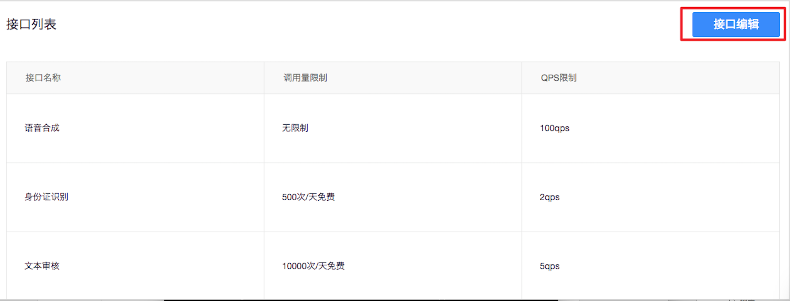
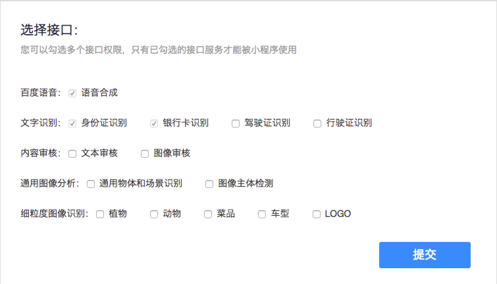

> **AI 接口目前只针对百度 APP 开放使用。**

在使用 AI 接口前，请使用有管理员权限的帐号，进行如下操作：

1. 进入<a href="https://smartprogram.baidu.com/mappconsole/main/apps">智能小程序平台</a>，单击进入小程序首页，单击“百度AI能力”。
2. 在“AI能力”页面，单击“编辑接口”。

3. 勾选您需要使用的接口，单击提交。

 ## 错误码

* Andriod

|错误码|说明|
|--|--|
|201|解析失败，请检查调起协议是否合法|
|202|解析失败，请检查参数是否正确|
|1001|执行失败|

* iOS

|错误码|说明|
|--|--|
|202|解析失败，请检查参数是否正确 |
|1001|请求失败|