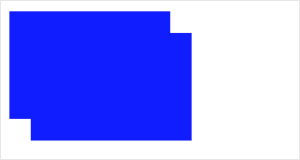

简介
-----

**解释：**canvas 画布，可使用 JS 操作 canvas 上下文，发出指令，进行绘制。

**SWAN模板写法示例：**

```xml
<canvas canvas-id="myCanvas" />
```

**JS写法示例：**

```js
Page({
    onReady: function () {
        const ctx = this.createCanvasContext('myCanvas');
        ctx.setFillStyle('#ff0000');
        ctx.arc(100, 100, 50, 0, 2 * Math.PI);
        ctx.fill();
        ctx.draw();
    }
});
```

我们来回顾一下，刚刚都执行了哪些指令：

**1、创建绘图上下文**

推荐使用 Page 对象上挂载的`createCanvasContext`方法，进行绘制上下文的创建：

```js
Page({
    onReady: function () {
        const ctx = this.createCanvasContext('myCanvas');
	}
});

```

当然，也可以使用 SWAN 上挂载的`createCanvasContext`方法。
如下，我们调用 SWAN 的接口`createCanvasContext`创建了一个绘制上下文（但请注意，使用 SWAN 上挂载的`createCanvasContext`，会在当前用户可见的 Page 中寻找`canvas`）。

```js
const ctx = swan.createCanvasContext('myCanvas');
```

**2、发送绘制指令**

设置颜色，并画一个圆，填充。

```js
ctx.setFillStyle('#ff0000');
ctx.arc(100, 100, 50, 0, 2 * Math.PI);
ctx.fill();
```

**3、绘制**
执行上面已经发出的指令，进行 canvas 绘制。

```js
ctx.draw();
```


坐标系
-----

canvas 坐标系，以左上角为(0, 0)，横轴为 x，纵轴为 y。
如：`ctx.arc(100, 200, 50, 0, 2 * Math.PI);`命令，就是在`x: 100, y: 200`为圆心处，开始画圆。


createCanvasContext
-----

**解释：**在 Page 中，推荐使用`this.createCanvasContext(canvasId)`，进行绘图上下文的创建。

**Tips：**

也可使用`swan.createCanvasContext(canvasId)`，但使用`swan.createCanvasContext(canvasId)`进行创建时，并非在执行所在的 Page 对象中使用 canvasId 进行查找，而是在用户当前可视的 Page 中使用 canvasId 进行查找。


canvasContext.setFillStyle
-----

**解释：**设置填充色。

**参数：**

|参数名 |类型  |必填  |说明|
|---- | ---- | ---- |---- |
|color | Color | 是  | 设置的填充颜色 |

**示例：**

```js
const ctx = this.createCanvasContext('myCanvas');
ctx.setFillStyle('blue');
ctx.fillRect(30, 30, 150, 75);
ctx.draw();
```


canvasContext.setStrokeStyle
-----

**解释：**设置边框颜色。

**参数：**

|参数名 |类型  |必填  |说明|
|---- | ---- | ---- |---- |
|color | Color | 是  | 设置的边框颜色 |

**示例：**

```js
const ctx = this.createCanvasContext('myCanvas');
ctx.setStrokeStyle('blue');
ctx.strokeRect(30, 30, 150, 75);
ctx.draw();
```


canvasContext.setShadow
-----

**解释：**设置阴影样式。

**参数：**

|参数名 |类型  | 范围 |说明|
|---- | ---- | ---- |---- |
| offsetX | Number | | 阴影相对于形状在水平方向的偏移 |
| offsetY | Number | | 阴影相对于形状在竖直方向的偏移 |
| blur | Number | 1 ~ 100 | 阴影的模糊级别，数值越大越模糊 |
| color	| Color | | 阴影的颜色 |

**示例：**

```js
const ctx = swan.createCanvasContext('myCanvas');
ctx.setFillStyle('blue');
ctx.setShadow(10, 50, 50, 'red');
ctx.fillRect(30, 30, 150, 75);
ctx.draw();
```


canvasContext.createLinearGradient
-----

**解释：**创建一个线性的渐变颜色。

**参数：**

|参数名 |类型  |说明|
|---- | ---- | ---- |
| x0 | Number | 起点的 x 坐标 |
| y0 | Number | 起点的 y 坐标 |
| x1 | Number | 阴影的模糊级别，数值越大越模糊 |
| y1 | Number | 阴影的颜色 |

**示例：**

```js
const ctx = this.createCanvasContext('myCanvas');

// Create linear gradient
const grd = ctx.createLinearGradient(0, 0, 200, 0);
grd.addColorStop(0, 'blue');
grd.addColorStop(1, 'red');

// Fill with gradient
ctx.setFillStyle(grd);
ctx.fillRect(30, 30, 150, 80);
ctx.draw();
```


canvasContext.createCircularGradient
-----

**解释：**创建一个圆形的渐变颜色。

**参数：**

|参数名 |类型 |说明|
|---- | ---- | ---- |
|x|Number|圆心的 x 坐标|
|y|Number|圆心的 y 坐标|
|r|Number|圆的半径|

**示例：**

```js
const ctx = swan.createCanvasContext('myCanvas');

// Create circular gradient
const grd = ctx.createCircularGradient(75, 50, 50);
grd.addColorStop(0, 'red');
grd.addColorStop(1, 'blue');

// Fill with gradient
ctx.setFillStyle(grd);
ctx.fillRect(30, 30, 150, 80);
ctx.draw();
```


canvasContext.addColorStop
-----

**解释：**创建一个颜色的渐变点。

**参数：**

|参数名 |类型 |说明|
|---- | ---- | ---- |
|stop|Number(0-1)|表示渐变点在起点和终点中的位置|
|color|Color|渐变点的颜色|

**示例：**

```js
const ctx = swan.createCanvasContext('myCanvas');

// Create circular gradient
const grd = ctx.createLinearGradient(30, 10, 120, 10);
grd.addColorStop(0, 'red');
grd.addColorStop(0.16, 'orange');
grd.addColorStop(0.33, 'yellow');
grd.addColorStop(0.5, 'green');
grd.addColorStop(0.66, 'cyan');
grd.addColorStop(0.83, 'blue');
grd.addColorStop(1, 'purple');

// Fill with gradient
ctx.setFillStyle(grd);
ctx.fillRect(30, 30, 150, 80);
ctx.draw();
```


**Bug & Tip**
1、addColorStop 目前在 Android 有bug。

canvasContext.setLineWidth
-----

**解释：**设置线条的宽度。

**参数：**

|参数名 |类型 |说明|
|---- | ---- | ---- |
|lineWidth|Number|	线条的宽度(单位是 px)|

**示例：**

```js
const ctx = swan.createCanvasContext('myCanvas');
ctx.beginPath();
ctx.moveTo(30, 10);
ctx.lineTo(200, 10);
ctx.stroke();

ctx.beginPath();
ctx.setLineWidth(5);
ctx.moveTo(50, 30);
ctx.lineTo(200, 30);
ctx.stroke();

ctx.beginPath();
ctx.setLineWidth(10);
ctx.moveTo(70, 50);
ctx.lineTo(200, 50);
ctx.stroke();

ctx.beginPath();
ctx.setLineWidth(15);
ctx.moveTo(90, 70);
ctx.lineTo(200, 70);
ctx.stroke();

ctx.draw();
```


canvasContext.setLineCap
-----

**解释：**设置线条的端点样式。

**参数：**

|参数名 |类型 | 范围 | 说明 |
|---- | ---- | ---- | ---- |
|lineCap|String|'butt'、'round'、'square'| 线条的结束端点样式 |

**示例：**

```js
const ctx = swan.createCanvasContext('myCanvas');
ctx.beginPath();
ctx.moveTo(30, 10);
ctx.lineTo(200, 10);
ctx.stroke();

ctx.beginPath();
ctx.setLineCap('butt');
ctx.setLineWidth(10);
ctx.moveTo(50, 30);
ctx.lineTo(200, 30);
ctx.stroke();

ctx.beginPath();
ctx.setLineCap('round');
ctx.setLineWidth(10);
ctx.moveTo(70, 50);
ctx.lineTo(200, 50);
ctx.stroke();

ctx.beginPath();
ctx.setLineCap('square');
ctx.setLineWidth(10);
ctx.moveTo(90, 70);
ctx.lineTo(200, 70);
ctx.stroke();

ctx.draw();
```


canvasContext.setLineJoin
-----

**解释：**设置线条的交点样式。

**参数：**

|参数名 |类型 | 范围 | 说明 |
|---- | ---- | ---- | ---- |
|lineJoin|String|'bevel'、'round'、'miter'| 线条的结束交点样式 |

**示例：**

```js
const ctx = swan.createCanvasContext('myCanvas');
ctx.beginPath();
ctx.moveTo(10, 10);
ctx.lineTo(100, 50);
ctx.lineTo(10, 90);
ctx.stroke();

ctx.beginPath();
ctx.setLineJoin('bevel');
ctx.setLineWidth(10);
ctx.moveTo(50, 10);
ctx.lineTo(140, 50);
ctx.lineTo(50, 90);
ctx.stroke();

ctx.beginPath();
ctx.setLineJoin('round');
ctx.setLineWidth(10);
ctx.moveTo(90, 10);
ctx.lineTo(180, 50);
ctx.lineTo(90, 90);
ctx.stroke();

ctx.beginPath();
ctx.setLineJoin('miter');
ctx.setLineWidth(10);
ctx.moveTo(130, 10);
ctx.lineTo(220, 50);
ctx.lineTo(130, 90);
ctx.stroke();

ctx.draw();
```


canvasContext.setLineDash
-----

**解释：**设置线条的宽度。

**参数：**

| 参数名 | 类型 | 说明 |
|---- | ---- | ---- |
| pattern | Array | 一组描述交替绘制线段和间距（坐标空间单位）长度的数字 |
| offset | Number | 虚线偏移量 |

**示例：**

```js
const ctx = swan.createCanvasContext('myCanvas');
ctx.setLineDash([10, 20], 5);
ctx.beginPath();
ctx.moveTo(0,100);
ctx.lineTo(400, 100);
ctx.stroke();
ctx.draw();
```


canvasContext.setMiterLimit
-----

**解释：**设置最大斜接长度，斜接长度指的是在两条线交汇处内角和外角之间的距离，当 setLineJoin() 为 miter 时才有效，超过最大倾斜长度的，连接处将以 lineJoin 为 bevel 来显示。

**参数：**

| 参数名 | 类型 | 说明 |
|---- | ---- | ---- |
| miterLimit | Number | 最大斜接长度 |

**示例：**

```js
const ctx = swan.createCanvasContext('myCanvas');
ctx.beginPath();
ctx.setLineWidth(10);
ctx.setLineJoin('miter');
ctx.setMiterLimit(1);
ctx.moveTo(10, 10);
ctx.lineTo(100, 50);
ctx.lineTo(10, 90);
ctx.stroke();

ctx.beginPath();
ctx.setLineWidth(10);
ctx.setLineJoin('miter');
ctx.setMiterLimit(2);
ctx.moveTo(50, 10);
ctx.lineTo(140, 50);
ctx.lineTo(50, 90);
ctx.stroke();

ctx.beginPath();
ctx.setLineWidth(10);
ctx.setLineJoin('miter');
ctx.setMiterLimit(3);
ctx.moveTo(90, 10);
ctx.lineTo(180, 50);
ctx.lineTo(90, 90);
ctx.stroke();

ctx.beginPath();
ctx.setLineWidth(10);
ctx.setLineJoin('miter');
ctx.setMiterLimit(4);
ctx.moveTo(130, 10);
ctx.lineTo(220, 50);
ctx.lineTo(130, 90);
ctx.stroke();

ctx.draw();
```


canvasContext.rect
-----

**解释：**创建一个矩形。

**参数：**

| 参数名 | 类型 | 说明 |
|---- | ---- | ---- |
| x | Number | 矩形路径左上角的 x 坐标 |
| y | Number | 矩形路径左上角的 y 坐标 |
| width | Number | 矩形路径的宽度 |
| height | Number | 矩形路径的高度 |

**示例：**

```js
const ctx = swan.createCanvasContext('myCanvas');
ctx.rect(30, 30, 150, 75);
ctx.setFillStyle('blue');
ctx.fill();
ctx.draw();
```


canvasContext.fillRect
-----

**解释：**填充一个矩形。

**参数：**

| 参数名 | 类型 | 说明 |
|---- | ---- | ---- |
| x | Number | 矩形路径左上角的 x 坐标 |
| y | Number | 矩形路径左上角的 y 坐标 |
| width | Number | 矩形路径的宽度 |
| height | Number | 矩形路径的高度 |

**示例：**

```js
const ctx = swan.createCanvasContext('myCanvas');
ctx.setFillStyle('blue');
ctx.fillRect(30, 30, 150, 75);
ctx.draw();
```


canvasContext.strokeRect
-----

**解释：**画一个矩形(非填充)。

**参数：**

| 参数名 | 类型 | 说明 |
|---- | ---- | ---- |
| x | Number | 矩形路径左上角的 x 坐标 |
| y | Number | 矩形路径左上角的 y 坐标 |
| width | Number | 矩形路径的宽度 |
| height | Number | 矩形路径的高度 |

**示例：**

```js
const ctx = swan.createCanvasContext('myCanvas');
ctx.setStrokeStyle('blue');
ctx.strokeRect(30, 30, 150, 75);
ctx.draw();
```


canvasContext.clearRect
-----

**解释：**清除画布上在该矩形区域内的内容。

**参数：**

| 参数名 | 类型 | 说明 |
|---- | ---- | ---- |
| x | Number | 矩形路径左上角的 x 坐标 |
| y | Number | 矩形路径左上角的 y 坐标 |
| width | Number | 矩形路径的宽度 |
| height | Number | 矩形路径的高度 |

**示例：**

```js
const ctx = swan.createCanvasContext('myCanvas');
ctx.setFillStyle('red');
ctx.fillRect(0, 0, 150, 200);
ctx.setFillStyle('blue');
ctx.fillRect(150, 0, 150, 200);
ctx.clearRect(30, 30, 150, 75);
ctx.draw();
```


canvasContext.fill
-----

**解释：**对当前路径中的内容进行填充。默认的填充色为黑色。

**参数：**无

**示例：**

```js
const ctx = swan.createCanvasContext('myCanvas');
ctx.moveTo(100, 100);
ctx.lineTo(10, 100);
ctx.lineTo(10, 10);
ctx.fill();
ctx.draw();
```


canvasContext.stroke
-----

**解释：**画出当前路径的边框。默认颜色为黑色。

**参数：**无

**示例：**

```js
const ctx = swan.createCanvasContext('myCanvas');
ctx.moveTo(100, 100);
ctx.lineTo(10, 100);
ctx.lineTo(10, 10);
ctx.stroke();
ctx.draw();
```


canvasContext.beginPath
-----

**解释：**开始创建一个路径，需要调用 fill 或者 stroke 才会使用路径进行填充或描边。

**参数：**无

**示例：**

```js
const ctx = swan.createCanvasContext('myCanvas');
ctx.rect(10, 10, 100, 30);
ctx.setFillStyle('red');
ctx.fill();
ctx.beginPath();
ctx.rect(10, 40, 100, 30);
ctx.setFillStyle('blue');
ctx.fillRect(10, 70, 100, 30);
ctx.rect(10, 100, 100, 30);
ctx.setFillStyle('green');
ctx.fill();
ctx.draw();
```


canvasContext.closePath
-----

**解释：**关闭一个路径。

**参数：**无

**示例：**

```js
const ctx = swan.createCanvasContext('myCanvas');
ctx.moveTo(100, 100);
ctx.lineTo(10, 100);
ctx.lineTo(10, 10);
ctx.closePath();
ctx.stroke();
ctx.draw();
```


canvasContext.moveTo
-----

**解释：**把路径移动到画布中的指定点，不创建线条。

**参数：**

| 参数名 | 类型 | 说明 |
|---- | ---- | ---- |
| x | Number | 目标位置的 x 坐标 |
| y | Number | 目标位置的 y 坐标 |

**示例：**

```js
const ctx = swan.createCanvasContext('myCanvas');
ctx.moveTo(10, 10);
ctx.lineTo(100, 10);
ctx.moveTo(10, 100);
ctx.lineTo(100, 100);
ctx.stroke();
ctx.draw();
```


canvasContext.lineTo
-----

**解释：**lineTo 方法增加一个新点，然后创建一条从上次指定点到目标点的线。

**参数：**

| 参数名 | 类型 | 说明 |
|---- | ---- | ---- |
| x | Number | 目标位置的 x 坐标 |
| y | Number | 目标位置的 y 坐标 |

**示例：**

```js
const ctx = swan.createCanvasContext('myCanvas');
ctx.moveTo(10, 10);
ctx.rect(10, 10, 100, 50);
ctx.lineTo(110, 60);
ctx.stroke();
ctx.draw();
```


canvasContext.arc
-----

**解释：**画一条弧线。

**参数：**

| 参数名 | 类型 | 说明 |
|---- | ---- | ---- |
| x | Number | 圆的 x 坐标 |
| y | Number | 圆的 y 坐标 |
| r | Number | 圆的半径 |
| sAngle | Number | 起始弧度，单位弧度（在3点钟方向）|
| eAngle | Number | 终止弧度 |
| counterclockwise | Boolean | 可选。指定弧度的方向是逆时针还是顺时针。默认是 false，即顺时针。 |

**示例：**

```js
const ctx = swan.createCanvasContext('myCanvas');
ctx.arc(100, 75, 50, 0, 2 * Math.PI);
ctx.setFillStyle('blue');
ctx.fill();
ctx.draw();
```


canvasContext.bezierCurveTo
-----

**解释：**创建三次方贝塞尔曲线路径。

**参数：**

| 参数名 | 类型 | 说明 |
|---- | ---- | ---- |
|cp1x|Number|第一个贝塞尔控制点的 x 坐标|
|cp1y|Number|第一个贝塞尔控制点的 y 坐标|
|cp2x|Number|第二个贝塞尔控制点的 x 坐标|
|cp2y|Number|第二个贝塞尔控制点的 y 坐标|
|x|Number|结束点的 x 坐标|
|y|Number|结束点的 y 坐标|

**示例：**

```js
const ctx = swan.createCanvasContext('myCanvas');
// Draw quadratic curve
ctx.beginPath();
ctx.moveTo(20, 20);
ctx.bezierCurveTo(20, 100, 200, 100, 200, 20);
ctx.setStrokeStyle('black');
ctx.stroke();

ctx.draw();
```


canvasContext.quadraticCurveTo
-----

**解释：**创建二次贝塞尔曲线路径。

**参数：**

| 参数名 | 类型 | 说明 |
|---- | ---- | ---- |
|cpx|Number|贝塞尔控制点的 x 坐标|
|cpy|Number|贝塞尔控制点的 y 坐标|
|x|Number|结束点的 x 坐标|
|y|Number|结束点的 y 坐标|

**示例：**

```js
const ctx = swan.createCanvasContext('myCanvas');
// Draw quadratic curve
ctx.beginPath();
ctx.moveTo(20, 20);
ctx.quadraticCurveTo(20, 100, 200, 20);
ctx.setStrokeStyle('blue');
ctx.stroke();

ctx.draw();
```


canvasContext.save
-----

**解释：**保存当前的绘图上下文。

**参数：**无

**示例：**

```js
const ctx = swan.createCanvasContext('myCanvas');
// save the default fill style
ctx.save();
ctx.setFillStyle('blue');
ctx.fillRect(10, 10, 150, 100);

// restore to the previous saved state
ctx.restore();
ctx.fillRect(50, 50, 150, 100);

ctx.draw();
```


canvasContext.restore
-----

**解释：**恢复之前保存的绘图上下文。

**参数：**无

**示例：**

```js
const ctx = swan.createCanvasContext('myCanvas');
// save the default fill style
ctx.save();
ctx.setFillStyle('blue');
ctx.fillRect(10, 10, 150, 100);

// restore to the previous saved state
ctx.restore();
ctx.fillRect(50, 50, 150, 100);

ctx.draw();
```


canvasContext.draw
-----

**解释：**将之前在绘图上下文中的描述（路径、变形、样式）画到 canvas 中。

**参数：**
<!-- 
| 参数名 | 类型 | 说明 |
|---- | ---- | ---- |
|reserve|Boolean|非必填。本次绘制是否接着上一次绘制，即 reserve 参数为 false，则在本次调用 drawCanvas 绘制之前 native 层应先清空画布再继续绘制；若 reserver 参数为 true，则保留当前画布上的内容，本次调用 drawCanvas 绘制的内容覆盖在上面，默认 false
|callback|Function|绘制完成后回调 -->

| 参数名 | 类型 | 说明 |
|---- | ---- | ---- |
|callback|Function|绘制完成后回调

**示例：**

```js
const ctx = swan.createCanvasContext('myCanvas');
ctx.setFillStyle('blue');
ctx.fillRect(10, 10, 150, 100);
ctx.draw();
ctx.fillRect(30, 30, 150, 100);
ctx.draw();
```


<!-- **示例：**

```js
const ctx = swan.createCanvasContext('myCanvas');
ctx.setFillStyle('blue');
ctx.fillRect(10, 10, 150, 100);
ctx.draw();
ctx.setFillStyle('blue');
ctx.fillRect(30, 30, 150, 100);
ctx.draw(true);
```

 -->