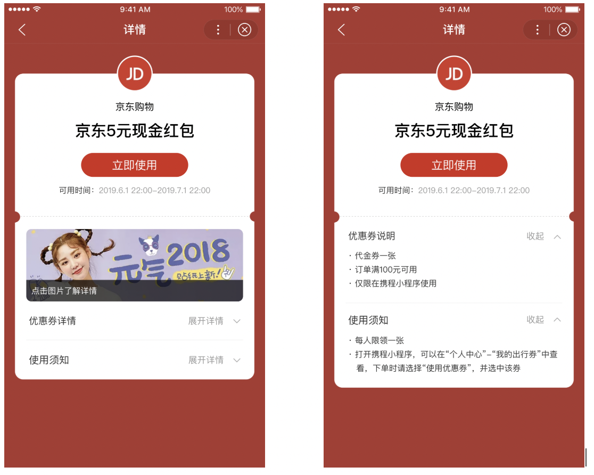
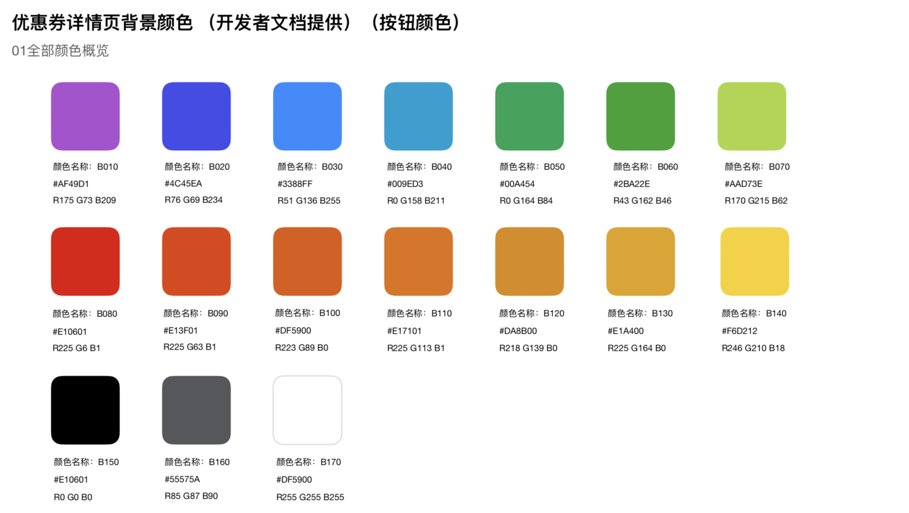

# 小程序优惠券服务接口
## 功能介绍
卡券助手，是百度官方为小程序提供的免费优惠券接口。接入后，可以使用该功能。
1. 获取平台投放的入口；
2. 发放的优惠券统一进入用户的百度卡券包中。

## 接入条件
1. 使用百度官方提供的登录能力；

	相关开发文档：
	* 登录能力：[登录](https://smartprogram.baidu.com/docs/develop/api/open_log/)
	* 获取用户设备标识-swanid：[swanid机制说明](https://smartprogram.baidu.com/docs/develop/api/open_userinfo/)
	* 获取手机号能力：表单组件-[button](https://smartprogram.baidu.com/docs/develop/component/formlist/#button/) -bindgetphonenumber 

2. 开发者业务有优惠券功能，具备发券-核销能力。百度智能小程序仅作为平台投放、券的统一展示、集中管理。
     
## 接入方式
开发者可通过以下API接入小程序卡券包，开发者调用百度平台接口需[获取access_token](https://smartprogram.baidu.com/docs/develop/serverapi/power_exp/)。
## 优惠券接口
优惠券展示示例

 


> 优惠券类型，1-通用优惠券，2-代金券，3-折扣券，4-兑换券，5-团购券  
## 创建优惠券
**接口描述**: 创建优惠券模板
**接口地址**:`https://openapi.baidu.com/rest/2.0/smartapp/coupon/create`
**请求方式**：`POST`
**请求参数**：

| ** 参数名称         **   | ** 参数说明     **   | **     in **   | **  是否必须      **   | **  数据类型  **   | 
|:----|:----:|:----|:----:|:----|:----:|:----|:----:|:----|:----:|
| access_token   |      |  query    |  true    | string     | 
| bgColor   |  背景色的名称，按钮的颜色跟着背景色走   |  query    |  true    | string     | 
| couponType   |  优惠券类型，1-通用优惠券，2-代金券，3-折扣券，4-兑换券，5-团购券     |  query    |  true    | integer     | 
| description   |  补充说明：卡券的优惠内容说明，如"代金券一张"  ，字数上限为20个汉字。(建议涵盖卡券类型、张数、适用品类等)   |  query    |  false    | string     | 
| effectTime   |  生效时间的Unix时间戳     |  query    |  true    | integer     | 
| expireTime   |  失效时间的Unix时间戳     |  query    |  true    | integer     | 
| introduce   |  使用须知：卡券使用方法的介绍 ；字数上限为500个汉字；  |  query    |  true    | string     | 
| sill   |   使用优惠券的门槛条件，字数上限为20个汉字；   |  query    |  true    | string     | 
| takeLimit   |  领取限制，这里仅作描述，实际领取策略需要另外建词典来支持；字数上限为20个汉字；   |  query    |  true    | string     | 
| title   |  10元优惠券  ，字数上限为10个汉字 (建议涵盖卡券属性、服务及金额)   |  query    |  true    | string     | 
| **callbackUrl**   | 发券回调地址   | query   |  true   | string   | 


**响应示例**:

```
{
	"data": {
		"appId": 0,
		"bgColor": "B010",
		"couponType": 2,//优惠券类型
		"createTime": 0,
		"deleted": 0,
		"description": "代金券一张", //补充说明：卡券的优惠内容说明  
		"effectTime": 0,
		"expireTime": 0,
		"id": 0,
		"introduce": "打开京东小程序，可以在“个人中心”-“我的618券”中查看，下单时请选择“使用优惠券”，并选中该券",//使用须知：卡券使用方法的介绍
		"sill": "订单满199元可用",//使用优惠券的门槛条件 
		"takeLimit": "每个用户限领1张",//领取限制
		"title": "京东618满199减100券",
		"updateTime": 0
	},
	"errno": 0,
	"msg": ""
}
```
### 选择适用色值
 
目前百度智能小程序提供包括以上17种色值供开发者使用。

|  **名称**   |  **背景色值**   | 
|:----|:----|
| B010   |    #9857AE    | 
| B020    |    #5854BE   | 
| B030    |    #487FCC   | 
| B040      |    #288DAF   | 
| B050    |    #28915E   | 
| B060   |    #449045   | 
| B070    |    #95B250   | 
| B080    |    #B82C28    | 
| B090   |    #B85029    | 
| B100    |    #B76229   | 
| B110    |    #B87029   | 
| B120   |    #B48228   | 
| B130   |    #B89028   | 
| B140   |    #C5AE34   | 
| B150   |    #282828   | 
| B160   |    #5F6062   | 
| B170   |    #CCCCCC   | 


### 创建优惠券广告图（选填）
**接口描述**:创建优惠券广告图，当前最多可配置一张
**接口地址**:`https://openapi.baidu.com/file/2.0/smartapp/coupon/banner/create`
**请求方式**：`POST`
**consumes**:`["multipart/form-data"]`


**请求参数**：


| ** 参数名称         **   | ** 参数说明     **   | ** in **   | **  是否必须      **   | **  数据类型  **   | 
|:----|:----:|:----|:----:|:----|:----:|:----|:----:|:----|:----:|
| access_token   |      |  query    |  true    | string     | 
| couponTemplateId    |  优惠券id     |  query    |  true    | integer     | 
| destUrl   |  小程序内的跳转path   |  query    |  true    | string     | 
| multipartFile   |  广告图    |  formData    |  true    | file     | 
| title   |   广告标题    |  query    |  true    | string     | 

**响应示例**:

```
{
	"data": {
		"couponTemplateId": 0,
		"createTime": 0,
		"deleted": 0,
		"destUrl": "",
		"id": 0,
		"picUrl": "",//自定义小程序跳转地址，H5当前不支持
		"title": "京东618活动专场",// 广告图片标题
		"updateTime": 0
	},
	"errno": 0,
	"msg": ""
}
```

### 删除优惠券广告图
**接口描述**:删除一条优惠券广告图
**接口地址**:`https://openapi.baidu.com/rest/2.0/smartapp/coupon/banner/delete`
**请求方式**：`POST`
**请求参数**

| ** 参数名称         **   | ** 参数说明     **   | **     in **   | **  是否必须      **   | **  数据类型  **   | **  schema  **   | 
|:----|:----:|:----|:----:|:----|:----:|:----|:----:|:----|:----:|:----|:----:|
| access_token    |      |  query    |  true    | string     |        | 
| couponBannerId   |  优惠券广告图id     |  query    |  true    | integer     |        | 
| couponTemplateId   |  优惠券id     |  query    |  true    | integer     |        | 


**响应示例**:

```
{
	"data": true,
	"errno": 0,
	"msg": ""
}
```

### 优惠券广告图列表
**接口描述**: 获取优惠券广告图列表
**接口地址**:`https://openapi.baidu.com/rest/2.0/smartapp/coupon/banner/list`
**请求方式**：`GET`
**请求参数**：

| ** 参数名称         **   | ** 参数说明     **   | **     in **   | **  是否必须      **   | **  数据类型  **   | **  schema  **   | 
|:----|:----:|:----|:----:|:----|:----:|:----|:----:|:----|:----:|:----|:----:|
| access_token   |      |  query    |  true    | String     |        | 
| couponTemplateId   |   优惠券id    |  query    |  false    | integer     |        | 
| page   |  page     |  query    |  false    | integer     |        | 
| pageSize   |  pageSize     |  query    |  false    | integer     |        | 


**响应示例**:

```
{
	"data": {
		"dataList": [
			{
				"couponTemplateId": 0,
				"createTime": 0,
				"deleted": 0,
				"destUrl": "",
				"id": 0,
	            "picUrl": "",//自定义小程序跳转地址，H5当前不支持
		        "title": "京东618活动专场",// 广告图片标题
				"updateTime": 0
			}
		],
		"pageNo": 0,
		"total": 0
	},
	"errno": 0,
	"msg": ""
}
```

## 删除优惠券
**接口描述**: 删除一张优惠券
**接口地址**:`https://openapi.baidu.com/rest/2.0/smartapp/coupon/delete`
**请求方式**：`POST`
**请求参数**：

| ** 参数名称         **   | ** 参数说明     **   | **     in **   | **  是否必须      **   | **  数据类型  **   | **  schema  **   | 
|:----|:----:|:----|:----:|:----|:----:|:----|:----:|:----|:----:|:----|:----:|
| bd_app_id   |  bd_app_id     |  query    |  true    | integer     |        | 
| couponTemplateId   |  优惠券id     |  query    |  true    | integer     |        | 


**响应示例**:

```
{
	"data": true,
	"errno": 0,
	"msg": ""
}
```

## 更新优惠券
**接口描述**: 修改一张优惠券
**接口地址**:`https://openapi.baidu.com/rest/2.0/smartapp/coupon/update`
**请求方式**：`POST`
**请求参数**：

| ** 参数名称         **   | ** 参数说明     **   | **     in **   | **  是否必须      **   | **  数据类型  **   | **  schema  **   | 
|:----|:----:|:----|:----:|:----|:----:|:----|:----:|:----|:----:|:----|:----:|
| access_token   |       |  query    |  true    | string     |        | 
| couponTemplateId   |  优惠券id     |  query    |  false    | integer     |        | 
| bgColor   |  背景色的编码，按钮的颜色跟着背景色走     |  query    |  true    | string     |        | 
| couponType   |  优惠券类型，1-通用优惠券，2-代金券，3-折扣券，4-兑换券，5-团购券     |  query    |  true    | integer     |        | 
| description   |  补充说明：卡券的优惠内容说明     |  query    |  false    | string     |        | 
| effectTime   |  生效时间的Unix时间戳     |  query    |  true    | integer     |        | 
| expireTime   |  失效时间的Unix时间戳     |  query    |  true    | integer     |        | 
| introduce   |  使用须知：卡券使用方法的介绍     |  query    |  true    | string     |        | 
| sill   |   使用优惠券的门槛条件    |  query    |  true    | string     |        | 
| takeLimit   |  领取限制，这里仅作描述，实际领取策略需要另外建词典来支持     |  query    |  true    | string     |        | 
| title   |  10元优惠券     |  query    |  true    | string     |        | 
| **callbackUrl**   | 发券回调地址   | query   | true   | string   |    | 


**响应示例**:

```
{
	"data": {
	    "appId": 0,
		"bgColor": "#9857AE",
		"couponType": 2,//优惠券类型
		"createTime": 0,
		"deleted": 0,
		"description": "代金券一张", //补充说明：卡券的优惠内容说明  
		"effectTime": 0,
		"expireTime": 0,
		"id": 0,
		"introduce": "打开京东小程序，可以在“个人中心”-“我的618券”中查看，下单时请选择“使用优惠券”，并选中该券",//使用须知：卡券使用方法的介绍
		"sill": "订单满199元可用",//使用优惠券的门槛条件 
		"takeLimit": "每个用户限领1张",//领取限制
		"title": "京东618满199减100券",
		"updateTime": 0
	},
	"errno": 0,
	"msg": ""
}
```
## 优惠券列表
**接口描述**: 获取优惠券列表
**接口地址**:`https://openapi.baidu.com/rest/2.0/smartapp/coupon/list`
**请求方式**：`GET`
**请求参数**：

| ** 参数名称         **   | ** 参数说明     **   | **     in **   | **  是否必须      **   | **  数据类型  **   | **  schema  **   | 
|:----|:----:|:----|:----:|:----|:----:|:----|:----:|:----|:----:|:----|:----:|
| access_token   |  bd_app_id     |  query    |  true    | string     |        | 
| couponType   |   优惠券类型，1-通用优惠券，2-代金券，3-折扣券，4-兑换券，5-团购券    |  query    |  false    | integer     |        | 
| page   |  page     |  query    |  false    | integer     |        | 
| pageSize   |  pageSize     |  query    |  false    | integer     |        | 


**响应示例**:

```
{
	"data": {
		"dataList": [
			{
				"appId": 0,
	         	"bgColor": "#9857AE",
	        	"couponType": 2,//优惠券类型
	         	"createTime": 0,
        		"deleted": 0,
		        "description": "代金券一张", //补充说明：卡券的优惠内容说明  
	          	"effectTime": 0,
		        "expireTime": 0,
		        "id": 0,
	        	"introduce": "打开京东小程序，可以在“个人中心”-“我的618券”中查看，下单时请选择“使用优惠券”，并选中该券",//使用须知：卡券使用方法的介绍
		        "sill": "订单满199元可用",//使用优惠券的门槛条件 
		        "takeLimit": "每个用户限领1张",//领取限制
		        "title": "京东618满199减100券",
		        "updateTime": 0
			}
		],
		"pageNo": 0,
		"total": 0
	},
	"errno": 0,
	"msg": ""
}
```
 
## 添加优惠券库存
**接口描述：**添加优惠券库存，添加库存时库存名称必须唯一，百度服务器以名称为唯一标识进行幂等操作，一个名称，只能做一次操作。
**接口地址：**`https://openapi.baidu.com/rest/2.0/smartapp/coupon/addStock`
**请求方式：**`POST`
**请求参数：**

**Query参数：**

| ** 参数名称         **   | ** 参数说明     **   | **     in **   | **  是否必须      **   | **  数据类型  **   | **  schema  **   | 
|:----|:----:|:----|:----:|:----|:----:|:----|:----:|:----|:----:|:----|:----:|
| access_token   |      |  query    |  true    | String     |        | 

**POST数据：**

| 参数名称 | 参数说明 | 是否必须 | 数据类型 | 
|:----|:----|:----|:----|
| **couponTemplateId**   | 优惠券模板id   | 是   | long   | 
| stockName   | 库存名称（必须唯一，百度服务器以名称为唯一标识进行幂等操作，一个名称，只能做一次操作）   | 是   | string   | 
| stock   | 添加库存数量 必须是正数   | 是   | int   | 
| createTime   | 时间戳 单位 s   | 是   | long   | 

格式：**application/x-www-form-urlencoded**


**响应示例**:
```
{
    "errno": "0",
    "msg": "success"
}
```

## 开发者为用户分配券
**接口描述：**用户在开发者小程序内领取优惠券后，开发者通过该接口将券添加至用户的卡券包内
**接口地址：**`https://openapi.baidu.com/rest/2.0/smartapp/coupon/sync`
**请求方式：**`POST`
**请求参数：**

**Query参数：**

| ** 参数名称         **   | ** 参数说明     **   | **     in **   | **  是否必须      **   | **  数据类型  **   | **  schema  **   | 
|:----|:----:|:----|:----:|:----|:----:|:----|:----:|:----|:----:|:----|:----:|
| access_token   |      |  query    |  true    | String     |        | 

**POST数据：**

| 参数名称   | 参数说明   | 是否必须   | 数据类型   | 
|:----|:----|:----|:----|
| openid   | 用户的openid   | 是   | string   | 
| coupon   | 优惠券的结构体   | 是   | map   | 
| record_id   | 优惠券领取记录ID   | 是   | 32字节内string   | 
| coupon_template_id | 优惠券模板ID | 是 | int64 | 
| effect_time   | 优惠券生效的Unix时间戳   | 是   | int32   | 
| expire_time   | 优惠券失效的Uninx时间戳   | 是   | int32   | 
| code   | 优惠码   | 是   | 32字节内string   | 


格式：application/json
```
{
    "openid":"50zRWFu-pMbB4GK8FjH6EKbRxx",
    "coupon": {
        "record_id": "931c6e3af4a94b448becf9e0e8dc1663",
        "coupon_template_id": 123,
        "effect_time": 1558702254,
        "expire_time": 1558702255,
        "code": "ShowMeTheMoney"
    }
}
```

**响应示例**:
```
{
    "errno": "0",
    "errmsg": "success"
}
```

## 平台为用户分配券
**接口描述：**百度服务器会调用用户添加优惠券填写的callback_url 地址，进行用户发券操作，发券逻辑由开发者自行实现，开发者需要通过recordId 参数实现接口幂等性，百度服务器调用开发者接口3次没有明确的返回结果，将不会再调用并且任务本次发券失败。


**接口地址：**开发者自己定义回调地址
**请求方式：**`POST`
**请求参数：**

**POST数据：**

| 参数名称 | 参数说明 | 是否必须 | 数据类型 | 
|:----|:----|:----|:----|
| recordId   |  优惠券领取记录id   | 是   | string   | 
| openId   | openId   | 是   | string   | 
| **couponT****emplateId**   | 优惠券模板id   | 是   | long   | 
| sign   | md5签名串(小写)    签名盐： recordId +openId+timestamp后5位+**couponTemplateId**+*&^%$#    md5(recordId+openId+**couponTemplateId**+timestamp+盐)     | 是   | string   | 
| timestamp   | 时间戳 单位s   |    |    | 

格式：**application/json**


**响应示例**:
```
{
    "errno": "0",
    "msg": "success"
    "data":"优惠码"
}
```
## 同步优惠券核销状态
**接口描述：同步优惠券状态到百度服务器**
**接口地址：**`https://openapi.baidu.com/rest/2.0/smartapp/coupon/**writeOffCoupon**`
**请求方式：**`POST`
**请求参数：**

**Query参数：**

| ** 参数名称         **   | ** 参数说明     **   | **     in **   | **  是否必须      **   | **  数据类型  **   | **  schema  **   | 
|:----|:----:|:----|:----:|:----|:----:|:----|:----:|:----|:----:|:----|:----:|
| access_token   |      |  query    |  true    | String     |        | 

**POST数据：**

| 参数名称 | 参数说明 | 是否必须 | 数据类型 | 
|:----|:----|:----|:----|
| recordId   |  优惠券领取记录id   | 是   | string   | 
| openId   | openid   | 是   | string   | 

格式：**application/x-www-form-urlencoded**

**响应示例**:
```
{
    "errno": "0",
    "msg": "success"
}
```


