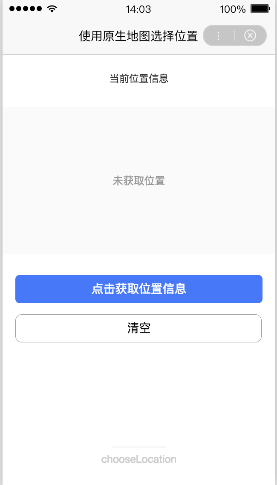

## swan.getLocation

> 在工具和真机中的实现有区别，详见[API 实现差异](/develop/devtools/diff/)。

**解释**： 获取当前的地理位置、速度。当用户离开智能小程序后，此接口无法调用。

**百度APP中扫码体验：**


**方法参数**：Object object

**`object`参数说明**：

|参数名 |类型  |必填 | 默认值 |说明|
|---- | ---- | ---- | ----|----|
|type   | String | 否  | -| 默认为 wgs84 返回 gps 坐标，可选 gcj02 。|
|altitude   | Boolean | 否  | -| 传入 true 会返回高度信息，获取高度需要较高精度且需要打开 gps ，会很耗时，默认没有用 gps。|
|success |Function  |  否 | -|  接口调用成功的回调函数，返回内容详见返回参数说明。|
|fail  |  Function  |  否  | -| 接口调用失败的回调函数|
|complete  |  Function |   否 |  -| 接口调用结束的回调函数（调用成功、失败都会执行）|

**success 返回参数说明**：

|参数  |说明  |
|---- | ---- |
|latitude   | 纬度，浮点数，范围为-90~90，负数表示南纬。|
|longitude |  经度，浮点数，范围为-180~180，负数表示西经。|
|speed  | 速度，浮点数，单位m/s。|
|accuracy  |  位置的精确度|
|altitude  |  高度，单位 m 。|
|verticalAccuracy  |  垂直精度，单位 m（Android 无法获取，返回 0） 。|
|horizontalAccuracy  |水平精度，单位 m 。 |
|street|街道名称|
|cityCode|城市编码|
|city|城市名称|
|country|国家|
|countryCode|国家代码|
|province|省份|
|streetNumber|街道号码|
|district|区|


**示例**：
<a href="swanide://fragment/775dce89a25a95becbe8cb12562c5b581560166773963" title="在开发者工具中预览效果" target="_self">在开发者工具中预览效果</a>

* 在 swan 文件中

```xml
<view class="container">
    <view class="page-body">
        <view class="title">当前位置经纬度</view>
        <view s-if="location" class="info">E: {{location.longitude[0]}}°{{location.longitude[1]}}′ N: {{location.latitude[0]}}°{{location.latitude[1]}}′</view>
        <view s-else class="info">未获取</view>
        <button bind:tap="getLocation" type="primary" loading="{{loading}}" hover-stop-propagation="true">点击获取位置信息</button>
        <button bind:tap="clearLocation" hover-stop-propagation="true">清空</button>
    </view>
    <view class="page-title">
        <view class="page-title-line"></view>
        <view class="page-title-text">{{title}}</view>
    </view>
</view>
```
* 在 js 文件中

```js
Page({
    data: {
        title: 'getLocation',
        loading: false
    },

    getLocation(e) {
        this.setData('loading', true);
        swan.getLocation({
            type: 'wgs84',
            altitude: true,
            success: res => {
                this.setData('location', this.formatLocation(res.longitude, res.latitude));
            },
            fail: err => {
                swan.showToast({
                    title: '获取失败'
                });
            },
            complete: () => {
                this.setData('loading', false);
            }
        });
    },

    clearLocation(e) {
        this.setData('location', '');
    },

    formatLocation(longitude, latitude) {
        if (typeof longitude === 'string' && typeof latitude === 'string') {
            longitude = parseFloat(longitude);
            latitude = parseFloat(latitude);
        }

        longitude = longitude.toFixed(2);
        latitude = latitude.toFixed(2);

        return {
            longitude: longitude.toString().split('.'),
            latitude: latitude.toString().split('.')
        };
    }
});
```
#### 错误码
* Andriod

|错误码|说明|
|--|--|
|201|解析失败，请检查调起协议是否合法|
|401|安全校验失败|
|1001|文件不存在|

* iOS

|错误码|说明|
|--|--|
|202|解析失败，请检查参数是否正确      |
|10005|系统拒绝|


## swan.chooseLocation

**解释**： 打开地图选择位置。需要用户授权 scope.userLocation。

**百度APP中扫码体验：**


**方法参数**：Object object

**`object`参数说明**：

|参数名 |类型  |必填 | 默认值 |说明|
|---- | ---- | ---- | ----|----|
|success  | Function |否 | -| 接口调用成功的回调函数|
|fail  | Function |否 | -| 接口调用失败的回调函数|
|complete  | Function |否 | -| 接口调用结束的回调函数（调用成功、失败都会执行）|

**success 返回参数说明**：

|参数  |说明  |
|---- | ---- |
|name   | 位置名称|
|address |  详细地址|
|latitude  | 纬度，浮点数，范围为-90~90，负数表示南纬。使用 gcj02 国测局坐标系。|
|longitude  |  经度，浮点数，范围为-180~180，负数表示西经。使用 gcj02 国测局坐标系。|

**示例**：

<a href="swanide://fragment/09f8e00c2d4fd069e5001041293d07191557727424300" title="在开发者工具中预览效果" target="_self">在开发者工具中预览效果</a>

* 在 swan 文件中

```html
<view class="container">
    <view class="page-body">
        <view class="page-dec">
            当前位置信息
        </view>
        <view class="page-content">
            <view s-if="location">
                <view>{{msg}}}</view><br/>
                <text class="page-font">E: {{location.longitude[0]}}°{{location.longitude[1]}}′ N: {{location.latitude[0]}}°{{location.latitude[1]}}′</text>
            </view>
            <view s-else>未获取位置</view>
        </view>
        <view class="page-btn">
            <button bind:tap="chooseLocation" class="btn" type="primary" hover-stop-propagation="true">点击获取位置信息</button>
            <button bind:tap="clearLocation">清空</button>
        </view>
    </view>
    <view class="page-title">
        <view class="page-title-line"></view>
        <view class="page-title-text">{{title}}</view>
    </view>
</view>
```

* 在 js 文件中

```js
Page({
    data: {
        location: '',
        title: 'chooseLocation'
    },
    onReady() {
        swan.authorize({
            scope: 'scope.userLocation',
            success: function (res) {
                console.log(res);
            },
            fail: function () {
                console.log('授权失败');
            }
        });
    },
    chooseLocation() {
        let that = this;
        swan.chooseLocation({
            success: function (res) {
                console.log(res);
                that.setData({
                    'msg': res.name,
                    'location': that.formatLocation(res.longitude, res.latitude)
                });
            },
            fail: function (err) {
                console.log('错误码：' + err.errCode);
                console.log('错误信息：' + err.errMsg);
            }
        });
    },
    clearLocation() {
        this.setData({
            location: ''
        });
    },
    formatLocation(longitude, latitude) {
        if (typeof longitude === 'string' && typeof latitude === 'string') {
            longitude = parseFloat(longitude);
            latitude = parseFloat(latitude);
        }
        longitude = longitude.toFixed(2);
        latitude = latitude.toFixed(2);
        return {
            longitude: longitude.toString().split('.'),
            latitude: latitude.toString().split('.')
        };
    }
});
```

* 在 css 文件中 
 
```css
.container {
    background-color: white;
}

.page-dec {
    font-family: PingFangSC-Regular;
    font-size: .15rem;
    color: #333333;
    letter-spacing: 0;
    text-align: center;
    line-height: .15rem;
}

.page-body {
    margin-top: .3rem; 
}

.page-content {
    background-color: #FAFAFA;
    text-align: center;
    color: #999;
    height: 2.24rem;
    margin-top: .35rem;
    display: flex;
    flex-direction: column;
    justify-content: center;
}

.page-btn {
    margin-top: .3rem;
}

.page-font {
    color: #333333;
}

swan-button {
    margin-top: .17rem;
    padding: 0;
    font-size: .18rem;  
}

swan-button:after {
    border: 1px solid #999; 
}

.btn:after {
    border: none;
}
```
**图示**

<div class="m-doc-custom-examples">
    <div class="m-doc-custom-examples-correct">
        
    </div>
    <div class="m-doc-custom-examples-correct">
        
    </div>
    <div class="m-doc-custom-examples-correct">
        
    </div>     
</div>

#### 错误码
* Andriod

|错误码|说明|
|--|--|
|1002|用户取消错误码                                |
|1003|没有获取位置的权限|
|1007|地图服务异常|

* iOS

|错误码|说明|
|--|--|
|202|解析失败，请检查参数是否正确       |
|1002|用户取消操作错误码|
|1003|没有获取位置的权限|
|1007|地图服务异常|