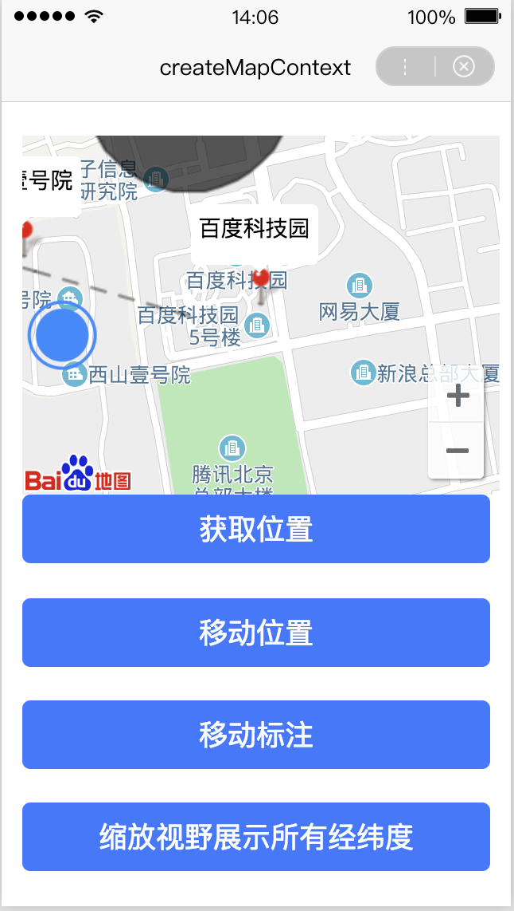

## swan.createMapContext

**解释**：创建并返回 map 上下文 mapContext 对象。在自定义组件下，第二个参数传入组件实例 this，以操作组件内 `<map/>` 组件。mapContext 通过 mapId 跟一个 <map/> 组件绑定，通过它可以操作对应的 <map/> 组件。

**方法参数**：String mapId

**`mapId`参数说明**：要获取 map 组件的 id。

**返回值**：mapContext

## mapContext

**解释**：map 返回值。

**示例**：

<a href="swanide://fragment/f95be9b50c98489dfbaec599db78672f1557727607625" title="在开发者工具中预览效果" target="_self">在开发者工具中预览效果</a>

* 在 swan 文件中

```html
<view class="wrap">
    <map id="myMap" style="width: 100%"
     scale="{{scale}}"
     longitude="{{longitude}}"
     latitude="{{latitude}}"
     markers="{{markers}}"
     position="{{position}}"
     showLocation="{{showLocation}}"
     polyline="{{polyline}}"
     controls="{{controls}}"
     circles="{{circles}}"></map>
    <button type="primary" bindtap="getCenterLocation">获取位置</button>
    <button type="primary" bindtap="moveToLocation">移动位置</button>
    <button type="primary" bindtap="translateMarker">移动标注</button>
    <button type="primary" bindtap="includePoints">缩放视野展示所有经纬度</button>
    <button type="primary" bindtap="getRegion">获取当前地图的视野范围</button>
</view>
```

* 在 js 文件中

```js
Page({
    data: {
        scale: 16,
        latitude: '40.048828',
        longitude: '116.280412',
        markers: [{
            markerId: '1',
            latitude: '40.052751',
            longitude: '116.278796'
        }, {
            markerId: '2',
            latitude: '40.048828',
            longitude: '116.280412',
            callout: {
                display: 'ALWAYS',
                content: '百度科技园'
            }
        }, {
            markerId: '3',
            latitude: '40.049655',
            longitude: '116.27505',
            callout: {
                display: 'ALWAYS',
                content: '西山壹号院'
            }
        }],
        showLocation: '1',
        polyline: [{
            points: [{
                longitude: 116.278796,
                latitude: 40.048828
            }, {
                longitude: 116.27505,
                latitude: 40.049655
            }],
            color: '#FF5F41FF',
            width: 2,
            dottedLine: true
        }],
        controls: [{
            controlId: 1,
            iconPath: '/images/group.png',
            position: {
                left: 0,
                top: 100,
                width: 50,
                height: 50
            },
            clickable: true
        }],
        circles: [{
            latitude: '40.052751',
            longitude: '116.278796',
            color: '#FF5F41FF',
            fillColor: '#21FFFFFF',
            radius: '200',
            strokeWidth: '2'
        }]
    },
    onReady() {
        this.mapContext = swan.createMapContext('myMap');
    },
    getCenterLocation: function () {
        this.mapContext.getCenterLocation({
            success: function (res) {
                console.log("经度", res.longitude);
                console.log("纬度", res.latitude);
            }
        })
    },
    moveToLocation: function () {
        this.mapContext.moveToLocation();
    },
    translateMarker: function () {
        this.mapContext.translateMarker({
            markerId: 0,
            rotate: 90,
            autoRotate: true,
            duration: 1000,
            destination: {
                latitude: 23.10229,
                longitude: 113.3345211,
            },
            animationEnd() {
                console.log('animation end');
            }
        })
    },
    includePoints: function () {
        this.mapContext.includePoints({
            padding: [10],
            points: [{
                latitude: 23,
                longitude: 113.33,
            }, {
                latitude: 23,
                longitude: 113.3345211,
            }]
        })
    },
    getRegion: function () {
        this.mapContext.getRegion({
            success: function (res) {
                console.log("西南角的经纬度", res.southwest);
                console.log("东北角的经纬度", res.northeast);
            }
        });
    }
});
```

* 在 css 文件中

```css
.wrap {
    padding: 50rpx 30rpx;
}

.wrap button {
    margin-bottom: 50rpx;
}
```


**图示**

<div class="m-doc-custom-examples">
    <div class="m-doc-custom-examples-correct">
        
    </div>
    <div class="m-doc-custom-examples-correct">
        
    </div>
    <div class="m-doc-custom-examples-correct">
        
    </div>     
</div>


## mapContext.getCenterLocation

**解释**：获取当前地图中心的经纬度，返回的是 gcj02 坐标系，可以用于 swan.openLocation。

**方法参数**：Object object

**`object`参数说明**：

|参数名 |类型  |必填  |默认值|说明|
|---- | ---- | ---- |---- |--|
|success   |Function  |  否  | |接口调用成功的回调函数 ，res = { longitude: "经度", latitude: "纬度"} 。|
|fail  |Function  |  否 |  |接口调用失败的回调函数|
|complete   | Function   | 否 | | 接口调用结束的回调函数（调用成功、失败都会执行）|

## mapContext.moveToLocation

**解释**：将地图中心移动到当前定位点，需要配合 map 组件的 show-location 使用 。

**方法参数**：无


## mapContext.translateMarker

**解释**：平移 marker，带动画 。

**方法参数**：Object object

**`object`参数说明**：

|参数名 |类型  |必填  |默认值|说明|
|---- | ---- | ---- |---- |---|
|markerId  |Number  |  是  | |指定 marker |
|destination  |Object  |  是 | | 指定marker移动到的目标点|
|autoRotate   | Boolean   | 是 |  |移动过程中是否自动旋转 marker|
|rotate  |Number  |  是  | |marker 的旋转角度 |
|duration  |Number   |  否 |  |动画持续时长，默认值1000ms，平移与旋转分别计算。 |
|fail   | Function   | 否 |  |接口调用失败的回调函数|
|animationEnd|Function|否||动画结束时回调函数|
|success|	function|		否||	接口调用成功的回调函数|

## mapContext.includePoints

**解释**：缩放视野展示所有经纬度。

**方法参数**：Object object


**`object`参数说明**：

|参数名 |类型  |必填  |默认值|说明|
|---- | ---- | ---- |---- |---|
|points  |Array  |  是  | |要显示在可视区域内的坐标点列表，[{latitude, longitude}] 。|
|padding  |Array  |  否 |  |坐标点形成的矩形边缘到地图边缘的距离，单位像素。格式为[上,右,下,左]，安卓上只能识别数组第一项，上下左右的 padding 一致。开发者工具暂不支持 padding 参数。|
|success|	function|		否||	接口调用成功的回调函数|
|fail	|function	|	否||	接口调用失败的回调函数|
|complete|	function|		否||	接口调用结束的回调函数（调用成功、失败都会执行）|


## mapContext.getRegion

**解释**：获取当前地图的视野范围。

**方法参数**：Object object


**`object`参数说明**：

|参数名 |类型  |必填  |默认值|说明|
|---- | ---- | ---- |---- |---|
|success   |Function  |  否  | |接口调用成功的回调函数，res = {southwest, northeast}，西南角与东北角的经纬度。 |
|fail  |Function  |  否 |  |接口调用失败的回调函数|
|complete   | Function   | 否 |  |接口调用结束的回调函数（调用成功、失败都会执行）|
## mapContext.getScale	

**解释**：获取当前地图的缩放级别。

**方法参数**：Object object

**`object`参数说明**：

|参数名 |类型  |必填  |默认值|说明|
|---- | ---- | ---- |---- |---|
|success   |Function  |  否  | |接口调用成功的回调函数，res = {scale} 。|
|fail  |Function  |  否 | | 接口调用失败的回调函数|
|complete   | Function   | 否 | | 接口调用结束的回调函数（调用成功、失败都会执行）|

