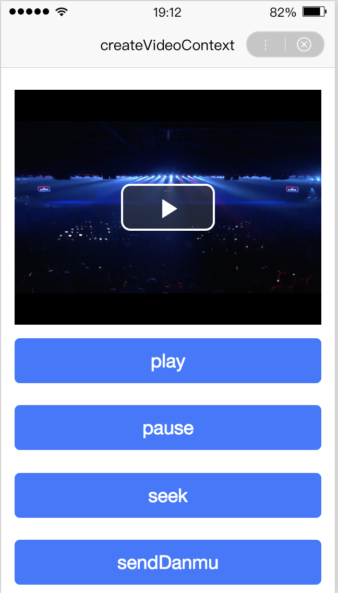

 

**解释**： swan.createVideoContext 的返回值


**示例**：
<a href="swanide://fragment/9c93370ee6d59177ca696966033540261570533594995" title="在开发者工具中预览效果" target="_self">在开发者工具中预览效果</a>

* 在 swan 文件中

```html
<view class="wrap">
    <video id="myVideo" auto enable-danmu="true" src="https://b.bdstatic.com/swan-temp/940fe716b0eaad38f47b209d61657490.mp4"></video>

    <button type="primary" bindtap="play">play</button>
    <button type="primary" bindtap="pause">pause</button>
    <button type="primary" bindtap="seek">seek</button>
    <button type="primary" bindtap="sendDanmu">sendDanmu</button>
    <button type="primary" bindtap="fullScreen">{{fullScreenText}}</button>
</view>
```

* 在 js 文件中

```js
Page({
    data: {
        fullScreenText: 'requestFullScreen'
    },
    onLoad() {
        const videoContext = swan.createVideoContext('myVideo');
        this.videoContext = videoContext;
    },
    play() {
        this.videoContext.play();
    },
    pause() {
        this.videoContext.pause();
    },
    seek() {
        this.videoContext.seek(10);
    },
    sendDanmu() {
        this.videoContext.sendDanmu({
            text: '这是一条弹幕',
            color: '#f60'
        });
    },
    fullScreen() {
        if (this.getData('fullScreenText') === 'requestFullScreen') {
            this.videoContext.requestFullScreen();
            this.setData('fullScreenText', 'exitFullScreen');
        } else {
            this.videoContext.exitFullScreen();
            this.setData('fullScreenText', 'requestFullScreen');
        }
    }
});
```


**图示**

<div class="m-doc-custom-examples">
    <div class="m-doc-custom-examples-correct">
        
    </div>
    <div class="m-doc-custom-examples-correct">
        
    </div>
    <div class="m-doc-custom-examples-correct">
        
    </div>     
</div>


#### 错误码

* Andriod

|错误码|说明|
|--|--|
|202|解析失败，请检查参数是否正确       |
|1001|执行失败|

* iOS

|错误码|说明|
|--|--|
|202|解析失败，请检查参数是否正确       |

