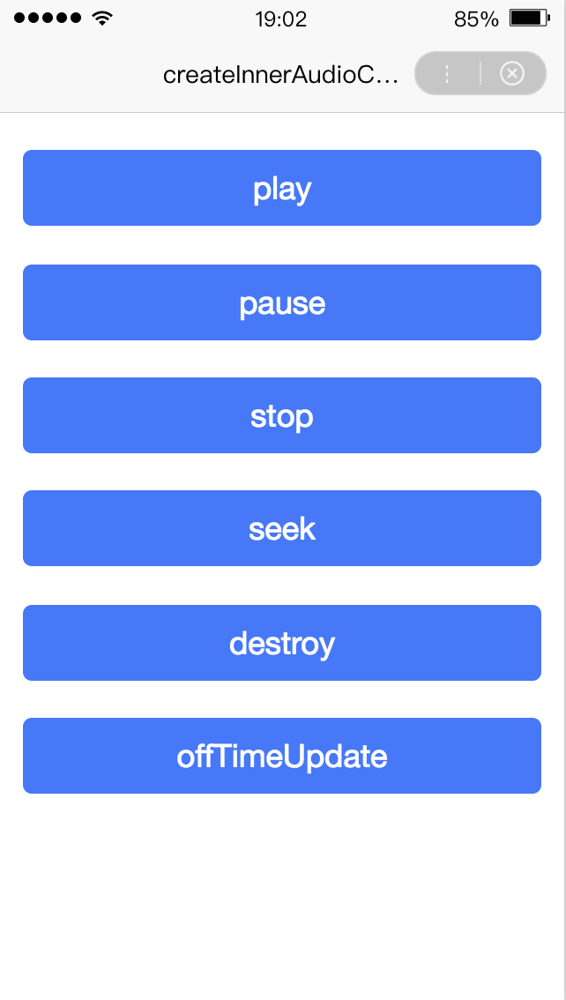
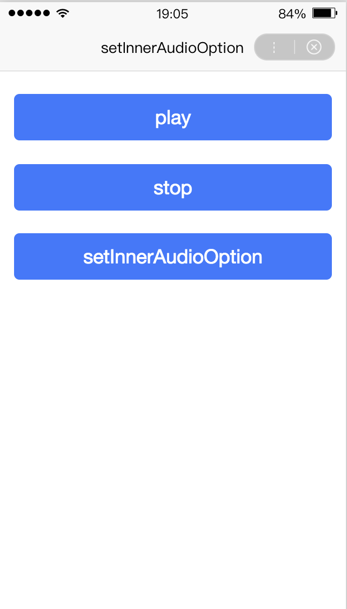

## swan.createInnerAudioContext

> 在工具和真机中的实现有区别，详见[API 实现差异](https://smartapp.baidu.com/docs/develop/devtools/diff/)。


**解释**： 创建并返回内部 audio 上下文 `innerAudioContext` 对象。

**方法参数**： 无

**返回值**：innerAudioContext

## innerAudioContext

**`innerAudioContext`对象的属性列表**：

|方法 | 参数 | 只读 |说明 |
|---- | ---- | ---- | ---- |
|src |String | 否 |音频的数据链接，用于直接播放，仅支持绝对路径。|
|startTime |Number | 否 | 开始播放的位置（单位：s），默认 0 。|
|autoplay |Boolean| 否 |是否自动开始播放，默认 false 。|
|loop |Boolean |否 |是否循环播放，默认 false。 |
|obeyMuteSwitch |Boolean |否 |是否遵循系统静音开关，默认 true，当此参数为 false 时，即使用户打开了静音开关，也能继续发出声音。|
|duration |Number |是 |当前音频的长度（单位：s），只有在当前有合法的 src 时返回 。|
|currentTime |Number |是 |当前音频的播放位置（单位：s），只有在当前有合法的 src 时返回，时间不取整，保留小数点后 6 位 。|
|paused |Boolean |是 |当前状态:true 表示暂停或停止，false 表示正在播放。 |
|volume |Number |否 |音量，范围 0~1。 |

### innerAudioContext

**`innerAudioContext`对象的方法列表**：

|方法 | 参数 | 说明 |
|---- | ---- | ---- |
|play | 无 | 播放 |
|pause | 无 | 暂停 |
|stop | 无 | 停止 |
|seek | position | 跳转到指定位置（单位：s）|
|destroy | 无 | 销毁当前实例 |
|onCanplay | callback | 音频进入可以播放状态，但不保证后面可以流畅播放 。|
|onPlay | callback | 音频播放事件 |
|onPause | callback | 音频暂停事件 |
|onStop | callback | 音频停止事件 |
|onEnded | callback | 音频自然播放结束事件 |
|onTimeUpdate | callback | 音频进度更新事件 |
|onError | callback | 音频播放错误事件 |
|onWaiting | callback | 音频加载中事件，当音频因为数据不足，需要停下来加载时会触发 。|
|onSeeking | callback | 音频进行 seek 操作事件 |
|onSeeked | callback | 音频完成 seek 操作事件 |
|offCanplay | callback | 取消监听 onCanplay 事件 |
|offPlay | callback | 取消监听 onPlay 事件 |
|offPause | callback | 取消监听 onPause 事件 |
|offStop | callback | 取消监听 onStop 事件 |
|offEnded | callback | 取消监听 onEnded 事件 |
|offTimeUpdate | callback | 取消监听 onTimeUpdate 事件 |
|offError | callback | 取消监听 onError 事件 |
|offWaiting | callback | 取消监听 onWaiting 事件 |
|offSeeking | callback | 取消监听 onSeeking 事件 |
|offSeeked | callback | 取消监听 onSeeked 事件 |

**示例**：

<a href="swanide://fragment/3f02bf553d26adb2adc3dcc248b892bf1556535805834" title="在开发者工具中预览效果" target="_self">在开发者工具中预览效果</a>

* 在 swan 文件中

```html
<view class="wrap">
    <button type="primary" bindtap="play">play</button>
    <button type="primary" bindtap="pause">pause</button>
    <button type="primary" bindtap="stop">stop</button>
    <button type="primary" bindtap="seek">seek</button>
    <button type="primary" bindtap="destroy">destroy</button>
    <button type="primary" bindtap="offTimeUpdate">offTimeUpdate</button>
</view>
```

* 在 js 文件中

```javascript

Page({
    onLoad() {
        const innerAudioContext = swan.createInnerAudioContext();
        innerAudioContext.src = 'http://vd3.bdstatic.com/mda-ic7mxzt5cvz6f4y5/mda-ic7mxzt5cvz6f4y5.mp3';
        innerAudioContext.autoplay = false;

        innerAudioContext.onPlay(res => {
            swan.showToast({
                title: 'play',
                icon: 'none'
            });
            console.log('onPlay', res);
        });

        innerAudioContext.onPause(res => {
            swan.showToast({
                title: 'pause',
                icon: 'none'
            });
            console.log('onPause', res);
        });

        innerAudioContext.onStop(res => {
            swan.showToast({
                title: 'stop',
                icon: 'none'
            });
            console.log('onStop', res);
        });

        innerAudioContext.onEnded(res => {
            swan.showToast({
                title: 'end',
                icon: 'none'
            });
            console.log('onEnded', res);
        });

        innerAudioContext.onTimeUpdate(res => {
            console.log('onTimeUpdate', res);
        });

        innerAudioContext.onError(res => {
            swan.showToast({
                title: 'error',
                icon: 'none'
            });
            console.log('onError', res);
        });

        innerAudioContext.onWaiting(res => {
            swan.showToast({
                title: 'waiting',
                icon: 'none'
            });
            console.log('onWaiting', res);
        });

        this.innerAudioContext = innerAudioContext;
    },
    play() {
        this.innerAudioContext.play();
    },
    pause() {
        this.innerAudioContext.pause();
    },
    stop() {
        this.innerAudioContext.stop();
    },
    seek() {
        this.innerAudioContext.seek(10);
    },
    destroy() {
        this.innerAudioContext.destroy();
    },
    offTimeUpdate() {
        this.innerAudioContext.offTimeUpdate(res => {
            swan.showToast({
                title: 'offTimeUpdate',
                icon: 'none'
            });
            console.log('offTimeUpdate', res);
        });
    }
});

```


**图示**

<div class="m-doc-custom-examples">
    <div class="m-doc-custom-examples-correct">
        
    </div>
    <div class="m-doc-custom-examples-correct">
        
    </div>
    <div class="m-doc-custom-examples-correct">
        
    </div>     
</div>

## swan.setInnerAudioOption

> 基础库 3.10.4 版本开始支持。

**解释**： 对`innerAudioContext`进行小程序内部的全局设置。

**方法参数**：Object object

**`object`参数说明**：

|参数名 |类型  |必填 | 默认值 |说明|
|---- | ---- | ---- | ----|----|
|mixWithOther |Boolean | 否 | false |设置是否与其他音频混播。 11.3 <p>低版本请做<a href="https://smartprogram.baidu.com/docs/develop/swan/compatibility/">兼容性处理</a>|
|success  | Function |否 | -| 接口调用成功的回调函数| 
|fail  | Function |否 |  -|接口调用失败的回调函数| 
|complete  | Function |否 | -| 接口调用结束的回调函数（调用成功、失败都会执行）|  


**示例**：

<a href="swanide://fragment/e62fbe5e8485bfb6dc130933ada570781556535988468" title="在开发者工具中预览效果" target="_self">在开发者工具中预览效果</a>

* 在 swan 文件中

```html
<view class="wrap">
    <button type="primary" bindtap="play">play</button>
    <button type="primary" bindtap="stop">stop</button>
    <button type="primary" bindtap="setInnerAudioOption">setInnerAudioOption</button>
</view>
```
* 在 js 文件中

```javascript
Page({
    onLoad() {
        const innerAudioContext = swan.createInnerAudioContext();
        innerAudioContext.src = 'http://vd3.bdstatic.com/mda-ic7mxzt5cvz6f4y5/mda-ic7mxzt5cvz6f4y5.mp3';
        innerAudioContext.autoplay = false;

        innerAudioContext.onPlay(() => {
            swan.showToast({
                title: 'play',
                icon: 'none'
            });
        });

        this.innerAudioContext = innerAudioContext;
    },
    play() {
        this.innerAudioContext.play();
    },
    stop() {
        this.innerAudioContext.stop();
    },
    setInnerAudioOption() {
        swan.setInnerAudioOption({
            mixWithOther: true,
            success: function (res) {
                swan.showToast({
                    title: 'success',
                    icon: 'none'
                });
                console.log('setInnerAudioOption success', res);
            },
            fail: function (err) {
                swan.showToast({
                    title: 'fail',
                    icon: 'none'
                });
                console.log('setInnerAudioOption fail', err);
            }
        });
    }
});
```

* 在 css 文件中

``` css
.wrap {
    padding: 50rpx 30rpx;
}

.wrap button {
    margin-bottom: 50rpx;
}

```
**图示**

<div class="m-doc-custom-examples">
    <div class="m-doc-custom-examples-correct">
        
    </div>
    <div class="m-doc-custom-examples-correct">
        
    </div>
    <div class="m-doc-custom-examples-correct">
        
    </div>     
</div>