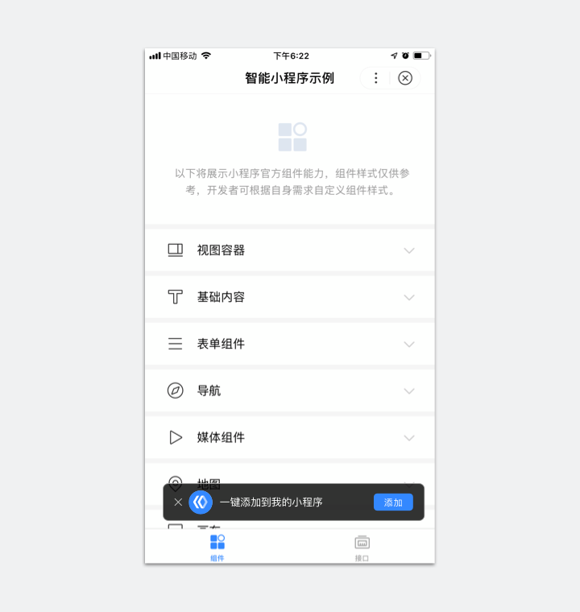
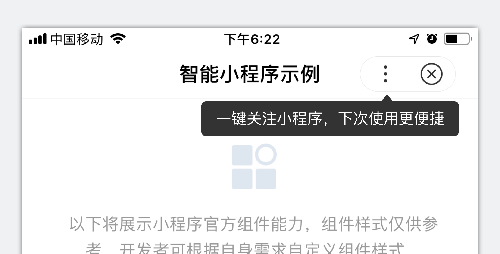

## showFavoriteGuide

支持在小程序内调起添加到我的小程序引导组件，引导用户添加到我的小程序。

目前添加到我的小程序引导组件支持以下三种类型，开发者可根据自身业务进行选择：

 - bar 浮层引导（一直展现）：用户点击引导组件旁边的关闭按钮才能关闭，点击添加按钮可直接添加到我的小程序。



 - bar-autohide 浮层引导（自动消失）： 引导组件3s后自动消失，点击添加按钮可直接添加到我的小程序。


 - tip 气泡引导：引导组件3s后自动消失，组件箭头指向小程序菜单。



引导组件设计文档详见：<a href="http://smartprogram.baidu.com/docs/design/component/guide_add/">添加到我的小程序引导</a>。

> 引导组件有统一的疲劳度，若用户未执行过添加操作，则3天内不再出现引导组件；若用户执行过添加操作，则引导组件对该用户将不再出现。
> 百度App v11.5及以上版本的智能小程序，支持添加到我到小程序引导组件。

**Object参数说明：**

|参数名 |类型  |必填  |说明|
|---- | ---- | ---- |---- |
|type |String | 否 | 引导组件类型，有效值： bar/bar-autohide/tip， 默认值为bar|
|content |String| 否 | 引导组件文字， bar和bar-autohide类型限制少于11个字符，tip类型少于18个字符，超过长度将截断显示，默认值: <br/>bar: 一键添加到我的小程序；<br> bar-autohide: 一键添加到我的小程序；<br> tip: 添加到我的小程序，下次使用更方便。|
|success |Function  |  否 |  接口调用成功的回调|
|fail   | Function |   否  | 接口调用失败的回调函数|
|complete  |  Function |   否 |  接口调用结束的回调函数（调用成功、失败都会执行）|

**示例代码：**

```javascript
swan.showFavoriteGuide({
    type： 'bar'，
    content：'一键添加到我的小程序'
    success(res) {
        console.log('添加成功：', res);
    },
    fail(err) {
        console.log('添加失败：', err);
    }
})
```

