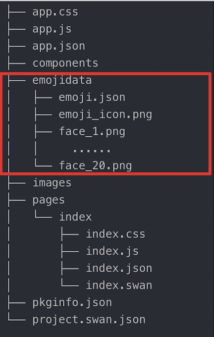
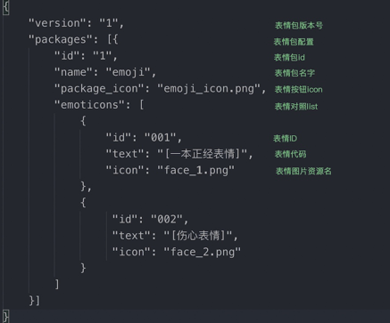

 

> 基础库 3.90.1 版本开始支持。以下版本请使用小程序发布器组件

**解释**： 调起原生全屏内容发布器，并支持开发者配置发布器展示模块。

 
## 方法参数 


### `object`参数说明 

|属性名 |类型  |必填 | 默认值 |说明|
|---- | ---- | ---- | ----|----|
|contentPlaceholder   | String  |  否  | 请输入正文 |正文默认占位符|
|titlePlaceholder  |  String  | 否 | 请输入标题 |标题默认占位文符|
|moduleList  |  Array  | 否 | |显示模块list|
|imageConf  |  Object  | 否 | {maxNum:9,ratio:1}|图片参数配置，最大上传图片数量和图片压缩比|
|navBarTitleText  |  String  | 否 | 发布帖子|导航栏标题文案|
|navBarTextStyle  |  String  | 否 | black  |导航栏标题文字颜色，有效值 black / white|
|navBarBackgroundColor  |  HexColor  | 否 | #ffffff|导航栏背景颜色|
|confirmText  |  String  | 否 | 发布|发布按钮的文字，最多 2 个字符，超出长度会被截断|
|confirmColor  |  HexColor  | 否 | #3388ff|发布按钮的文字颜色|
|cancelText  |  String  | 否 | 取消|取消按钮的文字，最多 2 个字符，超出长度会被截断|
|cancelColor  |  HexColor  | 否 | #666666|取消按钮的文字颜色|
|targetText  |  String  | 否 | |设置发布范围文案，若配置发布范围模块，则必填|
|emojiPath  |  String  | 否 | |设置自定义表情配置路径|
|success  |  Function  | 否 | |发布内容的回调函数|
|fail  |  Function  | 否 | |调起失败的回调函数|
|complete  |  Function  | 否 | |接口调用结束的回调函数（调用成功、失败都会执行）|

###  success返回参数说明 

|参数名 |类型 | 说明|
|---- | ---- | ---- |
| tempFilePaths  | Array.&lt;string&gt; |图片的本地文件路径列表 。|
| tempFiles  | Array.&lt;object&gt; |图片的本地文件列表，每一项是一个 File 对象。|
| title | String | 标题 |
| content | String | 正文 |


###  moduleList 列表  
若moduleList传空数组或不传，则默认展示正文、图片模块、表情模块。若传值，则只展示所传 list 中配置的模块。 
如：`moduleList: ['image']` 则只展示图片模块。

|moduleList| 类型 |描述|
|---|---|---|
|title|String|标题|
|image|String|图片模块|
|emoji|String|表情模块|
|target|String|发布范围模块|

###  imageConf 参数说明 

|参数| 类型|描述|
|---|---|---|
|maxNum|Number|最多上传图片数量|
|ratio|Number|图片压缩比例，0-1之间的浮点型|

```js
imageConf: {
    maxNum: 9,
    ratio: 0.5
}
```

###  emojiPath 参数说明  

开发者在配置 emoji 模块后，可以选择是否使用自定义表情表。若使用自定义表情功能，则将自定义表情的资源文件夹路径传入 emojiPath 字段。若不传 emojiPath 字段则使用默认表情包。

自定义表情资源文件夹格式：
文件夹中包括：`emoji.json` 和所有表情图片资源。外层文件夹名字可以由开发者自由定义，路径配置在 emojiPath 中即可，`emoji.json` 为固定文件名，请开发者按格式创建。表情没有数量和大小限制，但是表情资源会占用包体大小。


`emoji.json` 格式：



## 示例
<a href="swanide://fragment/63e363bef4ad273006b7021cfec1cd1e1578987178217" title="在开发者工具中预览效果" target="_self">在开发者工具中预览效果</a>

### 扫码体验

<div class='scan-code-container'>
    
    <font color=#777 12px>请使用百度APP扫码</font>
</div>

###  图片示例  


<div class="m-doc-custom-examples">
    <div class="m-doc-custom-examples-correct">
        
    </div>
    <div class="m-doc-custom-examples-correct">
        
    </div>
    <div class="m-doc-custom-examples-correct">
        
    </div>
</div>

### 代码示例 

* 在 swan 文件中

```html
<view class="wrap">
    <view class="card-area">
        <view class="top-description border-bottom">
           <view>基础用法</view>
           <view>moduleList:[]</view>
        </view>
        <button type="primary" bindtap="openCommunityEditor">打开图文发布器</button>
    </view>
    <view class="card-area">
        <view class="top-description border-bottom">
           <view>展示全部功能</view>
           <view>moduleList:['title','image','emoji','target']</view>
        </view>
        <button type="primary" bindtap="openCommunityEditorAll">打开全功能发布器</button>
    </view>
    <view class="tip-week">
        注：基础库 3.90.1 版本开始支持。
    </view>
</view>
```

* 在 js 文件中

```js
Page({
    openCommunityEditor() {
        swan.openCommunityEditor({
            contentPlaceholder: '请输入帖子正文',
            titlePlaceholder: '请输入标题',
            navBarTitleText: '发布帖子',
            navBarTextStyle: 'black',
            navBarBackgroundColor: '#ffffff',
            moduleList: [],
            confirmText: '发布',
            confirmColor: '#3388ff',
            cancelText: '取消',
            cancelColor: '#666666',
            targetText: '话题/吧/版块',
            success(res) {
                console.log('openCommunityEditor success', res);
                // 将图片上传到服务器
                //  swan.uploadFile({
                //     url: 'https://smartprogram.baidu.com/xxx', // 仅为示例，并非真实的接口地址
                //     filePath: res.tempFilePaths[0], // 要上传文件资源的路径
                //     name: 'myfile',
                //     success: function (res) {
                //         console.log(res.statusCode);
                //         // 上传成功关闭发布器
                //         swan.closeCommunityEditor();
                //     },
                //     fail: function (err) {
                //         console.log('错误码：' + err.errCode);
                //         console.log('错误信息：' + err.errMsg);
                //     }
                // });
                swan.closeCommunityEditor();
                swan.showToast({
                    title: '发布成功',
                    icon: 'none'
                });
            },
            fail(err) {
                console.log('openCommunityEditor fail', err);
                swan.closeCommunityEditor();
            },
            complete(res) {
                console.log('openCommunityEditor complete', res);
            }
        });
    },
    openCommunityEditorAll() {
        swan.openCommunityEditor({
            contentPlaceholder: '请输入帖子正文',
            titlePlaceholder: '请输入标题',
            moduleList: ['title', 'image', 'emoji', 'target'],
            imageConf: {
                maxNum: 9,
                ratio: 1
            },
            navBarTitleText: '发布帖子',
            navBarTextStyle: 'black',
            navBarBackgroundColor: '#ffffff',
            confirmText: '发布',
            confirmColor: '#3388ff',
            cancelText: '取消',
            cancelColor: '#666666',
            targetText: '话题/吧/版块',
            emojiPath: '../../emojidata',
            success: function (res) {
                console.log('openCommunityEditor success', res);
                // 将图片上传到服务器
                //  swan.uploadFile({
                //     url: 'https://smartprogram.baidu.com/xxx', // 仅为示例，并非真实的接口地址
                //     filePath: res.tempFilePaths[0], // 要上传文件资源的路径
                //     name: 'myfile',
                //     success: function (res) {
                //         console.log(res.statusCode);
                //         // 上传成功关闭发布器
                //         swan.closeCommunityEditor();
                //     },
                //     fail: function (err) {
                //         console.log('错误码：' + err.errCode);
                //         console.log('错误信息：' + err.errMsg);
                //     }
                // });
                swan.closeCommunityEditor();
                swan.showToast({
                    title: '发布成功',
                    icon: 'none'
                });
            },
            fail: function (err) {
                console.log('openCommunityEditor fail', err);
                swan.closeCommunityEditor();
            },
            complete: function (res) {
                console.log('openCommunityEditor complete', res);
            }
        });
    }
});
```

