## 百度收银台账号开通
开通百度收银台账号有两种方式：
* 若您已入驻百度电商平台，可以绑定已有电商平台账号。 
* 若无百度电商平台账号，可以重新开通账号

### 绑定已有百度电商平台账号
1. 绑定电商平台账号，在百度收银台下，点击“点击此处”。
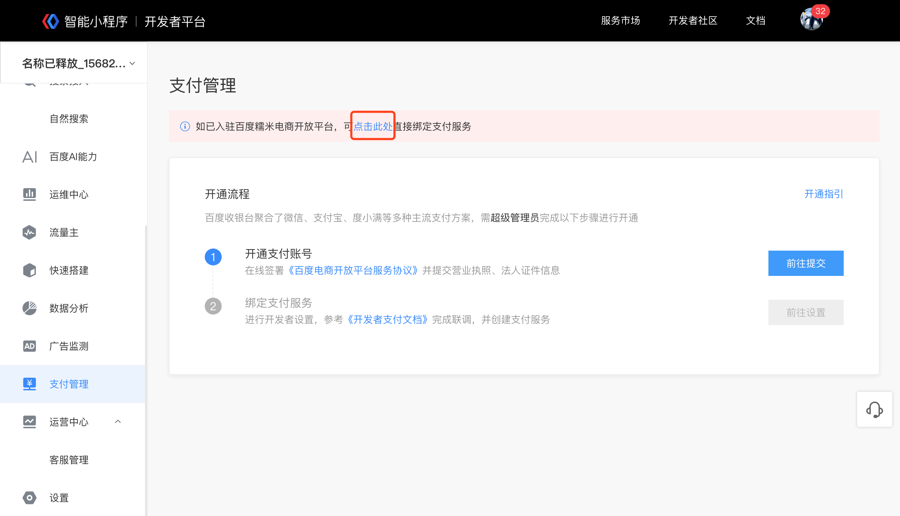
2. 输入百度电商平台账号的用户名、密码。

3. 小程序与支付服务绑定，可以选择已创建的支付服务或重新创建新的支付服务。
   绑定支付服务入口“百度收银台-开通流程-前往设置”。
   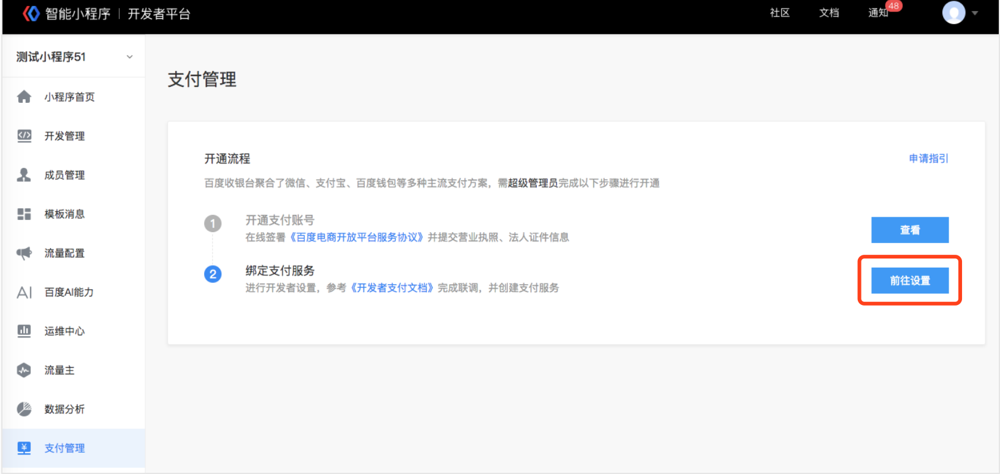
   绑定支付服务：可以创建新服务或绑定已有服务。
   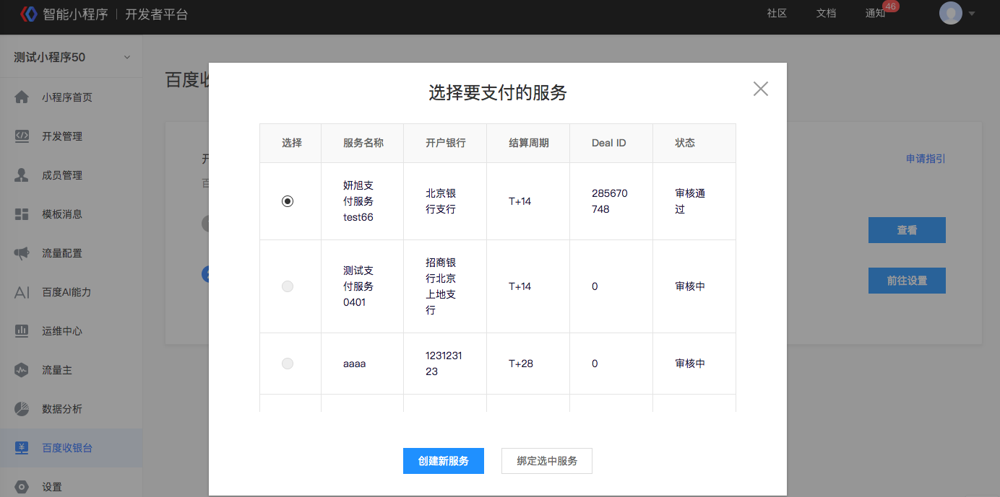

### 创建新的账号

1. 百度收银台开通流程下，点击“前往提交”。
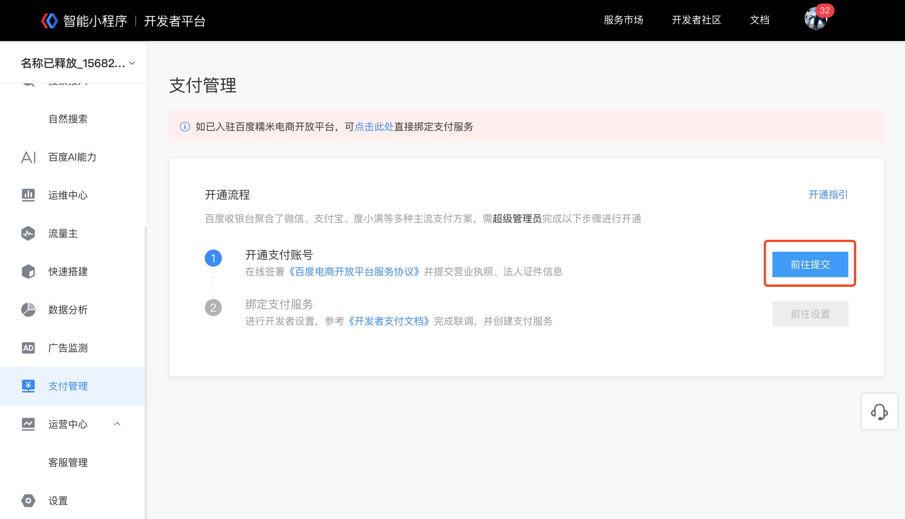
2. 勾选服务协议。
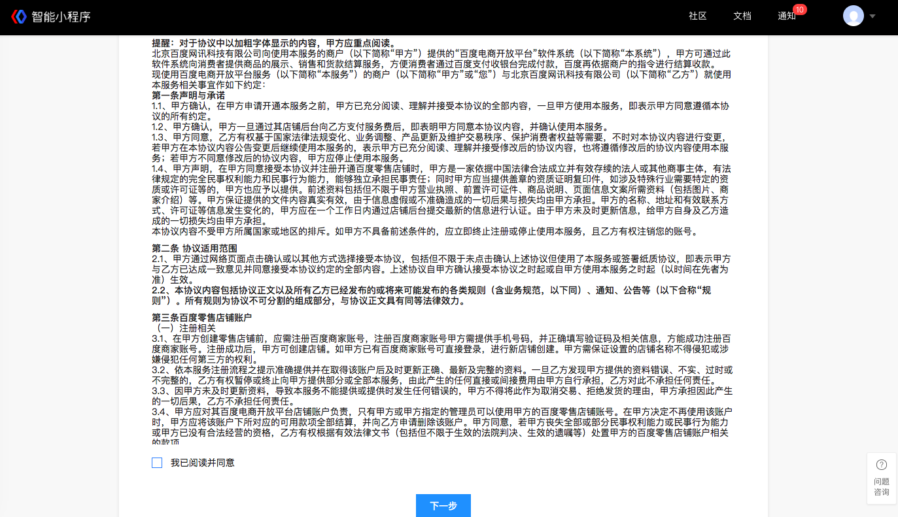
3. 资质填写，包括企业信息及法人信息，资质审核需要2个工作日。
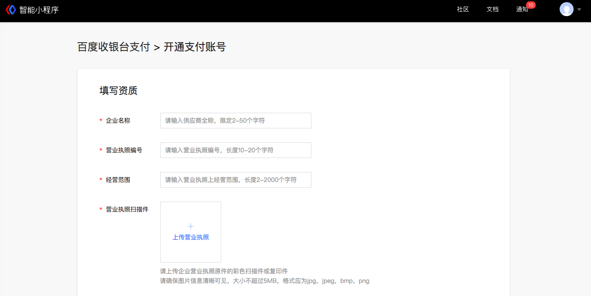
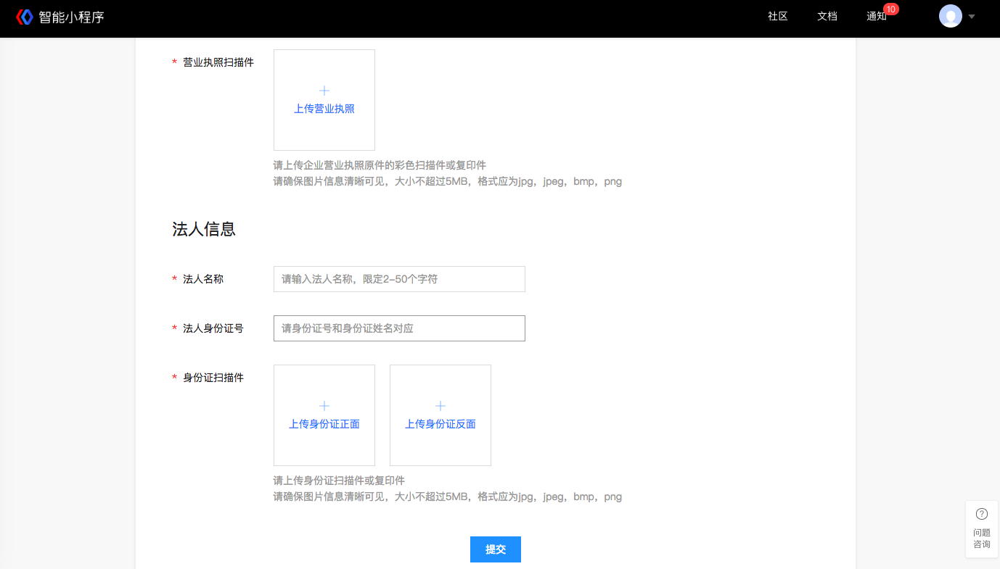

4. 资质审核通过后，可进行开发者信息设置
   开发者设置入口：百度收银台-开通流程-前往设置。
   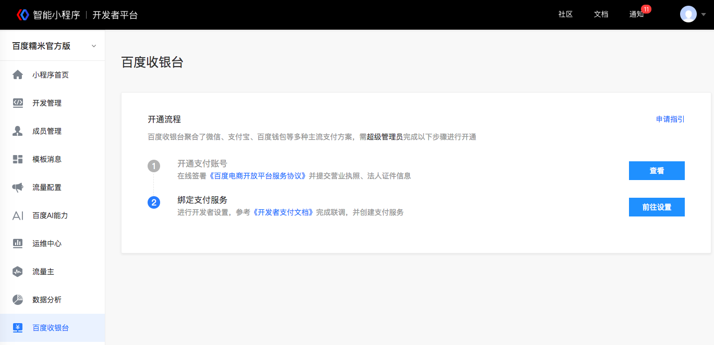
   设置信息包括开发者公钥和收银台参数（线上环境）
   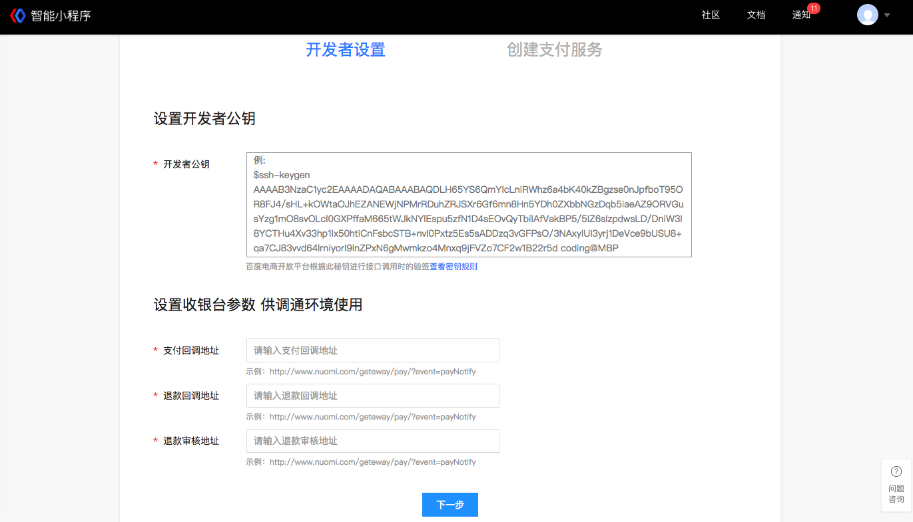
5. 创建服务，进入创建服务页，填写服务名称、录入银行卡信息、并且进行财务设置。填写服务信息后，提交平台进行服务审核，审核周期1个工作日，审核通过后服务即可上线。
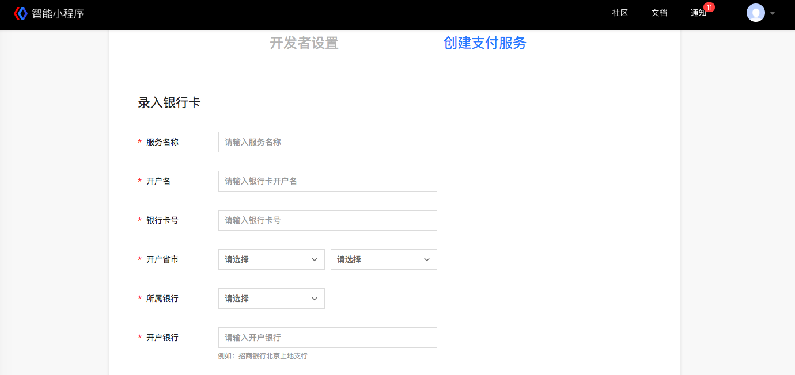
* 目前银行卡仅支持对公账户，请务必保证目前银行卡仅支持对公账户，请务必保证开户名是对公账户名并且和银行开户证明信息一致。
* 银行卡号请正确填写对公银行卡号，卡号不能包含空格。
* 开户银行请填写银行支行全称，请不要填写简称。

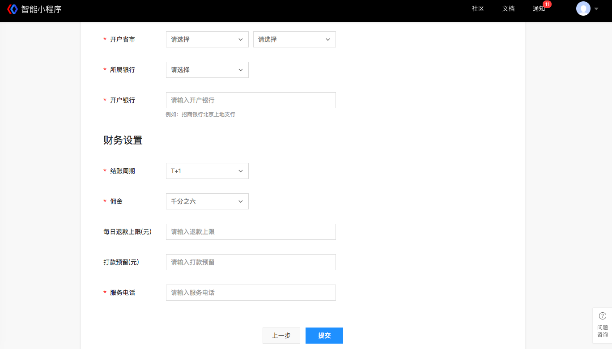

|事项|说明|
|--|--|
|结算周期|小程序可以选择T+1,T+7,T+14,T+28，小游戏默认T+28。|
|佣金|小程序收取千分之六，小游戏收取百分之一。|
|每日退款上限（元）| 每日发起给用户退款的最大金额。如每日退款上限为10000元，当日退款的总金额则不可以超过10000元，超过10000元则退款失败，次日可以再次发起退款。|
|打款预留（元）| 自动付款至绑定银行卡时，可以设置预留金额，此部分金额不进行付款，预留金额可以用来给用户进行退款，以防企业资产为0时，不能给用户退款的情况。如预留金额为1000元，T日产生流水1200元，T+1日则付款200 元至绑定银行卡，1000元在企业资产中。打款预留金额可进行修改。|

> 防止资金池金额小于退款金额时退款失败的情况，建议根据业务退款情况，设置“每日退款上限(元)”和“打款预留(元)”。

## swan.requestPolymerPayment

**版本：** swanjs 1.8.5 版本开始支持。

**解释：** 百度收银台，聚合了主流的百度钱包、微信、支付宝、网银等多种支付方式，方便开发者一站式快速接入多种支付渠道，让百度用户能在智能小程序场景下，直接完成支付、交易闭环，提升用户支付体验的同时，提高智能小程序的订单转化率。

为了帮助开发者调用收银台接口，我们提供了Go语言版本封装了签名&验签、HTTP接口请求等基础功能，详见[下载小程序支付demo](https://github.com/baidu-smart-app)。

了解更多信息，请查看 [百度电商开放平台：产品介绍](https://dianshang.baidu.com/platform/doclist/index.html#!/doc/nuomiplus_1_guide/mini_program_cashier/product_intro.md)。

**方法参数：**Object object

**`object`参数说明：**

|参数名 |类型  |必填 | 默认值 |说明|
|---- | ---- | ---- | ----|----|
|orderInfo| Object | 是 |订单信息|
|bannedChannels| StringArray | 否 | 需要隐藏的支付方式|
|success |Function  |  否  | 接口调用成功的回调函数|
|fail   | Function  |  否  | 接口调用失败的回调函数|
|complete  |  Function  |  否 |  接口调用结束的回调函数（调用成功、失败都会执行）|

**orderInfo 参数说明：**

|参数| 必填|说明|
|----|   ----|---|
|dealId| 是|跳转百度收银台支付必带参数之一，是百度收银台的财务结算凭证，与账号绑定的结算协议一一对应，每笔交易将结算到dealId对应的协议主体。详见<a href="https://dianshang.baidu.com/platform/doclist/index.html#!/doc/nuomiplus_1_guide/mini_program_cashier/parameter.md">核心参数获取</a>。|
|appKey| 是|<a href="https://dianshang.baidu.com/platform/doclist/index.html#!/doc/nuomiplus_2_base/term_v2.md">百度电商开放平台appKey</a>，用以表示应用身份的唯一ID，在应用审核通过后进行分配，一经分配后不会发生更改，来唯一确定一个应用。详见<a href="https://dianshang.baidu.com/platform/doclist/index.html#!/doc/nuomiplus_1_guide/mini_program_cashier/parameter.md">核心参数获取</a>。|
|totalAmount|  是|订单金额，单位为人民币分。|
|tpOrderId| 是|商户平台自己记录的订单ID，当支付状态发生变化时，会通过此订单ID通知商户。|
| dealTitle| 是|订单的名称|
| signFieldsRange| 是|固定值1|
|rsaSign| 是|对`appKey+dealId+tpOrderId+totalAmount`进行RSA加密后的签名，防止订单被伪造。签名过程见 [百度电商开放平台：签名与验签](https://dianshang.baidu.com/platform/doclist/index.html#!/doc/nuomiplus_2_base/sign_v2.md)。|
|bizInfo|  是|订单详细信息，需要是一个可解析为JSON Object的字符串。字段内容见： [百度电商开放平台：收银台接入](https://dianshang.baidu.com/platform/doclist/index.html#!/doc/nuomiplus_1_guide/mini_program_cashier/parameter.md)。|

<!-- |参数|类型|必填|说明|
|----|---|----|---|
|dealId|integer|是|跳转百度收银台支付必带参数之一，是百度收银台的财务结算凭证，与账号绑定的结算协议一一对应，每笔交易将结算到dealId对应的协议主体。|
|appKey|string|是|用以表示应用身份的唯一ID，在应用审核通过后进行分配，一经分配后不会发生更改，来唯一确定一个应用。|
|totalAmount| integer|是|订单金额，单位为人民币分。|
|tpOrderId|integer|是|商户平台自己记录的订单ID，当支付状态发生变化时，会通过此订单ID通知商户。|
| dealTitle|string|是|订单的名称|
|rsaSign|string|是|对`appKey+dealId+tpOrderId`进行RSA加密后的密文，防止订单被伪造。签名过程见 [百度电商开放平台：签名与验签](https://dianshang.baidu.com/platform/doclist/index.html#!/doc/nuomiplus_2_base/sign_v2.md)。|
|bizInfo| string|是|订单详细信息，需要是一个可解析为JSON Object的字符串。字段内容见： [百度电商开放平台：收银台接入](https://dianshang.baidu.com/platform/doclist/index.html#!/doc/nuomiplus_1_guide/beginner_v2/step3/cash.md)。| -->

**bannedChannels 参数说明：**

|channel|说明 |
|----| ---- |
| Alipay | 支付宝 |
| BDWallet | 百度钱包 |
| WeChat | 微信支付|

**示例：**
<a href="swanide://fragment/2fd9f0f66f3a557c70475be52e0617241544430726" title="在开发者工具中预览效果" target="_blank">在开发者工具中预览效果</a>
```js
swan.requestPolymerPayment({
    orderInfo: {
        "dealId": "470193086",
        "appKey": "MMMabc",
        "totalAmount": "1",
        "tpOrderId": "3028903626",
        "dealTitle": "智能小程序Demo支付测试",
        "rsaSign": '',
        "bizInfo": ''
    },
    success: function (res) {
        swan.showToast({
            title: '支付成功',
            icon: 'success'
        });
    },
    fail: function (err) {
        swan.showToast({
            title: JSON.stringify(err)
        });
        console.log('pay fail', err);
    }
});
```
<!-- #### 错误码
**Andriod**
|错误码|说明|
|--|--|
|1001|执行失败 |
**iOS**
|错误码|说明|
|--|--|
|202|解析失败，请检查参数是否正确。|
|10002|网络请求失败|
|10005|系统拒绝| -->