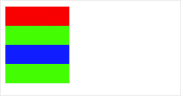

 


**解释**：开始创建一个路径，需要调用 fill 或者 stroke 才会使用路径进行填充或描边。

**方法参数**：无

**代码示例**：

```js
const CanvasContext = swan.createCanvasContext('myCanvas');
CanvasContext.rect(10, 10, 100, 30);
CanvasContext.setFillStyle('red');
CanvasContext.fill();
CanvasContext.beginPath();
CanvasContext.rect(10, 40, 100, 30);
CanvasContext.setFillStyle('blue');
CanvasContext.fillRect(10, 70, 100, 30);
CanvasContext.rect(10, 100, 100, 30);
CanvasContext.setFillStyle('green');
CanvasContext.fill();
CanvasContext.draw();
```



