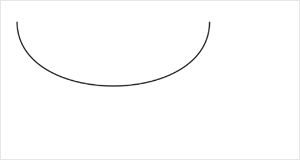

 


**解释**：创建三次方贝塞尔曲线路径。

**百度APP中扫码体验：**


**方法参数**：Number cp1x, Number cp1y, Number cp2, Number cp2y, Number x, Number y

**`cp1x`参数说明**：第一个贝塞尔控制点的 x 坐标 

**`cp1y`参数说明**：第一个贝塞尔控制点的 y 坐标

**`cp2x`参数说明**：第二个贝塞尔控制点的 x 坐标 

**`cp2y`参数说明**：第二个贝塞尔控制点的 y 坐标 

**`x`参数说明**：结束点的 x 坐标  

**`y`参数说明**：结束点的 y 坐标 

**图片示例**：



**代码示例**：

<a href="swanide://fragment/f54afefdc128050accdc18a9e52296911573724955575" title="在开发者工具中预览效果" target="_self">在开发者工具中预览效果</a>

```js
const canvasContext = swan.createCanvasContext('myCanvas');
// Draw quadratic curve
canvasContext.beginPath();
canvasContext.moveTo(20, 20);
canvasContext.bezierCurveTo(20, 100, 200, 100, 200, 20);
canvasContext.setStrokeStyle('black');
canvasContext.stroke();

canvasContext.draw();
```


