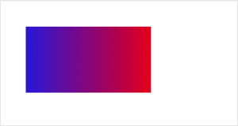

 

**解释**：创建一个线性的渐变颜色。

 
## 方法参数 
 

|参数名|属性|必填|默认值|说明|
|----|----|----|---|---|
| `x0`|Number|是||起点的 x 坐标|
| `y0`|Number|是||起点的 y 坐标|
| `x1`|Number|是||终点的 x 坐标|
|`y1`|Number|是||终点的 y 坐标|

## 示例

<a href="swanide://fragment/883216ba616ba348d103b4a42dfe9e411576354423698" title="在开发者工具中预览效果" target="_self">在开发者工具中预览效果</a> 

### 扫码体验

<div class='scan-code-container'>
    
    <font color=#777 12px>请使用百度APP扫码</font>
</div>

###  图片示例  




### 代码示例 


```js
const canvasContext = this.createCanvasContext('myCanvas');

// Create linear gradient
const grd = canvasContext.createLinearGradient(0, 0, 200, 0);
grd.addColorStop(0, 'blue');
grd.addColorStop(1, 'red');

// Fill with gradient
canvasContext.setFillStyle(grd);
canvasContext.fillRect(30, 30, 150, 80);
canvasContext.draw();
```

