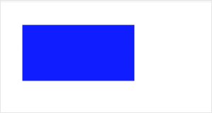

 

**解释**：填充一个矩形。

**方法参数**：Number x, Number y,Number width, Number height

**`x`参数说明**：矩形路径左上角的 x 坐标。

**`y`参数说明**：矩形路径左上角的 y 坐标。

**`width`参数说明**：矩形路径的宽度。

**`height`参数说明**：矩形路径的高度。

**示例**：

```js
const CanvasContext = swan.createCanvasContext('myCanvas');
CanvasContext.setFillStyle('blue');
CanvasContext.fillRect(30, 30, 150, 75);
CanvasContext.draw();
```



