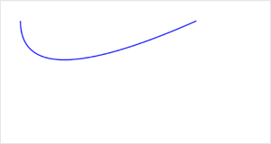

 
**解释**：创建二次贝塞尔曲线路径。

**方法参数**：Number cpx, Number cpy, Number x, Number y

**`cpx`参数说明**：贝塞尔控制点的 x 坐标 

**`cpy`参数说明**：贝塞尔控制点的 y 坐标 

**`x`参数说明**：结束点的 x 坐标  

**`y`参数说明**：结束点的 y 坐标 

**图片示例**：



**代码示例**：

<a href="swanide://fragment/d2d5ff700bbf4feba2a4bf925e0c8d151573725024694" title="在开发者工具中预览效果" target="_self">在开发者工具中预览效果</a>

```js
const canvasContext = swan.createCanvasContext('myCanvas');
// Draw quadratic curve
canvasContext.beginPath();
canvasContext.moveTo(20, 20);
canvasContext.quadraticCurveTo(20, 100, 200, 20);
canvasContext.setStrokeStyle('blue');
canvasContext.stroke();

canvasContext.draw();
```


