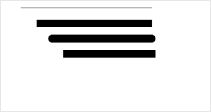

 
**解释**：设置线条的端点样式。

 百度APP中扫码体验： 


 方法参数 ：String lineCap

 `lineCap`参数说明 ：有效值：'butt'、'round'、'square', 线条的结束端点样式。
## 示例

 
### 扫码体验

<div class='scan-code-container'>
    
    <font color=#777 12px>请使用百度APP扫码</font>
</div>

###  图片示例  


### 代码示例 

<a href="swanide://fragment/f88c23c09480e31a3450caf4bb2054091573720910716" title="在开发者工具中预览效果" target="_self">在开发者工具中预览效果</a>

```js
const canvasContext = swan.createCanvasContext('myCanvas');
canvasContext.beginPath();
canvasContext.moveTo(30, 10);
canvasContext.lineTo(200, 10);
canvasContext.stroke();

canvasContext.beginPath();
canvasContext.setLineCap('butt');
canvasContext.setLineWidth(10);
canvasContext.moveTo(50, 30);
canvasContext.lineTo(200, 30);
canvasContext.stroke();

canvasContext.beginPath();
canvasContext.setLineCap('round');
canvasContext.setLineWidth(10);
canvasContext.moveTo(70, 50);
canvasContext.lineTo(200, 50);
canvasContext.stroke();

canvasContext.beginPath();
canvasContext.setLineCap('square');
canvasContext.setLineWidth(10);
canvasContext.moveTo(90, 70);
canvasContext.lineTo(200, 70);
canvasContext.stroke();

canvasContext.draw();
```


