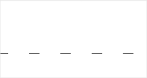

 
**解释**：设置线条虚线样式的间距和长度。

**方法参数**：Array pattern, Number offset

**`pattern`参数说明**：一组描述交替绘制线段和间距（坐标空间单位）长度的数字。 

**`offset`参数说明**：虚线偏移量。

**示例**：

```js
const CanvasContext = swan.createCanvasContext('myCanvas');
CanvasContext.setLineDash([10, 20], 5);
CanvasContext.beginPath();
CanvasContext.moveTo(0,100);
CanvasContext.lineTo(400, 100);
CanvasContext.stroke();
CanvasContext.draw();
```



