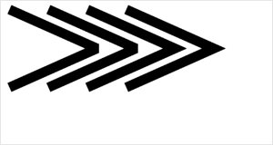

 


**解释**：设置最大斜接长度，斜接长度指的是在两条线交汇处内角和外角之间的距离。当 setLineJoin() 为 miter 时，该设置才有效。超过最大倾斜长度的，连接处将以 lineJoin 为 bevel 来显示。

 
## 方法参数 

 Number miterLimit

 `miterLimit`参数说明： 最大斜接长度  
## 示例

<a href="swanide://fragment/4d8cb34c8688d828ba9064e3d9406a231573721300843" title="在开发者工具中预览效果" target="_self">在开发者工具中预览效果</a> 

### 扫码体验

<div class='scan-code-container'>
    
    <font color=#777 12px>请使用百度APP扫码</font>
</div>

###  图片示例  


### 代码示例 


```js
const canvasContext = swan.createCanvasContext('myCanvas');
canvasContext.beginPath();
canvasContext.setLineWidth(10);
canvasContext.setLineJoin('miter');
canvasContext.setMiterLimit(1);
canvasContext.moveTo(10, 10);
canvasContext.lineTo(100, 50);
canvasContext.lineTo(10, 90);
canvasContext.stroke();

canvasContext.beginPath();
canvasContext.setLineWidth(10);
canvasContext.setLineJoin('miter');
canvasContext.setMiterLimit(2);
canvasContext.moveTo(50, 10);
canvasContext.lineTo(140, 50);
canvasContext.lineTo(50, 90);
canvasContext.stroke();

canvasContext.beginPath();
canvasContext.setLineWidth(10);
canvasContext.setLineJoin('miter');
canvasContext.setMiterLimit(3);
canvasContext.moveTo(90, 10);
canvasContext.lineTo(180, 50);
canvasContext.lineTo(90, 90);
canvasContext.stroke();

canvasContext.beginPath();
canvasContext.setLineWidth(10);
canvasContext.setLineJoin('miter');
canvasContext.setMiterLimit(4);
canvasContext.moveTo(130, 10);
canvasContext.lineTo(220, 50);
canvasContext.lineTo(130, 90);
canvasContext.stroke();

canvasContext.draw();
```


