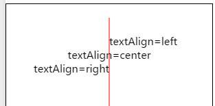

 
**解释**：用于设置文字的对齐。

**方法参数**：String align

**`align `参数说明**： 可选值 'left'、'center'、'right'。 

**示例**：

```js
const CanvasContext = swan.createCanvasContext('myCanvas');

CanvasContext.setStrokeStyle('red');
CanvasContext.moveTo(150, 20);
CanvasContext.lineTo(150, 170);
CanvasContext.stroke();

CanvasContext.setFontSize(15);
CanvasContext.setTextAlign('left');
CanvasContext.fillText('textAlign=left', 150, 60);

CanvasContext.setTextAlign('center');
CanvasContext.fillText('textAlign=center', 150, 80);

CanvasContext.setTextAlign('right');
CanvasContext.fillText('textAlign=right', 150, 100);

CanvasContext.draw();
```


