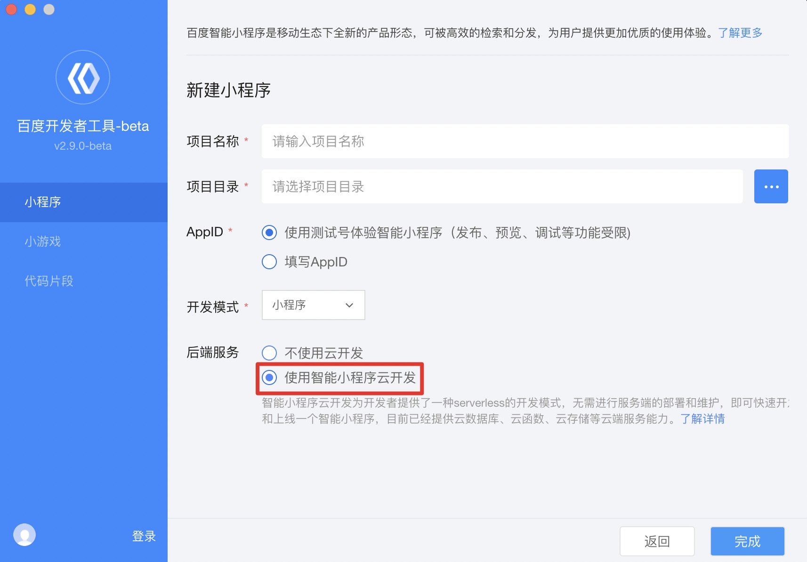

> 开发者可以通过智能小程序提供的官方示例快速体验云开发的相关能力。

##  新建云开发小程序

初次使用云开发小程序，您可在开发者工具中新建页面，依次填写**项目名称、项目目录、AppID**，并且在"后端服务"中勾选"使用智能小程序云开发"选项。

对于已经开发中的智能小程序项目，也可跳过上面步骤，直接在开发者工具主界面的工具栏中，点击"云开发"按钮，开通并使用云开发服务。
> 云开发服务从基础库 3.105.2 开始支持，从百度开发者工具 2.11.0-beta 开始支持。

 
##  开通智能小程序云开发

进入到百度开发者工具的主界面，点击工具栏中的"云开发"按钮，根据提示开通云开发服务。

>* 确保当前开发者工具已经登录，并且已经填写了正确的 AppID ，否则无法开通云开发服务。
>* 目前云开发仅支持小程序管理员进行开通申请，如果是小程序普通项目发起申请，请使用管理员帐号重新登录开发者工具。

成功开通云开发能力后，需要在云开发控制台中创建云环境。

**云环境**：小程序云开发必备的云端工作空间，代表一组云端资源（一个文档数据库、一个存储空间、云函数配置）的组合，每个云环境有唯一的ID作为标识。默认配额下每个开发者可以创建两个工作空间。

## 云开发功能体验

百度开发者工具会默认初始化一个集成了云存储、数据库、云函数等api的云开发小程序示例，开发者可以在模拟器中体验效果，或者可以在百度APP(11.13或者以上版本)查看云开发小程序示例的效果。

> 在默认生成的智能小程序源代码中，project.config.json 配置文件中新增了 cloudfunctionRoot 字段，表示云函数相关代码存放的路径。

## 发布一个云开发小程序

**云开发小程序在发布之前，需要确认[最低基础库的版本](https://smartprogram.baidu.com/docs/develop/swan/compatibility/#%E5%9F%BA%E7%A1%80%E5%BA%93%E6%9C%80%E4%BD%8E%E7%89%88%E6%9C%AC%E8%AE%BE%E7%BD%AE/)。**
如果当前智能小程序是云开发类型，开发者工具会默认将最低基础库版本设置为 3.105.2，如果开发者手动将最低基础库版本调低，开发者工具会给出相关警告。
同时在"项目信息"中的"调试基础库"，也要确认基础库的版本是 3.105.2 或者以上，保证云开发相关功能可以在模拟器中正常运行。
## 云开发控制台

开发者可通过云开发控制查看当前工作空间下的各类云端资源，云开发控制集成在开发者工具中，开发者开通云开发能力之后，在工具栏中点击"云开发"按钮即可查看。