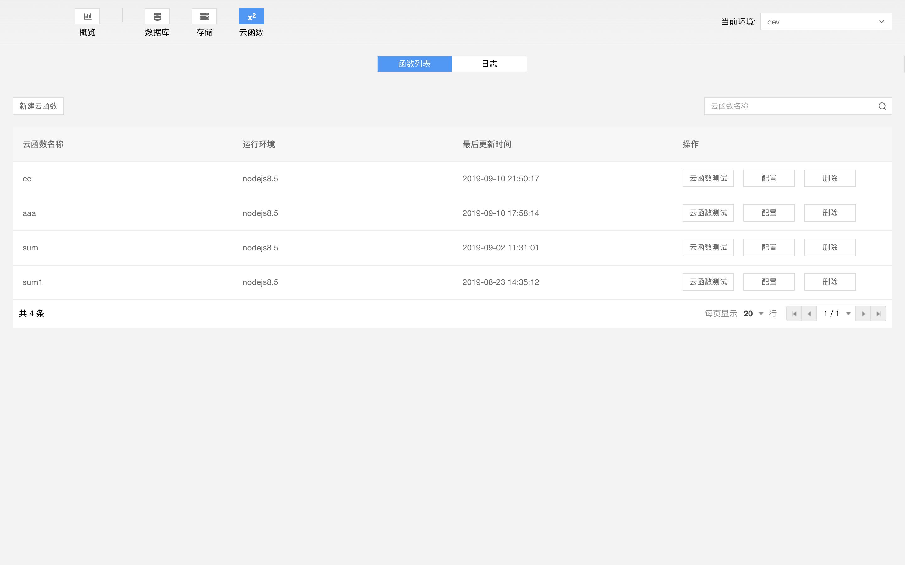
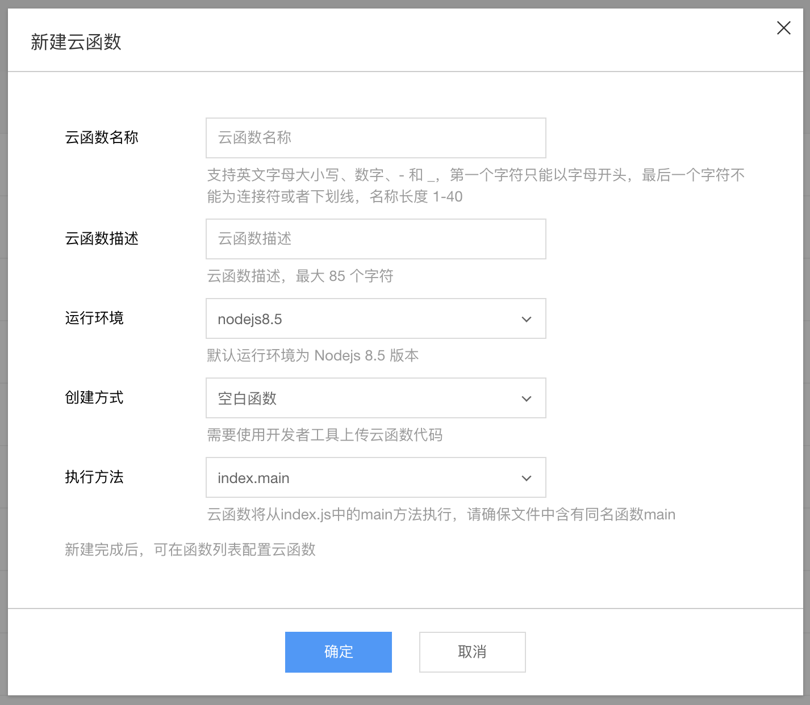
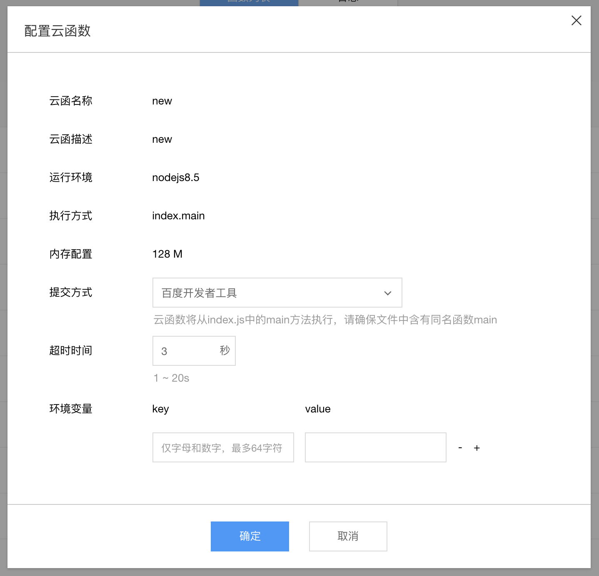
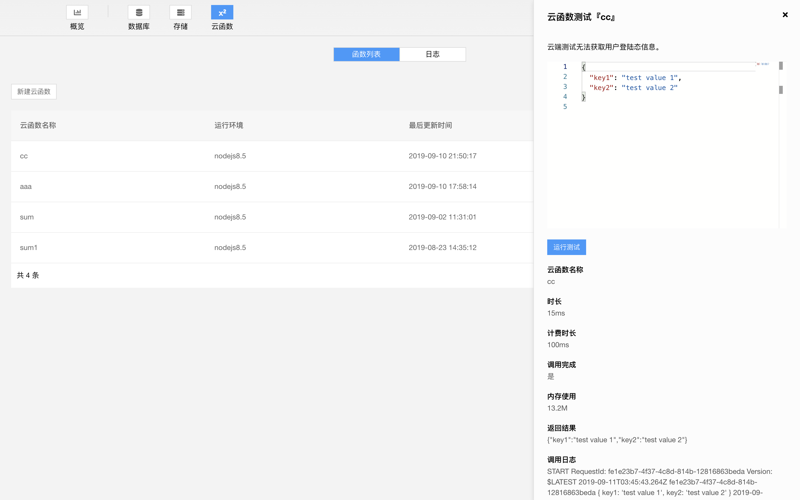
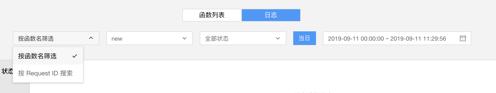

云函数面板可管理云函数、查看调用日志。

## 函数管理

可新建函数，查询，测试，配置，删除云函数。

### 新建云函数

点击新建云函数，输入函数名和描述可新建云函数。云函数名支持英文字母大小写、数字、- 和 _，第一个字符只能以字母开头，最后一个字符不能为连接符或者下划线，名称长度 1-40。云函数描述不能超过 85 个字符。

创建云函数后，默认生成一个空白函数，空白函数的返回值为输入参数。可在开发者工具编辑器中修改、部署云函数。

云函数将从index.js中的main方法执行，请确保文件中含有同名函数main

### 配置云函数

配置云函数时可配置环境变量。云函数运行时会注入到`process.env`

### 云函数测试

点击云函数测试可测试云函数。测试云函数的参数为 json 格式。编辑好参数点击运行测试即可看到测试结果。

## 日志

日志可按函数名筛选和按request ID 搜索。

