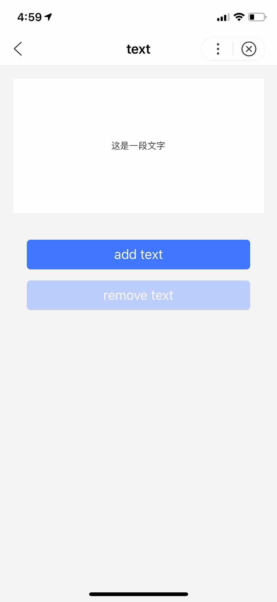
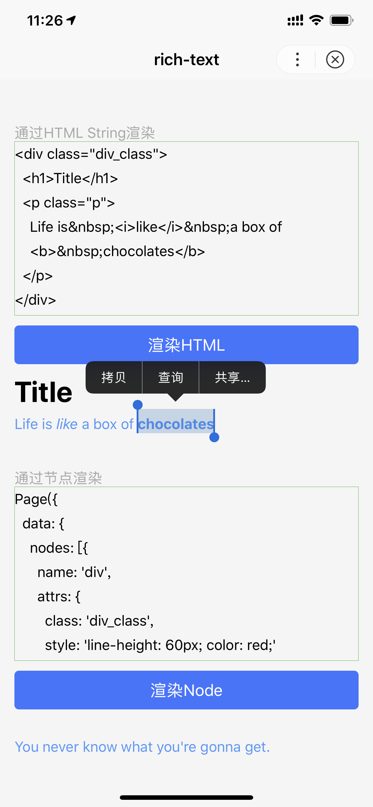

## text 文本

**解释**：文本元素

**百度APP中扫码体验：**


**属性说明:**

|属性名 |类型  |默认值  | 必填 |说明|最低版本|
|---- | ---- | ---- |---- |---- |--|
| space | String  | false | 否 |显示连续空格|1.10.1|
| selectable|Boolean|false| 否 |文本是否可选<br>**true**:可用于文本复制，粘贴等场景。|3.10.4|

**space 有效值**:

| 值 | 说明 |
| ---- | ---- |
| ensp | 中文字符空格一半大小 |
| emsp | 中文字符空格大小 |
| nbsp | 根据字体设置的空格大小 |

**示例**：
<a href="swanide://fragment/475757ad12315ba758ce42bc61e47ba11565503530789" title="在开发者工具中预览效果" target="_self">在开发者工具中预览效果</a>

* 在 swan 文件中

```html
<view class="wrap">
    <view class="page-section page-section-spacing">
        <view class="text-box">
            <text selectable="true" space="20">{{text}}</text>
        </view>
        <button class="btn" disabled="{{!canAdd}}" type="primary" bind:tap="add">add text</button>
        <button class="btn" disabled="{{!canRemove}}" type="primary" bind:tap="remove">remove text</button>
    </view>
</view>
```

* 在 js 文件中

```js
const texts = [
    '百度智能小程序',
    '生态共建',
    '持续为开发者拓展更多的百度内、外的流量资源',
    '百亿广告分成',
    '通过把广告组件嵌入到小程序里得到广告收益',
    '十亿创新基金',
    '为创新类小程序提升流量及曝光',
    '......'
  ]
  let extraLine = []

Page({
    data: {
        text: '这是一段文字',
        canAdd: true,
        canRemove: false,
        extraLine : [],
    },
    add() {
        extraLine.push(texts[extraLine.length % 12])
        this.setData({
          text: extraLine.join('\n'),
          canAdd: extraLine.length < 12,
          canRemove: extraLine.length > 0
        })
    },
    remove() {
      if (extraLine.length > 0) {
          extraLine.pop()
          this.setData({
            text: extraLine.join('\n'),
            canAdd: extraLine.length < 12,
            canRemove: extraLine.length > 0,
          })
        }
        else {
          this.setData({
            text: 'end'
          })
        }
    }
});

```
**图示**：

<div class="m-doc-custom-examples">
    <div class="m-doc-custom-examples-correct">
        
    </div>
    <div class="m-doc-custom-examples-correct">
        
    </div>
    <div class="m-doc-custom-examples-correct">
        
    </div>
</div>


**Bug & Tip**：

* 除了文本节点以外的其他节点都无法长按选中，支持复制，但不支持剪切。
* 各个操作系统的空格标准并不一致。
* `<text/>`组件内只支持`<text/>`嵌套，注意被嵌套的text绑定事件无法触发。


## icon 图标

**解释**： 图标

**百度APP中扫码体验：**


**属性说明**:

|属性名|类型  |默认值  | 必填 |说明|
|---- | ---- | ---- | ---- |---- |
|type |String  | | 是 |生效的值：success, info, warn, waiting, success_no_circle, clear, search, personal, setting, top, close, cancel, download, checkboxSelected, radioSelected, radioUnselect, loadingGrey|
|size | Number  |23 | 否 |icon 的大小，单位是 px|
|color | Color |   | 否 |icon 的颜色，同 css 的 color|

**type 有效值**:

| 值 | 说明 |
| ---- | ---- |
| success | 成功图标 |
| info | 消息图标 |
| warn | 警告图标 |
| waiting | 等待图标 |
| success_no_circle | 无圆形边框成功图标 |
| clear | 删除图标 |
| search | 搜索图标 |
| personal | 人物图标 |
| setting | 设置图标 |
| top | 回到顶部图标 |
| close | 关闭图标 |
| cancel | 取消图标 |
| download | 下载图标 |
| checkboxSelected | 复选框选中图标 |
| radioSelected | 单选框选中图标 |
| radioUnselect | 单选框未选中图标 |
| loadingGrey | loading图标 |

**示例**：
<a href="swanide://fragment/e2162b6a873dffee7317e9f7ec2375271565503511850" title="在开发者工具中预览效果" target="_self">在开发者工具中预览效果</a>

* 在 swan 文件中

```html
<view class="wrap">
    <view class="title">默认样式</view>
    <view class="group">
        <view>
            <icon s-for="type in types.smallDefault" type="{{type}}" class="small-default" />
        </view>
    </view>

    <view class="title">尺寸选择</view>
    <view class="group choose">
        <icon s-for="size in sizes" type="success" size="{{size}}" class="icon-size" />
    </view>

    <view class="title">颜色选择</view>
    <view class="group choose">
        <icon s-for="color in colors" type="success" size="40" color="{{color}}" class="icon-color" />
    </view>
</view>
```

* 在 js 文件中

```js
Page({
    data: {
        types: {
            smallDefault: ['success', 'info', 'warn', 'waiting',
            'success_no_circle', 'clear', 'search', 'personal',
            'setting', 'top', 'close', 'cancel', 'download',
            'checkboxSelected', 'radioSelected', 'radioUnselect']
        },
        colors: [
            '#333', '#666', '#999', '#3C76FF', '#F7534F'
        ],
        sizes: [
            40, 35, 30, 25
        ]
    }
});
```

## progress 进度条

**解释**：进度条

**百度APP中扫码体验：**


**属性说明**：

|属性名 |类型  |默认值  | 必填 |说明|
|---- | ---- | ---- |---- |---- |
| percent | Float  | | 否 |百分比 0~100 |
| show-info | Boolean  | false  | 否 |在进度条右侧显示百分比|
| stroke-width | Number/String | 2 | 否 |进度条线的宽度，单位 px|
| color | Color  | #09BB07 | 否 |进度条颜色 （请使用 activeColor）	|
| activeColor | Color  | #09BB07 | 否 | 已选择的进度条的颜色	|
| backgroundColor |  Color | #E6E6E6 | 否 |未选择的进度条的颜色	|
| active | Boolean  | false  | 否 |进度条从左往右的动画	|
| active-mode | String  | backwards  | 否 |backwards: 动画从头播；forwards：动画从上次结束点接着播	|

**示例**：
<a href="swanide://fragment/1a3cd8dd48a72058a36b9d2238cc9a281565503522559" title="在开发者工具中预览效果" target="_self">在开发者工具中预览效果</a>

* 在 swan 文件中

```html
<view class="wrap">
    <progress class="progress" percent="20" activeColor="#3c76ff" show-info />
    <progress class="progress" percent="40" activeColor="#3c76ff" active />
    <progress class="progress" percent="60" activeColor="#3c76ff" stroke-width="10" active />
    <progress class="progress" percent="70" color="#3c76ff" active/>
    <progress class="progress" percent="80" activeColor="#74fa7d"  backgroundColor="#3c76ff" active active-mode="backwards"/>
</view>

```


## rich-text 富文本

> nodes 属性推荐使用 Array 类型，由于组件会将 String 类型转换为 Array 类型，因而性能会有所下降。

**解释**： 富文本


**百度APP中扫码体验：**


**属性说明:**

|属性名 |类型  |默认值  | 必填 |说明|
|---- | ---- | ---- | ---- |---- |
| nodes | Array &#124; String  | [] | 否 |节点列表 / HTML String|
| selectable | Boolean | false | 否 |富文本是否可以长按选中，可用于复制，粘贴等场景。 <font color="#4183c4">百度 APP 11.10 以上</font>|

### nodes
现支持两种节点，通过type来区分，分别是 **元素节点** 和 **文本节点** ，默认是元素节点，在富文本区域里显示的HTML节点。

* 元素节点：type = node

**属性说明:**

|属性名 | 说明 | 类型  | 必填 | 备注 |
|---- | ---- | ---- |---- | ---- |
| name | 标签名 | String | 是 | 支持部分受信任的HTML节点 |
| attrs | 属性 | Object | 否 | 支持部分受信任的属性，遵循Pascal命名法 |
| children | 子节点列表 | Array | 否 | 结构和nodes一致 |

* 文本节点：type = text


**属性说明:**

|属性名 | 说明 | 类型  | 必填 | 备注 |
|---- | ---- | ---- |---- | ---- |
| text | 文本 | String | 是 | 支持entities |

### 受信任的HTML节点及属性。

> 全局支持class和style属性，不支持id属性。

属性说明:

|节点 | 属性 |
|---- | ---- |
| a | -|
| abbr |- |
| b |- |
| blockquote | -|
| br | -|
| code |- |
| col | span，width |
| colgroup | span，width |
| dd | -|
| del | -|
| div |- |
| dl |- |
| dt |- |
| em | -|
| fieldset |- |
| h1 |- |
| h2 |- |
| h3 |- |
| h4 |- |
| h5 |- |
| h6 |- |
| hr | -|
| i |- |
| img | alt，src，height，width |
| ins |- |
| label |- |
| legend |- |
| li | -|
| ol | start，type |
| p | -|
| q |- |
| span |- |
| strong | -|
| sub |- |
| sup |- |
| table | width |
| tbody |- |
| td | colspan，height，rowspan，width |
| tfoot | -|
| th | colspan，height，rowspan，width |
| thead |- |
| tr | -|
| ul | - |

**示例**

<a href="swanide://fragment/746c4d81d51218ea977782622aa61d9a1566379382794" title="在开发者工具中预览效果" target="_self">在开发者工具中预览效果</a>

* 在 swan 文件中

```html
<view class="rich-text">
    <view class="renders">
        <view class="renders_title">通过HTML String渲染</view>
        <view class="renders_view">
            <scroll-view scroll-y>
                <view class="cont">{{htmlSnip}}</view>
            </scroll-view>
            <button type="primary" bind:tap="renderHtml">渲染HTML</button>
            <block s-if="{{renderedByHtml}}">
                <rich-text nodes="{{htmlSnip}}" selectable="true"></rich-text>
            </block>
        </view>
    </view>
    <view class="renders">
        <view class="renders_title">通过节点渲染</view>
        <view class="renders_view">
            <scroll-view scroll-y>
                <view class="cont">{{nodeSnip}}</view>
            </scroll-view>
            <button type="primary" bind:tap="renderNode">渲染Node</button>
            <block s-if="{{renderedByNode}}" style="margin-bottom:.5rem">
                <rich-text nodes="{{nodes}}" selectable="true"></rich-text>
            </block>
        </view>
    </view>
</view>
```

* 在 js 文件中

```js
const htmlSnip
=`<div class="div_class">
  <h1>Title</h1>
  <p class="p">
    Life is&nbsp;<i>like</i>&nbsp;a box of
    <b>&nbsp;chocolates</b>
  </p>
</div>`;
const nodeSnip
=`Page({
  data: {
    nodes: [{
      name: 'div',
      attrs: {
        class: 'div_class',
        style: 'line-height: 60px; color: red;'
      },
      children: [{
        type: 'text',
        text: 'You never know what you're gonna get.'
      }]
    }]
  }
})`;

Page({
    data: {
        htmlSnip,
        nodeSnip,
        renderedByHtml: false,
        renderedByNode: false,
        nodes: [{
            name: 'div',
            attrs: {
                class: 'div_class',
                style: 'line-height: 60px; color: #4F99FB;'
            },
            children: [{
                type: 'text',
                text: 'You never know what you\'re gonna get.'
            }]
        }]
    },
    renderHtml() {
        this.setData({
            renderedByHtml: true
        });
    },
    renderNode() {
        this.setData({
            renderedByNode: true
        });
    },
    enterCode(e) {
      this.setData({
          htmlSnip: e.detail.value
      });
    }
});
```
**图示**

<div class="m-doc-custom-examples">
    <div class="m-doc-custom-examples-correct">
        
    </div>
    <div class="m-doc-custom-examples-correct">
        
    </div>
    <div class="m-doc-custom-examples-correct">
        
    </div>
</div>

**Bug & Tip**：

* 单击此处，查看将<a href="https://gitee.com/sootou/bdparse">富文本字符串转成 json 格式</a>的具体方法。
* 支持默认事件，包括：tap、touchstart、touchmove、touchcancel、touchend和longtap。
* nodes 不推荐使用 String 类型，性能会有所下降。
* rich-text 组件内屏蔽所有节点的事件。
* attrs 属性不支持 id ，支持 class。
* name 属性大小写不敏感。
* 如果使用了不受信任的HTML节点，该节点及其所有子节点将会被移除。
* img 标签仅支持网络图片。
* 如果在自定义组件中使用 rich-text 组件，那么仅自定义组件的 swan 样式对 rich-text 中的 class 生效。


## animation-view Lottie 动画

> 客户端创建的[原生组件](https://smartprogram.baidu.com/docs/develop/component/native/)，使用时请注意相关限制。


**解释**：支持 Lottie 动画

**百度APP中扫码体验：**


**属性说明**：

|属性名 |类型  |必填 |默认值  |说明|最低版本|
|---- | ---- | --- | ---- |---- |--|
| path | String  |是 |  |动画资源地址，目前只支持绝对路径|-|
| loop | Boolean  | 否 | false | 动画是否循环播放 |-|
|autoplay | Boolean | 否 |true	  |动画是否自动播放	|-|
|action | String  |	 否 | play |动画操作，可取值 play、pause、stop	|-|
|hidden | Boolean  | 否 | true |是否隐藏动画|-|
|bindended | EventHandle | 否 |   | 当播放到末尾时触发 ended 事件（自然播放结束会触发回调，循环播放结束及手动停止动画不会触发。）|3.0.0|

**action 有效值**:

| 值 | 说明 |
| ---- | ---- |
| play | 播放 |
| pause | 暂停 |
| stop | 停止 |

**示例**：

<a href="swanide://fragment/19c06d05f550daf240008413039c50021565512139450" title="在开发者工具中预览效果" target="_self">在开发者工具中预览效果</a>

* 在 swan 文件中

```html
<view class="container">
    <view class="animation-content hide">
        <view class="animation-info">
            <animation-view id="myAnim" action="{{action}}" loop="{{loop}}" hidden="{{hidden}}" class="controls hide" autoplay="{{autoplay}}" bind:ended="end" path="{{path}}">
            </animation-view>
        </view>
        <view class="button-content">
            <button bind:tap="playLottie" class="toggle-animation" type="primary" hover-stop-propagation="true">{{status}}lottie动画</button>
        </view>
    </view>
</view>

```
* 在 js 文件中

```javascript
Page({
    data: {
        title: 'lottie',
        action: 'play',
        hidden: false,
        path: '/anims/lottie_example.json',
        loop: true,
        autoplay: true,
        status: '停止',
        updateImgSrc: 'https://b.bdstatic.com/searchbox/icms/searchbox/img/bg-new.png',
        textImgSrc: 'https://b.bdstatic.com/searchbox/icms/searchbox/img/title.png'
    },
    onShow(){
        console.log('手百版本11.3以上才可使用');
    },
    playLottie() {
        // 切换播放状态
        let action = this.data.action;
        action = action === 'pause' ? 'play' : 'pause';
        let status = action === 'pause' ? '播放' : '停止';

        this.setData({
            action,
            status
        });
    },
    end() {
        console.log('播放结束,设置不循环播放才能触发');
    }
});
```
**图示**

<div class="m-doc-custom-examples">
    <div class="m-doc-custom-examples-correct">
        
    </div>
    <div class="m-doc-custom-examples-correct">
        
    </div>
    <div class="m-doc-custom-examples-correct">
        
    </div>
</div>

**Bug & Tip**：

* animation-view组件的位置信息、padding值以path里传的json文件里的left、top、padding值为准。
* animation-view组件不支持原生组件嵌套。
* 为避免出现iOS中画面被拉伸的情况，建议将animation-view组件的长宽比设置的与动画长宽比一致。
