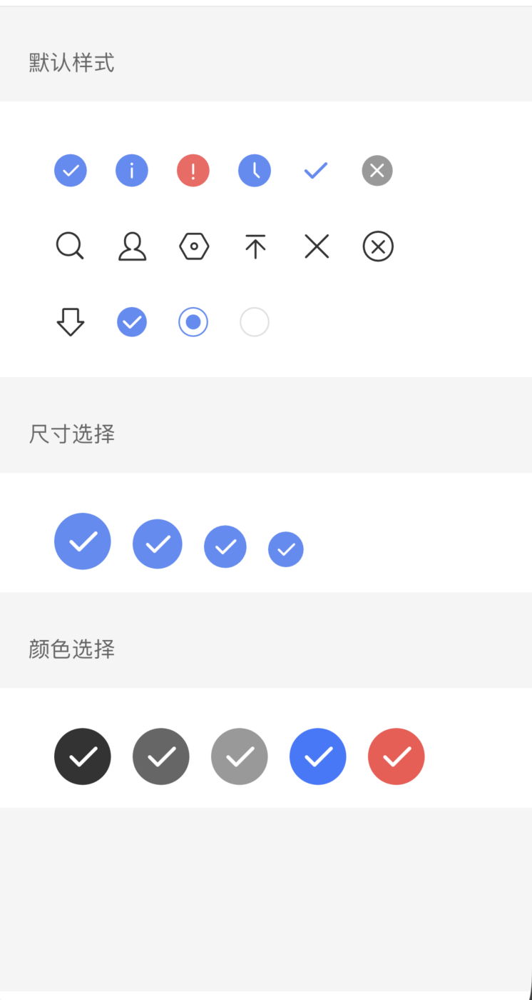
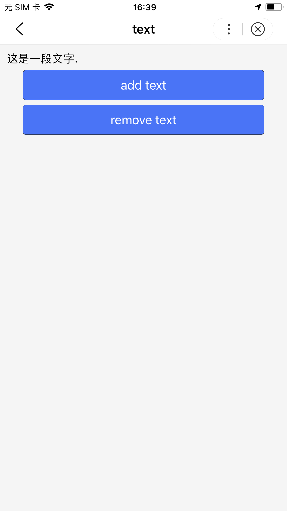

## icon

**解释**： 图标
**属性说明**:

|属性名|类型  |默认值  |说明|
|---- | ---- | ---- |---- |
|type |String  |-|生效的值：success, info, warn, waiting, success_no_circle, clear, search, personal, setting, top, close, cancel, download, checkboxSelected, radioSelected, radioUnselect|
|size | Number  |23 |icon 的大小，单位是 px|
|color | Color | - |icon 的颜色，同 css 的 color|


**示例**： 
<a href="swanide://fragment/e4ad20aa04f31f0e785575e828ee15f01540395172" title="在开发者工具中预览效果" target="_blank">在开发者工具中预览效果</a>
```xml
<view class="group">
    <view>
        <icon s-for="type in types.smallDefault" type="{{type}}" class="small-default" />
    </view>
</view>

<view class="group choose">
    <icon s-for="size in sizes" type="success" size="{{size}}" class="icon-size" />
</view>

<view class="group choose">
    <icon s-for="color in colors" type="success" size="40" color="{{color}}" class="icon-color" />
</view>

```

```js
Page({
    data: {
        types: {
           smallDefault: ['success', 'info', 'warn', 'waiting',
           'success_no_circle', 'clear', 'search', 'personal',
           'setting', 'top', 'close', 'cancel', 'download',
           'checkboxSelected', 'radioSelected', 'radioUnselect']
        },
        colors: [
            '#333', '#666', '#999', '#3C76FF', '#F7534F'
        ],
        sizes: [
            40, 35, 30, 25
        ]
    }
});
```


## text

<div class="notice">解释： </div>放文本的元素<div></div><text class="notice">属性说明:</text>

|属性名 |类型  |默认值  |说明|最低版本|
|---- | ---- | ---- |---- |--|
| space | String  | false |显示连续空格|-|
| selectable|Boolean|false|文本是否可选|3.10.4|

**space 有效值**:

| 值 | 说明 |
| ---- | ---- |
| ensp | 中文字符空格一半大小 |
| emsp | 中文字符空格大小 |
| nbsp | 根据字体设置的空格大小 |

**示例**：
<a href="swanide://fragment/24164a23bc5b36e15464ac2c518143131548067007795" title="在开发者工具中预览效果" target="_blank">在开发者工具中预览效果</a>
```xml
<view class="wrap">
	<text>{{text}}</text>
	<button class="btn" type="primary" bind:tap="add">add text</button>
	<button class="btn" type="primary" bind:tap="remove">remove text</button>
</view>
```

```js
let initData = '这是一段文字.';
let extraLine = [];
Page({
    data: {
        text: initData
    },
    add(e) {
        extraLine.push('其他文字');
        this.setData({
            text: initData + extraLine.join(',')
        });
    },
    remove(e) {
        if (extraLine.length > 0) {
            extraLine.pop();
            this.setData({
                text: initData + extraLine.join(',')
            });
        }
    }
});


```


**说明:**

* 除了文本节点以外的其他节点都无法长按选中。
* 各个操作系统的空格标准并不一致。
* `<text/>`组件内只支持`<text/>`嵌套。


## rich-text
<div class="notice">解释： </div>富文本<div></div><text class="notice">属性说明:</text>

|属性名 |类型  |默认值  |说明|
|---- | ---- | ---- |---- |
| nodes | Array / String  | [] |节点列表 / HTML String|

* 支持默认事件，包括：tap、touchstart、touchmove、touchcancel、touchend和longtap。
* nodes 属性推荐使用 Array 类型，由于组件会将 String 类型转换为 Array 类型，因而性能会有所下降。
* 现支持两种节点，通过type来区分，分别是元素节点和文本节点，默认是元素节点，在富文本区域里显示的HTML节点。

<notice>元素节点：type = node</notice><div></div><text class="notice">属性说明:</text>

|属性名 | 说明 | 类型  | 必填 | 备注 |
|---- | ---- | ---- |---- | ---- |
| name | 标签名 | String | 是 | 支持部分受信任的HTML节点 |
| attrs | 属性 | Object | 否 | 支持部分受信任的属性，遵循Pascal命名法 |
| children | 子节点列表 | Array | 否 | 结构和nodes一致 |

**文本节点：type = text**
**属性说明:**

|属性名 | 说明 | 类型  | 必填 | 备注 |
|---- | ---- | ---- |---- | ---- |
| text | 文本 | String | 是 | 支持entities |

* 受信任的HTML节点及属性。
* 全局支持class和style属性，不支持id属性。

属性说明:

|节点 | 属性 |
|---- | ---- |
| a | |
| abbr | |
| b | |
| blockquote | |
| br | |
| code | |
| col | span，width |
| colgroup | span，width |
| dd | |
| del | |
| div | |
| dl | |
| dt | |
| em | |
| fieldset | |
| h1 | |
| h2 | |
| h3 | |
| h4 | |
| h5 | |
| h6 | |
| hr | |
| i | |
| img | alt，src，height，width |
| ins | |
| label | |
| legend | |
| li | |
| ol | start，type |
| p | |
| q | |
| span | |
| strong | |
| sub | |
| sup | |
| table | width |
| tbody | |
| td | colspan，height，rowspan，width |
| tfoot | |
| th | colspan，height，rowspan，width |
| thead | |
| tr | |
| ul | `` |


```xml
<!-- rich-text.swan -->
<rich-text nodes="{{nodes}}" bindtap="tap"></rich-text>
```

```js
// rich-text.js
Page({
    data: {
        nodes: [{
        name: 'div',
        attrs: {
            class: 'div_class',
            style: 'line-height: 60px; color: red;'
        },
        children: [{
            type: 'text',
            text: 'Hello&nbsp;World!'
        }]
        }]
    },
    tap() {
        console.log('tap')
    }
})
```

**说明：**
* nodes 不推荐使用 String 类型，性能会有所下降。
* rich-text 组件内屏蔽所有节点的事件。
* attrs 属性不支持 id ，支持 class。
* name 属性大小写不敏感。
* 如果使用了不受信任的HTML节点，该节点及其所有子节点将会被移除。
* img 标签仅支持网络图片。
* 如果在自定义组件中使用 rich-text 组件，那么仅自定义组件的 swan 样式对 rich-text 中的 class 生效。

## progress

**解释：**进度条

**属性说明：**

|属性名 |类型  |默认值  |说明|
|---- | ---- | ---- |---- |
| percent | Float  |无|百分比 0~100 |
| show-info | Boolean  | false  |在进度条右侧显示百分比|
| stroke-width | Number | 2 |进度条线的宽度，单位 px|
| color | Color  | #09BB07 |进度条颜色 （请使用 activeColor）	|
| activeColor | Color  |  | 已选择的进度条的颜色	|
| backgroundColor |  Color ||未选择的进度条的颜色	|
| active | Boolean  | false  |进度条从左往右的动画	|
| active-mode | String  | backwards  |backwards: 动画从头播；forwards：动画从上次结束点接着播	|

**示例：**
<a href="swanide://fragment/b6ee78360b1e54b8365a49b98cf09e811540395700" title="在开发者工具中预览效果" target="_blank">在开发者工具中预览效果</a>
```xml
<!-- progress.swan -->
<view class="section">
    <progress percent="20" show-info />
    <progress percent="40" stroke-width="12" />
    <progress percent="60" color="pink" />
    <progress percent="80" active />
</view>

```


## animation-view
**解释：**Lottie动画组件

**属性说明：**

|属性名 |类型  |必填 |默认值  |说明|最低版本|
|---- | ---- | --- | ---- |---- |--|
| path | String  |是 |  |动画资源地址，目前只支持绝对路径|-|
| loop | Boolean  | 否 | false | 动画是否循环播放 |-|
|autoplay | Boolean | 否 |true	  |动画是否自动播放	|-|
|action | String  |	 否 | play |动画操作，可取值 play、pause、stop	|-|
|hidden | Boolean  | 否 | true |是否隐藏动画|-|
|bindended | EventHandle | 否 | - | 当播放到末尾时触发 ended 事件（自然播放结束会触发回调，循环播放结束及手动停止动画不会触发。）|3.0.0|

**说明:**

* animation-view组件的位置信息、padding值以path里传的json文件里的left、top、padding值为准。
* animation-view组件不支持原生组件嵌套。
* 为避免出现iOS中画面被拉伸的情况，建议将animation-view组件的长宽比设置的与动画长宽比一致。
**示例：**

```xml
<!-- animation-view.swan -->
<view>
    <animation-view id="myAnim" action="{{action}}" hidden="{{hidden}}" class="controls" autoplay="false" path="{{path}}">
    </animation-view>
</view>

```
```javascript
Page({
    data: {
        path: '/anims/anim_one.json',
        action: 'play',
        hidden: false
    }
});
```
