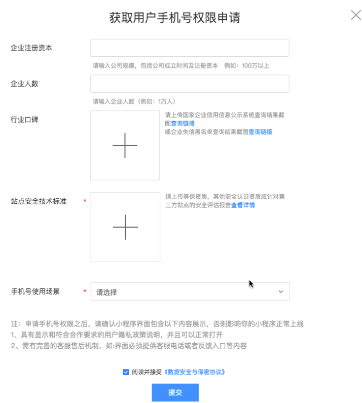

## button 按钮


**解释**： 按钮

**百度APP中扫码体验：**


**属性说明**：

|属性名 |类型  |默认值  | 必填 |说明|最低支持版本|
|---- | ---- | ---- |---- |---- |---- |
|size|String | default  | 否 |大小|- |
| type | String | default | 否 |类型|- |
| plain | Boolean  |false | 否 |按钮是否镂空，背景色透明。|- |
|form-type |String  | buttonclick | 否 |用于`<form/>`组件，点击分别会触发`<form/>`组件的  submit/reset 事件。|- |
|open-type | String |  | 否 |百度 App开放能力，比如分享、获取用户信息等等。|- |
|hover-class |String  |button-hover | 否 |点击态。指定按钮按下去的样式类。当 ` hover-class="none"`  时，没有点击态效果。 button-hover 默认为{background-color: rgba(0, 0, 0, 0.1); opacity: 0.7;}。|- |
| hover-stop-propagation|Boolean|false | 否 |指定是否阻止本节点的祖先节点出现点击态。|- |
|hover-start-time | Number |20  | 否 |按住后多久出现点击态，单位毫秒。|- |
|hover-stay-time|Number | 70  | 否 |手指松开后点击态保留时间，单位毫秒。|- |
|disabled|Boolean|false| 否 |是否禁用|- |
|loading|Boolean|false| 否 |名称前是否带有loading图标|- |
|bindgetphonenumber|Handler| | 否 |获取用户手机号回调。和 open-type 搭配使用， 使用时机：` open-type="getPhoneNumber"`。具体申请方法请见：<a href="https://smartprogram.baidu.com/docs/develop/component/formlist/#获取用户手机号权限申请">获取用户手机号权限申请</a>。|1.12.14	|
| bindgetuserinfo |EventHandler |   | 否 |用户点击该按钮时，会返回获取到的用户信息，从返回参数的 detail 中获取到的值，和 swan.getUserInfo 一样的。和 open-type 搭配使用， 使用时机： `open-type="getUserInfo"`。|- |
|bindopensetting|Handler| | 否 |		在打开授权设置页后回调，使用时机：`open-type="openSetting"`。|- |
| bindcontact | Handler | | 否 |		客服消息回调，使用时机：open-type="contact"。如果需要使用该功能，请发送邮件至 smartprogram_support@baidu.com 咨询详细情况。|- |
|contact|Handler||否|打开客服会话，如果用户在会话中点击消息卡片后返回小程序，可以从bindcontact回调中获得具体信息。|- |


**size有效值**：

|值 |说明|
|---- |---- |
| default |默认大小 |
| mini   |小尺寸 |


**type有效值**：

|值 |说明|
|---- |---- |
| primary	|蓝色|
| default |白色|
| warn |红色|

**form-type有效值**：

|值|说明|
| ---- | ---- |
| buttonclick | 普通按钮点击 |
| submit | 提交表单 |
| reset | 重置表单 |

**open-type有效值**：

|值 |说明|
|---- |---- |
|share |触发用户分享，使用前建议先阅读 <a href="https://smartprogram.baidu.com/docs/develop/api/open_share/">swan.onShareAppMessage</a> 用。|
| getUserInfo |获取用户信息，可以从 bindgetuserinfo 回调中获取到用户信息，参考<a href="https://smartprogram.baidu.com/docs/develop/api/open_log/#用户数据的签名验证和加解密/">用户数据的签名验证和加解密</a>对用户数据进行处理。|
| getPhoneNumber |获取用户手机号，可以从 bindgetphonenumber 回调中获取到用户信息：<br>detail.errMsg 值为`"getPhoneNumber:ok"` 时代表用户信息获取成功；<br>detail.errMsg 值为`"getPhoneNumber:fail auth deny"`时代表用户信息获取失败。<br>参考<a href="https://smartprogram.baidu.com/docs/develop/api/open_log/#用户数据的签名验证和加解密/">用户数据的签名验证和加解密</a>对用户数据进行处理获得用户手机号。<br>1. 非个人开发者可申请；<br>2. 审核通过后，进入小程序首页,在左侧导航栏单击“设置>开发设置”。下拉页面，在“获取用户手机号权限申请”中单击“申请开通”。|
|openSetting|	打开授权设置页|
|contact|打开客服会话，如果用户在会话中点击消息卡片后返回小程序，可以从bindcontact回调中获得具体信息。|


**示例**：
<a href="swanide://fragment/c5e9c02cad6b485032a87ee568c3fe4a1565507494356" title="在开发者工具中预览效果" target="_self">在开发者工具中预览效果</a>

* 在 swan 文件中

```xml
<view class="wrap">
    <view class="mini-btn-content">
        <view class="title">默认态</view>
        <button type="primary" size="mini" class="mini-btn primary">
            按钮
        </button>
        <button type="default" size="mini" class="mini-btn">按钮</button>
        <button type="warn"    size="mini" class="mini-btn warn">
            按钮
        </button>
    </view>

    <view class="mini-btn-content">
        <view class="title">禁用态</view>
        <button type="primary" size="mini" class="mini-btn primary" disabled>
            按钮
        </button>
        <button type="default" size="mini" class="mini-btn" disabled>
            按钮
        </button>
        <button type="warn" size="mini" class="mini-btn warn" disabled>
            按钮
        </button>
    </view>

    <view class="btn-content">
        <button type="primary" class="btn primary">
            主操作按钮 默认态
        </button>
        <button type="primary" class="btn primary" plain='true'>
            主操作按钮 背景镂空
        </button>
        <button type="primary" hover-class='none' hover-stop-propagation="true" class="btn primary" bind:tap="tap">
            主操作按钮 无点击态
        </button>
        <button type="primary" class="btn primary" hover-start-time="1000" hover-stay-time="2000">
            主操作按钮 延迟点击
        </button>
        <button type="primary" loading="true" class="btn primary">
            主操作按钮 loading
        </button>
        <button type="primary" class="btn primary" disabled>
            主操作按钮 禁用态
        </button>
        <button type="default" class="btn">
            次要操作按钮 默认态
        </button>
        <button type="default" class="btn" disabled>
            次要操作按钮 禁用态
        </button>
        <button type="warn" class="btn warn">
            警告类操作按钮 默认态
        </button>
        <button type="warn" class="btn warn" disabled>
            警告类操作按钮 禁用态
        </button>
    </view>
    <view class="btn-bottom">
        <button type="default" class="middle-btn" open-type="share">分享按钮</button>
    </view>
</view>
```

* 在 js 文件中

```js
Page({
    onShareAppMessage() {
        return {
            title: '小程序标题',
            content: '世界很复杂，百度更懂你',
            imageUrl: 'http://imgsrc.baidu.com/forum/pic/item/d9f9d72a6059252daecdfc36309b033b5bb5b92e.jpg',
            path: '/pages/openShare/openShare',
            success(res) {
                // 分享成功
            },
            fail(err) {
                // 分享失败
            }
        };
    },
    getUserInfo(e) {
        console.log('cdsf');
        swan.getUserInfo({
            success: res => {
                swan.showModal({
                    title: '获取成功',
                    content: JSON.stringfy(res)
                });
            },
            fail: err => {
                swan.showToast({
                    title: '获取失败'
                });
            }
        });
    },
    tap() {
        swan.showToast({
            title: '已点击',
            icon: 'none'
        });

    }
});

```

## 获取用户手机号权限申请

审核过后，登录[开发者平台](https://smartprogram.baidu.com/developer/index.html)可通过如下操作获取用户手机号权限：
1、在页面左侧导航栏，单击“设置-开发设置”；
2、下拉页面，可见“获取用户手机号申请”，单击“申请开通”；
3、在弹出的页面填写如下信息，点击提交。



## form 表单

**解释**：表单，将组件内的用户输入的`<switch/>   <input/>   <checkbox/>   <slider/>   <radio/>   <picker/>`提交。当点击`<form/>`表单中 form-type 为 submit 的`<button/>`组件时，会将表单组件中的 value 值进行提交，需要在表单组件中加上 name 来作为 key。

**百度APP中扫码体验：**


**属性说明**：

|属性名 |类型 | 默认值 | 必填 |说明|最低版本|
|-----|---- |---- |----|----|----|
|report-submit|Boolean| false | 否 |是否返回formId用于发送<a href="http://smartprogram.baidu.com/docs/develop/serverapi/open_infomation/#%E4%BD%BF%E7%94%A8%E5%9C%BA%E6%99%AF/">模板消息</a> （工具上formId为`''`，请在真机上测试）。|1.12|
| bindsubmit | EventHandle | | 否 | 携带 form 中的数据触发 submit 事件，`event.detail = {value : {'name': 'value'}, formId: ''}	`|-|
| bindreset | EventHandle  |  | 否 |表单重置时会触发 reset 事件|-|


**示例：**
<a href="swanide://fragment/76cdbf7140fe788bb467feeca6abaddf1565507977593" title="在开发者工具中预览效果" target="_self">在开发者工具中预览效果</a>

* 在 swan 文件中

```xml
<view class="wrap">
    <form bindsubmit="formSubmit" bindreset="formReset" report-submit="true">
        <view class="section">
            <view class="section-title">switch</view>
            <switch name="switch" checked/>
        </view>
        <view class="section">
            <view class="section-title">radio</view>
            <radio-group name="radio-group">
                <label><radio value="radio1" checked/>选中</label>
                <label class="label"><radio value="radio2"/>未选中</label>
            </radio-group>
        </view>
        <view class="section section-gap">
            <view class="section-title">checkbox</view>
            <checkbox-group name="checkbox">               
                <label><checkbox value="checkbox1" checked/>选项一</label>
                <label class="label-checkbox"><checkbox  value="checkbox2"/>选项二</label>              
            </checkbox-group>
        </view>
        <view class="section section-gap">
            <view class="section-title">slider</view>
            <slider name="slider" show-value ></slider>
        </view>
        <view class="section">
            <view class="section-title">input</view>
        </view>
         <input name="input" placeholder="这是一个输入框" />
        <view class="btn-area">
            <button formType="submit" type="primary">Submit</button>
            <button formType="reset">Reset</button>
        </view>
    </form>
</view>
```
* 在 js 文件中

```javascript
Page({
    data: {},
    formSubmit: function(e) {
        console.log('form发生了submit事件，携带数据为：', e.detail.value);
        swan.showModal({
            content: '数据：' + JSON.stringify(e.detail.value),
            confirmText: '确定'
        });
    },
    formReset: function() {
        console.log('form表单reset');
    }
});

```

## label 表单组件标签

**解释：** 为鼠标用户改进表单的可用性。使用 for 属性找到对应的 id（必须写for），当点击时，就会触发对应的控件。for 优先级高于内部控件，内部有多个控件的时候默认触发第一个控件。目前可以绑定的控件有：`'<button/>`、 `<checkbox/>`、 `<radio/>`、`<switch/>`。

**百度APP中扫码体验：**


**属性说明**：

|属性名|类型|默认值|必填|说明|
|-----|--- |--- |--- |--- |
|for|String| | 否 |绑定控件的 id|
**示例**：
<a href="swanide://fragment/e57d56f1f8440367f2980cafcbf112f91565503515586" title="在开发者工具中预览效果" target="_self">在开发者工具中预览效果</a>

* 在 swan 文件中

``` xml
<view class="wrap">
    <view class="page-section">
        <view class="page-section-title">表单组件在label内</view>
        <checkbox-group class="group">
            <view class="label-1 {{index === 0 ? 'label-first': ''}}" s-for="item, index in checkboxItems">
              <label>
                <checkbox value="{{item.name}}" checked="{{item.checked}}"></checkbox>
                <text class="label-1-text">{{item.value}}</text>
              </label>
            </view>
        </checkbox-group>
    </view>
    <view class="page-section">
        <view class="page-section-title">label用for标识表单组件</view>
        <radio-group class="group">
            <view class="label-2 {{index === 0 ? 'label-first': ''}}" s-for="item, index in radioItems">
              <radio id="{{item.name}}" value="{{item.name}}" checked="{{item.checked}}"></radio>
              <label class="label-2-text" for="{{item.name}}"><text>{{item.value}}</text></label>
            </view>
        </radio-group>
    </view>
    <view class="page-section">
        <view class="page-section-title">label内有多个时选中第一个</view>
        <label class="label-3">
            <view class="label-box">
                <checkbox></checkbox>
                <checkbox></checkbox>
                <checkbox></checkbox>      
                <checkbox></checkbox>           
            </view>
            <view class="label-3-text">click me～</view>
        </label>
    </view>
</view>
```
* 在 js 文件中
```javascript
Page({
    data: {
        checkboxItems: [
            {name: 'CHN', value: '中国', checked: 'true'},
            {name: 'USA', value: '美国'}
        ],
        radioItems: [
            {name: 'CHN', value: '中国', checked: 'true'},
            {name: 'USA', value: '美国'}
        ]
    }
});
```
## input 输入框

**解释**：输入框，客户端创建的[原生组件](https://smartprogram.baidu.com/docs/develop/component/native/)，使用时请注意相关限制。

**百度APP中扫码体验：**


**属性说明**：

|属性名 |类型  |默认值  | 必填 |说明|最低支持版本|
|---- | ---- | ---- |---- |---- |---- |
| value | String  | | 否 |输入框的初始内容。若要动态设置输入框内容，需设置 `value="{= value =}"`|-|
| type | String  |text  | 否 |input 的类型|-|
| password | Boolean  | false  | 否 |是否是密码类型|-|
| placeholder | String  |   | 否 |输入框为空时占位符|-|
|placeholder-style| String  |  | 否 | placeholder 的样式|-|
|placeholder-class |  String |input-placeholder  | 否 |placeholder 的样式类|-|
| disabled | Boolean  | false  | 否 |是否禁用|-|
| maxlength | Number  | 140 | 否 |最大输入长度，设置为 -1 的时候不限制最大长度|-|
|cursor-spacing |Number	  |0  | 否 |指定光标与键盘的距离，单位 px。 当键盘弹出时， 如果需要页面上滑才能完整显示input组件, 那么此时光标与键盘的距离为设定的cursor-spacing值； 如果input组件处于屏幕上方，键盘弹出时不会挡住input， 则忽略该属性。|-|
| focus |Boolean	  | false | 否 |获取焦点，调起键盘|-|
|confirm-type|String  | done | 否 |设置键盘右下角按钮的文字|-|
|confirm-hold | Boolean  | false | 否 |点击键盘右下角按钮时是否保持键盘不收起|-|
|cursor	 | Number  |  | 否 |指定 focus 时的光标位置|-|
|selection-start | Number | -1 | 否 | 光标起始位置，自动聚集时有效，需与 selection-end 搭配使用|1.10.0|
|selection-end | Number | -1 | 否 | 光标结束位置，自动聚集时有效，需与 selection-start 搭配使用 |1.10.0|
|adjust-position | Boolean | true | 否 | 键盘弹起时，是否自动上推页面 |1.10.0|
| bindinput | EventHandle  |   | 否 |当键盘输入时，触发 input 事件，event.detail = {value, cursor, keyCode}，keyCode为键值。 |-|
| bindfocus | EventHandle  |  | 否 |输入框聚焦时触发，event.detail = {value: value, height: height}, height为键盘高度|-|
|bindblur	|EventHandle	  | | 否 |输入框失去焦点时触发，event.detail = {value: value}|-|
| bindconfirm |EventHandle	  |  | 否 |点击完成按钮时触发，event.detail = {value: value}|-|


**type 有效值**：

|值|说明 |
|---- | ---- |
| text |文本输入键盘 |
| number |数字输入键盘 |
| idcard |身份证输入键盘 |
| digit |带小数点的数字键盘 |

**confirm-type 有效值**：

|值|说明 |
|---- | ---- |
| send |键盘右下角按钮为 “发送”|
|search |键盘右下角按钮为 “搜索” |
| next |键盘右下角按钮为 “下一个”|
| go |键盘右下角按钮为 “前往” |
| done |键盘右下角按钮为 “完成” |

**示例**：
<a href="swanide://fragment/1c64feb864d9378d6e69bec6ab1b21671565503514247" title="在开发者工具中预览效果" target="_blank">在开发者工具中预览效果
</a>

* 在 swan 文件中

```xml

<view class="section">
    <view class="title">可以自动聚焦的input</view>
    <input class="ipt" placeholder="将会获取焦点" bindfocus="bindKeyfocus" selection-start="3" selection-end="7" focus="autoFocus" confirm-hold="false" confirm-type="send"/>
</view>
<view class="section">
    <view class="title">普通input</view>
    <input class="ipt" cursor='10' bindblur="bindKeyblur"  bindconfirm="bindKeyconfirm" placeholder="这是一个普通输入框"/>
</view>

<view class="section">
    <view class="title">控制最大输入长度的input</view>
    <input class="ipt" maxlength="10" placeholder="最大输入长度为10" />
</view>
<view class="section">
    <view class="title">实时获取输入值：{{inputValue}}</view>
    <input class="ipt" bindinput="bindKeyInput" placeholder="输入同步到view中" maxlength="19"/>
</view>

<view class="section">
    <view class="title">数字输入的input</view>
    <input class="ipt" type="number" placeholder="这是一个数字输入框" />
</view>
<view class="section">
    <view class="title">密码输入的input</view>
    <input class="ipt" password placeholder="这是一个密码输入框" />
</view>
<view class="section">
    <view class="title">带小数点的input</view>
    <input class="ipt" type="digit" placeholder="带小数点的数字键盘"/>
</view>
<view class="section">
    <view class="title">身份证输入的input</view>
    <input class="ipt" type="idcard" adjust-position="true" placeholder="身份证输入键盘" />
</view>
<view class="section" >
    <view class="title">控制占位符颜色的input</view>
    <input class="ipt" placeholder-class="placeholder" placeholder-style="color:#6895FF" placeholder="占位符字体是蓝色的" />
</view>
<view class="section" style="padding-bottom: .2rem;">
    <view class="title">禁止使用input</view>
    <input class="ipt" disabled/>
</view>
```
* 在 js 文件中

```javascript
Page({
    data: {
        inputValue: '',
        autoFocus: true
    },
    onShow(){
        this.setData({
            autoFocus: true
        });
    },
    bindButtonTap: function () {
        this.setData({
            focus: true
        });
    },
    bindKeyInput: function (e) {
        this.setData({
            inputValue: e.detail.value
        });
    },
    bindKeyfocus: function (e){
        console.log(e.detail);
    },
    bindKeyblur: function (e){
        swan.showToast({
            title: '普通input失焦时间',
            icon: 'none'
        });
    },
    bindKeycomfirm: function (e){
        swan.showToast({
            title: '点击确定',
            icon: 'none'
        });
    }
});
```

**Bug & Tip**：

* confirm-type 的最终表现与手机输入法本身的实现有关，部分安卓系统输入法和第三方输入法可能不支持或不完全支持。
* input 组件是一个原生组件，字体是系统字体，所以无法设置 font-family。
* 在 input 聚焦期间，避免使用 css 动画。
* placeholder 的样式暂时只支持设置 font-size、font-weight、color 。
* 在 iOS 端键盘弹起时会出现组件 bindtap 不生效的问题（部分场景，如：IM 聊天场景中的固定在页面底部的文本框与发送按钮），建议先使用 bindtouchstart 代替 bindtap。
* 暂不支持 bindinput 处理函数直接 return 一个字符串。

## textarea 多行输入框


**解释**：多行输入框。客户端创建的[原生组件](https://smartprogram.baidu.com/docs/develop/component/native/)，不支持嵌套在其它组件中使用。


**百度APP中扫码体验：**


**属性说明**：

|属性名|类型|默认值|必填|说明|
|----|----|----|----|----|
|value|String| |否|输入框的内容，若要动态设置输入框内容，需设置 `value="{= value =}"`。|
|disabled|Boolean|false|否|是否禁用|
|maxlength|Number|140|否|最大输入长度，设置为 -1 的时候不限制最大长度|
|placeholder|String| |否|输入框为空时占位符|
|placeholder-style|String| |否|指定 placeholder 的样式|
|placeholder-class|String||否|指定 placeholder 的样式类|
|auto-height|Boolean|false|否|是否自动增高，设置auto-height时，style.height不生效|
|cursor|Number|-1|否|指定focus时的光标位置 <font color="#4183c4">10.8.5 以上</font>|
|auto-focus|Boolean|false|否|自动聚焦，调起键盘 <font color="#4183c4">10.8.5 以上</font>|
|confirm-type|String|default|否|设置键盘右下角按钮的文字。<font color="#4183c4">11.10.0 以上</font>|
|focus|Boolean|false|否|获取焦点，调起键盘 <font color="#4183c4">10.8.5 以上</font>|
|fixed|Boolean|false|否|如果 textarea 是在一个 position:fixed 的区域，需要显示指定属性 fixed 为 true <font color="#4183c4">10.8.5 以上</font>|
|cursor-spacing|Number|0|否|指定光标与键盘的距离，单位 px 。取 textarea 距离底部的距离和 cursor-spacing 指定的距离的最小值作为光标与键盘的距离 <font color="#4183c4">10.8.5 以上</font>|
|show-confirm-bar|Boolean|true|否|是否显示键盘上方带有”完成“按钮那一栏。  <font color="#4183c4">10.8.5 以上</font>|
|selection-start|Number|-1|否|光标起始位置，自动聚集时有效，需与selection-end搭配使用 <font color="#4183c4">10.8.5 以上</font>|
|selection-end|Number|-1|否|光标结束位置，自动聚集时有效，需与selection-start搭配使用 <font color="#4183c4">10.8.5 以上</font>|
|adjust-position|Boolean|true|否|键盘弹起时，是否自动上推页面 <font color="#4183c4">10.8.5 以上</font>|
|bindfocus|EventHandle| |否|输入框聚焦时触发，event.detail = { value, height }，height为键盘高度|
|bindblur|EventHandle| |否|输入框失去焦点时触发，event.detail = {value, cursor}|
|bindlinechange|EventHandle| |否|输入框行数变化时调用，event.detail = {height: 0, heightRpx: 0, lineCount: 0, lineHeight: 0}|
|bindinput|EventHandle| |否|当键盘输入时，触发 input 事件，event.detail = {value, cursor}， bindinput 处理函数的返回值并不会反映到 textarea 上|
|bindconfirm|EventHandle| |否|点击完成时， 触发 confirm 事件，event.detail = {value: value}|

**confirm-type 有效值**：

| 值 | 说明 |
|--- |--- |
| default | 原生键盘状态，输入状态下右下角按钮为“确认”，可将用户正在输入的文字填充至输入框，未输入状态下右下角按钮为“换行”，用户点击后可手动换行 |
| done | 右下角按钮为“完成”，点击会触发bindconfirm事件 |
| send | 右下角按钮为“发送”，点击会触发bindconfirm事件 |
| search | 右下角按钮为“搜索”，点击会触发bindconfirm事件 |
| next | 右下角按钮为“下一步”，点击会触发bindconfirm事件 |
| go | 右下角按钮为“前往”，点击会触发bindconfirm事件 |

**示例代码**：

 <a href="swanide://fragment/ac338b37c23a6f6bc3c29479bb0eee761556528438569" title="在开发者工具中预览效果" target="_self">在开发者工具中预览效果</a>

* 在 swan 文件中

```html
<!--textarea.swan-->
<view class="wrap">
    <view class="section">
        <view class="title">输入区高度自适应</view>
        <textarea auto-height maxlength="-1" bindinput="bindInput"/>
    </view>
    <view class="section">
        <view class="title">受控聚焦</view>
        <textarea style="height: 3em"
                  maxlength="-1"
                  auto-focus="{{focus}}" 
                  cursor="-1" show-confirm-bar="true" 
                  placeholder="我会出现滚动条~" 
                  placeholder-class="plh" 
                  selection-start="-1"
                  selection-end="-1"
                  adjust-position="true"
                  bindinput="bindInput"
                  bindfocus="bindFocus"
                  bindblur="bindBlur"
                  bindlinechange="bindLineChange"
                  bindconfirm="bindConfirm"
                  />
        <button type="primary" style="margin-top:.3rem">聚焦</button>
    </view>
</view>

```

* 在 js 文件中

```javascript
Page({
    data: {
        height: 1,
        focus: true
    },
    bindfocus(e) {
        console.log('focus - e:', e);
    },
    bindInput(e) {
        console.log('input - e:', e);
    },
    bindLineChange(e) {
        console.log('linechange - e:', e);
    },
    bindblur(e) {
        console.log('blur - e:', e);
    },
    bindConfirm(e){
        console.log('confirm - e:', e);
    }
});

```

**图示**

<div class="m-doc-custom-examples">
    <div class="m-doc-custom-examples-correct">
        
    </div>
    <div class="m-doc-custom-examples-correct">
        
    </div>
    <div class="m-doc-custom-examples-correct">
        
    </div>
</div>

**Bug & Tip**：
* textarea 的 blur 事件会晚于页面上的 tap 事件，如果需要在 button 的点击事件获取 textarea，可以使用 form 的 bindsubmit。
* 不建议在多行文本上对用户的输入进行修改，所以 textarea 的 bindinput 处理函数并不会将返回值反映到 textarea 上。
* 请使用cover-view组件在 textarea 组件上开发遮罩层。


## checkbox 多项选择器

**解释**： 多项选择器

**百度APP中扫码体验：**


**属性说明**：

|属性名 |类型  |默认值  | 必填 |说明|
|---- | ---- | ---- |---- |
|value | String  | | 否 |`<checkbox/>`标识，选中时触发`<checkbox-group/>`的 change 事件，并携带`<checkbox/>`的 value|
|disabled|Boolean| false| 否 | 是否禁用|
|checked|Boolean | false| 否 |当前是否选中，可用来设置默认选中|
|color| Color| #3c76ff | 否 | checkbox 的颜色，同 CSS 的 color|


## checkbox-group 多项选择器组

**解释**：多项选择器组，内部由多个 checkbox 组成

**百度APP中扫码体验：**


**属性说明**：

|属性名 |类型  |默认值  | 必填 |说明|
|---- | ---- | ---- |---- |---- |
|bindchange | EventHandle  | | 否 |`<checkbox-group/>`中选中项发生改变时触发 change 事件，detail = {value:[选中的checkbox的value的数组]}|

示例：
<a href="swanide://fragment/72d45eb3b93a72d92a553736ebf4b8941565507862768" title="在开发者工具中预览效果" target="_self">在开发者工具中预览效果</a>

* 在 swan 文件中

```xml
<view class="wrap">
    <view class="title">默认样式</view>
    <view class="checkbox-group">
        <checkbox class="checkbox" checked>&nbsp;&nbsp;选中</checkbox>
        <checkbox class="checkbox" checked="false">&nbsp;&nbsp;未选中</checkbox>
        <checkbox class="checkbox" disabled>&nbsp;&nbsp;不可选</checkbox>
        <checkbox class="checkbox" color="#C3D1FF" checked>&nbsp;&nbsp;我是浅色的</checkbox>
    </view>
    <view class="title">列表选项</view>
    <view class="item-wrap">
        <checkbox-group bindchange="checkboxChange" >
            <view class='check' s-for="item in items">
                <checkbox class="check-box" value="{{item.value}}" checked="{{item.checked}}" id="{{item.id}}">{{item.text}}</checkbox>
            </view>
        </checkbox-group>
    </view>
</view>
```
* 在 js 文件中

```javascript
Page({
    data: {
        items: [
            {
                value: 'China',
                text: '中国',
                id: '1'
            },
            {
                value: 'US',
                text: '美国',
                id: '2'
            },
            {
                value: 'Britain',
                text: '英国',
                checked: true,
                id: '3'
            }
        ],
        result: []
    }
});
```

## radio 单项选择器

**解释**： 单项选择器


**百度APP中扫码体验：**


**属性说明**：

| 属性名 | 类型 | 默认值 | 必填 | 说明 |
| ---- | ---- | ---- | ---- | ---- |
| value | String | &nbsp; | 否 | &lt;radio/&gt; 标识。当该 &lt;radio/&gt; 选中时，&lt;radio-group/&gt; 的 change 事件会携带 &lt;radio/&gt; 的 value |
| checked | Boolean | false | 否 |当前是否选中 |
| disabled | Boolean | false | 否 |是否禁用 |
| color | Color | #3c76ff| 否 | radio 的颜色，同 CSS 的 color |

## radio-group 单项选择器组

**解释**：单项选择器组，内部由多个radio组成。代码示例与 [radio](https://smartprogram.baidu.com/docs/develop/component/formlist/#radio/) 相同。


**百度APP中扫码体验：**


**属性说明**：

| 属性名 | 类型 | 默认值 | 必填 | 说明 |
| ---- | ---- | ---- | ---- | ---- |
| bindchange | EventHandle | &nbsp; | 否 | &lt;radio-group/&gt; 中的选中项发生变化时触发 change 事件，event.detail = {value: 选中项 radio 的 value} |

**示例**：
<a href="swanide://fragment/6e21eb27622b96b353930a5f18234e061565503524059" title="在开发者工具中预览效果" target="_self">在开发者工具中预览效果</a>

* 在 swan 文件中

```xml
<view class="wrap">
    <view class="title">默认样式</view>
    <radio-group bindchange="radioChange" class="radio-group">
        <radio class="radio" checked>&nbsp;&nbsp;选中</radio>
        <radio class="radio" checked="false">&nbsp;&nbsp;未选中</radio>
         <radio class="radio" disabled>&nbsp;&nbsp;不可用</radio>
          <radio class="radio" color="#C3D1FF" checked>&nbsp;&nbsp;我是浅色的</radio>
    </radio-group>

    <view class="title">推荐示例</view>
    <view class="item-wrap">
        <radio-group bindchange="radioChange">
            <label s-for="item in items" class="radio-background-active" for="{{item.id}}">
                <view class="item">
                    <radio value="{{item.value}}" checked="{{item.checked}}" id="{{item.id}}">&nbsp;&nbsp;{{item.text}}</radio>
                </view>
            </label>
        </radio-group>
    </view>
</view>
```

* 在 js 文件中

```javascript
Page({
    data: {
        items: [
            {
                value: 'have',
                text: '选中选项',
                checked: true,
                id: 1
            },
            {
                value: 'have',
                text: '未选中选项',
                id: 2
            }
        ],
        result: []
    },

    radioChange: e => {
        console.log(e);
    },

    formSubmit: e => {
        console.log('ljh', e);
    }
});
```

## switch 开关选择器

**解释**： 开关选择器

**百度APP中扫码体验：**


属性说明：

|属性名 |类型  |默认值  | 必填 |说明|
|---- | ---- | ---- |---- |---- |
|checked| Boolean| false| 否 |是否选中|
|type| String| switch| 否 |样式，有效值：switch,checkbox|
|color| Color| #3388ff| 否 |switch 的颜色，同 CSS 的 color|
|disabled|	Boolean|	false| 否 |	是否禁用|
|bindchange | EventHandle  | | 否 |checked 改变时触发 change 事件，event.detail={ checked:true}|

**type 有效值**:

| 值 | 说明 |
| ---- | ---- |
| switch | 切换样式 |
| checkbox | 复选框样式 |

**示例**：
<a href="swanide://fragment/acd75f1f1c4ecb2e83e4af8f7cb6cd661565508713613" title="在开发者工具中预览效果" target="_self">在开发者工具中预览效果</a>

* 在 swan 文件中
```xml
<view class="wrap">
    <view class="title">默认样式</view>
    <view>
        <switch class="init-switch" checked disabled="false"></switch><text class="switch-text">开启</text>
        <switch class="init-switch"></switch><text class="switch-text">关闭</text>
         <switch class="init-switch" color="#FF3333" checked></switch><text class="switch-text">红色</text>
    </view>

    <view class="title">推荐示例</view>
    <view class="item-wrap">
        <view class="item">
            <text>开启选项</text>
            <switch checked class="switch"></switch>
        </view>
        <view class="item">
            <text>关闭选项</text>
            <switch class="switch"></switch>
        </view>
    </view>
</view>
```
**Bug & Tip**:
switch 类型切换时在 IOS 自带振动反馈，可在系统设置 -声音与触感 -系统触感反馈中关闭。
 

## slider 滑动选择器

**解释**：滑动选择器

**百度APP中扫码体验：**


**属性说明**：

|属性名 |类型  |默认值  | 必填 |说明|
|---- | ---- | ---- |---- |---- |
| min | Number  | 0  | 否 |最小值|
| max | Number  |100  | 否 |最大值|
| step |Number  |1 | 否 |步长，取值必须大于 0，并且可被 (max - min) 整除|
| disabled | Boolean |false  | 否 |是否禁用|
| value | Number  |0 | 否 |当前取值|
| backgroundColor | Color  |#cccccc  | 否 |背景条的颜色|
| block-size | Number  |24 | 否 |滑块的大小，取值范围为 12 - 28|
| block-color | Color  |#ffffff | 否 |滑块的颜色|
| activeColor | Color  |#3c76ff | 否 |已选择的颜色|
|show-value |Boolean  |false | 否 |是否显示当前 value|
|bindchange | EventHandle  | | 否 |完成一次拖动后触发的事件，event.detail = {value: value}|
|bindchanging |EventHandle |  | 否 |拖动过程中触发的事件，event.detail = {value: value}|

**示例**：
<a href="swanide://fragment/d47270bf31719f0e0ff2dc7975f968861565503527422" title="在开发者工具中预览效果" target="_self">在开发者工具中预览效果</a>

* 在 swan 文件中

```xml
<view class="wrap">
    <view class="title">设置step</view>
    <slider min="0" max="1500" value="200" step="30" bind:change="sliderChange" disabled="false"></slider>
    <view class="title">显示当前value</view>
    <slider min="0" max="1500" value="421" show-value bind:change="sliderChange"></slider>
    <view class="title">设置最小最大值</view>
    <slider min="200" max="1500" value="330" show-value bind:change="sliderChange"></slider>
    <view class="title">自定义样式</view>
    <slider min="200" max="1500" value="330" block-size='12' activeColor="#8FB1FF" bindchanging="changing" block-color="#6895FF" backgroundColor="#fff" show-value bind:change="sliderChange"></slider>
</view>

```
* 在 js 文件中

```javascript
Page({
    sliderChange(e) {
        console.log(e);
    },
    changing(e){
        console.log(e);
    }
});
```


## picker-view 滚动选择器

**解释**： 可嵌页面的滚动选择器

**百度APP中扫码体验：**


**属性说明**：

|属性名 |类型  |默认值|必填|说明|
|---- | ---- |---- |---- |---- |
| value |`Array.<number>` |[]|否|数组中的数字依次表示 picker-view 内的 picker-view-colume 选择的第几项（下标从 0 开始），数字大于 picker-view-column 可选项长度时，选择最后一项。|
|indicator-style | String ||否|设置选择器中间选中框的样式|
|indicator-class | String ||否|设置选择器中间选中框的类名|
|mask-style | String ||否|设置蒙层的样式 |
|mask-class | String ||否|设置蒙层的类名|
| bindchange | EventHandle ||否|当滚动选择，value 改变时触发 change 事件，event.detail = {value: value}；value 为数组，表示 picker-view 内的 picker-view-column 当前选择的是第几项（下标从 0 开始）|


**Bug & Tip**:

其中只可放置`<picker-view-column/>`组件，其他节点不会显示。

## picker-view-column 滚动选择器子项

**解释**：  可嵌页面的滚动选择器子项。仅可放置于`<picker-view />`中，其孩子节点的高度会自动设置成与 picker-view 的选中框的高度一致。

**百度APP中扫码体验：**


**示例**：
<a href="swanide://fragment/3c91ac3d1d08ec0d7e5dd4033498dd311565503521188" title="在开发者工具中预览效果" target="_self">在开发者工具中预览效果</a>

* 在 swan 文件中

```xml
<view class="wrap">
    <view class="page-body">
    <view class="selected-date">{{year}}年{{month}}月{{day}}日{{isDaytime ? "白天" : "夜晚"}}</view>
    <picker-view  indicator-style ="color: #74fa7d" mask-style="color: #74fa7d" style="width: 100%; height: 300px;" value="{{value}}" bindchange="bindChange">
        <picker-view-column>
            <view s-for="item in years" class="item">{{item}}年</view>
        </picker-view-column>
        <picker-view-column>
            <view s-for="item in months" class="item">{{item}}月</view>
        </picker-view-column>
        <picker-view-column>
            <view s-for="item in days" class="item">{{item}}日</view>
        </picker-view-column>
    </picker-view>
  </view>
</view>
```

* 在 js 文件中

```js
const date = new Date()
const years = []
const months = []
const days = []

for (let i = 1990; i <= date.getFullYear(); i++) {
    years.push(i)
}

for (let i = 1; i <= 12; i++) {
    months.push(i)
}

for (let i = 1; i <= 31; i++) {
    days.push(i)
}

Page({
    data: {
        years,
        year: date.getFullYear(),
        months,
        month: 2,
        days,
        day: 2,
        value: [9999, 1, 1],
        isDaytime: true,
    },
    bindChange(e) {
        const val = e.detail.value
        this.setData({
            year: this.data.years[val[0]],
            month: this.data.months[val[1]],
            day: this.data.days[val[2]],
            isDaytime: !val[3]
        })
    }
});
```


## picker 底部弹起的滚动选择器

**解释：** 从底部弹起的滚动选择器。现支持五种选择器，通过 mode 来区分，分别是时间选择器、日期选择器、普通选择器、多列选择器以及省市区选择器，默认是普通选择器。

**百度APP中扫码体验：**


**属性说明**：

|属性|类型|默认值|必填|说明|
|--- |---|---|---|---|
|mode|String|selector|否|选择器类型|
|disabled|Boolean|false|否|是否禁用|
|bindcancel|EventHandle||否|取消选择或点击遮罩层收起 picker 时触发|

> 除去上述通用属性外，针对不同的mode，picker组件还提供有其他不同的属性，详细介绍见下。

**mode的有效值**

|值|说明|
|---|---|
|selector|普通选择器|
|time|时间选择器|
|date|日期选择器|
|multiSelector|多列选择器|
|region|省市区选择器|

<notice>普通选择器：mode = selector</notice>

|属性名 |类型  |默认值  |说明|
|---- | ---- | ---- |---- |
| range | Array &#124; ` Array.<object> ` |[]|mode 为 selector 或 multiSelector 时，range 有效|
| range-key | String |  |当 range 是一个 ` Array.<object> ` 时，通过 range-key 来指定 Object 中 key 的值作为选择器显示内容|
| value | Number | 0 |value 的值表示选择了 range 中的第几个（下标从 0 开始）|
| bindchange | EventHandle | |value 改变时触发 change 事件，event.detail = {value: value}|
| title | String |  | 选择器标题（仅安卓有效）默认值为 "设置" |


<notice>时间选择器：mode = time</notice>

|属性名 |类型  |默认值  |说明|
|---- | ---- | ---- |---- |
| value | String  |  |表示选中的时间，格式为 "hh:mm"|
| start | String  |   |表示有效时间范围的开始，字符串格式为 "hh:mm"|
| end | String  | |表示有效时间范围的结束，字符串格式为 "hh:mm"|
|bindchange| EventHandle | |value 改变时触发 change 事件，event.detail = {value: value}|

<notice>日期选择器：mode = date</notice>

|属性名 |类型  |默认值  |说明|
|---- | ---- | ---- |---- |
| value | String | 当前日期|表示选中的日期，格式为 "YYYY-MM-DD"|
| start | String |  |表示有效日期范围的开始，字符串格式为 "YYYY-MM-DD"|
| end | String |  |表示有效日期范围的结束，字符串格式为 "YYYY-MM-DD"|
| fields | String | day |有效值 year、 month、 day，表示选择器的粒度|
| bindchange | EventHandle |   |value 改变时触发 change 事件，event.detail = {value: value}|

<div style="font-style: italic"> fields有效值：</div>

| 值 | 说明 |
| ---- | ---- |
| year | 选择器粒度为年 |
| month | 选择器粒度为月份 |
| day | 选择器粒度为天 |

<notice>多列选择器：mode = multiSelector</notice>

|属性名 |类型  |默认值  |说明|
|---- | ---- | ---- |---- |
| range | 二维 Array &#124; ` Array.<object> ` |[]|mode 为 selector 或 multiSelector 时，range 有效。二维数组，长度表示多少列，数组的每项表示每列的数据，如[["a","b"], ["c","d"]]|
| range-key | String |  |当 range 是一个二维 ` Array.<object> ` 时，通过 range-key 来指定 Object 中 key 的值作为选择器显示内容|
| value | Array | [ ] |value 每一项的值表示选择了 range 对应项中的第几个（下标从 0 开始）|
| bindcolumnchange | EventHandle | |某一列的值改变时触发 columnchange 事件，event.detail = {column: column, value: value}，column 的值表示改变了第几列（下标从0开始），value 的值表示变更值的下标|
| bindchange | EventHandle | |value 改变时触发 change 事件，event.detail = {value: value}|
| title | String | | 选择器标题（仅安卓有效）默认值为 "设置" |

<notice>省市区选择器：mode = region</notice>

|属性名 |类型  |默认值  |说明|
|---- | ---- | ---- |---- |
| value | Array | [] |表示选中的省市区，默认选中每一列的第一个值|
| custom-item | String | |可为每一列的顶部添加一个自定义的项|
| bindchange | EventHandle | |value 改变时触发 change 事件，event.detail = {value}， 暂不支持统计用区划代码（code）、邮政编码（postcode）。|
| title | String |  | 选择器标题（仅安卓有效）默认值为 "设置" |


**mode 有效值**:

| 值 | 说明 |
| ---- | ---- |
| selector | 普通选择器 |
| time | 时间选择器 |
| date | 日期选择器 |
| multiSelector | 多列选择器 |
| region | 省市区选择器 |

**示例**：
<a href="swanide://fragment/4e627d1fb5e3167c46e736956cd1e8581565503520142" title="在开发者工具中预览效果" target="_self">在开发者工具中预览效果</a>

* 在 swan 文件中

```xml
<view class="wrap">
    <view class="title">时间选择</view>
    <form>
        <label class="section" for="section1">
            <picker id="section1" mode="time" value="{{time}}" start="1:01" end="22:59" bind:change="timeChange" disabled="false" bindcancel="cancel">
                <view class="picker">
                    <text class='chooseItem'>当前选择:</text>{{time}}
                </view>
            </picker>
        </label>
    </form>
    <view class="title">日期选择</view>
    <form>
        <label class="section date-section" for="section2">
            <picker id="section2" mode="date" value="{{dateDay}}" bind:change="dateChangeDay" fields="day" bindcancel="cancel">
                <view>
                    <text class='chooseItem'>当前选择:</text>{{dateDay}}
                </view>
            </picker>
        </label>
    </form> 
    <view class="title">多列选择器</view>
    <form>
        <label class="section date-section" for="section3">
            <picker mode="multiSelector" bindchange="bindMultiPickerChange" bindcolumnchange="bindMultiPickerColumnChange" value="{{multiIndex}}" range="{{multiArray}}" title="多列选择器">
                <view class="picker">
                   <text class='chooseItem'>当前选择:</text>{{multiArray[0][multiIndex[0]]}} {{multiArray[1][multiIndex[1]]}} {{multiArray[2][multiIndex[2]]}}
                </view>
            </picker>
        </label>
        <label class="section" for="section4">
            <picker id="section4" mode="date" value="{{dateYear}}" bind:change="dateChangeYear" fields="year" bindcancel="cancel">
                <view>
                    <text class='chooseItem'>当前选择:</text>{{dateYear}}
                </view>
            </picker>
        </label>
    </form>
    <view class="title">地区选择</view>
    <form>
        <label class="section" for="section5">
            <picker id="section5" mode="region" bind:change="regionChange" custom-item="{{customItem}}" title="地区选择器" bindcancel="cancel">
                <view class="picker">
                    <text class='chooseItem'>当前选择:</text>{{regionData[0]}} {{regionData[1]}} {{regionData[2]}}
                </view>
            </picker>
        </label>
    </form>
</view>
```
* 在 js 文件中

```javascript
Page({
    data: {
        time: '12:12',
        dateDay: '2018-01-05',
        dateMonth: '2018-01',
        dateYear: '2018',
        regionData: ['全部', '全部', '全部'],
        customItem: '全部',
        multiIndex: [0, 0, 0],
        multiArray: [['无脊柱动物', '脊柱动物'], ['扁性动物', '线形动物', '环节动物', '软体动物', '节肢动物'], ['猪肉绦虫', '吸血虫']],
    },
    timeChange(e) {
        console.log('picker-time changed，值为', e.detail.value);
        this.setData('time', e.detail.value);
    },
    dateChangeDay(e) {
        console.log('picker-date changed，值为', e.detail.value);
        this.setData(
            'dateDay', e.detail.value
        );
    },
    dateChangeMonth(e) {
        console.log('picker-date changed，值为', e.detail.value);
        this.setData(
            'dateMonth', e.detail.value
        );
    },
    dateChangeYear(e) {
        console.log('picker-date changed，值为', e.detail.value);
        this.setData(
            'dateYear', e.detail.value
        );
    },
    regionChange(e) {
        this.setData(
            'regionData', e.detail.value
        );
        console.log('picker-time changed，值为', e.detail.value);
    },
    cancel() {
        swan.showToast({
            title: '用户取消选择',
            icon: 'none'
        });
    },
    bindMultiPickerChange: function (e) {
        console.log('picker-multiSelector changed，值为', e.detail.value)
        this.setData(
            'multiIndex', e.detail.value
        );
    },

    bindMultiPickerColumnChange: function (e) {
        console.log('修改的列为', e.detail.column, '，值为', e.detail.value);
        var data = {
            multiArray: this.getData('multiArray'),
            multiIndex: this.getData('multiIndex')
        };
        data.multiIndex[e.detail.column] = e.detail.value;
        switch (e.detail.column) {
            case 0:
                switch (data.multiIndex[0]) {
                    case 0:
                        data.multiArray[1] = ['扁性动物', '线形动物', '环节动物', '软体动物', '节肢动物'];
                        data.multiArray[2] = ['猪肉绦虫', '吸血虫'];
                        break;
                    case 1:
                        data.multiArray[1] = ['鱼', '两栖动物', '爬行动物'];
                        data.multiArray[2] = ['鲫鱼', '带鱼'];
                        break;
                }
                data.multiIndex[1] = 0;
                data.multiIndex[2] = 0;
                break;
            case 1:
                switch (data.multiIndex[0]) {
                    case 0:
                        switch (data.multiIndex[1]) {
                            case 0:
                                data.multiArray[2] = ['猪肉绦虫', '吸血虫'];
                                break;
                            case 1:
                                data.multiArray[2] = ['蛔虫'];
                                break;
                            case 2:
                                data.multiArray[2] = ['蚂蚁', '蚂蟥'];
                                break;
                            case 3:
                                data.multiArray[2] = ['河蚌', '蜗牛', '蛞蝓'];
                                break;
                            case 4:
                                data.multiArray[2] = ['昆虫', '甲壳动物', '蛛形动物', '多足动物'];
                                break;
                        }
                        break;
                    case 1:
                        switch (data.multiIndex[1]) {
                            case 0:
                                data.multiArray[2] = ['鲫鱼', '带鱼'];
                                break;
                            case 1:
                                data.multiArray[2] = ['青蛙', '娃娃鱼'];
                                break;
                            case 2:
                                data.multiArray[2] = ['蜥蜴', '龟', '壁虎'];
                                break;
                        }
                        break;
                }
                data.multiIndex[2] = 0;
                break;
        }
        this.setData('multiArray', data.multiArray);
        this.setData('multiIndex', data.multiIndex);
    },
});
```