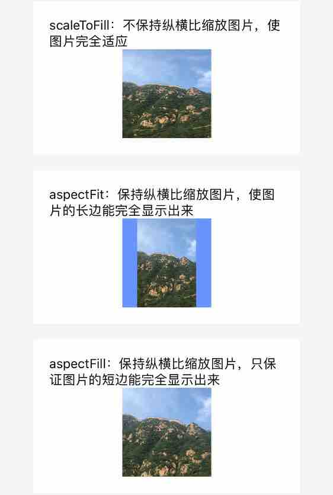
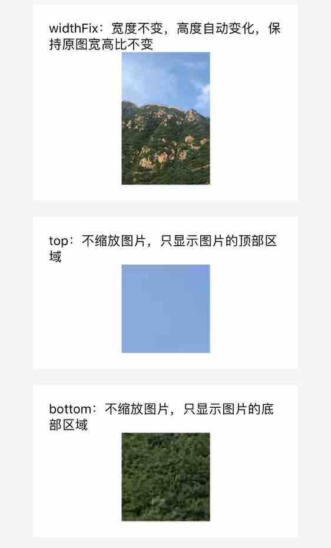
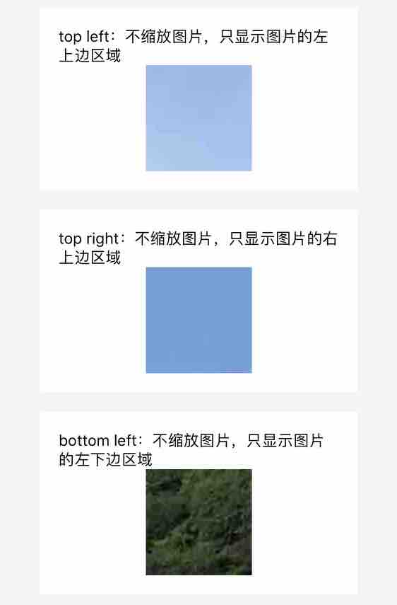
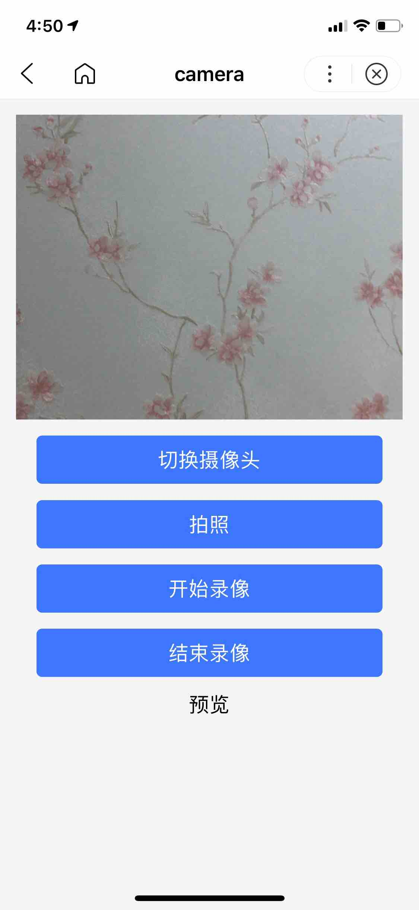
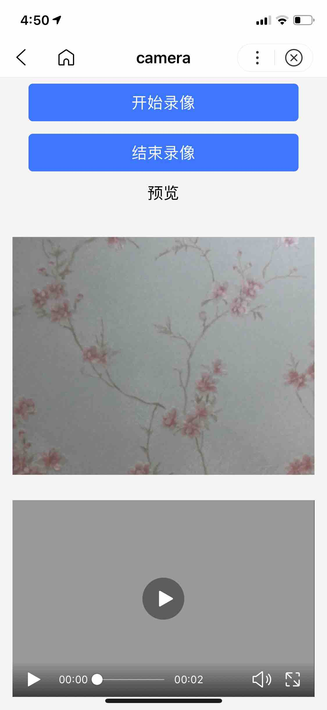
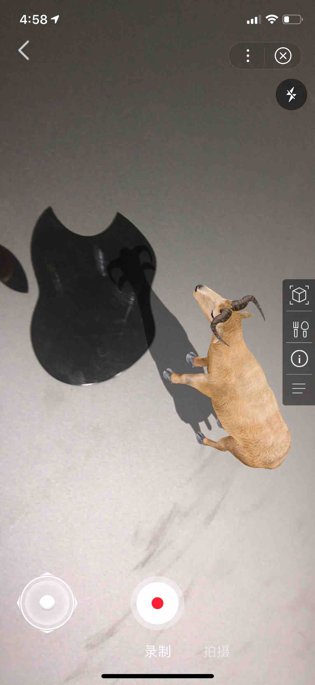
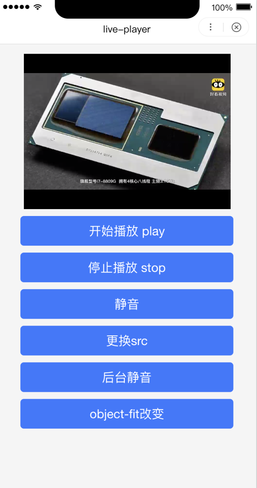

## image 图片

**解释**：图片，image 组件默认宽度 300px、高度 225px。

**百度APP中扫码体验：**


**属性说明**：

|属性名 |类型  |默认值  | 必填 |说明|
|---- | ---- | ---- |---- |---- |
| src | String  |  | 否 |图片资源地址|
| mode | String  | scaleToFill | 否 |图片裁剪、缩放的模式|
|lazy-load | Boolean  |false | 否 |图片懒加载，在图片即将进入一定范围（距离当前屏50px）时才开始进行加载。只针对 scroll-view 下的 image 有效 |
| binderror |HandleEvent | | 否 |当错误发生时，发布到 AppService 的事件名，事件对象 event.detail = {errMsg: 'something wrong'}|
| bindload | HandleEvent  | | 否 |当图片载入完毕时，发布到 AppService 的事件名，事件对象 event.detail = {height:'图片高度px', width:'图片宽度px'}|


**mode 有效值**： 有 13 种模式，其中 4 种是缩放模式，9 种是裁剪模式。

|模式 |值  |说明|
|--- | ---- |---- |
| 缩放 | scaleToFill  |不保持纵横比缩放图片，使图片的宽高完全拉伸至填满 image 元素|
| 缩放 |aspectFit  |保持纵横比缩放图片，使图片的长边能完全显示出来。也就是说，可以完整地将图片显示出来。|
| 缩放 | aspectFill  |保持纵横比缩放图片，只保证图片的短边能完全显示出来。也就是说，图片通常只在水平或垂直方向是完整的，另一个方向将会发生截取。|
| 缩放 | widthFix |宽度不变，高度自动变化，保持原图宽高比不变|
| 裁剪 | top |不缩放图片，只显示图片的顶部区域|
| 裁剪 | bottom |不缩放图片，只显示图片的底部区域|
| 裁剪 | center |不缩放图片，只显示图片的中间区域|
| 裁剪 | left |不缩放图片，只显示图片的左边区域|
| 裁剪 | right |不缩放图片，只显示图片的右边区域|
| 裁剪 | top left |不缩放图片，只显示图片的左上区域|
| 裁剪 | top right |不缩放图片，只显示图片的右上区域|
| 裁剪 | bottom left |不缩放图片，只显示图片的左下区域|
| 裁剪 | bottom right |不缩放图片，只显示图片的右下区域|

**Bug & Tip**：

* 支持设置 CSS background-position 属性，但是不推荐使用，会影响对应 mode 类型的展示。
* image 组件默认宽度 300px、高度 225px。

**示例**：
  <a href="swanide://fragment/a65834765b18e32b8bbf4473c526c4141565503512941" title="在开发者工具中预览效果" target="_self">在开发者工具中预览效果</a>

* 在 swan 文件中

```xml
<view class="container">
  <view class="page-section" s-for="{{array}}">
    <view class="page-section-title">{{item.text}}</view>
    <view class="page-section-demo">
      <image class="image"
        data-name="{{item.mode}}"
        bindtap="onTap"
        mode="{{item.mode}}" src="{{src}}" binderror="imageError" bindload="imageLoad" />
    </view>
  </view>
</view>
```
* 在 js 文件中

```js
Page({
    data: {
      array: [{
        mode: 'scaleToFill',
        text: 'scaleToFill：不保持纵横比缩放图片，使图片完全适应',
      }, {
        mode: 'aspectFit',
        text: 'aspectFit：保持纵横比缩放图片，使图片的长边能完全显示出来',
      }, {
        mode: 'aspectFill',
        text: 'aspectFill：保持纵横比缩放图片，只保证图片的短边能完全显示出来',
      }, {
        mode: 'widthFix',
        text: 'widthFix：宽度不变，高度自动变化，保持原图宽高比不变',
      }, {
        mode: 'top',
        text: 'top：不缩放图片，只显示图片的顶部区域',
      }, {
        mode: 'bottom',
        text: 'bottom：不缩放图片，只显示图片的底部区域',
      }, {
        mode: 'center',
        text: 'center：不缩放图片，只显示图片的中间区域',
      }, {
        mode: 'left',
        text: 'left：不缩放图片，只显示图片的左边区域',
      }, {
        mode: 'right',
        text: 'right：不缩放图片，只显示图片的右边边区域',
      }, {
        mode: 'top left',
        text: 'top left：不缩放图片，只显示图片的左上边区域',
      }, {
        mode: 'top right',
        text: 'top right：不缩放图片，只显示图片的右上边区域',
      }, {
        mode: 'bottom left',
        text: 'bottom left：不缩放图片，只显示图片的左下边区域',
      }, {
        mode: 'bottom right',
        text: 'bottom right：不缩放图片，只显示图片的右下边区域',
      }],
      src: 'https://b.bdstatic.com/miniapp/image.png',
    },
    imageError(e) {
      console.log('image 发生 error 事件，携带值为', e.detail.errMsg);
    },
    onTap(e) {
      console.log('image 发生 tap 事件', e);
    },
    imageLoad(e) {
      console.log('image 加载成功', e);
    },
  });

```
**图示**

<div class="m-doc-custom-examples">
    <div class="m-doc-custom-examples-correct">
        
    </div>
    <div class="m-doc-custom-examples-correct">
        
    </div>
    <div class="m-doc-custom-examples-correct">
        
    </div>  
    <div class="m-doc-custom-examples-correct">
        
    </div>     
</div>


## audio 音频

**解释**：音频

**百度APP中扫码体验：**


**属性说明**：


|属性名 |类型  |默认值  | 必填 |说明|
|---- | ---- | ---- |---- |---- |
|id|String||否|audio 组件的唯一标识符|
|src|String||否|要播放音频的资源地址|
|loop|Boolean|false|否|是否循环播放|
|controls|Boolean|false|否|是否显示默认控件|
|poster|String||否|默认控件上的音频封面的图片资源地址，如果 controls 属性值为 false 则设置 poster 无效|
|name|String|未知音频|否|默认控件上的音频名字，如果 controls 属性值为 false 则设置 name 无效|
|author|String|未知作者|否|默认控件上的作者名字，如果 controls 属性值为 false 则设置 author 无效|
|binderror|EventHandle||否|当发生错误时触发 error 事件，detail = {errMsg: MediaError.code}|
|bindplay|EventHandle||否|当开始/继续播放时触发play事件，detail = {duration}|
|bindpause|EventHandle||否|当暂停播放时触发 pause 事件，detail = {duration}|
|bindtimeupdate|EventHandle||否| 当播放进度改变时触发 timeupdate 事件，detail = {currentTime, duration}|
|bindended|EventHandle||否|当播放到末尾时触发 ended 事件，detail = {duration}|


**MediaError.code**

|返回错误码|描述|
|---- |---- |
|1|获取资源过程被用户终止|
|2|网络错误|
|3|当解码时发生错误|
|4|不支持音频|

**示例**：

<a href="swanide://fragment/cef8f1aa7935d28b4621c35df1f6e2c61565503498770" title="在开发者工具中预览效果" target="_self">在开发者工具中预览效果</a>

* 在 swan 文件中

```html
<audio poster="{{poster}}" 
       name="{{name}}" 
       loop="false" 
       author="{{author}}" 
       src="{{src}}" 
       id="myAudio" 
       controls 
       bind:error="error" 
       bind:play="audioPlay" 
       bind:pause="audioPause" 
       bind:timeupdate="timeupdate" 
       bind:ended="audioEnded">
</audio>
```

* 在 js 文件中

```javascript
Page({
    data: {
        poster: 'http://c.hiphotos.baidu.com/super/pic/item/8b13632762d0f703e34c0f6304fa513d2797c597.jpg',
        name: '演员',
        author: '薛之谦',
        src: 'http://vd3.bdstatic.com/mda-ic7mxzt5cvz6f4y5/mda-ic7mxzt5cvz6f4y5.mp3'
    },
    error: function (e) {
        console.log('audio error:', e);
        swan.showToast({
            title: '加载音频资源出错',
            duration: 1000
        });
    },
    audioPlay: function (e) {
        console.log('audio play');
        swan.showToast({
            title: '音频开始播放',
            duration: 1000
        });
    },
    audioPause: function (e) {
        console.log('audio pause');
        swan.showToast({
            title: '音频暂停',
            duration: 1000
        });
    },
    audioEnded: function () {
        console.log('audio ended');
        swan.showToast({
            title: '音频播放完',
            duration: 1000
        });
    },
    timeupdate: function () {
        console.log('audio update');
    }
});
```


## video 视频


**解释**：视频，客户端创建的[原生组件](https://smartprogram.baidu.com/docs/develop/component/native/)，不支持嵌套在其它组件中使用。

**百度APP中扫码体验：**


**属性说明**：

|属性名 |类型  |默认值  | 必填 |说明|
|---- | ---- | ---- |---- |---- |
|src|String|  | 是 |视频的资源地址|
|initial-time|Number|  | 否 |指定视频初始播放位置|
|duration|Number|  | 否 |指定视频时长|
|controls|Boolean|true|否|是否显示默认播放控件（播放/暂停按钮、播放进度、时间）|
|autoplay|Boolean|false|否|是否自动播放|
|loop|Boolean|false|否|是否循环播放|
|muted|Boolean|false|否|是否静音播放|
|objectFit|String|contain|否|当视频大小与 video 容器大小不一致时，视频的表现形式。contain ：包含，fill ：填充，cover ：覆盖|
|poster|String|  |否|视频封面的图片网络资源地址|
|page-gesture|	Boolean|	false|否|	在非全屏模式下，是否开启使用手势调节亮度与音量。|
|direction|Number|	|否|按设置的视频全屏方向进入全屏。不指定视频全屏方向时则根据设备方向判断全屏方向。0：正常竖向，90：屏幕顺时针90度，-90：屏幕逆时针90度 <font color="#4183c4">百度 APP 11.12 以上</font>|
|show-progress|	Boolean|	true|否|	若不设置，宽度大于240时才会显示。|
|show-fullscreen-btn|	Boolean|	true|否|	是否显示全屏按钮|
|enable-progress-gesture|	Boolean	|true|否|	是否开启使用手势控制进度|
|danmu-list|	` Array.<object> `|	 	|否|弹幕列表|
|danmu-btn|	Boolean|	false|否|	是否显示弹幕按钮，只在初始化时有效，不能动态变更。|
|enable-danmu	|Boolean	|false	|否|是否展示弹幕，只在初始化时有效，不能动态变更。|
|show-play-btn|	Boolean	|true|否|	是否显示视频底部控制栏的播放按钮|
|show-center-play-btn|	Boolean	|true	|否|是否显示视频中间的播放按钮|
|show-no-wifi-tip|Boolean|true|否|非wifi环境下是否显示继续播放浮层 <font color="#4183c4">基础库 3.100.4 以上</font>|
|bindplay|EventHandle| |否|当开始播放时触发 play 事件|
|bindpause|EventHandle|  |否|当暂停播放时触发 pause 事件|
|bindended|EventHandle|  |否|当播放到末尾时触发 ended 事件|
|bindtimeupdate|EventHandle|  |否|播放进度变化时触发，event.detail = {currentTime, duration} 。|
|bindfullscreenchange|EventHandle|  |否|当视频进入和退出全屏是触发，event.detail = {fullscreen, direction}，direction 取为 vertical 或 horizontal|
|bindwaiting|	EventHandle| |否|		视频出现缓冲时触发|
|binderror|	EventHandle	| | 否 |视频播放出错时触发|

**objectFit 有效值**:

| 值 | 说明 |
| ---- | ---- |
| contain | 包含 |
| fill | 填充 |
| cover | 覆盖 |

**direction 有效值**:

| 值 | 说明 |
| ---- | ---- |
| 0 | 正常竖向 |
| 90 | 屏幕顺时针90度 |
| -90 | 屏幕逆时针90度 |

**主流格式支持**：

|格式|	Android|	IOS|
|--|--|--|
|mp4|	是	|是|
|mov|	是	|是|
|m4v|	是	|是|
|3gp|	是	|是|
|avi|	是	|是|
|m3u8|	是	|是|
|webm|	是|	否|
|flv	|	是	|是|
|mkv|	是	|是|
|rmvb|是	|是|
|rm|	是	|是|
|ogg|	是	|是|

**主流编码格式支持**：

|格式|	Android|	IOS|
|--|--|--|
|H.263	|是|	是|
|H.264	|是|是|
|HEVC	|是|	是|
|MPEG-4	|是|	否|
|VP8|	是	|否|
|VP9|	是	|否|

**示例**：
<a href="swanide://fragment/b4de2816258292dec183838859e8c57f1566389828332" title="在开发者工具中预览效果" target="_self">在开发者工具中预览效果</a>

* 在 swan 文件中

```xml
<view class="wrap">
    <view class="video-wrap">
        <video style="width: 100%;"
               id="myVideo"
               src="{{src}}"
               initial-time="0"
               controls='true'
               autoplay="{{autoplay}}"
               loop="false"
               muted="false"
               objectFit="fill"
               poster="{{posterSrc}}"
               page-gesture='true'
               direction='{{0}}'
               show-progress="true"
               show-fullscreen-btn="true"
               enable-progress-gesture="true"
               show-no-wifi-tip="true"
               danmu-list="{{danmuList}}"
               danmu-btn="true"
               enable-danmu="true"
               show-play-btn="true"
               show-center-play-btn="true"
               bindplay="play"
               bindpause="pause"
               bindended="ended" 
               bindfullscreenchange="fullscreen" 
               bindwaiting="waiting"
               binderror="error"
               >
        </video>
    </view>
    <form bindreset="cleanInput">
        <view class="swan-cells">
            <view class="swan-cell swan-cell_input">
            <view class="swan-cell__hd">
                <view class="swan-label">弹幕内容</view>
            </view>
            <view class="swan-cell__bd">
                <input bindinput="bindInput" class="swan-input" type="text" placeholder="在此处输入弹幕内容" />
            </view>
            </view>
        </view>
        <view class="btn-area">
            <button class="page-body-button" type="primary" formType="reset">发送弹幕</button>
            <button class="btn" bindtap="next" type="primary">切换视频地址</button>
        </view>
    </form>
</view>
```

* 在 js 文件中

```javascript
Page({
    data: {
        current: 0,
        srcList: ['https://b.bdstatic.com/swan-temp/940fe716b0eaad38f47b209d61657490.mp4', 'https://vd3.bdstatic.com/mda-ib0u8x1bvaf00qa8/mda-ib0u8x1bvaf00qa8.mp4?playlist=%5B%22hd%22%2C%22sc%22%5D'],
        src: 'https://b.bdstatic.com/swan-temp/940fe716b0eaad38f47b209d61657490.mp4',
        loop: false,
        autoplay: false,
        posterSrc: "",
        danmuList:[{
            text: '第 1s 出现的弹幕',
            color: '#ff0000',
            time: 1
            }, {
            text: '第 3s 出现的弹幕',
            color: '#ff00ff',
            time: 3
        }],
        sendInfo: '',
        userMessage: ''
    },
    onReady() {
        this.videoContext = swan.createVideoContext('myVideo')
    },
    play: function (e) {
        console.log('play!');
    },
    pause: function (e) {
        console.log('pause');
    },
    fullscreen: function (e) {
        console.log('fullscreenchange!! 参数是' + JSON.stringify(e));
    },
    ended: function (e) {
        console.log('ended');
        this.next();
    },
    next: function (e) {
        let list = this.getData('srcList');
        let current = (this.getData('current') + 1) % list.length;
        this.setData('src', list[current]);
        this.setData('current', current);
    },
    waiting: function (e) {
        console.log('waiting');
    },
    error: function (e) {
        console.log('error');
    },
    setloop: function (e) {
        this.setData('loop', !this.getData('loop'));
    },
    setautoplay: function (e) {
        let autoplay = this.getData('autoplay');
        this.setData('autoplay', !autoplay);
    },
    bindInput(e) {
        this.setData({
            userMessage: e.detail.value
        })
    },
    cleanInput() {
        this.videoContext.sendDanmu({
            text: this.getData('userMessage')
        })
    },
    
});
```


**Bug & Tip**：
* 相关API：[createVideoContex](https://smartprogram.baidu.com/docs/develop/api/media_arcameracontext/#swan-createARCameraContext/)
* `<video />` 默认宽度 300px、高度 225px。

## camera 相机

**解释**：系统相机


**百度APP中扫码体验：**


**属性说明**：

|属性名 |类型  |默认值  | 必填 |说明|
|---- | ---- | ---- |---- |---- |
|device-position| String | back | 否 | 前置或后置，值为front, back |
|flash|String| auto | 否 |闪光灯，值为auto, on, off|
|bindstop|EventHandle|  | 否 |摄像头在非正常终止时触发，如退出后台等情况|
|binderror|EventHandle| | 否 |用户不允许使用摄像头时触发|

**device-position 有效值**:

| 值 | 说明 |
| ---- | ---- |
| front | 前置摄像头 |
| back | 后置摄像头 |

**flash 有效值**:

| 值 | 说明 |
| ---- | ---- |
| auto | 自动闪光灯 |
| on | 闪光灯开 |
| off | 闪光灯关 |

**示例**：

<a href="swanide://fragment/e57c71266aac86d6a0f6253f3c0f8de41565512985352" title="在开发者工具中预览效果" target="_self">在开发者工具中预览效果</a>

* 在 swan 文件中

```xml
<div class="camera">
    <camera device-position="{{device}}" 
            flash="off" 
            bindstop="stop"
            binderror="error" 
            style="width: 100%; height: 3rem;">
    </camera>
    <button type="primary" bind:tap="switchCamera">切换摄像头</button>
    <button type="primary" bind:tap="takePhoto">拍照</button>
    <button type="primary" bind:tap="startRecord">开始录像</button>
    <button type="primary" bind:tap="stopRecord">结束录像</button>
    <view class="preview">预览</view>
    <image s-if="src" class="img" mode="widthFix" src="{{src}}"></image>
    <video s-if="videoSrc" class="video" src="{{videoSrc}}"></video>
</div>

```

* 在 js 文件中

```javascript
Page({
    data: {
        src: '',
        device: 'back',
        videoSrc: ''
    },
    onShow() {
         console.log("目前此组件的录像功能在安卓端不能播放，请在开发者工具中查看完整效果");
    },
    switchCamera() {
        const devices = this.getData('device');
        if (devices === 'back') {
            this.setData({
                device: 'front'
            });
        } else {
            this.setData({
                device: 'back'
            });
        }
    },
    takePhoto() {
        const ctx = swan.createCameraContext();
        ctx.takePhoto({
            quality: 'high',
            success: res => {
                this.setData({
                    src: res.tempImagePath
                });
            }
        });
    },
    startRecord() {
        const ctx = swan.createCameraContext();
        ctx.startRecord({
            success: res => {
                swan.showToast({
                    title: 'startRecord'
                });
            }
        });
    },
    stopRecord() {
        const ctx = swan.createCameraContext();
        ctx.stopRecord({
            success: res => {
                swan.showModal({
                    title: '提示',
                    content: res.tempVideoPath
                });
                this.setData({
                    videoSrc: res.tempVideoPath
                });
            }
        });
    },
    error(e) {
        console.log(e.detail);
    }
});
```
**图示**

<div class="m-doc-custom-examples">
    <div class="m-doc-custom-examples-correct">
        
    </div>
    <div class="m-doc-custom-examples-correct">
        
    </div>
    <div class="m-doc-custom-examples-correct">
        
    </div>
</div>


**Bug & Tip**：
* camera 组件是由客户端创建的原生组件，它的层级是最高的，不能通过 z-index 控制层级。可使用 cover-view cover-image 覆盖在上面(在基础库3.0.0之前需要先创建camera，再通过的方式方 `s-if="{ {true} }"`可在camera上创建NA组件）。
* 同一页面只能插入一个 camera 组件。
* 请勿在 scroll-view、swiper、picker-view、movable-view 中使用 camera 组件。
* 相关API：<a href='https://smartprogram.baidu.com/docs/develop/api/media_cameracontext/#createCameraContext/'>createCameraContext</a>。

## ar-camera AR相机

> 基础库 3.15.104 开始支持，低版本需做兼容处理。**ar-camera 组件目前只针对百度 APP 开放使用。**

**解释**：AR相机，在DuMixAR内容开放平台（ http://dumix.baidu.com/content#/ ）提交并上线AR项目后（选择“百度App-相机”渠道）获取到AR Key、AR Type，可配置展现。

**百度APP中扫码体验：**


**属性说明**：

|属性名 |类型  |默认值  | 必填 |说明|
|---- | ---- | ---- |---- |---- |
|key| String |   | 是 |AR项目唯一标识，在DuMixAR内容开放平台上传生成AR项目后获取AR Key|
|type| String |   | 是 |AR相机类型，在DuMixAR内容开放平台上传生成AR项目后获取AR Type：<br>2D 跟踪类型：0；<br>SLAM 类型：5；<br>IMU 类型：8。|
|flash|String| off | 否 |闪光灯，值为auto, on, off|
|binderror|EventHandle| | 否 |用户不允许使用摄像头或扫码失败时触发|
|bindload|EventHandle| | 否 |AR加载成功时触发|
|bindmessage|EventHandle| | 否 |开发者制作AR项目时可自定义按键，用户点击时会收到事件和数据|
|bindscancode|EventHandle| | 否 | 扫描识图结束后触发 |

**type 有效值**:

| 值 | 说明 |
| ---- | ---- |
| 0 | 2D 跟踪类型 |
| 5 | SLAM 类型 |
| 8 | IMU 类型 |

**flash 有效值**:

| 值 | 说明 |
| ---- | ---- |
| auto | 自动闪光灯 |
| on | 闪光灯开 |
| off | 闪光灯关 |

**Bug & Tip**：

* ar-camera 组件是由客户端创建的原生组件，它的层级是最高的，不能通过 z-index 控制层级。可使用 cover-view cover-image 覆盖在上面。
* 同一页面只能插入一个 ar-camera 组件。可在新页面中放置ar-camera组件，并使用 <a href='https://smartprogram.baidu.com/docs/develop/api/show_tab/#navigateTo/'>swan.navigate</a>  API（注意应防止用户多次连续点击，否则会导致AR页面多次打开出现卡顿）跳转至该页面。
* 请勿在 scroll-view、swiper、picker-view、movable-view 中使用 ar-camera 组件。
* 相关API：<a href='https://smartprogram.baidu.com/docs/develop/api/media_arcameracontext/#createARCameraContext/'>createARCameraContext</a>。


**示例**：

<a href="swanide://fragment/88816aa54768ab457f54bb55804c6f301565512329940" title="在开发者工具中预览效果" target="_self">在开发者工具中预览效果</a>

* 在 swan 文件中

```html
<ar-camera ar-key="10298931" ar-type="5" flash="{{flashState}}" class="camera" bindload="loadCameraSuccess" bindmessage="message" binderror="error">
</ar-camera>
```
> 其它代码过长，建议直接<a href="swanide://fragment/88816aa54768ab457f54bb55804c6f301565512329940" title="在开发者工具中预览效果" target="_self">在开发者工具中预览效果</a>。

**图示**

<div class="m-doc-custom-examples">
    <div class="m-doc-custom-examples-correct">
        
    </div>
    <div class="m-doc-custom-examples-correct">
        
    </div>
    <div class="m-doc-custom-examples-correct">
        
    </div>
</div>

## live-player 实时视频播放器

**解释**：实时视频播放器，客户端创建的[原生组件](https://smartprogram.baidu.com/docs/develop/component/native/)，使用时请注意相关限制。只针对直播答题、直播服务类目开放。需要先通过类目审核，再在小程序管理后台，“设置”-“接口设置”中自助开通该组件权限。


|一级类目|二级类目|
|--|--|
|娱乐|直播、直播答题|

**百度APP中扫码体验：**


**属性说明**：

|属性名 |类型  |默认值  | 必填 |说明|
|---- | ---- | ---- |---- |---- |
|id|String| | 是 |live-player 属性的唯一标志符|
|src|String|  | 是 |音视频地址。目前仅支持 m3u8 格式|
|autoplay|Boolean|false| 否 |自动播放|
|muted|Boolean|false| 否 |是否静音|
|orientation|	String|	vertical| 否 |画面方向，可选值有 vertical，horizontal，目前仅支持安卓端使用该属性。|
|object-fit|String|contain| 否 |填充模式，可选值:contain、fillCrop|
|background-mute|Boolean|false| 否 |进入后台时是否静音|
|min-cache|Number|1| 否 |最小缓冲区，单位s|
|max-cache|Number|3| 否 |最大缓冲区，单位s|
|bindstatechange|EventHandle|  | 否 |播放状态变化事件，参考下方状态码表格，detail = {code}|
|bindnetstatus|EventHandle|  | 否 |网络状态变化通知，参考下方网络状态数据表格，detail = {info}|
|bindfullscreenchange|	EventHandle	| |	否 |全屏变化事件，detail = {direction, fullScreen}。|

**orientation 有效值**:

| 值 | 说明 |
| ---- | ---- |
| vertical | 垂直方向 |
| horizontal | 水平方向 |

**object-fit 有效值**:

| 值 | 说明 |
| ---- | ---- |
| contain | 包含 |
| fillCrop | 填充 |

**主流格式支持**：

|格式|	Android|	IOS|
|--|--|--|
|mp4|	是	|是|
|mov|	是	|是|
|m4v|	是	|是|
|3gp|	是	|是|
|avi|	是	|是|
|m3u8|	是	|是|
|webm|	是|	否|
|flv	|	是	|是|
|mkv|	是	|是|
|rmvb|是	|是|
|rm|	是	|是|
|ogg|	是	|是|

**主流编码格式支持**：

|格式|	Android|	IOS|
|--|--|--|
|H.263	|是|	是|
|H.264	|是|是|
|HEVC	|是|	是|
|MPEG-4	|是|	否|
|VP8|	是	|否|
|VP9|	是	|否|

**状态码**：

|代码  |说明   |
| --- | --- |
|2001|已经连接服务器|
|2002|已经连接服务器,开始拉流|
|2003|网络接收到首个视频数据包(IDR)|
|2004|视频播放开始|
|2005|视频播放进度|
|2006|视频播放结束|
|2007|视频播放Loading|
|2008|解码器启动|
|2009|视频分辨率改变|
|-2301|网络断连，且经多次重连抢救无效，更多重试请自行重启播放|
|-2302|获取加速拉流地址失败|
|2101|当前视频帧解码失败|
|2102|当前音频帧解码失败|
|2103|网络断连, 已启动自动重连|
|2104|网络来包不稳：可能是下行带宽不足，或由于主播端出流不均匀|
|2105|当前视频播放出现卡顿|
|2106|硬解启动失败，采用软解|
|2107|当前视频帧不连续，可能丢帧|
|2108|当前流硬解第一个I帧失败，SDK自动切软解|
|3001|RTMP -DNS解析失败|
|3002|RTMP服务器连接失败|
|3003|RTMP服务器握手失败|
|3005|RTMP 读/写失败|


**网络状态数据**：

|键名  | 说明 |
| --- | --- |
|videoBitrate|当前视频编/码器输出的比特率，单位 kbps|
|audioBitrate|当前音频编/码器输出的比特率，单位 kbps|
|videoFPS|当前视频帧率|
|videoGOP|当前视频 GOP,也就是每两个关键帧(I帧)间隔时长，单位 s (安卓不支持该键名)|
|netSpeed|当前的发送/接收速度|
|netStatus|网络状态：-1为未知;0为网络不可用;1为无线广域网连接;2为WiFi连接 。(安卓不支持该键名)|
|videoWidth|视频画面的宽度|
|videoHeight|视频画面的高度|

**示例**：

<a href="swanide://fragment/6edf51acedfd01e651364c04f64329651565503516666" title="在开发者工具中预览效果" target="_self">在开发者工具中预览效果</a>

* 在 swan 文件中

```xml
<view class="live-play">
    <live-player id="myLive" 
                 src="{{src}}" 
                 autoplay="{{autoplay}}"
                 muted="{{muted}}"
                 orientation="vertical"
                 object-fit="{{objectFit}}" 
                 background-mute="{{backgroundMute}}" 
                 min-cache="{{minCache}}" 
                 max-cache="{{maxCache}}"
                 bind:statechange="statechange" 
                 bind:netstatus="netstatus"
                 bindfullscreenchange>
    </live-player>
    <div class="section">
        <button type="primary" bind:tap="livePlay">开始播放 play</button>
        <button type="primary" bind:tap="liveStop">停止播放 stop</button>
        <button type="primary" bind:tap="liveMute">静音</button>
        <button type="primary" bind:tap="changeSrc">更换src</button>
        <button type="primary" bind:tap="backgroundMute">后台静音</button>
        <button type="primary" bind:tap="objectFit">object-fit改变</button>
    </div>
</view>
```
* 在 js 文件中
```js
Page({
    data: {
        cur: 0,
        autoplay: false,
        src: 'https://vd3.bdstatic.com/mda-ia8e6q3g23py8qdh/hd/mda-ia8e6q3g23py8qdh.mp4?playlist=%5B%22hd%22%5D&auth_key=1521549485-0-0-d5d042ba3555b2d23909d16a82916ebc&bcevod_channel=searchbox_feed&pd=share',
        srcList: [
            'https://vd3.bdstatic.com/mda-ia8e6q3g23py8qdh/hd/mda-ia8e6q3g23py8qdh.mp4?playlist=%5B%22hd%22%5D&auth_key=1521549485-0-0-d5d042ba3555b2d23909d16a82916ebc&bcevod_channel=searchbox_feed&pd=share',
            'https://vd3.bdstatic.com/mda-ib0u8x1bvaf00qa8/mda-ib0u8x1bvaf00qa8.mp4?playlist=%5B%22hd%22%2C%22sc%22%5D'
        ],
        objectFit: 'contain',
        orientation: 'vertical',
        minCache: 1,
        maxCache: 3,
        muted: false,
        backgroundMute: false
    },
    onReady(e) {
        this.ctx = swan.createLivePlayerContext('myLive');
    },
    statechange(e) {
        console.log('播放状态变化 statechange' + JSON.stringify(e))
    },
    netstatus(e) {
        console.log('网络状态变化 netstatus' + JSON.stringify(e))
    },
    livePlay(e) {
        this.ctx.play();
    },
    objectFit(e) {
        this.setData('objectFit', this.getData('objectFit') === 'contain' ? 'fillCrop' : 'contain');
    },
    liveStop(e) {
        this.ctx.stop();
    },
    liveMute(e) {
        this.setData({
            muted: true
        });
    },
    changeSrc(e) {
        let srcList = this.getData('srcList');
        let cur = (this.getData('cur') + 1) % srcList.length;
        this.setData('src', srcList[cur]);
        this.setData('cur', cur);
    },
    backgroundMute(e) {
        this.setData({
            'backgroundMute': true
        });
    },
});
```

**图示**

<div class="m-doc-custom-examples">
    <div class="m-doc-custom-examples-correct">
        
    </div>
    <div class="m-doc-custom-examples-correct">
        
    </div>
    <div class="m-doc-custom-examples-correct">
        
    </div>
</div>

**Bug & Tip**：
* live-player 默认宽度 300px、高度 225px；
* 从基础库版本1.12.0开始支持事件捕获、冒泡。
