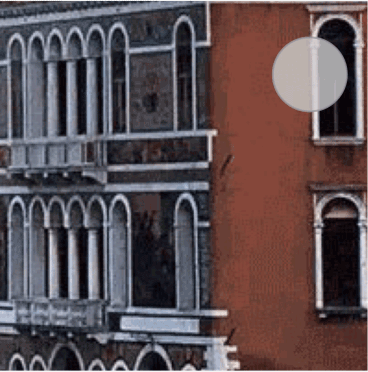

## audio
**解释：**音频

**属性说明：**


|属性名 |类型  |默认值  |说明|
|---- | ---- | ---- |---- |
|id|String||audio 组件的唯一标识符|
|src|String||要播放音频的资源地址|
|loop|Boolean|false|是否循环播放|
|controls|Boolean|false|是否显示默认控件|
|poster|String||默认控件上的音频封面的图片资源地址，如果 controls 属性值为 false 则设置 poster 无效|
|name|String|未知音频|默认控件上的音频名字，如果 controls 属性值为 false 则设置 name 无效|
|author|String|未知作者|默认控件上的作者名字，如果 controls 属性值为 false 则设置 author 无效|
|binderror|EventHandle||当发生错误时触发 error 事件，detail = {errMsg: MediaError.code}|
|bindplay|EventHandle||当开始/继续播放时触发play事件|
|bindpause|EventHandle||当暂停播放时触发 pause 事件|
|bindtimeupdate|EventHandle|| 当播放进度改变时触发 timeupdate 事件，detail = {currentTime, duration}|
|bindended|EventHandle||当播放到末尾时触发 ended 事件|


**MediaError.code**

|返回错误码|描述|
|---- |---- |
|1|获取资源过程被用户终止|
|2|当下载时发生错误|
|3|当解码时发生错误|
|4|不支持音频|

**示例：**
<a href="swanide://fragment/440dd61608484921b1cf26a99e6912ab1548068998649" title="在开发者工具中预览效果" target="_blank">在开发者工具中预览效果 </a>
```html
<audio poster="{{poster}}" name="{{name}}" author="{{author}}" src="{{src}}" id="myAudio" controls="true" bind:error="error" bind:play="audioPlay" bind:pause="audioPause" bind:timeupdate="timeupdate" bind:ended="audioEnded"></audio>
```

```javascript
Page({
    data: {
        poster: 'http://c.hiphotos.baidu.com/super/pic/item/8b13632762d0f703e34c0f6304fa513d2797c597.jpg',
        name: '演员',
        author: '薛之谦',
        src: 'http://vd3.bdstatic.com/mda-ic7mxzt5cvz6f4y5/mda-ic7mxzt5cvz6f4y5.mp3'
    },
    error: function (e) {
        console.log(e);
    },
    audioPlay: function (e) {
        console.log('audio play');
        swan.showToast({
            title: '音频开始播放',
            duration: 1000
        });
    },
    audioPause: function (e) {
        console.log('audio pause');
        swan.showToast({
            title: '音频暂停',
            duration: 1000
        });
    },
    audioEnded: function () {
        console.log('audio ended');
        swan.showToast({
            title: '音频播放完',
            duration: 1000
        });
    },
    timeupdate: function () {
        console.log('audio update');
    }
});
```
## image
**解释：**图片

**属性说明：**

|属性名 |类型  |默认值  |说明|
|---- | ---- | ---- |---- |
| src | String  |  |图片资源地址|
| mode | String  | scaleToFill |图片裁剪、缩放的模式|
|lazy-load | Boolean  |false |图片懒加载。只针对 scroll-view 下的 image 有效 |
| binderror |HandleEvent | |当错误发生时，发布到 AppService 的事件名，事件对象 event.detail = {errMsg: 'something wrong'}|
| bindload | HandleEvent  | |当图片载入完毕时，发布到 AppService 的事件名，事件对象 event.detail = {height:'图片高度px', width:'图片宽度px'}|

image 组件默认宽度 300px、高度 225px。

** mode 有效值：** 有 13 种模式，其中 4 种是缩放模式，9 种是裁剪模式。

|模式 |值  |说明|
|--- | ---- |---- |
|缩放 | scaleToFill  |不保持纵横比缩放图片，使图片的宽高完全拉伸至填满 image 元素|
|缩放 |aspectFit  |保持纵横比缩放图片，使图片的长边能完全显示出来。也就是说，可以完整地将图片显示出来。|
|缩放 | aspectFill  |保持纵横比缩放图片，只保证图片的短边能完全显示出来。也就是说，图片通常只在水平或垂直方向是完整的，另一个方向将会发生截取。|
|缩放 | widthFix |宽度不变，高度自动变化，保持原图宽高比不变|
| 裁剪 | top |不缩放图片，只显示图片的顶部区域|
| 裁剪 | bottom |不缩放图片，只显示图片的底部区域|
| 裁剪 | center |不缩放图片，只显示图片的中间区域|
| 裁剪 | left |不缩放图片，只显示图片的左边区域|
| 裁剪 | right |不缩放图片，只显示图片的右边区域|
| 裁剪 | top left |不缩放图片，只显示图片的左上区域|
| 裁剪 | top right |不缩放图片，只显示图片的右上区域|
| 裁剪 | bottom left |不缩放图片，只显示图片的左下区域|
| 裁剪 | bottom right |不缩放图片，只显示图片的右下区域|

**说明**:
支持设置 CSS background-position 属性，但是不推荐使用，会影响对应 mode 类型的展示。

**示例：**
  <a href="swanide://fragment/7a68224b93ea534f04994407a85387b91540360503" title="在开发者工具中预览效果" target="_blank">在开发者工具中预览效果</a>
```xml
<view class="wrap">
    <view>
        <text>image</text>
        <text>图片</text>
    </view>
    <view>
        <view s-for="item in test">
            <view>{{item.text}}</view>
            <view>
                <image style="width: 200px; height: 200px; background-color: #eeeeee;" mode="{{item.mode}}" src="{{src}}"></image>
            </view>
        </view>
    </view>
</view>

```
```xml
Page({
    data: {
        test: [
            {
                mode: 'scaleToFill',
                text: 'scaleToFill：不保持纵横比缩放图片，使图片完全适应'
            },
            {
                mode: 'aspectFit',
                text: 'aspectFit：保持纵横比缩放图片，使图片的长边能完全显示出来'
            },
            {
                mode: 'aspectFill',
                text: 'aspectFill：保持纵横比缩放图片，只保证图片的短边能完全显示出来'
            },
            {
                mode: 'top',
                text: 'top：不缩放图片，只显示图片的顶部区域'
            },
            {
                mode: 'bottom',
                text: 'bottom：不缩放图片，只显示图片的底部区域'
            },
            {
                mode: 'center',
                text: 'center：不缩放图片，只显示图片的中间区域'
            },
            {
                mode: 'left',
                text: 'left：不缩放图片，只显示图片的左边区域'
            },
            {
                mode: 'right',
                text: 'right：不缩放图片，只显示图片的右边边区域'
            },
            {
                mode: 'top left',
                text: 'top left：不缩放图片，只显示图片的左上边区域'
            },
            {
                mode: 'top right',
                text: 'top right：不缩放图片，只显示图片的右上边区域'
            },
            {
                mode: 'bottom left',
                text: 'bottom left：不缩放图片，只显示图片的左下边区域'
            },
            {
                mode: 'bottom right',
                text: 'bottom right：不缩放图片，只显示图片的右下边区域'
            }
        ],
        src: '../../images/image8.jpg'
    }
});

```
**原图**


**scaleToFill**
**不保持纵横比缩放图片，使图片完全适应**


**aspectFit**
**保持纵横比缩放图片，使图片的长边能完全显示出来**


**aspectFill**
**保持纵横比缩放图片，只保证图片的短边能完全显示出来**


**top**
**不缩放图片，只显示图片的顶部区域**


**bottom**
**不缩放图片，只显示图片的底部区域**


**center**
**不缩放图片，只显示图片的中间区域**


**left**
**不缩放图片，只显示图片的左边区域**


**right**
**不缩放图片，只显示图片的右边边区域**



**top left**
**不缩放图片，只显示图片的左上边区域**


**top right**
**不缩放图片，只显示图片的右上边区域**


**bottom left**
**不缩放图片，只显示图片的左下边区域**


**bottom right**
**不缩放图片，只显示图片的右下边区域**


## video
**解释：**视频

**属性说明：**

|属性名 |类型  |默认值  |说明|
|---- | ---- | ---- |---- |
|src|String|- |视频的资源地址|
|initial-time|Number|- |指定视频初始播放位置|
|duration|Number| -|指定视频时长|
|controls|Boolean|true|是否显示默认播放控件（播放/暂停按钮、播放进度、时间）|
|autoplay|Boolean|false|是否自动播放|
|loop|Boolean|false|是否循环播放|
|muted|Boolean|false|是否静音播放|
|objectFit|String|contain|当视频大小与 video 容器大小不一致时，视频的表现形式。contain ：包含，fill ：填充，cover ：覆盖|
|poster|String|- |视频封面的图片网络资源地址|
|page-gesture|	Boolean|	false|	在非全屏模式下，是否开启使用手势调节亮度与音量。|
|show-progress|	Boolean|	true|	若不设置，宽度大于240时才会显示。|
|show-fullscreen-btn|	Boolean|	true|	是否显示全屏按钮|
|enable-progress-gesture|	Boolean	|true|	是否开启使用手势控制进度|
|danmu-list|	` Array.<object> `|	-	|弹幕列表|
|danmu-btn|	Boolean|	false|	是否显示弹幕按钮，只在初始化时有效，不能动态变更。|
|enable-danmu	|Boolean	|false	|是否展示弹幕，只在初始化时有效，不能动态变更。|
|show-play-btn|	Boolean	|true|	是否显示视频底部控制栏的播放按钮|
|show-center-play-btn|	Boolean	|true	|是否显示视频中间的播放按钮|
|bindplay|EventHandle| -|当开始播放时触发 play 事件|
|bindpause|EventHandle|- |当暂停播放时触发 pause 事件|
|bindended|EventHandle|- |当播放到末尾时触发 ended 事件|
|bindtimeupdate|EventHandle| -|播放进度变化时触发，event.detail = {currentTime, duration} 。|
|bindfullscreenchange|EventHandle|- |当视频进入和退出全屏是触发，event.detail = {fullscreen, direction}，direction 取为 vertical 或 horizontal|
|bindwaiting|	EventHandle|-|		视频出现缓冲时触发|
|binderror|	EventHandle	|-|	视频播放出错时触发|

**主流格式支持**：

|格式|	Android|	IOS|
|--|--|--|
|mp4|	是	|是|
|mov|	是	|是|
|m4v|	是	|是|
|3gp|	是	|是|
|avi|	是	|是|
|m3u8|	是	|是|
|webm|	是|	否|
|flv	|	是	|是|
|mkv|	是	|是|
|rmvb|是	|是|
|rm|	是	|是|
|ogg|	是	|是|

**主流编码格式支持**：

|格式|	Android|	IOS|
|--|--|--|
|H.263	|是|	是|
|H.264	|是|是|
|HEVC	|是|	是|
|MPEG-4	|是|	否|
|VP8|	是	|否|
|VP9|	是	|否|

**Tip：**

`<video />` 默认宽度 300px、高度 225px


**示例：**
<a href="swanide://fragment/737ddbcaf3eb0f9915965a7a265baa2e1548067067236" title="在开发者工具中预览效果" target="_blank">在开发者工具中预览效果</a>


```xml
<view class="section">
    <video id="myde" src="{{src}}" controls bindplay="play" bindpause="pause" bindfullscreenchange="fullscreen" bindended="ended" autoplay="{{autoplay}}" muted="{{muted}}"></video>
</view>
<view class="btn-area">
    <button bindtap="next">切换视频地址</button>
</view>
<view class="btn-area">
    <button bindtap="setmuted">设置静音</button>
</view>
<view class="btn-area">
    <button bindtap="setautoplay">切换 autoplay </button>
</view>
```
<!-- <text></text> -->
```javascript
Page({
    data: {
        current: 0,
        srcList: ['https://vd3.bdstatic.com/mda-ia8e6q3g23py8qdh/hd/mda-ia8e6q3g23py8qdh.mp4?playlist=%5B%22hd%22%5D&auth_key=1521549485-0-0-d5d042ba3555b2d23909d16a82916ebc&bcevod_channel=searchbox_feed&pd=share', 'https://vd3.bdstatic.com/mda-ib0u8x1bvaf00qa8/mda-ib0u8x1bvaf00qa8.mp4?playlist=%5B%22hd%22%2C%22sc%22%5D'],
        src: 'https://vd3.bdstatic.com/mda-ia8e6q3g23py8qdh/hd/mda-ia8e6q3g23py8qdh.mp4?playlist=%5B%22hd%22%5D&auth_key=1521549485-0-0-d5d042ba3555b2d23909d16a82916ebc&bcevod_channel=searchbox_feed&pd=share',
        loop: false,
        muted: false,
        autoplay: false
    },
    play: function (e) {
        console.log('play!');
    },
    pause: function (e) {
        console.log('pause');
    },
    fullscreen: function (e) {
        console.log('fullscreenchange!! 参数是' + JSON.stringify(e));
    },
    ended: function (e) {
        console.log('ended');
        this.next();
    },
    next: function (e) {
        let list = this.getData('srcList');
        let current = (this.getData('current') + 1) % list.length;
        this.setData('src', list[current]);
        this.setData('current', current);
    },
    setloop: function (e) {
        this.setData('loop', !this.getData('loop'));
    },
    setmuted: function (e) {
        this.setData('muted', !this.getData('muted'));
    },
    setautoplay: function (e) {
        this.setData('autoplay', !this.getData('autoplay'));
    }
});
```
## camera
**解释：**相机

**属性说明：**

|属性名 |类型  |默认值  |说明|
|---- | ---- | ---- |---- |
|device-position| String | back | 前置或后置，值为front, back |
|flash|String| auto |闪光灯，值为auto, on, off|
|bindstop|EventHandle|-|摄像头在非正常终止时触发，如退出后台等情况|
|binderror|EventHandle|-|用户不允许使用摄像头时触发|


**示例：**
 
<a href="swanide://fragment/21b60b0d38bf33771697da5c7d5149cd1556528875741" title="在开发者工具中预览效果" target="_blank">在开发者工具中预览效果</a>

* 在 swan 文件中

```xml
<div class="camera">
    <camera device-position="{{device}}" flash="off" binderror="error" style="width: 100%; height: 500rpx;"></camera>
    <button type="primary" bind:tap="switchCamera">切换摄像头</button>
    <button type="primary" bind:tap="takePhoto">拍照</button>
    <button type="primary" bind:tap="startRecord">开始录像</button>
    <button type="primary" bind:tap="stopRecord">结束录像</button>
    <view class="preview">预览</view>
    <image s-if="src" class="img" mode="widthFix" src="{{src}}"></image>
    <video s-if="videoSrc" class="video" src="{{videoSrc}}"></video>
</div>
```

* 在 js 文件中

```javascript
Page({
    data: {
        src: '',
        device: 'back',
        videoSrc: ''
    },
    switchCamera() {
        const devices = this.getData('device');
        if (devices === 'back') {
            this.setData({
                device: 'front'
            });
        } else {
            this.setData({
                device: 'back'
            });
        }
    },
    takePhoto() {
        const ctx = swan.createCameraContext();
        ctx.takePhoto({
            quality: 'high',
            success: res => {
                this.setData({
                    src: res.tempImagePath
                });
            }
        });
    },
    startRecord() {
        const ctx = swan.createCameraContext();
        ctx.startRecord({
            success: res => {
                swan.showToast({
                    title: 'startRecord'
                });
            }
        });
    },
    stopRecord() {
        const ctx = swan.createCameraContext();
        ctx.stopRecord({
            success: res => {
                swan.showModal({
                    title: '提示',
                    content: res.tempVideoPath
                });
                this.setData({
                    videoSrc: res.tempVideoPath
                });
            }
        });
    },
    error(e) {
        console.log(e.detail);
    }
});
```

* 在 css 文件中

```css
.camera {
    width: 100%;
    padding: .16rem;
    font-size: .16rem;
}
.preview {
    width: 100%;
    height: 50px;
    line-height: 50px;
    text-align: center;
}
button {
    margin-top: .16rem;
}
.img,
video {
    width: 100%;
    margin-top: 50rpx;
}
```
**图示**

<div class="m-doc-custom-examples">
    <div class="m-doc-custom-examples-correct">
        
    </div>
    <div class="m-doc-custom-examples-correct">
        
    </div>
    <div class="m-doc-custom-examples-correct">
        
    </div>     
</div>


**说明**:
* camera 组件是由客户端创建的原生组件，它的层级是最高的，不能通过 z-index 控制层级。可使用 cover-view cover-image 覆盖在上面(在基础库3.0.0之前需要先创建camera，再通过的方式方 `s-if="{ {true} }"`可在camera上创建NA组件）。
* 同一页面只能插入一个 camera 组件。
* 请勿在 scroll-view、swiper、picker-view、movable-view 中使用 camera 组件。
* 相关API：<a href='https://smartprogram.baidu.com/docs/develop/api/media_cameracontext/#createCameraContext/'>createCameraContext</a>

## ar-camera

> 基础库 3.15.104 开始支持，低版本需做兼容处理。**ar-camera 组件目前只针对百度 APP 开放使用。**

**解释：**AR相机，在DuMixAR内容开放平台（ http://dumix.baidu.com/content#/ ）提交并上线AR项目后（选择“百度App-相机”渠道）获取到AR Key、AR Type，可配置展现。

**属性说明：**

|属性名 |类型  |默认值  |说明|
|---- | ---- | ---- |---- |
|key| String | - | AR项目唯一标识，在DuMixAR内容开放平台上传生成AR项目后获取AR Key|
|type| String | - | AR相机类型，在DuMixAR内容开放平台上传生成AR项目后获取AR Type：<br>2D 跟踪类型：0；<br>SLAM 类型：5；<br>IMU 类型：8。|
|flash|String| off |闪光灯，值为auto, on, off|
|binderror|EventHandle|-|用户不允许使用摄像头时触发|
|bindload|EventHandle|-|AR加载成功时触发|
|bindmessage|EventHandle|-|开发者制作AR项目时可自定义按键，用户点击时会收到事件和数据|

**说明**:

* ar-camera 组件是由客户端创建的原生组件，它的层级是最高的，不能通过 z-index 控制层级。可使用 cover-view cover-image 覆盖在上面。
* 同一页面只能插入一个 ar-camera 组件。可在新页面中放置ar-camera组件，并使用 <a href='https://smartprogram.baidu.com/docs/develop/api/show_tab/#navigateTo/'>swan.navigate</a>  API（注意应防止用户多次连续点击，否则会导致AR页面多次打开出现卡顿）跳转至该页面。
* 请勿在 scroll-view、swiper、picker-view、movable-view 中使用 ar-camera 组件。
* 相关API：<a href='https://smartapp.baidu.com/docs/develop/api/media_arcameracontext/#createARCameraContext/'>createARCameraContext</a>


**示例：**

<a href="swanide://fragment/c6b6e92b5ef4bc9276cfbc99fddf3dba1557733966512" title="在开发者工具中预览效果" target="_blank">在开发者工具中预览效果</a>

```html
<ar-camera ar-key="10298931" ar-type="5" flash="{{flashState}}" class="camera" bindload="loadCameraSuccess" bindmessage="message" binderror="error">
</ar-camera>
```
> 其它代码过长，建议直接<a href="swanide://fragment/c6b6e92b5ef4bc9276cfbc99fddf3dba1557733966512" title="在开发者工具中预览效果" target="_blank">在开发者工具中预览效果</a>。
<!-- 
```javascript
Page({
    takePhoto() {
        const ctx = swan.createARCameraContext();
        ctx.takePhoto({
            success: (res) => {
                this.setData({
                    src: res.tempImagePath
                })
            }
        });
    },
    error(e) {
        console.log(e.detail);
    },
    message(e) {
        console.log(e.detail);
    }
});
``` -->

## live-player

**解释：**实时视频播放

> 只针对直播答题、直播服务类目开放。需要先通过类目审核，再在小程序管理后台，“设置”-“接口设置”中自助开通该组件权限。

|一级类目|二级类目|
|--|--|
|娱乐|直播、直播答题|

**属性说明：**

|属性名 |类型  |默认值  |说明|
|---- | ---- | ---- |---- |
|id|String|-|live-player 属性的唯一标志符|
|src|String| -|音视频地址。目前仅支持 m3u8 格式|
|autoplay|Boolean|false|自动播放|
|muted|Boolean|false|是否静音|
|orientation|	String|	vertical|	画面方向，可选值有 vertical，horizontal，目前仅支持安卓端使用该属性。|
|object-fit|String|contain|填充模式，可选值:contain、fillCrop|
|background-mute|Boolean|false|进入后台时是否静音|
|min-cache|Number|1|最小缓冲区，单位s|
|max-cache|Number|3|最大缓冲区，单位s|
|bindstatechange|EventHandle|- |播放状态变化事件，detail = {code}|
|bindnetstatus|EventHandle| -|网络状态变化通知，detail = {info}|
|bindfullscreenchange|	EventHandle	|-|	全屏变化事件，detail = {direction, fullScreen}。|


**示例：**

<a href="swanide://fragment/c410637db3921439b6e438ee5448e0961557733794935" title="在开发者工具中预览效果" target="_blank">在开发者工具中预览效果</a> 

* 在 swan 文件中

```swan
<view class="live-play">
    <live-player id="myLive" src="{{src}}" autoplay="{{autoplay}}" object-fit="{{objectFit}}" background-mute="{{backgroundMute}}" muted="{{muted}}" min-cache="{{minCache}}" max-cache="{{maxCache}}" bind:statechange="statechange" bind:netstatus="netstatus"></live-player>
    <div class="section">
        <button type="primary" bind:tap="livePlay">开始播放 play</button>
        <button type="primary" bind:tap="liveStop">停止播放 stop</button>
        <button type="primary" bind:tap="liveMute">静音</button>
        <button type="primary" bind:tap="changeSrc">更换src</button>
        <button type="primary" bind:tap="backgroundMute">后台静音</button>
        <button type="primary" bind:tap="objectFit">object-fit改变</button>
    </div>
</view>
```
* 在 js 文件中
```js
Page({
    data: {
        cur: 0,
        autoplay: false,
        src: 'http://ivi.bupt.edu.cn/hls/cctv3hd.m3u8',
        srcList: [
            'http://ivi.bupt.edu.cn/hls/cctv3hd.m3u8',
            'http://ivi.bupt.edu.cn/hls/cctv1hd.m3u8'
        ],
        objectFit: 'contain',
        orientation: 'vertical',
        minCache: 1,
        maxCache: 3,
        muted: false,
        backgroundMute: false
    },
    onReady(e) {
        this.ctx = swan.createLivePlayerContext('myLive');
    },
    statechange(e) {
        swan.showToast({
            title: '播放状态变化 statechange' + JSON.stringify(e)
        });
    },
    netstatus(e) {
        swan.showToast({
            title: '网络状态变化 netstatus' + JSON.stringify(e)
        });
    },
    livePlay(e) {
        this.ctx.play();
    },
    objectFit(e) {
        this.setData('objectFit', this.getData('objectFit') === 'contain' ? 'fillCrop' : 'contain');
    },
    liveStop(e) {
        this.ctx.stop();
    },
    liveMute(e) {
        this.setData({
            muted: true
        });
    },
    changeSrc(e) {
        let srcList = this.getData('srcList');
        let cur = (this.getData('cur') + 1) % srcList.length;
        this.setData('src', srcList[cur]);
        this.setData('cur', cur);
    },
    backgroundMute(e) {
        this.setData({
            'backgroundMute': true
        });
    },
});
```
* 在 css 文件中
```css
.live-play {
    width: 100%;
    padding: .16rem;
}
button {
    margin-top: 20rpx;
}
```


**图示**


**说明**:
* live-player 默认宽度 300px、高度 225px；
* 从基础库版本1.12.0开始支持事件捕获、冒泡。

**主流格式支持**：

|格式|	Android|	IOS|
|--|--|--|
|mp4|	是	|是|
|mov|	是	|是|
|m4v|	是	|是|
|3gp|	是	|是|
|avi|	是	|是|
|m3u8|	是	|是|
|webm|	是|	否|
|flv	|	是	|是|
|mkv|	是	|是|
|rmvb|是	|是|
|rm|	是	|是|
|ogg|	是	|是|

**主流编码格式支持**：

|格式|	Android|	IOS|
|--|--|--|
|H.263	|是|	是|
|H.264	|是|是|
|HEVC	|是|	是|
|MPEG-4	|是|	否|
|VP8|	是	|否|
|VP9|	是	|否|

**状态码**

|代码  |说明   |
| --- | --- |
|2001|已经连接服务器|
|2002|已经连接服务器,开始拉流|
|2003|网络接收到首个视频数据包(IDR)|
|2004|视频播放开始|
|2005|视频播放进度|
|2006|视频播放结束|
|2007|视频播放Loading|
|2008|解码器启动|
|2009|视频分辨率改变|
|-2301|网络断连，且经多次重连抢救无效，更多重试请自行重启播放|
|-2302|获取加速拉流地址失败|
|2101|当前视频帧解码失败|
|2102|当前音频帧解码失败|
|2103|网络断连, 已启动自动重连|
|2104|网络来包不稳：可能是下行带宽不足，或由于主播端出流不均匀|
|2105|当前视频播放出现卡顿|
|2106|硬解启动失败，采用软解|
|2107|当前视频帧不连续，可能丢帧|
|2108|当前流硬解第一个I帧失败，SDK自动切软解|
|3001|RTMP -DNS解析失败|
|3002|RTMP服务器连接失败|
|3003|RTMP服务器握手失败|
|3005|RTMP 读/写失败|

**网络状态数据：**

|键名  | 说明 |
| --- | --- |
|videoBitrate|当前视频编/码器输出的比特率，单位 kbps|
|audioBitrate|当前音频编/码器输出的比特率，单位 kbps|
|videoFPS|当前视频帧率|
|videoGOP|当前视频 GOP,也就是每两个关键帧(I帧)间隔时长，单位 s (安卓不支持该键名)|
|netSpeed|当前的发送/接收速度|
|netStatus|网络状态：-1为未知;0为网络不可用;1为无线广域网连接;2为WiFi连接 。(安卓不支持该键名)|
|videoWidth|视频画面的宽度|
|videoHeight|视频画面的高度|