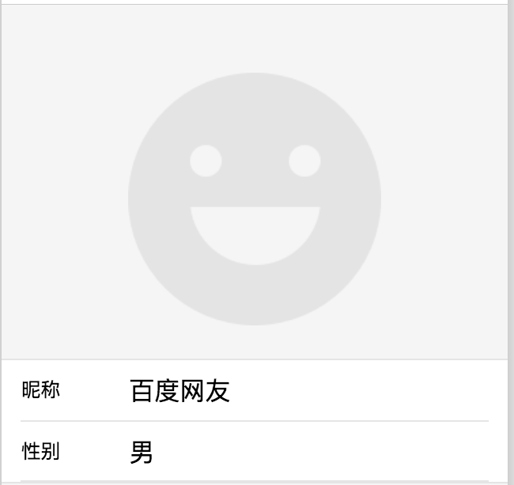

## open-data

**解释：**用于展示百度 App 开放的数据。

**属性说明：**


| 属性名 | 类型     | 默认值  | 必填 |说明              |
| --- | ------ | ---- | --------------- |---- |
| type | String | | 是 |开放数据类型 |

**type 有效值:**

| 值 | 说明 |
|--- |----- |
| userNickName | 用户昵称 |
| userAvatarUrl | 用户头像 |
| userGender | 用户性别 |

**示例**

<a href="swanide://fragment/7422d5f9b6c47e60886f90b55d13232a1556529501185" title="在开发者工具中预览效果" target="_self">在开发者工具中预览效果</a>

* 在 swan 文件中

```xml
<view class="open-data">
    <view class="avatar">
        <open-data class="avatar-img" type="userAvatarUrl"></open-data>
    </view>
    <view class="section">
        <view class="sec">
            <view class="sec_left">昵称</view>
            <view class="sec_right">
                <open-data class="sec_left" type="userNickName"></open-data>
            </view>
        </view>
        <view class="sec">
            <view class="sec_left">性别</view>
            <view class="sec_right">
                <open-data class="sec_left" type="userGender"></open-data>
            </view>
        </view>
    </view>
</view>
```

* 在 css 文件中

```css
.open-data {
    width: 100%;
    height: 100%;
    font-size: .16rem;
    padding-top: 100rpx;
}
.avatar {
    width: 100%;
    display: flex;
    justify-content: center;
}
.avatar .avatar-img {
    width: 50%;
    height: auto;
    border-radius: 50%;
}
.section {
    width: 100%;
    border-top: 1px solid #e5e5e5;
    border-bottom: 1px solid #e5e5e5;
    padding: 0 .16rem;
    margin-top: 50rpx;
    background: #fff;
}
.sec {
    width: 100%;
    height: .5rem;
    line-height: .5rem;
    display: flex;
    border-bottom: 1px solid #e5e5e5;
    display: flex;
}
.sec:nth-of-type(4) {
    border: none;
}
.sec .sec_left {
    flex-basis: 160rpx;
}
.sec .sec_right {
    flex: 1;
```

**图示**：

<div class="m-doc-custom-examples">
    <div class="m-doc-custom-examples-correct">
        
    </div>
    <div class="m-doc-custom-examples-correct">
        
    </div>
    <div class="m-doc-custom-examples-correct">
        
    </div>
</div>


## web-view

**解释**：web-view 组件是一个可以用来承载网页的容器，会自动铺满整个智能小程序页面。


**属性说明:**

| 属性名 | 类型     | 默认值  |必填| 说明 | 最低版本              |
| --- | ------ | ---- | ---- |---- |---- |
| src | String |  | 是 |webview 指向网页的链接 |-|
|bindmessage|EventHandler| | 否 |网页向小程序 postMessage 时，会在特定时机（小程序后退、组件销毁、分享）触发并收到消息。e.detail = { data }|1.12.0|


**示例**：
<a href="swanide://fragment/ac090bcb0bfd8aca1b9d47c7c854c6271560838933592" title="在开发者工具中预览效果" target="_self">在开发者工具中预览效果</a>

* 在 swan 文件中：

```xml
<view>
    <web-view s-if="src" src="{{src}}"></web-view>
    <view class="tip">web-view是承载网页的容器</view>
    <button type="primary" class="btn" bindtap="openWebViewInNewPage">新页面打开web-view</button>
    <button type="primary" class="btn" bindtap="openWebViewCurrent">当前页打开web-view</button>
</view>
```
* 在 js 文件中：

```js
const webviewUrl = 'https://smartprogram.baidu.com';
Page({
    data: {
        src: ''
    },
    onLoad(options) {
        if (options.webview) {
            this.setData('src', webviewUrl);
        }
    },
    openWebViewCurrent() {
        this.setData('src', webviewUrl);
    },
    openWebViewInNewPage() {
        swan.navigateTo({
            url: '/pages/webview/webview?webview=1'
        });
    }
});
```
* 在 css 文件中：

```css
.tip {
    text-align: center;
    padding: .3rem 0 .35rem 0;
    font-size: .15rem;
    color: #333;
}

.btn {
    line-height: .44rem;
    font-size: .18rem;
    margin: 0 .23rem .15rem .23rem;
}
```

### **相关接口1 **

web-view 网页中可使用 JSSDK 提供的接口返回智能小程序页面。 支持的接口有：

> 旧版本 swan.xxxx,已更新为 swan.webView.xxxx。

| 接口名               | 说明         | 
| ----------------- | ---------- | 
| swan.webView.navigateTo   | 参数与智能小程序接口一致 | 
| swan.webView.navigateBack | 参数与智能小程序接口一致 | 
| swan.webView.switchTab    | 参数与智能小程序接口一致 |
| swan.webView.reLaunch     | 参数与智能小程序接口一致 |
| swan.webView.redirectTo   | 参数与智能小程序接口一致 |
| swan.webView.getEnv   | 获取当前环境 |
| swan.webView.postMessage   | 向小程序发送消息 |

**示例**：

```xml
<!-- html -->

<script type="text/javascript" src="https://b.bdstatic.com/searchbox/icms/searchbox/js/swan-2.0.12.js"></script>
```

```javascript
// javascript
swan.webView.navigateTo({url: '/pages/detail/index'});
swan.webView.postMessage({ data: 'foo' })
swan.webView.postMessage({ data: {foo: 'bar'} })
swan.webView.getEnv(function(res) { console.log(res.smartprogram) // true })
```


### **相关接口2 **

web-view 网页中支持的接口有：


| 接口模块               | 接口说明         | 具体接口  | 备注 |
| ----------------- | ---------- | --- |
|设备| 拨打电话| <a href="https://smartprogram.baidu.com/docs/develop/api/device_call/#makePhoneCall/">swan.makePhoneCall</a> |-|
|开放接口| 打开小程序| <a href="https://smartprogram.baidu.com/docs/develop/api/open_smartprogram/#navigateToSmartProgram/">swan.navigateToSmartProgram</a> |-|
|开放接口| 登录| <a href="https://smartprogram.baidu.com/docs/develop/api/open_log/#login/">swan.login</a> |-|
|剪贴板| 设置剪贴板| <a href="https://smartprogram.baidu.com/docs/develop/api/device_clipboard/#setClipboardData/">swan.setClipboardData</a> |-|
|设备| 获取网络类型| <a href="https://smartprogram.baidu.com/docs/develop/api/device_network/#getNetworkType/">swan.getNetworkType</a> |-|
|媒体| 预览图片| <a href="https://smartprogram.baidu.com/docs/develop/api/media_image/#previewImage/">swan.previewImage</a> |-|
|开放接口| 分享 | <a href="https://smartprogram.baidu.com/docs/develop/api/open_share/#openShare/">swan.openShare</a> |需传入当前要分享的小程序的appKey|
|地理位置|使用内置地图打开地点|<a href="https://smartprogram.baidu.com/docs/develop/api/location_open/">swan.openLocation</a>|-|
|地理位置|获取地理位置|<a href="https://smartprogram.baidu.com/docs/develop/api/location_get/#getLocation/">swan.getLocation<a>|-|
|图像接口|拍照或上传|<a href="https://smartprogram.baidu.com/docs/develop/api/media_image/#chooseImage/">swan.chooseImage</a>| -|

### **相关接口3 **

用户分享时可获取当前web-view的URL，即在onShareAppMessage回调中返回webViewUrl参数。

示例代码：

```javascript
Page({
  onShareAppMessage(options) {
    console.log(options.webViewUrl)
  }
})
```


### 使用 web-view 打开限定域名内的网页

进入<a href="https://smartprogram.baidu.com/developer/index.html">智能小程序开发者平台</a>，单击“设置->开发设置”，即可在业务域名中下载、配置校验文件并配置业务域名。


<div class="m-doc-custom-examples">
    <div class="m-doc-custom-examples-correct">
        
    </div>
    <div class="m-doc-custom-examples-correct">
        
    </div>
    <div class="m-doc-custom-examples-correct">
        
    </div>
</div>

**Bug & Tip:**

* 网页内 iframe 的域名也需要配置到域名白名单。
* 每个页面只能有一个 <`web-view/`> ，<`web-view/`> 会自动铺满整个页面，并覆盖其他组件。
* 网页与智能小程序之间不支持除 JSSDK 提供的接口之外的通信。
* 避免在链接中带有中文字符，在 iOS 中会有打开白屏的问题，建议加一下 encodeURIComponent。
* 如果使用了 JSSDK 提供的接口，需要引入 `swanjs`。
