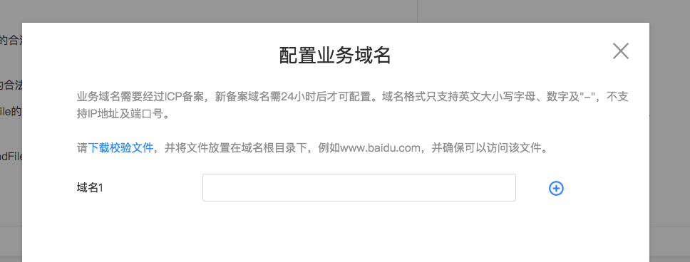

**解释**：web-view 组件是一个可以用来承载网页的容器，会自动铺满整个智能小程序页面。

## 代码示例

<a href="swanide://fragment/44fea332fa6dd229b9cce780089be3861576152075519" title="在开发者工具中预览效果" target="_self">在开发者工具中预览效果</a>

### 扫码体验

<div class='scan-code-container'>
    
    <font color=#777 12px>请使用百度APP扫码</font>
</div>


###  图片示例 

<div class="m-doc-custom-examples">
    <div class="m-doc-custom-examples-correct">
        
    </div>
    <div class="m-doc-custom-examples-correct">
        
    </div>
    <div class="m-doc-custom-examples-correct">
        
    </div>     
</div>

###  代码示例1 ：

<a href="swanide://fragment/5701757f175fd484c4f3b3a666d4a5301575189086529" title="在开发者工具中预览效果" target="_self">在开发者工具中预览效果</a>

* 在 swan 文件中：

```xml
<view>
    <web-view src="{{src}}"></web-view>
</view>

```
* 在 js 文件中：

```js
Page({
    data: {
        src: 'https://smartprogram.baidu.com'
    },
   //接收H5页传过来的参数
    onLoad(options) {
        console.log(options.webViewUrl);
    }
});
```

###  代码示例2 - 在特定时机接受到H5传递参数的函数 ：

<a href="swanide://fragment/6b417033a876fc19c589c7cdb875c9181575189212200" title="在开发者工具中预览效果" target="_self">在开发者工具中预览效果</a>

* 在 swan 文件中：

```xml
<view>
    <web-view src="{{src}}"></web-view>
</view>

```
* 在 js 文件中：

```js
Page({
    data: {
        src: 'https://smartprogram.baidu.com'
    },
    //小程序后退、组件销毁、分享时，由此函数来接收H5页传过来的参数
    postMessage(options) {
        console.log(options);
    }
});
```

###  代码示例3 - 如何判断 H5 页面是否在小程序 web-view 打开 ：

<a href="swanide://fragment/547f28b94e391bf484dece2bdc4c1e9b1575830214937" title="在开发者工具中预览效果" target="_self">在开发者工具中预览效果</a>

* 在 H5 文件中：

```js

let UA = window.navigator.userAgent;
var regex = /swan\//;
console.log( regex.test(UA) );// 若为true，则是在小程序的web-view中打开

```
###  代码示例4 - 原生页面与H5页面之间的跳转刷新： 
<a href="swanide://fragment/285b2bcaa6e473ea04d92ae23f2f73ff1575878402143" title="在开发者工具中预览效果" target="_self">在开发者工具中预览效果</a>

* 在 detail.swan 文件中

```html
<web-view src="{{url}}"></web-view>
```

* 在 detail.js 文件中

```js
Page({
    data: {
        src: ''
    },
   //接收H5页传过来的参数
    onLoad(options) {
        this.setData({'src': options.webViewUrl})
    },
    onShow(){
        this.onLoad()
    }
});
```

* 在 index.js 文件中

```js
Page({
    data: { },
    navigateTo(e) {
        swan.navigateTo({
            url: "/detail/detail?webViewUrl=https://smartprogram.baidu.com&Math.radom()"
        });
    }
});
```

## 相关接口介绍

###  相关接口1  

web-view 网页中可使用 JSSDK 提供的接口返回智能小程序页面。 支持的接口有：

> 旧版本 swan.xxxx,已更新为 swan.webView.xxxx。

| 接口名               | 说明         | 
| ----------------- | ---------- | 
| swan.webView.navigateTo   | 参数与智能小程序接口一致 |
| swan.webView.navigateBack | 参数与智能小程序接口一致 | 
| swan.webView.switchTab    | 参数与智能小程序接口一致 | 
| swan.webView.reLaunch     | 参数与智能小程序接口一致 | 
| swan.webView.redirectTo   | 参数与智能小程序接口一致 | 
| swan.webView.getEnv   | 获取当前环境 | 
| swan.webView.postMessage   | 向小程序发送消息 | 

###  代码示例 

```xml
<!-- html -->
<script type="text/javascript" src="https://b.bdstatic.com/searchbox/icms/searchbox/js/swan-2.0.18.js"></script>
```

```javascript
// javascript
swan.webView.navigateTo({url: '/pages/detail/index'});
swan.webView.postMessage({data: 'foo'})
swan.webView.postMessage({data: {foo: 'bar'} })
swan.webView.getEnv(function(res) {console.log(res.smartprogram) // true })
```

##  属性说明 

| 属性名 | 类型     | 默认值  |必填| 说明 | 最低版本              |
| :--- |: ------ | :---- | :---- |:---- |:---- |
| src | String |  | 是 |webview 指向网页的链接 | -|
|bindmessage|EventHandler| | 否 |网页向小程序 postMessage 时，会在特定时机（小程序后退、组件销毁、分享）触发并收到消息。e.detail = { data }|1.12.0<p>低版本请做<a href="https://smartprogram.baidu.com/docs/develop/swan/compatibility/">兼容性处理</a>|

###  相关接口2  

web-view 网页中支持的接口有：


| 接口模块               | 接口说明         | 具体接口  | 备注 | 
| ----------------- | ---------- |
|设备| 拨打电话| <a href="https://smartprogram.baidu.com/docs/develop/api/device_call/#makePhoneCall/">swan.makePhoneCall</a> | | 
|开放接口| 打开小程序| <a href="https://smartprogram.baidu.com/docs/develop/api/open_smartprogram/#navigateToSmartProgram/">swan.navigateToSmartProgram</a> |2.0.18版本开始，支持使用envVersion打开不同版本的小程序| 
|开放接口| 登录| <a href="https://smartprogram.baidu.com/docs/develop/api/open/log_swan-login/">swan.login</a> | | 
|剪贴板| 设置剪贴板| <a href="https://smartprogram.baidu.com/docs/develop/api/device_clipboard/#setClipboardData/">swan.setClipboardData</a> | | 
|设备| 获取网络类型| <a href="https://smartprogram.baidu.com/docs/develop/api/device_network/#getNetworkType/">swan.getNetworkType</a> | |
|媒体| 预览图片| <a href="https://smartprogram.baidu.com/docs/develop/api/media_image/#previewImage/">swan.previewImage</a> | |
|开放接口| 分享 | <a href="https://smartprogram.baidu.com/docs/develop/api/open_share/#openShare/">swan.openShare</a> |需传入当前要分享的小程序的appKey| 
|地理位置|使用内置地图打开地点|<a href="https://smartprogram.baidu.com/docs/develop/api/location_open/">swan.openLocation</a>| | 
|地理位置|获取地理位置|<a href="https://smartprogram.baidu.com/docs/develop/api/location_get/#getLocation/">swan.getLocation<a>| |
|图像接口|拍照或上传|<a href="https://smartprogram.baidu.com/docs/develop/api/media_image/#chooseImage/">swan.chooseImage</a>| ||

###  相关接口3  

用户分享时可获取当前web-view的URL，即在onShareAppMessage回调中返回webViewUrl参数。

代码示例：

```javascript
Page({
    onShareAppMessage(options) {
        console.log(options.webViewUrl);
    }
})
```


### 使用 web-view 打开限定域名内的网页

进入<a href="https://smartprogram.baidu.com/developer/index.html">智能小程序开发者平台</a>，单击“设置->开发设置”，即可在业务域名中下载、配置校验文件并配置业务域名。


<div class="m-doc-custom-examples">
    <div class="m-doc-custom-examples-correct">
        
    </div>
    <div class="m-doc-custom-examples-correct">
        
    </div>
    <div class="m-doc-custom-examples-correct">
        
    </div>
</div>

##  Bug & Tip 

* Tip：网页内 iframe 的域名也需要配置到域名白名单。
* Tip：每个页面只能有一个 <`web-view/`>，<`web-view/`> 会自动铺满整个页面，并覆盖其他组件。
* Tip：网页与智能小程序之间不支持除 JSSDK 提供的接口之外的通信。
* Tip：避免在链接中带有中文字符，在 iOS 中会有打开白屏的问题，建议加一下 encodeURIComponent。
* Tip：如果使用了 JSSDK 提供的接口，需要引入 `swanjs`。
* Tip：H5 运行时，通过 window.navigator.userAgent 获取浏览器 userAgent。当 userAgent 字符串中包含小程序标识：‘swan/’时，则说明当前环境为小程序 web-view。
